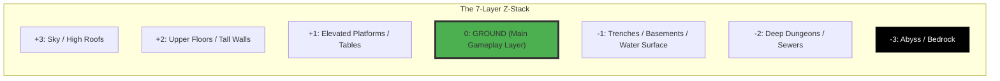

# 🌍 The Daicer Voxel Engine Architecture (SOTA)

> [!IMPORTANT]
> **Technical Briefing**
> This document details the high-performance voxel engine powering Daicer. It covers the atomic units (Assets) and the macro structures (World/Construction), focusing on the **7-Layer Z-Stack** and the **Procedural Assembly Pipeline**.

<br>

# 1. atomic_units: The Building Blocks

## A. Core Decisions (Jan 2026)

1.  **Gargantuan Collision**: **Full Footprint**. A 3x3 entity blocks all 9 tiles. Pathfinding must check entire area.
2.  **Anchoring**: **Geometric Center**. Coordinates (X,Y) represent the center of the entity.
3.  **Destructive Stamping**: **Merge Only**. Construction voxels replace World voxels. Construction "Air" does _not_ carve out existing World solids.
4.  **Storage**: **Dense/Consistent**. Store full voxel data for simplicity and hydration reliability.
5.  **Inventory**: **Anchor-Based**. Items attach to skeletal anchors (equipped slots) rather than a Tetris grid.
6.  **Pathfinding**: **Variable Clearance**. A\* must support unit size (1x1 vs 3x3).
7.  **Updates**: **Eventual Consistency**. Simple sequential chunk updates.
8.  **Blueprints**: **Visual Overlay + Functional Switch**. Primary mode is a schematic guide; toggle to see raw voxel data.
9.  **AI Timeout**: **5 Minutes**. Long-running jobs are acceptable.
10. **Persistence**: **Snapshot**. Placed constructions are independent copies; editing the prefab does not update existing world instances.

The world is composed of four fundamental data types. Understanding the distinction between **Terrain** (Voxel Data) and **Entity** (Actor Data) is critical.

| Type             | Nature          | Resolution                             | Role                                                 | Editor         | Code Reference                                                             |
| :--------------- | :-------------- | :------------------------------------- | :--------------------------------------------------- | :------------- | :------------------------------------------------------------------------- |
| **Terrain**      | Static Voxel    | 32x32 px (Tiled)                       | The "Paint" of the world. Walls, Floors, Fluids.     | `TextureInput` | [schema.json](src/api/terrain/content-types/terrain/schema.json)           |
| **Item**         | Dynamic Object  | Variable (Standard 32x32 or Larger)    | Pickupable loot. Swords, Potions. Can be Gargantuan. | `PixelForge`   | [schema.json](src/api/item/content-types/item/schema.json)                 |
| **Entity**       | Active Agent    | Variable (Standard 32x32 or Larger)    | Monsters, NPCs, Players. Can be Gargantuan.          | `PixelForge`   | [schema.json](src/api/entity-sheet/content-types/entity-sheet/schema.json) |
| **Construction** | Voxel Structure | Multiple of Chunks (Finile NxM Chunks) | Prefabricated structures (Houses, Dungeons).         | `VoxelInput`   | [schema.json](src/api/construction/content-types/construction/schema.json) |

## 🧱 1.1 Terrain (The Matter)

Terrains are the **immutable material types**.

- **Data Structure**: A flyweight definition. The world grid stores only the `TerrainID`.
- **Properties**: `isWalkable`, `isTransparent`, `luminance`, `damagePerTick`.
- **Visuals**: A seamless 32x32 texture.
- **Physics**: Defined by the Terrain Type (e.g., Water = Resistance, Lava = Damage).

## 👾 1.2 Entity & Item (The Actors)

Entities and Items are the **stateful objects** in the world.

- **Position**: Floating point Vector3 world coordinates `(x, y, z)`.
- **Size**: **Variable**.
  - **Standard**: 1x1 tile (32x32 px).
  - **Large**: 2x2 tiles (64x64 px).
  - **Gargantuan**: NxN tiles (Unlimited, Finite).
- **Rendering**: The sprite is anchored at the **Wait/Feet** center. A 64x64 sprite draws centered on a 2x2 voxel area.

<br>

# 2. macro_structure: The World Grid

The world is an **Infinite XY Plane** with a **Fixed Z-Depth**.
This hybrid approach allows massive exploration without the complexity of infinite 3D height (like Minecraft).

## 📐 2.1 The Coordinate System

- **X (Width)**: West (-X) to East (+X).
- **Y (Depth)**: North (-Y) to South (+Y).
- **Z (Height)**: The **7-Layer Stack**.

> [!NOTE]
> **Why 7 Layers?**
> Top-Down RPGs rarely need infinite height. By locking Z to `[-3, +3]`, we simplify pathfinding (A\*), visibility (Field of View), and rendering sorting orders.



<br>

# 3. construction_system: The Prefab Logic

A **Construction** is a saved "chunk" (or multiple chunks) of voxels that can be stamped onto the world.

## 🏗️ 3.1 Anatomy of a Construction

- **Based on Chunks**: Constructions are defined as multiples of the standard World Chunk size (e.g., 32x32).
- **Dimensions**: **Finite** `Width` (NxChunkSize) and `Depth` (MxChunkSize), with **Fixed** `Height` (Z=7).
  - Example: A small hut might be 1x1 Chunk.
  - Example: A large cathedral might be 3x4 Chunks.
- **Streaming**: Constructions are loaded/unloaded as full Chunks, simplifying network transmission.
- **Anchoring**: When placed, the Construction aligns perfectly to the Chunk Grid.

## ⚙️ 3.2 The Stamping Algorithm

When the world generator places a "Village House":

1.  **Select Position**: Pick a World Coordinate aligned to Chunk boundaries `(Cx, Cy)`.
2.  **Iterate Chunks**: Loop through the Construction's defined Chunks.
3.  **Injector**: `TargetChunk(Cx+i, Cy+j) = ConstructionChunk(i, j)`.
4.  **Overwrite**: The World Chunk data is replaced/merged with the Construction data.

```mermaid
graph LR
    subgraph Construction ["Construction (Prefab)"]
    C_Chunk ["Local Chunk (0,0)<br>32x32x7 Voxels"]
    end

    subgraph World ["World Grid (Infinite)"]
    W_Chunk ["World Chunk (10, 20)<br>Coordinate (320, 640)"]
    end

    C_Chunk -- "Stamp Operation" --> W_Chunk

    style C_Chunk fill:#FFCDD2,stroke:#F44336
    style W_Chunk fill:#C8E6C9,stroke:#4CAF50
```

<br>

# 4. engineering_relationships: The Class Diagram

This diagram visualizes the strict type hierarchy and containment rules.

```mermaid
classDiagram
    direction TB

    %% Core Systems
    class World {
        +UUID id
        +String seed
        +XY_Grid infinite
        +Z_Layers fixed[-3..+3]
        +Chunk[] loadedChunks
        +stamp(Construction, cx, cy)
    }

    class Chunk {
        +Voxel[32][32][7] data
        +Coordinates (cx, cy)
    }

    class Construction {
        +String name
        +Enum category
        +Chunk[N][M] chunks
        +Finite Width (Nx32)
        +Finite Depth (Mx32)
    }

    %% Essential Assets
    class Terrain {
        +String id (grass, stone)
        +Texture texture
        +Bitmask properties (IsSolid, IsLiquid)
    }

    class Entity {
        +String name
        +Vector3 position
        +Sprite sprite
        +Float size (Standard, Large, Gargantuan)
        +Stats stats
    }

    %% Relations
    World "1" *-- "many" Chunk : Manages
    Chunk "1" o-- "many" Terrain : References ID
    Construction "1" *-- "many" Chunk : Composed of
    World "1" ..> Construction : Instantiates
    World "1" o-- "many" Entity : Simulates

    %% Editors
    class Editors {
        <<System>>
    }
    Editors ..> Terrain : TextureInput (Gemini)
    Editors ..> Entity : PixelForge (Gemini)
    Editors ..> Construction : VoxelInput (Manual)
```



<br>

# 5. pipeline_flow: From Asset to Experience

The production pipeline for creating content in Daicer.

1.  **Asset Generation (AI-Assisted)**
    - **Texture**: Use `TextureInput` to generate a "Lava" terrain.
    - **Sprite**: Use `PixelForge` to generate a "Fire Elemental" entity (64x64 gargantuan) or a generic item (Sword).
2.  **Prefab Assembly (Manual)**
    - Open `VoxelInput` (Construction Editor).
    - Define Construction Size (e.g., 2x2 Chunks).
    - Select "Lava" terrain.
    - Draw a "Volcano Pit" structure (depth -2 to +1).
    - Save as "Volcano_Small".
3.  **World Generation (Procedural)**
    - Set World Seed.
    - Engine generates base "Ashlands" biome (Chunk by Chunk).
    - Engine procedurally places "Volcano_Small" constructions aligned to grid.
    - Engine spawns "Fire Elemental" entities near Lava.
