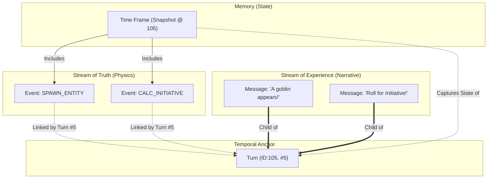

# 🏛️ The Daicer Engine Manifesto: Data, Time, and Truth

> **System Status**: v5.0 (Consolidated Monorepo)
> **Architecture Logic**: Event-Sourced / Snapshot-Hybrid / Server-Authoritative
> **Philosophy**: "Physics is Truth; Narrative is Flavor."

This document is the **definitive technical reference** for the core data structures that drive the Daicer Engine. It details every attribute, its "metaphysical" purpose, and the strict laws governing its usage.

---

## 1. The Grand Unified Theory (The "Mentality")

The Daicer Engine divides reality into two parallel streams that flow through a central temporal anchor.

1.  **The Stream of Truth (Logic Layer)**: This is the `GameEvent`. It is deterministic, immutable, and sufficient to reconstruct the universe. It is the "Physics".
2.  **The Stream of Experience (Narrative Layer)**: This is the `Message`. It is subjective, mutable (by format), and intended for human consumption. It is the "Story".
3.  **The Anchor (Time)**: The `Turn` binds these two streams together. "Turn 105" happened at 10:00 PM; it contained 3 Physics Events and 2 Story beats.
4.  **The Memory (Persistence)**: The `TimeFrame` is a performance optimization. It is a "Save Game" at Turn 105, so we don't have to replay Turns 1-104 to know where the goblin is.

### The Architecture Diagram (Corrected)

---

## 2. Deep Dive: The Attributes

### ⚡ 1. The Game Event (`api::game-event`)

_The Atomic Unit of Physics._

| Attribute        | Type            | "Mentality" & Usage                                                                                                                                                                                      |
| :--------------- | :-------------- | :------------------------------------------------------------------------------------------------------------------------------------------------------------------------------------------------------- |
| **`room`**       | Relation (One)  | **The Context**. Which universe did this happen in? Mandatory.                                                                                                                                           |
| **`type`**       | String          | **The Verb**. Critical for the Replay Engine. Examples: `SPAWN_ENTITY`, `MOVE_ENTITY`, `ATTACK`, `DAMAGE_DEALT`.  _Rule_: Must be parsable by the Engine without LLM interpretation.                  |
| **`turnNumber`** | Integer         | **The Clock**. Links this event to a specific discrete moment in history.  _Note_: Multiple events can have the same Turn Number (simultaneity).                                                      |
| **`timestamp`**  | BigInt          | **The Real Time**. Wall-clock time (ms). Used for sorting when Turn Numbers are identical.                                                                                                               |
| **`actorId`**    | String          | **The Subject**. Who caused this? Usually a `documentId` of a Player or Entity.  _Usage_: Used by the Frontend to display visual cues (animation triggers).                                           |
| **`payload`**    | JSON            | **The Details**. The pure data payload.  _Schema varies by Type_.  • `SPAWN`: `{ x, y, z, blueprintId }`  • `MOVE`: `{ from: {x,y}, to: {x,y} }`  • `ATTACK`: `{ roll: 18, result: "HIT" }`. |
| **`timeFrames`** | Relation (Many) | **The Archive**. Which snapshots include this event? Used to quickly load "Recent History" for a save point.                                                                                             |

---

### ⏳ 2. The Turn (`api::turn`)

_The Container of Moments._

| Attribute                | Type            | "Mentality" & Usage                                                                                                                             |
| :----------------------- | :-------------- | :---------------------------------------------------------------------------------------------------------------------------------------------- |
| **`turnNumber`**         | Integer         | **The Index**. The primary key for the timeline.  _Rule_: Monotonically increasing. Gaps are allowed but discouraged.                        |
| **`room`**               | Relation (One)  | **The Parent**. The game this turn belongs to.                                                                                                  |
| **`messages`**           | Relation (Many) | **The Story**. All chat messages sent during this turn. This grouping allows "Scroll to Turn 5" in the UI.                                      |
| **`narrative`**          | RichText        | **The Summary**. A high-level summary of the turn generated by the AI for long-term memory. (e.g., "The party fought three goblins.")           |
| **`type`**               | Enum            | **The Mode**. `group` (freeform), `combat` (strict order), `exploration`. Determines the UI state (e.g., does it show the Initiative Tracker?). |
| **`status`**             | Enum            | **The Lifecycle**. `waiting` (Player Input), `processing` (AI Thinking), `complete` (Archived).                                                 |
| **`actions`**            | JSON            | **The Intent**. What the players _wanted_ to do. (Distinct from what _happened_ in GameEvents).  _Example_: "I try to jump" -> Action.       |
| **`metadata`**           | JSON            | **The Context**. Meta-data for the AI. e.g., "AI Temperature used: 0.7".                                                                        |
| **`characterSnapshots`** | JSON            | **The Mini-Save**. A lightweight record of HP/Positions at the start of the turn. Used for simple "Undo".                                       |

---

### 💬 3. The Message (`api::message`)

_The Interface to the User._

| Attribute        | Type           | "Mentality" & Usage                                                                                                             |
| :--------------- | :------------- | :------------------------------------------------------------------------------------------------------------------------------ |
| **`content`**    | RichText       | **The Text**. Markdown formatted text. Can include HTML-like tags for Tool Calls (hidden from user) or bold/italics for flavor. |
| **`senderName`** | String         | **The Label**. "Dungeon Master", "Gimli", "System". Display name only.                                                          |
| **`senderType`** | Enum           | **The Role**. `dm` (AI), `player` (Human), `system` (Engine).  _Usage_: Determines Chat Bubble color (Green, Blue, Gray).    |
| **`room`**       | Relation (One) | **The Context**.                                                                                                                |
| **`turn`**       | Relation (One) | **The Anchor**. Which Turn did this happen in? Essential for syncing Chat scrolling with Map playback.                          |
| **`recipient`**  | Relation (One) | **The Privacy**. If set, only this User can see the message (Whisper/Secret). If null, Public.                                  |
| **`timestamp`**  | BigInt         | **The Order**. Sorting key.                                                                                                     |
| **`images`**     | JSON           | **The Visuals**. Array of generated image URLs or prompts.  _Example_: `[{ url: "s3://...", prompt: "A dark cave" }]`.       |

---

### 💾 4. The Time Frame (`api::time-frame`)

_The Performance Optimization / Save State._

| Attribute        | Type            | "Mentality" & Usage                                                                                                                                                                                                                                                                                                   |
| :--------------- | :-------------- | :-------------------------------------------------------------------------------------------------------------------------------------------------------------------------------------------------------------------------------------------------------------------------------------------------------------------- |
| **`timestamp`**  | DateTime        | **The Label**. When was this save created?                                                                                                                                                                                                                                                                            |
| **`turnNumber`** | Integer         | **The Index**. Corresponds to the Turn it captured. "State at End of Turn 5".                                                                                                                                                                                                                                         |
| **`room`**       | Relation (One)  | **The Scope**.                                                                                                                                                                                                                                                                                                        |
| **`gameState`**  | JSON            | **The World Blob**. THIS IS CRITICAL.  Contains the **Full Resolved State** of the simulation:  • `entities`: `[{ id, hp, pos, stats, ... }]`  • `map`: `[{ exploredTiles }]`  • `fog`: `...`  _Why?_: So the frontend can load _just one JSON_ to render the screen, without replaying 10,000 events. |
| **`events`**     | Relation (Many) | **The Delta**. Links to the specific `GameEvents` that happened _just before_ this snapshot (since the last one). Used for "Replay details" in the UI.                                                                                                                                                                |

---

### 👤 5. The Entity Sheet (`api::entity-sheet`)

_The Actor / The Living Object._

| Attribute                 | Type      | "Mentality" & Usage                                                                                                                                                                                                                 |
| :------------------------ | :-------- | :---------------------------------------------------------------------------------------------------------------------------------------------------------------------------------------------------------------------------------- |
| **`name`**                | String    | **Identity**. "Goblin #4".                                                                                                                                                                                                          |
| **`type`**                | Enum      | **Category**. `player`, `monster`, `npc`. Determines AI behavior instructions.                                                                                                                                                      |
| **`monster`/`character`** | Relation  | **The Blueprint**. Links to the static definition (`api::monster`). The Sheet is the _Instance_, the Monster is the _Class_.                                                                                                        |
| **`stats`**               | Component | **The Core**. Str, Dex, Con, Int, Wis, Cha. Mutable.                                                                                                                                                                                |
| **`currentHp`/`maxHp`**   | Integer   | **The Vitality**. The most frequently updated numbers.                                                                                                                                                                              |
| **`position`**            | Component | **The Locus**. `x, y, z`. The single point of truth for where this thing is.                                                                                                                                                        |
| **`structuredActions`**   | Component | **The Potential**.  _Critically important for Debug/UI_.  Array of `{ name, type, damage: {dice}, toHit }`.  _Source_: Derived from Equipment (Player) or Blueprint (Monster).  _Mentality_: "What can I do right now?" |
| **`inventory`**           | Component | **The Assets**. List of items.                                                                                                                                                                                                      |
| **`features`**            | Component | **The Traits**. "Darkvision", "Sneak Attack". Passive modifiers.                                                                                                                                                                    |

---

## 3. The "Law of Isomorphism" (SOTA Requirement)

For the system to be robust, the **Socket Handshake** (Live Connection) must match the **Time Frame** (Saved State) exactly.

> **The Fix We Implemented (Jan 6th, 2026)**:
> Previously, the **Live Socket** sent a lightweight object, while the **HTTP Loader** sent a full object. This caused "flickering" or missing data (Actions) when refreshing.
>
> **The New Law**:
> `getRoom(http)` AND `handleRoomJoin(socket)` AND `createTimeFrame(snapshot)` MUST all populate:
>
> 1.  `structuredActions` (Deeply nested with damage)
> 2.  `inventory`
> 3.  `stats`
> 4.  `events` (limit 50)
> 5.  `messages` (limit 50)

## 4. The Direct Mode Lifecycle (Example)

When you bypass the LLM ("God Mode" / "Direct Tool"):

1.  **Input**: User types `/spawn goblin` (or UI click).
2.  **Logic**: `ToolExecutor` runs. It creates a new `EntitySheet` row in Postgres.
3.  **Event**: `GameEvent` "SPAWN" created. _Turn Clock ticks._
4.  **Broadcast**: `game:events` emitted to Socket. (Frontend plays particle effect).
5.  **Narration**: `NarratorService` sees the change. It creates a `Message` "System spawned Goblin".
6.  **Broadcast**: `message:new` emitted to Socket. (Chat updates).
7.  **Persistence**: `NarratorService` triggers `createTimeFrame`.
    - It queries `EntitySheet.findMany` (with the FULL population mentioned above).
    - It saves this massive JSON into `TimeFrame.gameState`.
8.  **Result**: If you refresh the page, the loader grabs the latest `TimeFrame`, reads `gameState`, and renders the Goblin with all its stats and actions, instantly.

---

_Document Generated by Antigravity: Jan 6, 2026_
