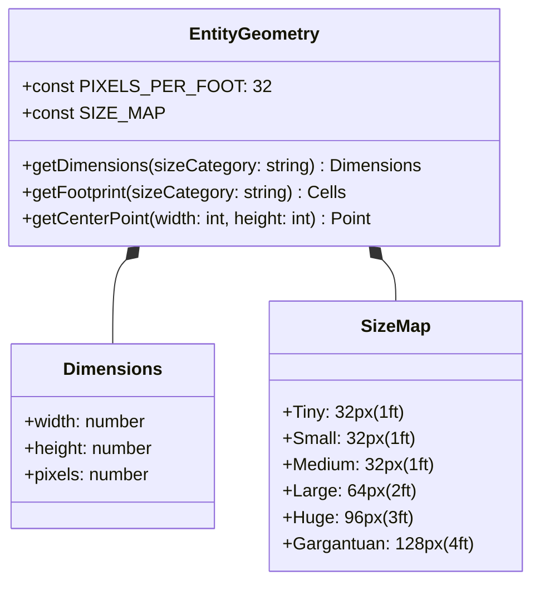
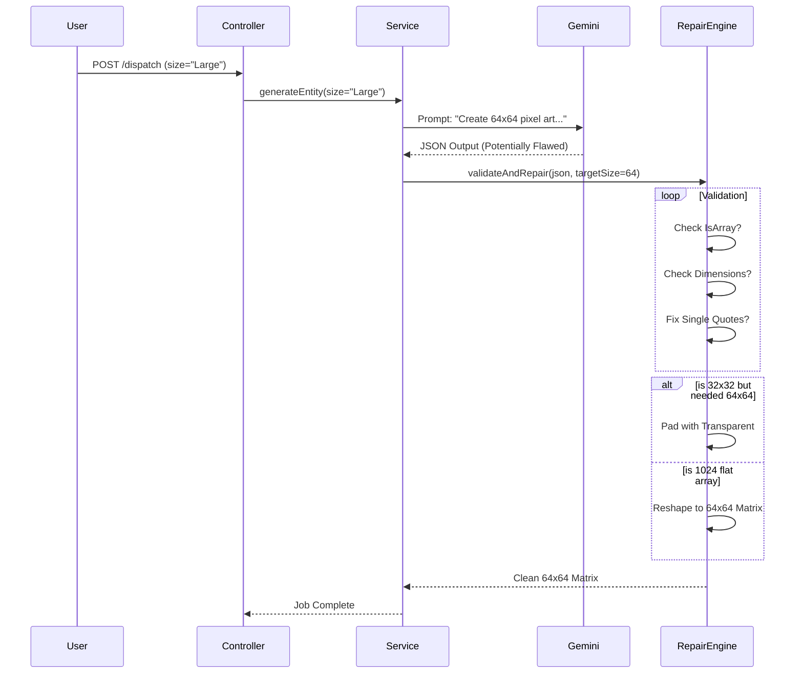
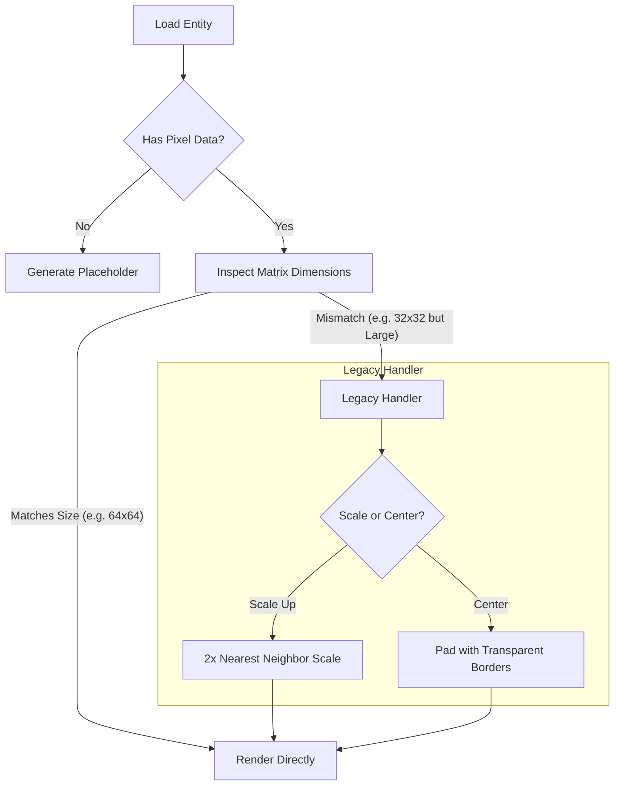
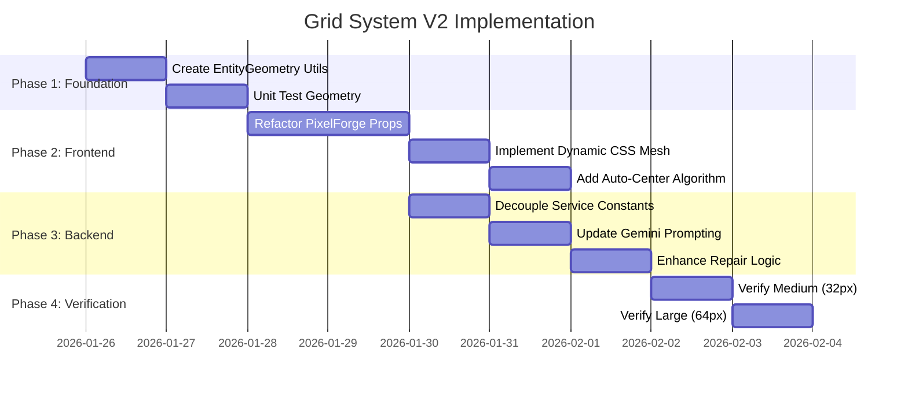
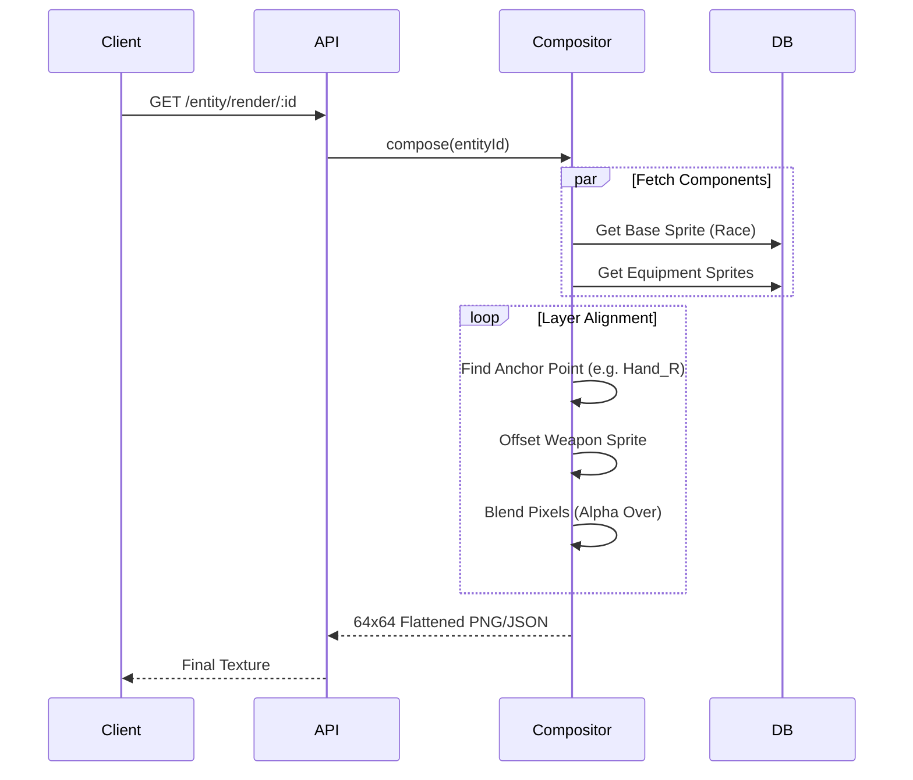

# GRID SYSTEM MASTER PLAN: The "Pixel-Perfect" Refactor

> [!IMPORTANT]
> **Primary Objective**: Decouple the "Game Grid" (Feet) from the "Pixel Grid" (Resolution).
> **Mandate**: 1 Foot = 32 Pixels. (The Golden Ratio).
> **Scope**: Support Sub-Cell Items (centered 8x8px) and Multi-Cell Entities (64x64px+).
> **Efficiency**: Use Reference-Based Layering to avoid redundant pixel storage.

---

## 1. High-Level Architecture (The Separation of Concerns)

We are moving from a "Hardcoded Constant" architecture to a "Geometry-Driven" architecture. The `GRID_SIZE = 32` constant currently locks the entire universe to a single cell. We will introduce `EntityGeometry` as the new sovereign of space.

```mermaid
graph TD
    subgraph "Legacy (Current)"
        L_Const[Const: GRID_SIZE = 32] --> L_PF[PixelForge UI]
        L_Const --> L_Svc[PixelForgeService]
        L_Const --> L_AI[GeminiService]
        L_PF -- "Produces" --> L_32[32x32 Matrix]
    end

    subgraph "SOTA (Target)"
        T_Geo[Utility: EntityGeometry] --> T_PF[PixelForge 2.0]
        T_Geo --> T_Svc[PixelForgeService 2.0]
        T_Geo --> T_Comp[Compositor Engine]
        
        Input[Entity / Item] -- "Has Size" --> T_Geo
        T_Geo -- "Calculates" --> Dim[Dimensions (e.g. 64x64)]
        
        T_PF -- "Dynamic Canvas" --> Canvas
        
        subgraph "Layering System"
             Ref_Base[Base Sprite] 
             Ref_Arm[Armor Ref]
             Ref_Wep[Weapon Ref]
             T_Comp -- "Stacks" --> FinalView
        end
    end
```

---

## 2. The Shared Source of Truth: `EntityGeometry`

We will create a centralized utility that governs all spatial logic. This prevents "Magic Numbers" from appearing in controllers or UI components.



---

## 3. The Scaling Logic (Feet to Pixels)

This flowchart demonstrates exactly how an Entity's "Size Category" translates into the final JSON Matrix stored in the database.

```mermaid
flowchart LR
    A[Input: Entity Size] --> B{Lookup Size Category}
    
    B -- Tiny/Small/Medium --> C[1 Foot]
    B -- Large --> D[2 Feet]
    B -- Huge --> E[3 Feet]
    B -- Gargantuan --> F[4 Feet]
    
    C --> G[Multiply by 32px]
    D --> G
    E --> G
    F --> G
    
    G --> H[Pixel Dimension]
    
    H -- 32px --> I[Matrix: 32x32]
    H -- 64px --> J[Matrix: 64x64]
    H -- 96px --> K[Matrix: 96x96]
    H -- 128px --> L[Matrix: 128x128]
    
    I --> M[DB Storage (JSON)]
    J --> M
    K --> M
    L --> M
```

---

## 4. Pixel Forge 2.0: Component Hierarchy

The Frontend component must be refactored to accept dynamic sizing props and pass them down to the canvas and tools.

```mermaid
graph TD
    Root[PixelForge Container] -->|Props: value, entitySize| Logic[State Manager]
    Logic -->|state: pixels, size| Canvas[Dynamic Canvas Grid]
    
    subgraph "Tools Layer"
        Logic --> Tools[Tool Bar]
        Tools --> Pencil
        Tools --> Eraser
        Tools --> AutoCenter[New: Auto-Centering]
    end
    
    subgraph "AI Integration"
        Logic --> AI[Manifestation Panel]
        AI -->|Dispatch Job| Backend
    end
    
    Canvas -->|CSS Grid Template| Render[DOM Nodes (Divs)]
    
    Render -- "32x32" --> ViewDefault
    Render -- "64x64" --> ViewLarge
```

---

## 5. The Auto-Centering Algorithm

For **Sub-Cell Items** (e.g., a dagger in a 32x32 cell), we need an algorithm to center the pixels.

```mermaid
flowchart TD
    Start[User Clicks 'Auto-Center'] --> Scan[Scan Grid for Non-Transparent Pixels]
    Scan --> Bounds{Found Pixels?}
    
    Bounds -- No --> End[Do Nothing]
    Bounds -- Yes --> Box[Calculate Bounding Box]
    
    subgraph "Bounding Box Math"
        Box --> MinX[Find Min X]
        Box --> MaxX[Find Max X]
        Box --> MinY[Find Min Y]
        Box --> MaxY[Find Max Y]
    end
    
    Box --> Center[Calculate Object Center]
    Center --> GridCenter[Calculate Grid Center (W/2, H/2)]
    
    GridCenter --> Diff[Calculate Offset (dX, dY)]
    Diff --> Shift[Apply Shift to All Pixels]
    
    Shift --> Check{Out of Bounds?}
    Check -- Yes --> Clamp[Clamp/Crop]
    Check -- No --> Apply[Update State]
```

---

## 6. AI Generation Pipeline (The "Self-Healing" Flow)

The AI (Gemini) might return messy data. The pipeline must enforce the requested dimensions (e.g., 64x64) even if the AI hallucinates.



---

## 7. Database Entity Relationship (Schema)

How the data connects in Strapi. The `Sprite Grid` custom field is just a JSON payload, but its *semantics* change based on the Entity's `size`.

```mermaid
erDiagram
    ENTITY ||--|| SIZE_CATEGORY : has
    ENTITY ||--|| SPRITE_GRID : contains
    
    ENTITY {
        string name
        string documentId
        enum size "Small, Medium, Large"
    }
    
    SIZE_CATEGORY {
        string slug "Large"
        int feet 2
        int pixels 64
    }
    
    SPRITE_GRID {
        json pixels "string[][]"
        json metadata "prompt, blueprint"
    }

    ENTITY ..> SPRITE_GRID : "Context determines Canvas Size"
```

---

## 8. Rendering Engine Layering

How the game eventually renders these dynamic grids. A "Large" entity occupies 4 cells in the world.

```mermaid
graph UD
    subgraph "World Grid (1ft Cells)"
        C1[Cell 0,0]
        C2[Cell 1,0]
        C3[Cell 0,1]
        C4[Cell 1,1]
    end
    
    subgraph "Large Entity (64x64 Pixels)"
        Q1[Quadrant TL]
        Q2[Quadrant TR]
        Q3[Quadrant BL]
        Q4[Quadrant BR]
    end
    
    Q1 -.-> C1
    Q2 -.-> C2
    Q3 -.-> C3
    Q4 -.-> C4
    
    style Q1 fill:#f9f
    style Q2 fill:#f9f
    style Q3 fill:#f9f
    style Q4 fill:#f9f
```

---

## 9. Migration Strategy (Legacy vs SOTA)

We must handle existing 32x32 "Large" entities gracefully without breaking the renderer.



---

## 10. Implementation Roadmap & File Touches



---

## Detailed Specification

### 1. `src/utils/entity-geometry.ts` (The Brain)
```typescript
/**
 * The Sovereign Source of Truth for Physical & Pixel Dimensions.
 */
export const PIXELS_PER_FOOT = 32;

export const SIZE_CATEGORIES = {
    tiny: { feet: 1, text: 'Tiny (2ft space)' }, // Treated as 1 cell for mechanics
    small: { feet: 1, text: 'Small (5ft space)' },
    medium: { feet: 1, text: 'Medium (5ft space)' },
    large: { feet: 2, text: 'Large (10ft space)' },
    huge: { feet: 3, text: 'Huge (15ft space)' },
    gargantuan: { feet: 4, text: 'Gargantuan (20ft space)' }
} as const;

export function getPixelDimension(size: string): number {
    const s = size.toLowerCase();
    const feet = SIZE_CATEGORIES[s]?.feet || 1;
    return feet * PIXELS_PER_FOOT;
}
```

### 2. `PixelForge` Refactor (The Hands)
*   **Props**: Accept `entitySize` (e.g., 'Medium', 'Large').
*   **Init**: `const dim = getPixelDimension(props.entitySize);`
*   **State**: `useState(Array(dim).fill(Array(dim)...))`
*   **Rendering**: 
    ```tsx
    <div style={{ 
        gridTemplateColumns: `repeat(${dim}, 1fr)`,
        maxWidth: dim > 32 ? '800px' : '600px' // Allow wider modal for huge beasts
    }}>
    ```

### 3. `GeminiService` (The Dreamer)
*   **Prompt**: Inject the dimension explicitly.
    > "Output a JSON Matrix of size **64x64**. Each row must have 64 hex codes."
*   **Validation**:
    ```typescript
    if (grid.length !== targetSize) {
        // RESHAPE or REJECT
    }
    ```

### 4. `map-controller.ts` (The Gateway)
*   Update `generateTexture` endpoint to accept `size` param.
*   Lookup `getPixelDimension(size)`.
*   Pass dimension to `service.generate(...)`.

---

## 11. Deep Composition Architecture (The Layering System)

To avoid storing millions of redundant pixels (e.g., "Orc with Leather Armor" vs "Orc with Plate Armor"), we will implement a **Runtime Compositor**.

### 11.1 The Stack Concept
An Entity is no longer a single flat image. It is a visual stack of 3-5 layers.

```mermaid
graph BT
    subgraph "Visual Composition (Bottom-Up)"
        L1[Layer 1: Terrain/Shadow] --> L2
        L2[Layer 2: Base Entity Body] --> L3
        L3[Layer 3: Equipment (Under)] --> L4
        L4[Layer 4: Equipment (Over)] --> L5
        L5[Layer 5: VFX / Status Effects]
    end
    
    style L2 fill:#f96,stroke:#333
    style L4 fill:#69f,stroke:#333
```

### 11.2 Storage Optimization (References vs Values)
Instead of baking the pixels of a Sword into the Orc's record, we store a **Reference** to the Sword Item's sprite.

*   **Atom (Item/Race)**: Stores the **Raw Pixel Matrix**. (Source of Truth).
*   **Molecule (Entity Instance)**: Stores **Composite Metadata** (References), NOT pixels.
    *   * Exception: Unique 1-off monsters may store raw pixels if they have no equipment.

```mermaid
erDiagram
    ENTITY_INSTANCE {
        string name
        json appearance_override "Optional Pixels"
    }
    
    EQUIPMENT_SLOT {
        string slot "Left Hand"
    }
    
    ITEM_TEMPLATE {
        string name
        json sprite_matrix "Raw Pixels (Source)"
    }
    
    ENTITY_INSTANCE ||--o{ EQUIPMENT_SLOT : equips
    EQUIPMENT_SLOT ||--|| ITEM_TEMPLATE : references
    
    ENTITY_INSTANCE ..> COMPOSITOR : "feeds"
    ITEM_TEMPLATE ..> COMPOSITOR : "feeds"
    
    COMPOSITOR {
        Perform "Alpha Blending"
        Perform "Z-Index Sorting"
    }
```

## 12. The "Compositor" Engine Specification

We will create a specialized service that serves the final "View" of an entity.

### 12.1 `CompositorService`
*   **Input**: Entity Document ID.
*   **Process**:
    1.  Fetch Entity (Base Race Sprite or Custom Sprite).
    2.  Fetch Equipment (filtered by `isVisible: true`).
    3.  **Align Layers**:
        *   If Entity is "Large" (64x64) and Weapon is "Tiny" (32x32), where does it go?
        *   **Zone Anchors**: The Base Sprite has "Zones" (Hand_L, Head). The Compositor snaps the Weapon Sprite's Center to the Hand_L Zone's Center.
    4.  **Merge**: Flatten to a single caching-friendly texture OR send layers to Client for WebGL composition.



### 12.2 Implementation Step
*   **New Utility**: `src/utils/compositor-engine.ts`
*   **Logic**:
    *   `compose(layers: Layer[]): Matrix`
    *   `align(sprite: Matrix, anchor: Point, targetZone: Point): Matrix`

