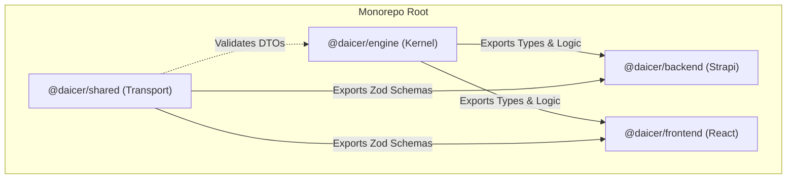

# Proposal 01: Unified Type System & Monorepo Shared Kernel

## 1. The Bottleneck: Type Schism & "Shim" Pattern

Currently, the codebase suffers from a "Type Schism" where the Backend (Strapi) and Frontend (React) maintain separate, often conflicting definitions of core domain entities.

- **Frontend**: Uses `frontend/src/types/models.ts`, creating loose "shims" (e.g., `character?: any`) to satisfy TypeScript without enforcing structure.
- **Backend**: Uses `backend/src/types/index.ts`, which contains the "real" definitions but is inaccessible to the frontend.
- **Result**: 1900+ linting errors, runtime crashes when backend data shape changes, and zero confidence in "God Mode" tools.

## 2. The Solution: The `@daicer/engine` Kernel

We must elevate the `@daicer/engine` workspace (which I have just initialized) to be the **Single Source of Truth** for all domain logic and types.

### Architecture Diagram

## 3. Implementation Phases

### Phase 1: Migration (Immediate)

1. **Move Definitions**: Move all interfaces from `backend/src/types/index.ts` to `@daicer/engine/src/types`.
2. **Delete Frontend Shims**: Delete `frontend/src/types/models.ts` entirely.
3. **Update Imports**:
   - Backend: `import { Player } from '@daicer/engine';`
   - Frontend: `import { Player } from '@daicer/engine';`

### Phase 2: Domain Logic Extraction (Short-term)

1. **Pure Functions**: Move calculation logic (e.g., "Calculate AC", "Roll Hit Die") from Backend Services into `@daicer/engine`.
2. **Shared usage**: Frontend uses this logic for "Preview" (optimistic UI), Backend uses it for "Authoritative Resolution".

### Phase 3: Zod Integration (Medium-term)

1. Use `zod` in `@daicer/engine` to infer the TypeScript types, ensuring that runtime validation (at API boundary) and compile-time types are identical.

## 4. Arguments

- **Eliminates Desync**: Frontend can never "guess" the shape of a Player. It imports the _actual_ shape.
- **Enables Optimistic UI**: Frontend can run same combat math as backend to show "Predicted Result" instantly.
- **Reduces Maintenance**: Change a field in ONE file, see red squiggles everywhere immediately.
