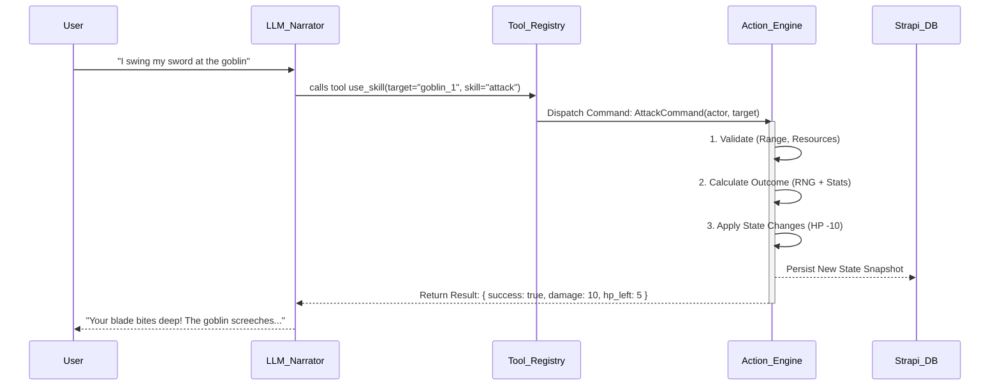

# Proposal 02: Deterministic Action Engine (Command Pattern)

## 1. The Bottleneck: Logic Coupling & "God Mode" fragility

Currently, game logic is intertwined with Strapi Services (`backend/src/api/game/services/game.ts`). The LLM (God Mode) likely calls these service methods directly or via ad-hoc switches.

- **Problem**: The "Engine" is not an engine; it's a collection of database manipulation scripts. It is hard to test, hard to replay, and hard for the LLM to use reliably.
- **Symptom**: "God Mode" chat is just a string parser. If the LLM says "Attack goblin", we have to manually parse it and find the right service method.

## 2. The Solution: Formalized Command Pattern

We treat the Game Engine as a **State Machine**. The LLM's role is strictly to output a structured **Command**.

`f(GameState, Command) -> { NewState, Events }`

### Architecture Diagram



## 3. Implementation Phases

### Phase 1: Command Definitions (In `@daicer/engine`)

Define strictly typed commands for every possible game action.

```typescript
interface Command {
  type: string;
  payload: any;
}
type AttackCommand = { type: 'ATTACK'; payload: { targetId: string; weaponId: string } };
type MoveCommand = { type: 'MOVE'; payload: { to: { x; y; z } } };
```

### Phase 2: The Action Dispatcher

Create a central `ActionDispatcher` in `@daicer/engine`.

- Input: `CurrentState`, `Command`
- Output: `Transaction` (a list of changes to apply)

### Phase 3: LLM Tool Binding

Expose these Commands to the LLM via the Vercel AI SDK or whatever tool calling mechanism is used.

- LLM Tool "Web" -> Maps 1:1 to `MoveCommand`.
- LLM Tool "Attack" -> Maps 1:1 to `AttackCommand`.

## 4. Arguments

- **Testability**: We can write unit tests for `ActionEngine` without running Strapi or a DB.
- **Replayability**: If we save the log of Commands, we can replay the entire session to debug bugs.
- **LLM Clarity**: The LLM knows exactly what actions are available because they are defined in code, not prose.
