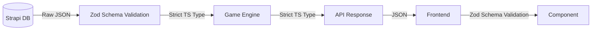

# Proposal 03: Strict Entity Boundaries & Data Consistency

## 1. The Bottleneck: Loose Data & "The Speed Issue"

The user identified a specific disconnect: "Speed" is an integer in some places code, but needs to be a complex object (Walk/Fly/Swim) in the rules.

- **Problem**: Strapi allows strictly defined schemas, but our code uses loose interfaces. We change the code, but the DB data remains "stale", leading to crashes.
- **Symptom**: `TypeError: activeEntity.speed.split is not a function` (if it was expected to be a string but is an int).

## 2. The Solution: Validation Boundaries (Zod)

We must treat the boundary between Code and Data (DB/Network) as hostile. We verify data _as it enters logic_.

### Architecture Diagram



## 3. Implementation Phases

### Phase 1: Shared Zod Schemas

Use `@daicer/shared` to define Zod schemas for all entities.

```typescript
// shared/src/schemas/actor.ts
export const SpeedSchema = z.union([
  z.number(), // Legacy support
  z.object({
    walk: z.number().default(30),
    fly: z.number().optional(),
    swim: z.number().optional(),
    climb: z.number().optional(),
  }),
]);
```

### Phase 2: The "Derivation" Layer

In Backend Services, never return raw Strapi data. Always pass it through `Schema.parse()`.

- If parsing fails, we catch it _before_ it crashes the frontend.
- We can implement "Transformers" here to handle Legacy Data (e.g., converting old `speed: 30` to `speed: { walk: 30 }` on the fly).

### Phase 3: Frontend Guards

Update frontend components to use Safe Parsing.

- If data is invalid, render an "Entity Corrupted" placeholder instead of crashing the whole HUD.

## 4. Arguments

- **Safety**: Prevents cascading failures.
- **Migration Path**: The Schema handles the logic of "It might be Old Format or New Format", decoupling the DB migration from the code deployment.
