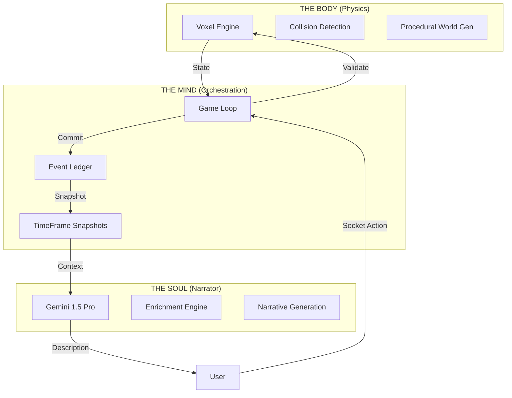
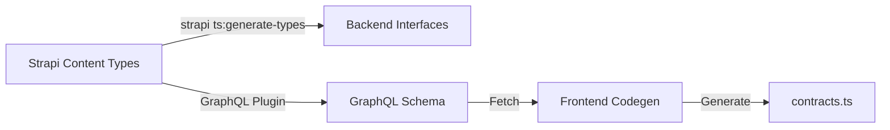

<div align="center">

# 🎲 DAICER

**The Server-Authoritative Voxel Roleplaying Engine**

[](https://github.com/lguibr/daice/actions/workflows/backend.yml)
[](https://github.com/lguibr/daice/actions/workflows/frontend.yml)
[](https://codecov.io/gh/lguibr/daice)
[](https://react.dev/)
[](https://strapi.io/)
[](https://www.typescriptlang.org/)
[](LICENSE)

<br />

> **"We do not hallucinate physics. We hallucinate description."**

</div>

---

## 🔥 The Philosophy (Why this exists)

**The Problem:**
In every VTT (Roll20, Foundry, Alchemy), the world is a **JPEG**. It is a static 2D plane. Walls are drawn lines. Height is a number in a text box.
When an AI Dungeon Master tries to run a game on a JPEG, it fails. It doesn't know where the wall is. It doesn't know if you can see the goblin. It hallucinates because it has no **Grounding**.

**The Daicer Solution:**
We built a **Voxel Physics Engine** first.

- The world exists on the server.
- It has 1ft precision (XYZ coordinates).
- It calculates Line of Sight (Raycasting).
- It handles Collision Detection.

Then, and ONLY then, do we attach the LLM.
The LLM (Gemini) is not the engine. It is the **Narrator**. It reads the deterministic state of the engine and describes it to you.

**We are building the Holodeck backend.**

---

## 🏛 The Trinity Architecture

The Daicer Engine is built on a Tri-Fold Architecture. Understanding this is key to contributing.



| Pillar       | Component            | Responsibility                                                                                                                                           | Tech Stack                                     |
| :----------- | :------------------- | :------------------------------------------------------------------------------------------------------------------------------------------------------- | :--------------------------------------------- |
| **THE BODY** | **Voxel Engine**     | **The Hard Truth.** Handles movement, collision, raycasting, and chunk management. It runs in Worker Threads for performance. It never waits for the AI. | `Worker Threads`, `Perlin Noise`, `Raycasting` |
| **THE SOUL** | **The Narrator**     | **The Soft Truth.** Interprets the user's "I want to swing my sword" and converts it into engine commands. Then, it describes the bloody result.         | `Gemini`, `LangChain`, `Zod Enforced`          |
| **THE MIND** | **The Orchestrator** | **The Timekeeper.** A rigid State Machine. It manages the `GameLoop`, processes the `TurnQueue`, and writes to the immutable `Ledger`.                   | `Strapi 5`, `Postgres`, `Socket.IO`            |

---

## 🛣 The Data Highways

How does data move? How do we ensure Type Safety across a Monorepo?

### 1. The Type Pipeline (Codegen)

We do not write types twice. We generate them.



1.  **Backend:** `yarn codegen` generates TypeScript interfaces from Strapi Models.
2.  **API:** Strapi automatically exposes a GraphQL Schema based on these models.
3.  **Frontend:** `yarn codegen` (via `@graphql-codegen/cli`) reads `http://localhost:1337/graphql` and generates strict TypeScript hooks and types.

### 2. The Engine Library (`backend/src/engine`)

"The Engine" is not just a folder. It is a shared library pattern within the backend.

- It contains **Pure Logic** (Math, Physics, Rules).
- It has **Zero Dependencies** on Strapi or React.
- It is imported by both the `VoxelEngine` (Body) and the `GameLoop` (Mind).

This separation ensures that if we ever swap Strapi for another CMS, the Physics Engine remains untouched.

---

## 🧠 Deep Tech Highlights

### 1. The Time Machine (Event Sourcing)

Daicer does not just overwrite database rows. We use a **Ledger System** (`game-ledger.ts`).

1. Every action is an Event (`MOVE`, `ATTACK`, `SPELL_CAST`).
2. Events are assigned a deterministic `sequenceId`.
3. Periodically, we create a full `TimeFrame` snapshot hash.
4. Clients can request _any_ previous frame to replay history.

```typescript
// The Immutable Truth
interface LedgerEvent {
  sequenceId: bigint;
  type: string; // "ATTACK"
  payload: unknown; // { target: "goblin-1", damage: 12 }
  hash: string; // SHA-256 of the resulting state
}
```

### 2. The Enrichment Engine

We do not manually enter data. We **Enrich** it.
Raw text from SRDs is useless to a computer. "Fireball does 8d6 damage" is a string.
Our **Enrichment Engine** (`backend/scripts/enrichment`) uses Gemini to "Hallucinate Structure":

_Input (Text):_ `"Fireball: A bright streak... 20ft radius... 8d6 fire damage."`
_Output (Zod Schema):_

```json
{
  "mechanic": "save_dex_half",
  "damage": { "dice": "8d6", "type": "fire" },
  "area": { "shape": "sphere", "radius": 20 }
}
```

Now the Voxel Engine can _mathematically_ calculate who gets hit.

### 3. The 1-Foot Grid

Most VTTs use 5ft squares. We use a **1ft coordinate system** (`x, y, z`).

- A Human is `2x2` voxels (approx 2ft wide).
- A Goblin is `1x1`.
- A Wall is `1` voxel thick.
  This allows for "Squeezing", "Partial Cover", and tight tactical movement that feels real, not like a board game.

---

## 🚀 Getting Started

### Prerequisites

- **Node.js 20+** (Active LTS)
- **Docker** (For the Postgres Database)
- **Yarn** (Strictly enforced)

### The "Ignition" Sequence

```bash
# 1. Install Dependencies (Monorepo-wide)
yarn install:all

# 2. Start the Development Cluster
yarn dev
```

This spins up:

- **Backend**: Strapi 5 on `http://localhost:1337`
- **Frontend**: React 19 on `http://localhost:3000`
- **Database**: Postgres on Port `5432` (Docker)

### Seeding the Universe

You need data. Laws of physics. Spells. Monsters.

```bash
yarn seed
```

_Note: This runs the seed script which populates the database with the SRD ruleset._

---

## 📂 Architecture Map

We follow a strict Monorepo structure.

```
/
├── .agent/             # AI Behavior Rules (The "Constitution")
├── backend/            # THE MIND & SOUL
│   ├── src/api/        # Business Logic
│   │   ├── game/       # The Game Loop & Ledger
│   │   ├── voxel/      # The Physics Engine
│   │   └── narrator/   # The AI Intermediary
│   └── scripts/        # Enrichment & Maintenance
│
├── frontend/           # THE FACE
│   ├── src/three/      # React Three Fiber (The 3D View)
│   ├── src/stores/     # Zustand (State Management)
│   └── src/components/ # "Juicy" UI Components
│
└── studyCase/          # DEEP LORE (Technical Design Docs)
```

---

## 🧪 The "33 Mandate" (Quality Control)

We are building a complex engine. **Tests are not optional.**
We enforce a "33 Mandate":

- Minimum **33 Critical Tests** per workspace.
- **Zero-Delta Debt**: You cannot commit if you broke the build.

```bash
# Run the Gauntlet
yarn test:all
```

---

<div align="center">

**State of the Art. Server Authoritative. Deterministic.**

[Contribution Guide](./CONTRIBUTING.md) • [Backend Deep Dive](./backend/README.md) • [Frontend Deep Dive](./frontend/README.md)

</div>
