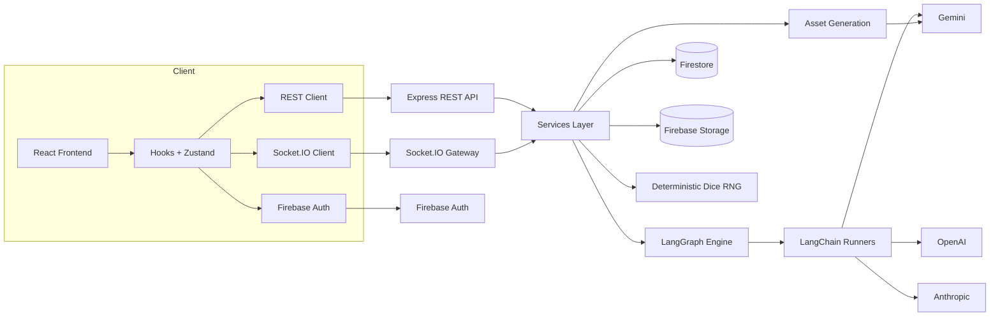

# Daicer

<p align="center">
  
</p>

<p align="center">
  <a href="https://github.com/lguibr/daice/actions/workflows/ci.yml"></a>
  <a href="https://github.com/lguibr/daice/releases"></a>
  <a href="https://github.com/lguibr/daice/actions/workflows/release.yml"></a>
  
  
  
  
  
  
  
</p>

Multiplayer tabletop RPG powered by an AI Dungeon Master. Daicer fuses deterministic dice mechanics, LangGraph orchestration, and a modern React client to deliver cooperative storytelling that stays faithful to D&D 5e.

---

## Why Daicer

- **AI DM with guardrails**: LangChain/LangGraph workflows enforce rules, track state, and expose every tool call.
- **Deterministic combat**: Seeded dice rolls make tactical encounters reproducible — rewind turns, branch timelines.
- **Emulator-first**: Firebase emulators ship in the dev loop for zero-cost local development.
- **Full-stack TypeScript**: Strict typing across backend + frontend, shared domain models, and colocated tests.
- **AI Asset Generation**: Generate 2D images, 3D voxel models, and procedural maps using Gemini AI.
- **Documented**: Every submodule ships with living READMEs (see links below).

---

## Monorepo Layout

```text
daicer/
├── backend/      Express + Socket.IO API, LangGraph services, Asset generation
├── frontend/     React 19 + Vite client, Storybook, Playwright, Assets UI
├── postman/      Postman collection for API testing and documentation
├── docs/         Mermaid diagrams, design notes
├── seeds/        SRD datasets and seeding scripts
├── scripts/      Repo-wide maintenance scripts
└── package.json  Yarn workspaces + shared tooling
```

Detailed docs:

- Backend: `backend/README.md`
- Frontend: `frontend/README.md`
- API controllers: `backend/src/api/README.md`
- Postman collection: `postman/README.md`
- Combat UI: `frontend/src/components/combat/README.md`
- Spell system: `backend/src/types/README-SPELLS.md`

---

## System Architecture



---

## Asset Generation (NEW)

Daicer now includes AI-powered asset generation tools accessible at `/assets`:

### Features

- **2D Image Generation**: Create character sprites and image variations using Gemini 2.5 Flash Image
  - Variations mode: Generate multiple versions of a base character
  - Text-to-Image: Create images from descriptions
  - Batch Transform: Apply transformations to multiple images

- **3D Voxel Models**: Generate low-poly 3D assets using Gemini 2.5 Pro
  - Creatures, Trees, Terrain, Humanoids, POIs, Objects
  - JSON-based voxel model format with primitive shapes
  - Real-time 3D preview with React Three Fiber

- **Procedural Maps**: Noise-based world generation
  - Multi-layer support (caves, surface, sky islands)
  - Biome systems with temperature and moisture
  - Cities, ruins, and structure generation
  - On-demand chunk loading

### Setup

Add to `backend/.env.local`:

```env
GEMINI_API_KEY=your_api_key_here
```

Get your API key at: https://aistudio.google.com/app/apikey

### Storage

- Assets stored in Firebase Storage (`assets/{userId}/...`)
- Metadata in Firestore collections: `assetCollections`, `assets`, `worldMaps`
- Full CRUD operations via REST API + Socket.IO for real-time progress

---

## Quick Start

1. **Prerequisites**
   - Node.js 22+
   - Yarn (Berry, shipped via repo)
   - Java 11+ (Firebase emulators)
   - Docker (optional, for container workflows)
   - Firebase CLI (`npm i -g firebase-tools`)

2. **Install dependencies**

   ```bash
   yarn install:all
   ```

3. **Copy env templates**

   ```bash
   cp .env.example .env.local
   cp backend/.env.example backend/.env.local
   ```

4. **Start full stack**

   ```bash
   yarn dev
   ```

   - Spins up Firebase emulators, backend watcher (`http://localhost:3001`), and frontend dev server (`http://localhost:3000`).

5. **Seed SRD data (optional)**

   ```bash
   yarn workspace @daicer/seeds seed:all
   ```

---

## Daily Commands

| Task                | Command                               |
| ------------------- | ------------------------------------- |
| Frontend dev server | `yarn workspace @daicer/frontend dev` |
| Backend only        | `yarn workspace @daicer/backend dev`  |
| Firebase emulators  | `yarn emulators`                      |
| Storybook           | `yarn storybook`                      |
| Run tests (all)     | `yarn test:coverage`                  |
| Backend QA          | `yarn qa backend`                     |
| Frontend QA         | `yarn qa frontend`                    |
| Lint + format       | `yarn lint && yarn format`            |

Complete CLI reference: `COMMANDS.md`

---

## Development Workflow

- **TDD**: Tests live beside code (`*.spec.ts` / `*.spec.tsx`). Write failing tests before modifying behavior.
- **Storybook**: Document UI states in `frontend/src/components/**/`. Stories double as visual regression baselines.
- **Graph Diagrams**: Mermaid diagrams in `docs/graphs/` illustrate gameplay and combat flow. Update when nodes change.
- **Data Seeds**: SRD data + spells reside in `seeds/`. Use `yarn workspace @daicer/seeds seed-spells` after modifying parser.
- **Debugging**: Press `Ctrl+D` in dev to open the in-app debug panel (socket traffic, LangGraph trace, combat timeline).

---

## Testing & QA

```bash
# Run all tests (frontend + backend)
yarn test

# Run with coverage (generates reports in all three locations)
yarn test:coverage

# Backend unit + integration
yarn test:backend

# Frontend component tests
yarn test:frontend

# E2E tests (separate, requires servers running)
yarn test:e2e

# Full QA suite (format, lint, typecheck, test with coverage)
yarn qa
```

### Testing Stack

- Jest (backend) with Firebase emulators + LangGraph mocks
- Vitest + Testing Library (frontend) with MSW
- Playwright E2E (auth, lobby, gameplay happy path)
- Coverage enforced at 80%+ statements/branches

### Coverage Reports

Coverage is automatically generated in three locations:

```text
coverage/                      # Combined frontend + backend reports
├── lcov.info                  # Merged LCOV data (for CI tools)
└── coverage-summary.json      # JSON summary with all metrics

backend/coverage/
└── index.html                 # Backend coverage report

frontend/coverage/
└── index.html                 # Frontend coverage report
```

**Automatic badge updates**: The `yarn test:coverage` command automatically:

1. Runs tests for frontend and backend
2. Generates coverage reports in each package
3. Merges reports into root `coverage/` directory
4. Updates the three coverage badges in this README with live percentages

---

## Release & Deployment

### One-click Release (tags starting with `v`)

1. Prepare release notes and ensure `main` is green.
2. Tag the desired commit:
   ```bash
   git tag v1.2.3
   git push origin v1.2.3
   ```
3. GitHub Actions `release.yml` workflow will:
   - Build backend container via Cloud Build.
   - Deploy backend to Cloud Run (`daicer-backend`).
   - Trigger Vercel production deployment for frontend.
   - Run database seeds using `seeds/cloudbuild.seed.yaml`.

### Manual Deployment

- Backend: see `docs/deployment.md#backend-on-google-cloud`.
- Frontend: see `docs/deployment.md#frontend-on-vercel`.
- Seeds: run from your machine or Cloud Build as documented in `docs/deployment.md#firestore-seeding`.

### CI Triggers

- `ci.yml`: Pull Requests, pushes to feature/release branches.
- `release.yml`: Tags matching `v*`.

## Observability & Ops

- Structured logging via Winston (`backend/src/utils/logger.ts`).
- LangGraph emits per-node traces stored in Firestore (`turn_history` collection).
- Health check at `GET /health` validates Firestore + LangGraph readiness.
- Cloud Run deployment pipeline defined in `backend/cloudbuild.yaml` and automated in `release.yml`.

---

## Automated Release Notes

Daicer automatically generates release notes from the `thoughts/` directory using Google Gemini AI. Every commit triggers a pre-commit hook that:

1. **Discovers** new thought/planning documents (`thoughts/*.md`)
2. **Summarizes** each with Gemini Flash 2.0
3. **Synthesizes** organized release notes with Gemini 2.0 Pro
4. **Versions** using semantic versioning (auto-increments patch)
5. **Stages** updated `RELEASE_NOTES.md` with the commit

### Setup

```bash
# Install dependencies (includes Husky)
yarn install

# Add Gemini API key to environment
export GOOGLE_GEMINI_API_KEY="your_api_key_here"
# Or add to .env file (not committed)
```

### Usage

**Automatic (on commit):**

```bash
git commit -m "your message"
# Release notes auto-generated and staged
```

**Manual:**

```bash
yarn release:notes
```

### Output

- **File**: `RELEASE_NOTES.md` (root directory)
- **Format**: Categorized markdown (🎨 Features, 🐛 Fixes, 📚 Docs, etc.)
- **State**: Tracked in `scripts/release-notes-state.json` to avoid duplicates

See `scripts/README.md` for detailed documentation.

---

## Troubleshooting

| Symptom                     | Likely Cause             | Resolution                                                    |
| --------------------------- | ------------------------ | ------------------------------------------------------------- |
| Cannot authenticate locally | Emulators not running    | `yarn emulators` then reload frontend                         |
| Socket disconnect loops     | Token expired or missing | Trigger `signOut()` and login again; inspect browser console  |
| LangGraph turn stuck        | Missing AI provider key  | Set `GEMINI_API_KEY` (or alternative) in `backend/.env.local` |
| Combat overlay incorrect    | Spell dataset outdated   | Rerun `yarn workspace @daicer/seeds seed-spells`              |
| Build fails on lint         | Airbnb rule violation    | Run `yarn lint:fix` or update offending code/tests            |
| Asset generation fails      | Missing GEMINI_API_KEY   | Set `GEMINI_API_KEY` in `backend/.env.local`                  |

---

## Contributing

1. Create feature branch off `main`.
2. Update relevant README(s) when behavior or contracts change.
3. Run appropriate QA commands (`yarn qa backend`, `yarn qa frontend`).
4. Provide tests (unit, integration, or e2e as appropriate).
5. Submit PR with context, screenshots (if UI), and verification checklist.

See `CONTRIBUTING.md` for broader guidelines.

---

## License

MIT — see `LICENSE`.

SRD content follows Wizards of the Coast Open Gaming License (refer to `docs/LICENSE-SRD.md`).
