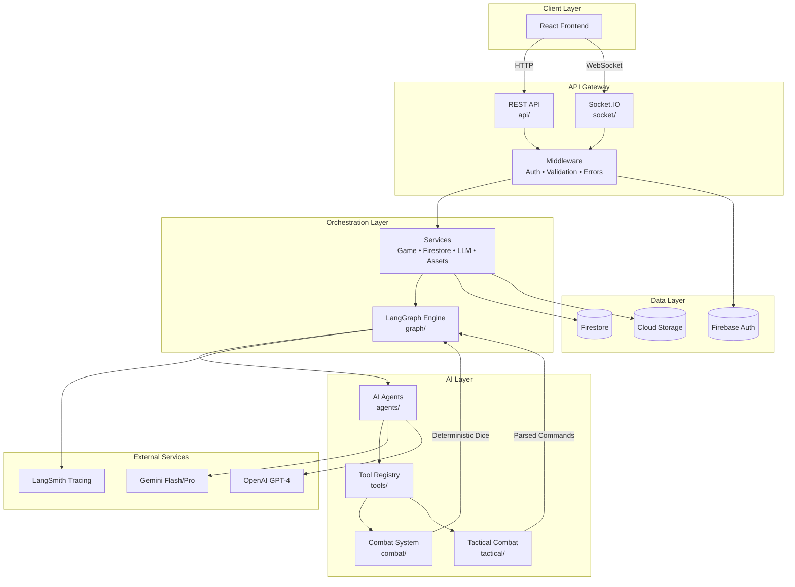
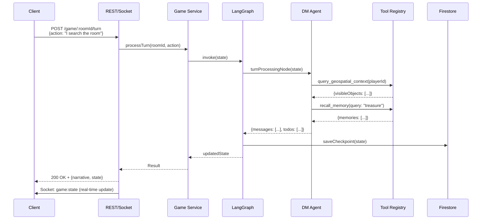

# Daicer Backend

<p align="center">
  
</p>

<p align="center">
  <a href="https://github.com/lguibr/daice/actions/workflows/ci.yml?query=branch%3Amain"></a>
  <a href="https://github.com/lguibr/daice/releases"></a>
  
  
  
  
  
  
</p>

Purpose-built orchestration layer for the AI Dungeon Master: REST + WebSocket APIs, LangGraph-tuned services, and Firebase persistence.

---

## TL;DR

- Express + Socket.IO server running on Node.js 22 with strict TypeScript and zero `any`.
- Persists narrative, combat, and asset state to Firestore and Storage via Firebase Admin SDK.
- Delegates AI-heavy work to LangChain / LangGraph services with deterministic dice rolls and audit trails.
- Ships with emulator-first workflows, reproducible Cloud Run deployments, and CI-enforced QA gates.

---

## Module Map

```text
backend/
├── src/
│   ├── agents/       AI agent configurations (DM, Tactical Commander)
│   ├── api/          HTTP controllers (RESTful surface)
│   ├── combat/       D&D 5e combat system (dice, nodes, tools, spells)
│   ├── config/       Firebase + LangChain + OpenAPI configuration
│   ├── graph/        LangGraph state machines (gameplay, combat, character creation)
│   ├── middleware/   Auth, validation, error shaping, rate limiting
│   ├── prompts/      LLM prompt templates (future)
│   ├── schemas/      Zod schemas for structured LLM outputs
│   ├── scripts/      Utility scripts (seed roles, parse spells, visualize graphs)
│   ├── services/     Business logic: game engine, Firestore, LLM, assets
│   ├── shared/       Pure utilities (spell geometry, loadouts)
│   ├── socket/       Real-time Socket.IO events
│   ├── tactical/     Grid-based tactical combat with natural language
│   ├── tools/        LangChain tool registry (48 tools)
│   ├── types/        TypeScript type definitions (spells, equipment, game data)
│   ├── utils/        Helpers (logging, dice, responses, room codes)
│   ├── workers/      Worker threads for parallel processing
│   └── server.ts     Express + Socket.IO bootstrap
├── jest.config.js
├── Dockerfile
└── cloudbuild.yaml
```

**Module Documentation:**

| Module                                       | Purpose                               | README                                 |
| -------------------------------------------- | ------------------------------------- | -------------------------------------- |
| **Core Systems**                             |                                       |                                        |
| [[src/graph/README.md\|Graph]]               | LangGraph state machines for gameplay | ⭐ Time-travel, deterministic turns    |
| [[src/combat/README.md\|Combat]]             | D&D 5e combat engine                  | ⭐ Deterministic dice, spell targeting |
| [[src/tactical/README.md\|Tactical]]         | Natural language tactical combat      | Grid-based, AI command parsing         |
| **AI Layer**                                 |                                       |                                        |
| [[src/agents/README.md\|Agents]]             | AI agent catalog                      | DM Agent, Tactical DM, World Builder   |
| [[src/tools/README.md\|Tools]]               | LangChain tool registry               | 48 validated tools with Zod schemas    |
| [[src/schemas/README.md\|Schemas]]           | Structured LLM outputs                | Turn responses, world generation       |
| [[src/prompts/README.md\|Prompts]]           | Prompt library                        | Future: centralized templates          |
| **API & Transport**                          |                                       |                                        |
| [[src/api/README.md\|API]]                   | REST controllers                      | OpenAPI documented                     |
| [[src/socket/README.md\|Socket]]             | WebSocket events                      | Real-time state sync                   |
| [[src/middleware/README.md\|Middleware]]     | Request pipeline                      | Auth, validation, errors               |
| **Services**                                 |                                       |                                        |
| [[src/services/README.md\|Services]]         | Business logic layer                  | Firestore, LLM, assets                 |
| [[src/config/README.md\|Config]]             | SDK initialization                    | Firebase, LangChain, OpenAPI           |
| **Data & Types**                             |                                       |                                        |
| [[src/types/README.md\|Types]]               | TypeScript definitions                | Spells, equipment, game data           |
| [[src/types/README-SPELLS.md\|Spell System]] | Complete spell reference              | 487 spells, geometry, targeting        |
| [[src/shared/README.md\|Shared]]             | Pure utilities                        | Spell geometry, loadouts               |
| **Utilities**                                |                                       |                                        |
| [[src/utils/README.md\|Utils]]               | Helpers                               | Logging, dice, room codes              |
| [[src/scripts/README.md\|Scripts]]           | Dev utilities                         | Seed data, parse spells                |
| [[src/workers/README.md\|Workers]]           | Parallel processing                   | Worker thread pools                    |

---

## Architecture Overview

### Role-Based Authorization

The backend implements a three-tier role system using Firebase custom claims:

- **`free`** - Default role for all new users. Access to core features.
- **`premium`** - Paid tier with access to advanced features (future).
- **`god`** - Admin role with full system access and exclusive admin features.

**Usage:**

```typescript
// Protect a route by role
import { authenticate } from '@/middleware/auth';
import { requireRole, requirePremium, requireGod } from '@/middleware/roleGuard';

// Require premium or god
router.post('/api/premium-feature', authenticate, requirePremium, handler);

// Require god only
router.post('/api/admin/users', authenticate, requireGod, handler);

// Custom role check
router.post('/api/custom', authenticate, requireRole(['premium', 'god']), handler);
```

**Seeding Test Users:**

```bash
yarn seed:roles
```

Creates:

- `free@daicer.com` / `freepass123` (free role)
- `premium@daicer.com` / `premiumpass123` (premium role)
- `god@daicer.com` / `godpass123` (god role)

---

## Architecture Overview (Continued)

### Complete System Diagram



### Data Flow: Turn Processing Example



Key traits:

- **Stateless containers**: Everything needed to rebuild state lives in Firestore and LangGraph checkpoints.
- **Deterministic combat**: Dice rolls seeded per encounter for replay & time-travel.
- **Observability baked in**: Structured logging with request correlation IDs and per-turn traces.

---

## Getting Started (Local)

1. Install workspace dependencies from repository root:

   ```bash
   yarn install:all
   ```

2. Copy environment templates (root + backend):

   ```bash
   cp .env.example .env.local
   cp backend/.env.example backend/.env.local
   ```

3. Populate `backend/.env.local`:

   ```env
   GEMINI_API_KEY=your-gemini-key
   FIREBASE_PROJECT_ID=daicer-dev
   FIREBASE_STORAGE_BUCKET=daicer-dev.appspot.com
   STORAGE_EMULATOR_HOST=http://127.0.0.1:9199
   OPENAI_API_KEY=optional
   ANTHROPIC_API_KEY=optional

   # LangSmith Tracing (optional)
   LANGSMITH_TRACING=true
   LANGSMITH_API_KEY=your-langsmith-key
   LANGSMITH_PROJECT=daicer-rpg
   ```

4. Launch the full stack (from repo root):

   ```bash
   yarn dev
   ```

   - Spins up Firebase emulators, backend watcher (port `3001`), and frontend dev server.

5. Alternative targeted workflows:

   ```bash
   yarn emulators           # Firebase only
   yarn dev:backend         # Backend only
   yarn test backend        # Jest in watch mode
   yarn storybook           # UI component catalog
   ```

Docker users:

```bash
docker-compose up backend   # Backend + emulators
docker-compose up           # Full stack
```

---

## Runtime Responsibilities

| Capability              | Where                                    | Notes                                                   |
| ----------------------- | ---------------------------------------- | ------------------------------------------------------- |
| REST endpoints          | `src/api`                                | Rooms, game lifecycle, asset generation, health checks  |
| WebSocket events        | `src/socket`                             | Real-time room state, combat progression, notifications |
| LangGraph orchestration | `src/services/game.ts`                   | Manages turn graph, tool execution, time travel         |
| Firestore access        | `src/services/firestore.ts`              | Emulator-aware, batched writes, optimistic concurrency  |
| Asset pipelines         | `src/services/asset-*.ts`                | Streams prompts to Gemini, stores outputs to Storage    |
| Spell + combat math     | `src/combat/*.ts`, `src/types/spells.ts` | Grid calculations, targeting, deterministic dice        |

---

## Key Scripts

| Command                       | Description                                        |
| ----------------------------- | -------------------------------------------------- |
| `yarn dev`                    | Start backend in watch mode (requires emulators)   |
| `yarn build`                  | Compile TypeScript to `dist/`                      |
| `yarn start`                  | Run compiled server (production)                   |
| `yarn test`                   | Jest unit/integration suite (auto spins emulators) |
| `yarn test:coverage`          | Jest with Istanbul coverage                        |
| `yarn test:ci`                | Headless CI run (fail on warnings)                 |
| `yarn lint` / `yarn lint:fix` | ESLint with Airbnb/TypeScript rules                |
| `yarn format`                 | Prettier write                                     |
| `yarn typecheck`              | `tsc --noEmit` safety net                          |

---

## Environment & Configuration

- **Firebase emulators** (default): Firestore on `localhost:8080`, Auth on `9099`, Storage on `9199`.
- **Service account**: Emulator mode uses `firebase-admin` without credentials; production injects service account via Secret Manager.
- **LangChain providers**: Keys pulled from env; configure provider priority in `src/config/langchain.ts`.
- **CORS**: Locked to `http://localhost:3000` in dev, environment variable driven in production.
- **Rate limiting**: Apply per-route via `express-rate-limit` (see `src/middleware/README.md`).

---

## Testing & QA

```bash
# Backend unit + integration suites
yarn test backend

# Spell targeting golden tests
yarn test backend/src/combat/__tests__/spell-targeting.test.ts

# Full QA (lint + format + typecheck + tests)
yarn qa
```

Testing layers:

- **Unit**: Utilities, services, reducers (Vitest-style assertions via Jest).
- **Integration**: API + socket flows with Firebase emulators.
- **Snapshots**: Combat spell geometries, LangGraph node transitions.
- **Regression**: Coverage enforced at ≥80% statements/branches.

---

## Observability & Ops

- **Logging**: `src/utils/logger.ts` configures Winston; emits JSON with request IDs and spans.
- **LangSmith Tracing**: All LangGraph flows and LLM calls are traced with comprehensive tags and metadata.
  - Each room creates a single thread (via `thread_id`/`session_id`) containing all traces
  - Tags include: room, phase, language, characters, turns, difficulty, theme, and more
  - Filter traces by: `"room:abc123" in tags`, `"phase:GAMEPLAY" in tags`, `"character:Alice" in tags`
  - Configure via `LANGSMITH_TRACING=true`, `LANGSMITH_API_KEY`, `LANGSMITH_PROJECT` env vars
  - See `src/utils/tracing.ts` for metadata/tag structure
- **Graph Tracing**: LangGraph runs annotate each node with duration + tool calls (persisted in Firestore `turn_history`).
- **Error shaping**: `src/middleware/error.ts` standardizes responses + hides stack traces in production.
- **Health**: `GET /health` tests Firestore and LangGraph readiness.
- **Metrics**: TODO — integrate OpenTelemetry (tracked in roadmap).

---

## Deployment (Cloud Run)

### Automated Release Flow

Tags prefixed with `v` (e.g., `v1.2.3`) trigger `release.yml`:

- Builds backend via Cloud Build using `backend/cloudbuild.yaml`.
- Deploys Cloud Run service `daicer-backend` in `us-central1`.
- Runs Firestore seeds by invoking `seeds/cloudbuild.seed.yaml`.
- Notifies Vercel to promote the latest frontend build.

### Manual Commands

```bash
gcloud builds submit --config cloudbuild.yaml
gcloud run deploy daicer-backend \
  --image gcr.io/<PROJECT_ID>/daicer-backend \
  --region us-central1 \
  --allow-unauthenticated
```

Configure environment:

- Secrets: `GEMINI_API_KEY`, `OPENAI_API_KEY`, `ANTHROPIC_API_KEY`, `FIREBASE_PRIVATE_KEY`.
- Vars: `FIREBASE_PROJECT_ID`, `FIREBASE_STORAGE_BUCKET`, `LOG_LEVEL`, `ALLOWED_ORIGINS`.
- Minimum instances: `1`, concurrency: `80`.

Post-deploy:

- Smoke test with `yarn test:e2e`.
- Verify Firestore indexes (`firestore.indexes.json`).
- Review Cloud Logging for errors.

---

## Contributing Checklist

1. Add/adjust tests beside the module (`*.spec.ts`).
2. Run `yarn qa backend`.
3. Update relevant README(s) if behavior or contracts change.
4. Provide migration notes for deployments (Firestore indexes, env vars).

Refer to `CONTRIBUTING.md` for repo-wide expectations.

---

## Troubleshooting

| Symptom                          | Likely Cause                    | Fix                                                         |
| -------------------------------- | ------------------------------- | ----------------------------------------------------------- |
| `UNAUTHENTICATED` responses      | Missing Firebase auth header    | Ensure frontend sends `Authorization: Bearer <token>`       |
| `Firestore emulator not running` | Forgot `yarn emulators`         | Start emulators or set `USE_EMULATORS=false`                |
| LangGraph node hang              | Gemini rate-limits              | Provide API key, enable fallback providers                  |
| Socket replay loop               | Client not acknowledging events | Inspect `socket/handlers.ts` and confirm idempotent reducer |

---

## Further Reading

- `src/services/README.md` — detailed LangGraph + Firestore orchestration.
- `docs/graphs/` — Mermaid diagrams for combat/narrative flows.
- `seeds/` — data population scripts for spells and SRD content.
- Root `README.md` — project-wide overview with frontend context.

---

MIT License.
