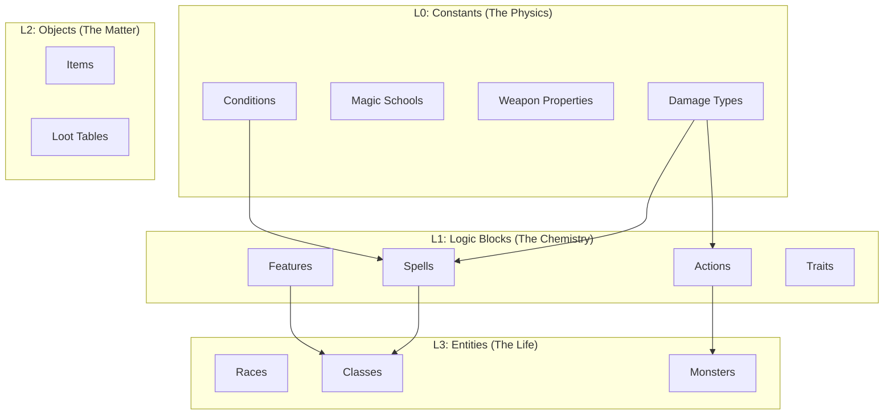

# 🧩 Daicer Genesis Service: SOTA Data Population Architecture

> **Philosophy**: "The Schema is the Map."
> We do not simply "insert text." We **hydrate** the Engine with computable, strictly-typed rules.
> We separate **Extraction** (converting text to JSON) from **Ingestion** (loading JSON to DB) to ensure determinism.

---

## 1. Directory Structure

We will establish a dedicated `backend/data` workspace to manage the lifecycle of game data.

```text
backend/
└─ data/
    ├─ raw/                  # Source of Truth (Markdown/PDFs)
    │   └─ rules.md          # The master rulebook
    ├─ library/              # The Verified Intermediate Representation (JSON)
    │   ├─ atoms/            # L0: DamageTypes, Conditions
    │   ├─ molecules/        # L1: Traits, Spells, Features
    │   ├─ compounds/        # L2: Items, Loot Tables
    │   └─ blueprints/       # L3: Monsters, Classes, Races
    ├─ schemas/              # Zod Schemas for the Library JSONs
    └─ scripts/              # The Machinery
        ├─ extractors/       # LLM/Regex pipelines (Raw -> Library)
        ├─ loaders/          # Deterministic seeders (Library -> DB)
        └─ verify.ts         # Integrity checker
```

---

## 2. The Dependency Graph (The "Why")

To maintain referential integrity in a Relational/Graph-like system (Strapi), we must respect the hierarchy of existence.



---

## 3. The Workflow Stages

### Stage A: Extraction (The "Smart" Part)

_Goal: Convert unstructured text into strictly typed JSON._
_Tools: LLM (Gemini/OpenAI), Regex, TypeScript._

1.  **Read** `backend/data/raw/rules.md`.
2.  **Parse** using `backend/data/scripts/extractors/parse-spells.ts`.
3.  **Validate** against `backend/data/schemas/Spell.ts` (Zod).
4.  **Write** to `backend/data/library/molecules/spells.json`.

> **SOTA Feature**: "Human-in-the-Loop Validation."
> Because the output is a JSON file on disk, the Developer (User) can manually review diffs in Git before the database is ever touched. This prevents "LLM Hallucinations" from corrupting the production DB.

### Stage B: Ingestion (The "Fast" Part)

_Goal: Hydrate the database idempotently._
_Tools: Strapi Entity Service._

1.  **Read** `backend/data/library/**/*.json`.
2.  **Upsert** (Update or Create) based on `slug`.
3.  **Link** relations automatically (e.g., finding the ID for "Fire" damage type when ingesting a "Fireball" spell).

---

## 4. Component Mapping & "Engine Compliance"

We populate data specifically to enable the **Deterministic Engine**.

### Example: The "Fireball" Spell

**Raw Text:**

> "A bright streak flashes... 8d6 fire damage... Dex save halves."

**Derived JSON (`library/molecules/spells.json`):**

```json
{
  "slug": "fireball",
  "name": "Fireball",
  "level": 3,
  "casting_config": {
    "time_value": 1,
    "time_unit": "Action"
  },
  "damage_instances": [
    {
      "dice_count": 8,
      "dice_value": 6,
      "damage_type": "fire" // Links to L0 Atom
    }
  ],
  "save": {
    "stat": "dex",
    "dc": 0, // Calculated at runtime
    "success_type": "half"
  }
}
```

**SOTA Requirement**: The Ingestor must fail if "fire" damage type does not exist in L0.

---

## 5. Execution Roadmap

### Phase 1: The Foundation (Atoms)

- [ ] Create `backend/data/library/atoms/*.json` (Manual/Static definition).
- [ ] Write `loaders/load-atoms.ts`.
- [ ] **Deliverable**: DB populated with Damage Types, Conditions, Schools.

### Phase 2: The Magic (Spells & Features)

- [ ] Define Zod Schemas for Spells and Features.
- [ ] Write `extractors/extract-spells.ts` (LLM-assisted).
- [ ] Write `loaders/load-molecules.ts`.
- [ ] **Deliverable**: Full spellbook searchable and linked.

### Phase 3: The Bestiary (Entities)

- [ ] **Critical**: Monsters are not just text blocks. They are pre-assembled Entities.
- [ ] Auto-create `api::action` generated items for their attacks (e.g., "Goblin Scimitar").
- [ ] **Deliverable**: Spawnable Goblins that can actually fight in the Engine.

### Phase 4: The Archives (Items)

- [ ] Populate Equipment (`api::item`).
- [ ] Link `weapon_properties` (Finesse, etc.) correctly so the Engine handles Dex-attacking.

---

## 6. Next Steps

1.  Create the folder structure.
2.  Initialize the **Atoms** JSON files.
3.  Write the `Loader` class (abstracts the Strapi `updateOrCreate` logic).
