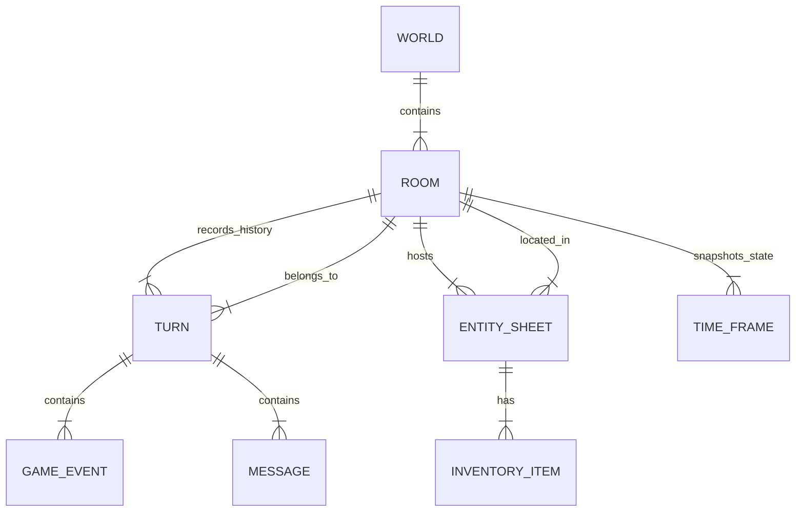

# Schema Architecture Map

> "The Schema is the Map."

This document illustrates the Monolithic Database Schema where the Database **IS** the State.

## Core Hierarchy

## Table Definitions

### 1. `api::world.world`

The root container.

- **Fields**: `name`, `seed`, `config` (JSON).
- **Purpose**: Defines the procedural generation rules and persistent identity of the campaign.

### 2. `api::room.room`

A distinct spatial instance (e.g., "The Tavern", "Dungeon Level 1").

- **Fields**: `name`, `status` (active/hibernating).
- **Relations**: Parent `World`.
- **Purpose**: The "Tick Boundary". Turns happen per Room.

### 3. `api::turn.turn`

The atomic unit of time and state change.

- **Fields**: `turnNumber` (int), `summary` (Text, AI generated), `startTime` (Ordering).
- **Relations**: Parent `Room`.
- **Content**: A batch of `GameEvents` that occurred during this tick.

### 4. `api::entity-sheet.entity-sheet`

The unified representation of Players, NPCs, Monsters, and Loot.

- **Fields**:
  - `name`, `type` (player|monster|npc|loot).
  - `stats` (Component: Str, Dex...), `hp`.
  - `inventory` (Dynamic Zone or Component List).
  - `position` (X, Y, Z coordinates).
- **Philosophy**: Ditching "EntityAdapter". This Table IS the gameplay object.

### 5. `api::game-event.game-event`

The Immutable Ledger.

- **Fields**: `type` (MOVE/ATTACK/etc), `payload` (JSON), `timestamp`.
- **Purpose**: Event Sourcing. We can rebuild the State by replaying these.

### 6. `api::time-frame.time-frame`

The "Save Game" / Checkpoint.

- **Fields**: `timestamp`, `gameState` (Full JSON Dump).
- **Purpose**: Performance. We snapshot every N turns so we don't have to replay from Turn 0.

---

_Generated by Antigravity Phase 3 Refactor._
