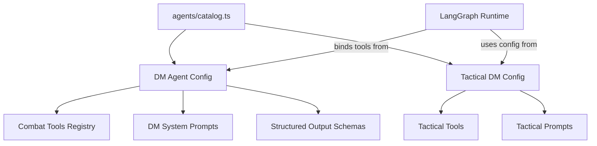
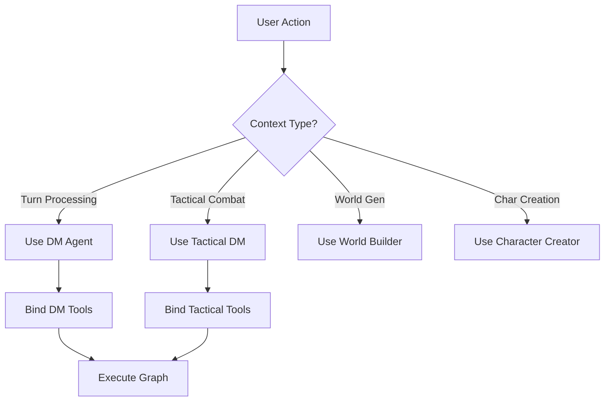

# Agent System

AI agent catalog and configuration registry. Defines personas, capabilities, and tool bindings for the DM Agent and Tactical Commander.

---

## Overview

The agent system provides a structured approach to configuring LangChain agents with:

- Defined roles and capabilities
- Tool registries (what each agent can do)
- Model configuration (temperature, tokens, system instructions)
- Prompt templates and output schemas



---

## Module Structure

```
agents/
├── catalog.ts       Agent configuration registry (DM, Tactical Commander, World Builder)
└── tacticalDM.ts    Tactical combat agent with natural language command parsing
```

---

## Agent Catalog (`catalog.ts`)

Central registry of all agents with their capabilities and configuration.

### Agent Config Schema

```typescript
export interface AgentConfig {
  id: string; // Unique identifier
  name: string; // Human-readable name
  description: string; // Purpose and scope
  role: 'dm' | 'tactical-commander' | 'world-builder' | 'character-creator' | 'assistant';
  capabilities: string[]; // High-level capabilities
  availableTools: string[]; // Tool IDs from registry
  primaryPrompts: string[]; // Prompt template IDs
  outputSchemas: string[]; // Zod schema IDs for validation
  model: string; // LLM model (default: gemini-2.0-flash-exp)
  temperature: number; // 0-2, default 0.7
  maxTokens?: number; // Optional token limit
  systemInstructions: string; // Core system prompt
  tags: string[]; // For filtering/discovery
  version: string; // Semantic version
  isActive: boolean; // Feature flag
}
```

### Registered Agents

#### 1. DM Agent (`dm-agent`)

**Role:** Main narrative agent for turn processing and storytelling.

**Capabilities:**

- Turn narrative generation
- Combat initiation and management
- NPC dialogue and reactions
- Environmental descriptions
- Rule adjudication
- Self-planning with todos
- Human clarification requests
- Semantic memory storage/retrieval
- Equipment and inventory management

**Available Tools:** (48 total)

- Combat: `start_combat`, `combat_attack`, `combat_move`, `end_turn`, `end_combat`
- State Query: `query_character_sheet`, `query_combat_log`, `query_tactical_grid`
- State Mutation: `update_character_hp`, `apply_condition`, `update_inventory`, `grant_xp`
- SRD Reference: `query_spells`, `query_monsters`, `query_conditions`, `query_equipment`
- Memory: `recall_memory`, `store_memory`
- Planning: `create_todo`, `update_todo`, `complete_todo`, `list_todos`
- Human Interaction: `ask_human`
- DM Overrides: `override_dice_roll`, `apply_rule_of_cool`, `invoke_legendary_action`
- Geospatial: `query_geospatial_context`

**Model:** `gemini-2.0-flash-exp` (temperature: 0.7)

**Output Schemas:**

- `TurnResponse` - Main turn narrative with player perspectives
- `TodoUpdate` - Self-planning structures
- `MemoryEntry` - Semantic storage format

**System Instructions:**

```
You are the Dungeon Master for a D&D 5e game using the DAICE platform.
Your role is to create immersive, rule-compliant narratives while managing
combat, NPCs, and environmental challenges.

CRITICAL PRINCIPLES:
1. Use tools for ALL mechanical operations (dice, damage, state changes)
2. Generate personalized perspectives based on player geospatial position
3. Plan complex scenarios using todos before execution
4. Store significant events in semantic memory
5. Ask humans for clarification when player intent is ambiguous
6. Apply Rule of Cool for epic moments, but maintain mechanical integrity
```

---

#### 2. Tactical DM Agent (`tactical-dm-agent`)

**Role:** Natural language command parser for grid-based tactical combat.

**Capabilities:**

- Parse natural language combat commands
- Validate D&D 5e tactical rules
- Generate action previews with predictions
- Execute tactical maneuvers
- Manage grid-based positioning
- LOS and range validation

**Model:** `gemini-2.0-flash-exp` (temperature: 0.3 for precision)

**System Instructions:**

```
You are a tactical combat agent specializing in natural language command parsing
for D&D 5e grid-based combat. Parse player commands into structured actions,
validate them against 5e rules, and generate accurate previews.
```

See [[tactical/README.md]] for full tactical system documentation.

---

#### 3. World Builder Agent (`world-builder-agent`)

**Role:** Procedural world generation from player settings.

**Capabilities:**

- Generate campaign setting narratives
- Create key NPCs and factions
- Design initial quest hooks
- Establish atmosphere and tone
- Define starting locations

**Status:** `isActive: false` (future implementation)

---

#### 4. Character Creator Agent (`character-creator-agent`)

**Role:** Guided character creation with validation.

**Capabilities:**

- Validate D&D 5e character builds
- Generate background narratives
- Suggest optimal builds
- Create appearance descriptions

**Status:** `isActive: false` (future implementation)

---

## Tactical DM (`tacticalDM.ts`)

Specialized agent for [[tactical/README.md|tactical combat]] with RAG-enhanced rule validation.

### Key Features

1. **Natural Language Parsing:**
   - "Gandalf moves to (5,3) and casts fireball"
   - "Orc attacks nearest player"
   - "Wizard takes dodge action"

2. **Rule Validation:**
   - Range checks (Manhattan for melee, Euclidean for ranged)
   - Line of sight (Bresenham algorithm)
   - Movement costs (terrain-based)
   - Action economy (has action/movement remaining)

3. **Action Preview:**
   - Hit chance predictions
   - Damage range (min/max/avg)
   - Movement path visualization
   - Friendly fire warnings

### Structured Output

```typescript
export const ParsedCommandSchema = z.object({
  intent: z.enum(['move', 'attack', 'cast_spell', 'dodge', 'dash', 'help']),
  actorId: z.string(),
  targetId: z.string().optional(),
  targetPosition: z.object({ x: z.number(), y: z.number() }).optional(),
  spellId: z.string().optional(),
  movementPath: z.array(z.object({ x: z.number(), y: z.number() })).optional(),
});
```

---

## Usage Examples

### Initializing DM Agent

```typescript
import { DM_AGENT_CONFIG } from '@/agents/catalog';
import { createReactAgent } from '@langchain/langgraph/prebuilt';
import { getChatModel } from '@/config/langchain';

const model = getChatModel({
  modelName: DM_AGENT_CONFIG.model,
  temperature: DM_AGENT_CONFIG.temperature,
});

const dmAgent = await createReactAgent({
  llm: model,
  tools: bindToolsFromRegistry(DM_AGENT_CONFIG.availableTools),
  checkpointer: firestoreCheckpointer,
});
```

### Using Tactical DM

```typescript
import { parseTacticalCommand } from '@/agents/tacticalDM';

const result = await parseTacticalCommand({
  command: 'Wizard casts fireball at the goblin group',
  encounterId: 'enc-123',
  activeUnitId: 'wizard-1',
});

// Result includes validated action plan with preview
console.log(result.preview.hitChance); // 0.65
console.log(result.preview.affectedUnits); // ['goblin-1', 'goblin-2', 'fighter-1']
console.log(result.validation.warnings); // ['Friendly fire: Fighter will be hit']
```

---

## Agent Selection Logic



---

## Configuration Best Practices

1. **Model Selection:**
   - Use `gemini-2.0-flash-exp` for most agents (fast, cost-effective)
   - Use `gemini-2.0-flash-thinking-exp` for complex multi-step planning
   - Use lower temperature (0.3) for tactical/mechanical tasks
   - Use higher temperature (0.9) for creative narrative

2. **Tool Binding:**
   - Only bind tools relevant to the agent's role
   - Tactical DM should NOT have narrative tools
   - DM Agent should have full SRD access

3. **System Instructions:**
   - Keep core principles in system prompt
   - Use few-shot examples in prompt templates (not in config)
   - Reference [[schemas/agent-responses.md|output schemas]] explicitly

4. **Versioning:**
   - Increment version on breaking changes to tools/prompts
   - Use feature flags (`isActive`) for gradual rollout
   - Tag with domain labels for filtering (`combat`, `narrative`, `rag`)

---

## Testing

Currently no automated tests for agent configs. Manual validation checklist:

- [ ] All referenced tools exist in [[tools/README.md|tool registry]]
- [ ] All referenced prompts exist in [[prompts/README.md|prompt library]]
- [ ] All output schemas exist in [[schemas/README.md|schema catalog]]
- [ ] System instructions are under 2000 tokens
- [ ] Agent can bind tools and execute a simple task

---

## Future Enhancements

1. **Multi-Agent Orchestration:**
   - DM delegates to Tactical DM for combat
   - World Builder pre-generates lore for DM retrieval
   - Character Creator validates sheets before DM ingestion

2. **Dynamic Tool Selection:**
   - Agent queries tool registry based on current phase
   - Tools hot-swap based on combat vs exploration

3. **Agent Fine-Tuning:**
   - Export LangSmith traces for fine-tuning dataset
   - Custom Gemini fine-tune for DAICE-specific prompts

---

## Related Documentation

- [[../graph/README.md|LangGraph Integration]] - How agents are used in graphs
- [[../tools/README.md|Tool Registry]] - Available tools and their schemas
- [[../schemas/README.md|Output Schemas]] - Structured output validation
- [[../prompts/README.md|Prompt Templates]] - Reusable prompt library
- [[../tactical/README.md|Tactical Combat]] - Tactical DM implementation details
- [[../../PROJECT_CATALOG.md|Project Architecture]] - Overall system design

---

Built with composable architecture following [[../../.cursor/rules/README.md|DAICE Architectural Principles]].
