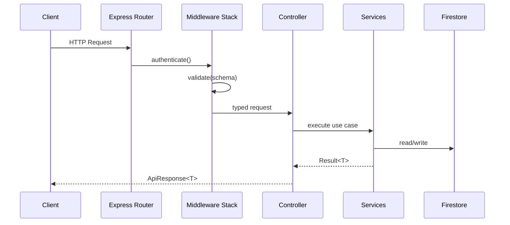

# Backend API Layer

Typed Express controllers powering narrative setup, room lifecycle, combat orchestration, and asset generation.

---

## Request Lifecycle



Responsibilities:

- Keep controllers thin: parameter parsing and orchestration only.
- Delegate domain rules to `src/services/`.
- Enforce consistent response envelopes with `success` + `data` or structured errors.

---

## File Overview

| File            | Purpose                                                 | Primary Services                                    |
| --------------- | ------------------------------------------------------- | --------------------------------------------------- |
| `rooms.ts`      | Create/join/manage multiplayer rooms                    | `services/game`, `services/firestore`               |
| `game.ts`       | World generation, character submission, turn processing | `services/game`, `services/llm`, `services/asset-*` |
| `users.ts`      | Player profile lookup and preferences                   | `services/firestore`                                |
| `assets.ts`     | Character art + battlemaps via Gemini                   | `services/asset-prompts`, `services/asset-storage`  |
| `characters.ts` | Character sheet CRUD                                    | `services/firestore`                                |
| `spells.ts`     | Spell metadata read endpoints                           | `services/game-data`                                |

Controllers export Express routers that are registered in `src/api/index.ts`.

---

## Endpoint Catalogue

### Health & Diagnostics

| Verb | Path      | Description                            | Auth |
| ---- | --------- | -------------------------------------- | ---- |
| GET  | `/health` | Liveness + Firestore + LangGraph probe | none |

### Rooms

| Verb   | Path                          | Notes                                         |
| ------ | ----------------------------- | --------------------------------------------- |
| POST   | `/api/rooms`                  | Create room + owner membership                |
| POST   | `/api/rooms/:code/join`       | Join via short code                           |
| GET    | `/api/rooms/:roomId`          | Fetch room state (includes players, settings) |
| PATCH  | `/api/rooms/:roomId/settings` | Owner-only updates                            |
| DELETE | `/api/rooms/:roomId`          | Soft-delete room + archived history           |

### Game Lifecycle

| Verb | Path                          | Description                              |
| ---- | ----------------------------- | ---------------------------------------- |
| POST | `/api/game/:roomId/world`     | Generate narrative seed + world settings |
| POST | `/api/game/:roomId/character` | Submit character sheet                   |
| POST | `/api/game/:roomId/turn`      | Execute next turn (LangGraph)            |
| POST | `/api/game/:roomId/reset`     | Rewind to initial turn (time-travel)     |

### Assets

| Verb | Path                          | Input                             |
| ---- | ----------------------------- | --------------------------------- |
| POST | `/api/assets/avatar`          | prompt + optional reference image |
| POST | `/api/assets/grid-background` | biome prompt                      |
| POST | `/api/assets/action-frame`    | action description, camera angle  |

### Reference Data

| Verb | Path                   | Description                              |
| ---- | ---------------------- | ---------------------------------------- |
| GET  | `/api/spells`          | Filterable spell catalogue               |
| GET  | `/api/spells/:id`      | Spell detail                             |
| GET  | `/api/game-data/races` | Static SRD lookups (race, class, skills) |

> Every protected route requires `Authorization: Bearer <Firebase ID token>`; tokens are verified in `middleware/auth.ts`.

---

## Request & Response Shapes

```typescript
interface ApiRequest<Params = unknown, Body = unknown, Query = unknown> extends Request {
  params: Params;
  body: Body;
  query: Query;
  user: DecodedIdToken;
}

interface ApiResponse<T> {
  success: true;
  data: T;
  meta?: Record<string, unknown>;
}

interface ApiError {
  success: false;
  error: {
    code: string;
    message: string;
    details?: unknown;
  };
}
```

Common payloads live in `src/types/api.ts`. Use `zod` schemas (under `src/schemas`) to validate both input and output (through `superRefine`).

---

## Validation & Error Handling

- **Auth**: `authenticate` middleware attaches `req.user` or throws `401`.
- **Validation**: `validate(schema)` ensures body/query/params; failed validations throw `422` with `details`.
- **Permissions**: Controllers own authorization checks (e.g. owner vs member) and throw `403` using `ForbiddenError`.
- **Errors**: Throw `ApiError` instances from `src/utils/response.ts`. The global error handler serializes them with consistent casing and hides stack traces outside `NODE_ENV=development`.

Example:

```typescript
router.post('/:roomId/turn', authenticate, validate(processTurnRequestSchema), async (req, res) => {
  const result = await processTurn({
    roomId: req.params.roomId,
    userId: req.user.uid,
  });
  return res.json(ok(result));
});
```

---

## OpenAPI Specification

The DAICE backend automatically generates OpenAPI 3.0 documentation from JSDoc annotations using [swagger-jsdoc](https://github.com/Surnet/swagger-jsdoc).

### Accessing the Documentation

- **Swagger UI**: http://localhost:3001/api-docs (interactive documentation with "Try it out" feature)
- **JSON Spec**: http://localhost:3001/api-docs/spec (raw OpenAPI JSON for tools like Postman)
- **YAML Spec**: http://localhost:3001/api-docs/spec.yaml (YAML format)

In E2E environment: replace port `3001` with `3101`.

### Using Postman

Postman can import the OpenAPI spec directly:

1. Open Postman
2. Click **Import** → **Link**
3. Enter: `http://localhost:3001/api-docs/spec`
4. Postman creates a collection from the spec

This complements the existing hand-crafted Postman collection in `postman/daicer-api.postman_collection.json`, which contains more complex test flows.

### Adding Documentation to New Endpoints

When creating a new endpoint, add an `@openapi` JSDoc block above the route handler:

```typescript
/**
 * @openapi
 * /api/example/{id}:
 *   get:
 *     summary: Brief description
 *     description: Detailed explanation of what this endpoint does
 *     tags:
 *       - TagName
 *     security:
 *       - bearerAuth: []
 *     parameters:
 *       - in: path
 *         name: id
 *         required: true
 *         schema:
 *           type: string
 *         description: The resource ID
 *     responses:
 *       200:
 *         description: Success response
 *         content:
 *           application/json:
 *             schema:
 *               type: object
 *               properties:
 *                 success:
 *                   type: boolean
 *                 data:
 *                   $ref: '#/components/schemas/YourSchema'
 *       401:
 *         $ref: '#/components/responses/UnauthorizedError'
 *       404:
 *         $ref: '#/components/responses/NotFoundError'
 */
router.get('/:id', authenticate, async (req, res) => {
  // handler code
});
```

**Key Guidelines:**

- Use standard OpenAPI 3.0 syntax
- Reference common responses: `UnauthorizedError`, `NotFoundError`, `ValidationError`, `ServerError`
- Reference common schemas: `Room`, `Player`, `UserProfile`, `ApiSuccessResponse`, `ApiErrorResponse`
- Add schemas to `backend/src/config/openapi.ts` for reusability
- Tags should match our API categories: Health, Rooms, Game, Users, Characters, Spells, Assets, Equipment, Tactical

### Configuration

The base OpenAPI config is in `backend/src/config/openapi.ts`. Update this file to:

- Add new reusable schemas
- Modify server URLs
- Add global security schemes
- Define common response objects

---

## Versioning & Compatibility

- Breaking changes require a new route prefix (`/v2/...`) or feature flags.
- Deprecate old routes with warning logs + documentation updates.
- Maintain swagger-like documentation in `docs/api/openapi.yaml` (planned).

---

## Adding a New Endpoint

1. Create controller in `src/api/<feature>.ts`; export typed router.
2. Define request/response schemas in `src/schemas/<feature>.ts`.
3. Implement use case inside appropriate service.
4. Register router in `src/api/index.ts`.
5. Add tests in `src/api/__tests__/<feature>.spec.ts` using supertest + emulators.
6. Update README(s) and root API catalogue.
7. Run `yarn qa backend`.

---

## Testing

```bash
# Run all API tests
yarn test backend/src/api/__tests__

# Single file
yarn test backend/src/api/__tests__/rooms.spec.ts

# Watch mode
yarn test --watch backend/src/api
```

Each test spins up:

- Firebase emulators (implicitly via `setup-emulators.ts`).
- Supertest request agent targeting the Express app.
- Fake LangGraph execution where applicable (mocks in `__mocks__/langgraph.ts`).

---

## References

- `src/services/README.md` — downstream orchestration details.
- `src/middleware/README.md` — authentication, validation, error stack.
- `docs/graphs/gameplay-graph.mmd` — LangGraph turn walkthrough.
- Root `COMMANDS.md` — CLI commands for debugging environments.
