# 🧙‍♂️ Narrator API

> **Namespace**: `api::narrator`  
> **Route**: `/api/narrator/action`

The **Narrator API** acts as the interface for the AI Dungeon Master (DM). It processes player input, interprets intent, interacts with the deterministic Game Engine, and generates immersive flavor text.

## 🧠 Architecture

The Narrator operates as an **Agentic Loop** that bridges natural language and deterministic game logic:

```mermaid
sequenceDiagram
    participant Player
    participant API as NarratorController
    participant Service as NarratorService
    participant LLM as Gemini 1.5
    participant Tools as GameTools
    participant Engine as GameEventService

    Player->>API: POST /action { input: "I run north!" }
    API->>Service: processAction(input, roomId)
    Service->>Service: Persist User Message (DB)

    rect rgb(20, 20, 30)
        Note over Service, LLM: Agent Loop
        Service->>LLM: Invoke (History + System Prompt)

        alt Tool Call Needed
            LLM->>Service: Call Tool: move_entity(x, y)
            Service->>Tools: Invoke Tool
            Tools->>Engine: Validate & Log Event
            Engine-->>Tools: Result ("Moved to 10,10")
            Tools-->>Service: Tool Output
            Service->>LLM: Re-invoke with Tool Output
        end

        LLM-->>Service: Final Narrative ("You sprint north...")
    end

    Service->>Service: Persist Narrator Message (DB)
    Service-->>Player: Return JSON
```



## 🛠 Core Services

### 1. Narrator Service (`services/narrator.ts`)

The orchestrator of the system.

- **Identity Resolution**: Maps `userId` to a character name.
- **LLM Initialization**: Instantiates `ChatGoogleGenerativeAI` (Gemini 1.5 Flash).
- **Prompt Engineering**: Selects the system prompt based on mode:
  - **DM Mode**: Immersive, roleplay-heavy, interprets intent.
  - **Debug Mode**: Strict executor, no flavor text.
- **Message Persistence**: Saves both User and Narrator messages to the `api::message.message` collection.
- **Broadcasting**: Uses `streamManager` to broadcast `message:new` events to all clients in the room via Socket.IO.

### 2. Tools (`services/tools.ts`)

The "hands" of the Narrator. These are **Structured Tools** (using Zod schemas) that the LLM can invoke to modify the game state.

| Tool Name     | Description                       | Logic (GameEventService)                            |
| :------------ | :-------------------------------- | :-------------------------------------------------- |
| `move_entity` | Moves a player/entity to a coord. | Validates physics/collision -> Logs `MOVE` event.   |
| `inspect_map` | Checks terrain at a location.     | Queries WorldGenerator -> Returns Biome/Block info. |

### 3. Game Event Integration (`api::game-event`)

The Narrator does **not** modify the world directly. It **requests** changes via the `GameEventService` (`api/game-event`). architecture.

- **Validation**: The engine (physics) decides if a move is valid.
- **Determinism**: Failed actions are returned to the LLM as failures ("You walk into a wall"), which the LLM then narrates ("You bump your head against the cold stone").

## 🔗 Utilities Integration

### LLM Utils (`utils/llm`)

The Narrator leverages the centralized streaming architecture:

- Imports `streamManager` to broadcast updates.
- Uses `ChatGoogleGenerativeAI` from LangChain (Google GenAI SDK).
- **Note**: Currently instantiates the model directly to bind custom game tools, rather than using the generic factory.

## 📡 Events

The service broadcasts standard message events:

- `message:new`: Sent when the User speaks AND when the Narrator replies.

## 📝 Usage Example

**Request:**

```json
POST /api/narrator/action
{
  "roomId": "documentId-123",
  "input": "I check the map for mountains",
  "userId": "user-456"
}
```

**Internal Flow:**

1. LLM identifies intent: `inspect_map`.
2. Tool executes `inspectTerrain`.
3. Engine returns: `Terrain: SCOTLAND_HIGHLANDS (Stone)`.
4. LLM narrates: "You unfold your map. To the north, the jagged peaks of the highlands rise..."

**Response:**

```json
{
  "message": "You unfold your map. To the north, the jagged peaks of the highlands rise...",
  "events": []
}
```
