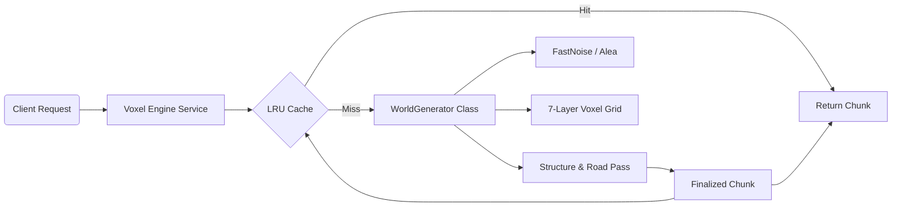

# 🧊 Voxel Engine System

> **Namespace**: `api::voxel-engine`  
> **Core Logic**: `services/world-generator-logic.ts`

The **Voxel Engine** is the deterministic, procedural heart of the Daicer world. It handles the generation of the 3D voxel grid, biome distribution, and structure placement using seeded noise algorithms.

## 🏗 Architecture Overview

The engines runs on a **Server-Authoritative** model where the backend generates world data on-demand as "Chunks".



## 🌍 World Generation Pipeline

The generation process for a single chunk (`16x16` or configured size) follows a strict deterministic pipeline:

1.  **Coordinate Mapping**:
    - Global coordinates (`worldX`, `worldY`) are derived from Chunk coordinates.
    - **Z-Levels**: The engine supports a 7-layer vertical slice:
      - `Z= 3` to ` 1`: Sky (Floating islands, tall structures)
      - `Z= 0`: **Surface** (Ground level)
      - `Z=-1` to `-3`: Underground (Dungeons, caves)

2.  **Terrain Pass (Noise)**:
    - Uses **FastNoise** with Fractional Brownian Motion (FBM).
    - **Elevation**: Determines height map and water levels.
    - **Moisture**: Combined with Elevation to determine **Biome**.

3.  **Biome Resolution**:
    - `OCEAN` / `BEACH`: Based on sea level threshold.
    - `SNOWY_PEAKS` / `MOUNTAIN`: High elevation.
    - `DESERT` / `FOREST` / `PLAINS`: Derived from Moisture/Heat map.

4.  **Civilization & Structure Pass**:
    - Operates on a "Region" grid (larger than chunks) to place structures deterministically.
    - **Collision Detection**: Scans 3x3 surrounding regions to render structures that overlap chunk boundaries.
    - **Roads**: Uses **Bresenham’s Line Algorithm** to "rasterize" paths between structures across chunks.

## 🧱 Data Structures

### Chunk

The fundamental unit of the world.

```typescript
interface Chunk {
  x: number; // Chunk X coordinate
  y: number; // Chunk Y coordinate
  tiles: Tile[][][]; // 3D Array [Z][Y][X]
}
```

### Tile

A single voxel unit.

```typescript
interface Tile {
  x: number;
  y: number;
  z: ZLevel; // -3 to +3
  block: BlockType; // e.g., 'stone', 'grass', 'water'
  biome: BiomeType;
  isWalkable: boolean;
  isTransparent: boolean;
  variant: number; // 0.0-1.0 for texture variation
}
```

## 🏰 Supported Structures

Structures are procedural "Stamps" applied to the voxel grid:

| Type        | Description                 | Special Features                          |
| :---------- | :-------------------------- | :---------------------------------------- |
| **City**    | Large cluster of buildings  | Plaza center, multiple building materials |
| **Castle**  | Fortified walls             | Outer walls, central keep, majestic gate  |
| **Tower**   | Vertical distinct structure | Spiral staircases, high visibility        |
| **Dungeon** | Underground complex         | Procedural maze generation (Z -1 to -3)   |

## 🧩 Usage

The engine is typically accessed via the Strapi Service layer:

```typescript
// In a Controller or another Service
const chunk = await strapi.service('api::voxel-engine.voxel-engine').getChunk(chunkX, chunkY, config);
```

### Configuration (`WorldConfig`)

- `seed`: String input for deterministic RNG.
- `chunkSize`: Width/Depth of a chunk (default: 16).
- `seaLevel`: Threshold for water generation.
- `structureChance`: Probability (0-1) of structure per region.
- `roadDensity`: Probability (0-1) of road connections.

## 🛠 Extension Guide

### Adding a New Biome

1.  Define the `BiomeType` in `utils/types.ts`.
2.  Update `determineBiome()` in `world-generator-logic.ts` with new noise thresholds.
3.  Add mapping for `BlockType` (surface block) for that biome.

### Adding a New Structure

1.  Add type to `StructureInfo` interface.
2.  Implement a `generateMyStructure()` method in `WorldGenerator`.
    - Use `stampBuilding()` for basic shapes.
    - Use `setBlock()` for precise voxel placement.
3.  Register it in `renderStructure` switch case.

## 🧪 Determinism & Caching

- **Determinism**: The same `seed` + `chunkX/Y` will **always** produce the exact same Voxel data. This allows the backend to be stateless regarding map storage.
- **Caching**: An LRU (Least Recently Used) cache stores the last 200 chunks to prevent re-calculation during active player movement.
