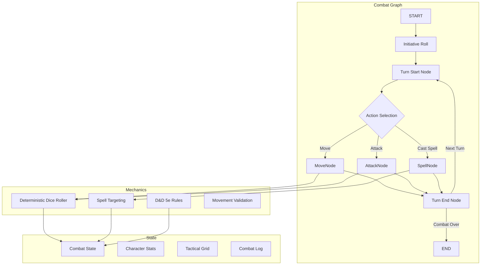
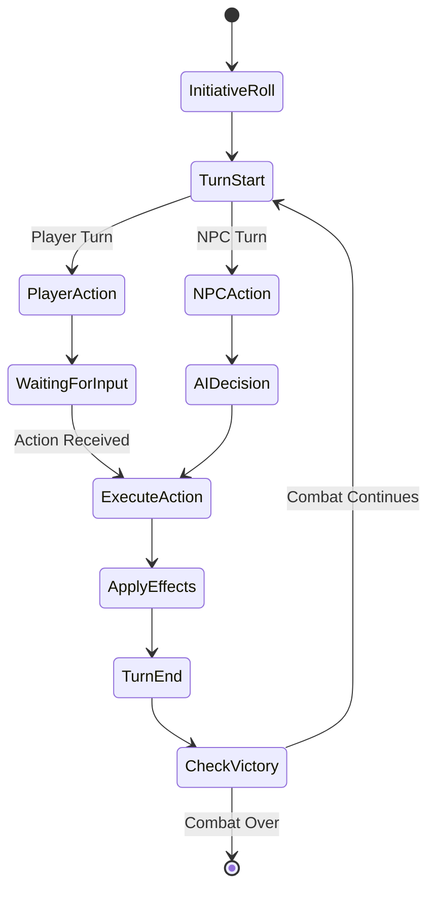

# Combat System

Deterministic, time-travelable D&D 5e combat engine powered by LangGraph. Handles initiative, turn order, movement, attacks, spell targeting, and grid-based spatial mechanics.

---

## Architecture Overview



---

## Module Structure

```
combat/
├── graph.ts                     LangGraph combat state machine
├── state.ts                     Combat state schema (Zod)
├── dice.ts                      Seeded RNG for deterministic rolls
├── spell-catalog.ts             Spell data registry
├── spell-targeting.ts           Geometric spell effect calculations
│
├── nodes/                       LangGraph nodes for combat phases
│   ├── InitiativeNode.ts       Roll initiative, set turn order
│   ├── TurnStartNode.ts        Reset action economy, apply conditions
│   ├── TurnEndNode.ts          Check death saves, advance turn counter
│   ├── MoveNode.ts             Validate movement, opportunity attacks
│   ├── AttackNode.ts           Attack roll, damage, critical hits
│   └── SpellCastNode.ts        Spell validation, targeting, effects
│
├── rules/                       D&D 5e mechanical rules
│   ├── attack.ts               Attack roll, damage calculation, advantage
│   ├── movement.ts             Speed, difficult terrain, prone
│   └── opportunityAttack.ts    Trigger conditions, reactions
│
├── tools/                       LangChain tools for DM agent
│   ├── combat-tools.ts         start_combat, attack, move, end_turn
│   ├── state-tools.ts          query_character_sheet, update_hp
│   ├── srd-query-tools.ts      query_spells, query_monsters
│   ├── memory-tools.ts         recall_memory, store_memory
│   ├── todo-tools.ts           create_todo, complete_todo (DM planning)
│   ├── geospatial-tools.ts     query_geospatial_context (vision/perception)
│   ├── dm-override-tools.ts    override_dice_roll, rule_of_cool
│   ├── human-interaction.ts    ask_human (clarification requests)
│   ├── schemas.ts              Zod schemas for all tool inputs
│   └── session.ts              Tool session management
│
├── simulations/                 Demo scenarios for testing
│   ├── demoCharacters.ts       Pre-built character templates
│   ├── demoScenarioDefinitions.ts  Combat scenarios (ambush, boss fight)
│   ├── demoSimulation.ts       Simulation runner
│   └── types.ts                Simulation result schemas
│
└── __tests__/                   Unit & integration tests
    ├── combat-graph.test.ts     Full graph execution tests
    ├── dice.test.ts             Determinism & distribution tests
    ├── spell-targeting.test.ts  Geometry snapshots (46 tests)
    ├── rules/                   Rule validation tests
    └── integration/             End-to-end combat scenarios
```

---

## Core Concepts

### 1. Deterministic Execution

Every combat is **fully deterministic** and **replayable** via seeded dice rolling.

```typescript
import { DiceRoller } from '@/combat/dice';

// Create roller with fixed seed for this combat
const roller = new DiceRoller({ seed: 12345, enableHistory: true });

// Every roll is deterministic and traceable
const attack = roller.roll('1d20+7'); // Always returns same value for same seed
const damage = roller.roll('2d6+4');

// History for time-travel
console.log(roller.getHistory());
// [
//   { formula: '1d20+7', result: 18, rolls: [11], timestamp: ... },
//   { formula: '2d6+4', result: 11, rolls: [4, 3], timestamp: ... }
// ]
```

**Why determinism matters:**

- Time-travel: Rewind combat to any turn and replay
- Debugging: Reproduce exact combat scenarios
- Audit: Verify fairness and rule compliance
- Testing: Snapshot-based test assertions

---

### 2. Combat State Schema

All combat state is defined in a single Zod schema for type safety across the stack.

```typescript
// combat/state.ts
export const CombatStateSchema = z.object({
  // Core identity
  encounterId: z.string(),
  roomId: z.string(),

  // Participants
  characters: z.array(CombatCharacterSchema),

  // Turn tracking
  turnOrder: z.array(z.string()), // Character IDs sorted by initiative
  currentTurnIndex: z.number(),
  roundNumber: z.number(),

  // Grid state
  gridWidth: z.number(),
  gridHeight: z.number(),
  terrain: z.array(TerrainCellSchema),

  // Combat log
  log: z.array(CombatLogEntrySchema),

  // Flags
  isCombatOver: z.boolean(),
  victoryCondition: z.enum(['enemies_defeated', 'objective_complete', 'retreat']).optional(),

  // Determinism
  diceRollerSeed: z.number(),
  version: z.number(), // For optimistic locking
});

export type CombatState = z.infer<typeof CombatStateSchema>;
```

---

### 3. Combat Graph Flow



**Node Responsibilities:**

| Node             | Purpose                            | Key Operations                                                           |
| ---------------- | ---------------------------------- | ------------------------------------------------------------------------ |
| `InitiativeNode` | Roll initiative for all combatants | Uses deterministic dice, sorts by result + DEX tiebreaker                |
| `TurnStartNode`  | Prepare character for their turn   | Reset action/bonus action, tick condition durations, check concentration |
| `MoveNode`       | Validate and execute movement      | Check speed, difficult terrain, opportunity attacks                      |
| `AttackNode`     | Execute attack action              | Attack roll, damage roll, apply advantage/disadvantage, critical hits    |
| `SpellCastNode`  | Cast spell with targeting          | Validate range/LOS, calculate affected squares, apply effects/damage     |
| `TurnEndNode`    | Clean up after turn                | Advance turn index, check death saves, remove expired conditions         |

---

## Key Systems

### Dice Rolling (`dice.ts`)

Seeded PRNG for deterministic randomness.

**Features:**

- D&D notation support: `1d20`, `2d6+4`, `3d8kh2` (keep highest 2)
- Advantage/disadvantage: `1d20adv`, `1d20dis`
- Critical auto-success/fail on nat 20/1
- Full history tracking for replay
- Exploding dice: `4d6!` (roll again on max)

**API:**

```typescript
const roller = new DiceRoller({
  seed: 42, // Deterministic seed
  enableHistory: true, // Track all rolls
});

// Simple roll
const result = roller.roll('1d20+5');

// Advantage (roll twice, take higher)
const attackWithAdv = roller.roll('1d20adv+7');

// Keep highest N
const statRoll = roller.roll('4d6kh3'); // Standard D&D stat generation

// Get history
const history = roller.getHistory();
// [{ formula: '1d20+5', result: 17, rolls: [12], modifiers: [5], timestamp: 1234567890 }]
```

**Testing:**

```bash
yarn test backend/src/combat/__tests__/dice.test.ts
```

---

### Spell Targeting (`spell-targeting.ts`)

Geometric calculations for D&D 5e spell areas of effect.

**Supported Shapes:**

- `MELEE_TOUCH` - 5ft single target
- `RANGED_SINGLE` - Ray to single target (range check)
- `CONE` - Expanding wedge from caster
- `LINE` - Straight line of squares
- `SPHERE` - Radius from target point (Fireball)
- `CUBE` - Cubic volume
- `CYLINDER` - Radius + height (Flame Strike)
- `SELF_AURA` - Moving radius around caster
- `WALL` - Barrier placement

**API:**

```typescript
import { calculateAffectedSquares } from '@/combat/spell-targeting';

const affected = calculateAffectedSquares({
  shape: 'SPHERE',
  dimensions: { radius: 20 }, // 20ft radius = 4 squares
  casterPosition: { x: 5, y: 5 },
  targetPosition: { x: 10, y: 10 },
  gridWidth: 30,
  gridHeight: 30,
});

// Returns: [{ x: 9, y: 9 }, { x: 10, y: 9 }, { x: 11, y: 9 }, ...]
```

**Line of Sight:**

Uses Bresenham's line algorithm for LOS checks.

```typescript
import { hasLineOfSight } from '@/combat/spell-targeting';

const canSee = hasLineOfSight(
  { x: 5, y: 5 }, // From
  { x: 15, y: 10 }, // To
  terrain // Terrain array with blocking cells
);
```

**Testing:**

```bash
yarn test backend/src/combat/__tests__/spell-targeting.test.ts
# 46 geometry tests with snapshot assertions
```

---

### Combat Tools (`tools/`)

LangChain tools that the DM Agent uses to execute combat mechanics.

**Combat Control:**

```typescript
// tools/combat-tools.ts

export const startCombatTool = tool(
  async ({ characters, terrain, seed }) => {
    // Initialize combat state, roll initiative
    return { encounterId, turnOrder };
  },
  {
    name: 'start_combat',
    description: 'Initiate combat encounter with given characters and terrain',
    schema: StartCombatSchema,
  }
);

export const attackTool = tool(
  async ({ attackerId, targetId, weaponId }) => {
    // Execute attack sequence: roll attack, check hit, roll damage
    return { hit, damage, isCritical, newHP };
  },
  {
    name: 'combat_attack',
    description: 'Perform melee or ranged attack against target',
    schema: AttackSchema,
  }
);

export const moveTool = tool(
  async ({ characterId, targetPosition }) => {
    // Validate movement, check opportunity attacks, update position
    return { newPosition, opportunityAttacks };
  },
  {
    name: 'combat_move',
    description: 'Move character to target position, respecting speed and terrain',
    schema: MoveSchema,
  }
);
```

**State Query:**

```typescript
// tools/state-tools.ts

export const queryCharacterSheetTool = tool(
  async ({ characterId }) => {
    return characterSheet; // Full D&D 5e character sheet
  },
  { name: 'query_character_sheet', schema: QueryCharacterSchema }
);

export const queryCombatStatusTool = tool(
  async ({ encounterId }) => {
    return {
      currentTurn: characterId,
      roundNumber: 3,
      activeCombatants: [...],
      defeatedEnemies: [...]
    };
  },
  { name: 'query_combat_status', schema: QueryCombatStatusSchema }
);
```

**DM Overrides:**

```typescript
// tools/dm-override-tools.ts

export const overrideDiceRollTool = tool(
  async ({ rollId, overrideValue, reason }) => {
    // DM can override dice for dramatic effect
    return { original: 3, override: 20, reason: 'Epic moment' };
  },
  { name: 'override_dice_roll', schema: OverrideDiceSchema }
);

export const applyRuleOfCoolTool = tool(
  async ({ playerId, action, narrativeJustification }) => {
    // Allow rule-bending for awesome player ideas
    return { allowed: true, modifiedEffect: '...' };
  },
  { name: 'apply_rule_of_cool', schema: RuleOfCoolSchema }
);
```

**See [[tools/README.md|Tool Registry]] for complete catalog.**

---

## D&D 5e Rules Implementation

### Attack Resolution (`rules/attack.ts`)

```typescript
export function resolveAttack(params: AttackParams): AttackResult {
  const { attackBonus, targetAC, damageFormula, hasAdvantage, hasDisadvantage, diceRoller } = params;

  // Attack roll with advantage/disadvantage
  const rollFormula = hasAdvantage ? '1d20adv' : hasDisadvantage ? '1d20dis' : '1d20';

  const attackRoll = diceRoller.roll(`${rollFormula}+${attackBonus}`);

  // Natural 20 = critical hit, Natural 1 = critical miss
  const isCritical = attackRoll.rolls[0] === 20;
  const isCriticalMiss = attackRoll.rolls[0] === 1;

  const hit = isCritical || (!isCriticalMiss && attackRoll.result >= targetAC);

  if (!hit) {
    return { hit: false, damage: 0, isCritical: false };
  }

  // Damage roll (double dice on critical)
  const damageRoll = isCritical
    ? diceRoller.roll(`${damageFormula}*2`) // Critical doubles dice, not modifiers
    : diceRoller.roll(damageFormula);

  return {
    hit: true,
    damage: damageRoll.result,
    isCritical,
    attackRoll: attackRoll.result,
  };
}
```

### Movement & Opportunity Attacks (`rules/movement.ts`, `rules/opportunityAttack.ts`)

```typescript
export function validateMovement(params: MovementParams): MovementResult {
  const { character, startPos, endPos, terrain } = params;

  // Calculate path using A* pathfinding
  const path = findPath(startPos, endPos, terrain);

  // Calculate movement cost (difficult terrain = 2x)
  const cost = calculatePathCost(path, terrain);

  if (cost > character.speed) {
    return { valid: false, reason: 'Insufficient movement speed' };
  }

  // Check for opportunity attacks
  const opportunityAttacks = checkOpportunityAttacks(character, path, enemies);

  return {
    valid: true,
    path,
    cost,
    opportunityAttacks,
  };
}

export function triggersOpportunityAttack(mover: Character, path: Position[], enemy: Character): boolean {
  // OA triggered when leaving threatened square without Disengage
  if (mover.hasDisengaged) return false;

  for (let i = 0; i < path.length - 1; i++) {
    const currentPos = path[i];
    const nextPos = path[i + 1];

    const inThreatBefore = isInMeleeRange(currentPos, enemy.position, enemy.reach);
    const inThreatAfter = isInMeleeRange(nextPos, enemy.position, enemy.reach);

    if (inThreatBefore && !inThreatAfter) {
      return true; // Leaving threatened area
    }
  }

  return false;
}
```

---

## Testing Strategy

### Unit Tests

Test individual functions in isolation with deterministic inputs.

```typescript
// __tests__/dice.test.ts
describe('DiceRoller', () => {
  it('produces deterministic results with same seed', () => {
    const roller1 = new DiceRoller({ seed: 42 });
    const roller2 = new DiceRoller({ seed: 42 });

    expect(roller1.roll('1d20')).toEqual(roller2.roll('1d20'));
  });

  it('handles advantage correctly', () => {
    const roller = new DiceRoller({ seed: 123 });
    const result = roller.roll('1d20adv');

    // Should roll twice, take higher
    expect(result.rolls.length).toBe(2);
    expect(result.result).toBe(Math.max(...result.rolls));
  });
});
```

### Integration Tests

Test full combat scenarios end-to-end.

```typescript
// __tests__/integration/combat-scenarios.test.ts
describe('Combat Scenarios', () => {
  it('executes full combat from start to finish', async () => {
    const graph = createCombatGraph();

    const initialState = {
      characters: [fighter, wizard, goblin1, goblin2],
      diceRollerSeed: 42,
      gridWidth: 20,
      gridHeight: 20,
      terrain: [],
    };

    // Run graph to completion
    const result = await graph.invoke(initialState);

    expect(result.isCombatOver).toBe(true);
    expect(result.victoryCondition).toBe('enemies_defeated');
    expect(result.log.length).toBeGreaterThan(0);
  });
});
```

### Snapshot Tests

Capture geometry calculations for regression detection.

```typescript
// __tests__/spell-targeting.test.ts
it('calculates fireball radius correctly', () => {
  const affected = calculateAffectedSquares({
    shape: 'SPHERE',
    dimensions: { radius: 20 },
    casterPosition: { x: 10, y: 10 },
    targetPosition: { x: 15, y: 15 },
    gridWidth: 30,
    gridHeight: 30,
  });

  expect(affected).toMatchSnapshot();
});
```

Run tests:

```bash
yarn test backend/src/combat/__tests__
```

---

## Simulation System

Demo combat scenarios for testing and showcase.

```typescript
import { runCombatSimulation } from '@/combat/simulations/demoSimulation';
import { AMBUSH_SCENARIO } from '@/combat/simulations/demoScenarioDefinitions';

const result = await runCombatSimulation(AMBUSH_SCENARIO, {
  seed: 12345,
  maxRounds: 20,
  verbose: true,
});

console.log(`Combat ended in ${result.roundsElapsed} rounds`);
console.log(`Winner: ${result.winner}`);
console.log(`Casualties: ${result.casualties.length}`);
```

**Available Scenarios:**

- `SIMPLE_DUEL` - 1v1 fighter vs goblin
- `AMBUSH_SCENARIO` - Party ambushed by goblins
- `BOSS_FIGHT` - Epic dragon encounter
- `TACTICAL_PUZZLE` - Environmental hazards + positioning

---

## Performance Considerations

1. **Pathfinding:** A\* is cached per movement request (O(n log n))
2. **LOS Checks:** Bresenham is O(distance), acceptable for grid sizes <100x100
3. **Spell Geometry:** Pre-calculated lookup tables for common radii
4. **State Diffs:** Only send changed properties via Socket.IO

**Benchmarks (M1 Mac):**

- Initiative roll (6 characters): ~5ms
- Attack resolution: ~2ms
- Spell targeting (20ft sphere): ~8ms
- Full turn (move + attack + spell): ~25ms

---

## Future Enhancements

1. **Advanced Conditions:**
   - Grappled, prone, invisible, poisoned
   - Automatic condition tracking and expiration

2. **Environmental Hazards:**
   - Lava, ice, traps
   - Dynamic terrain changes

3. **3D Combat:**
   - Vertical movement (flying, climbing)
   - Height advantage mechanics

4. **AI Tactics:**
   - Behavior trees for NPCs
   - Smart positioning and spell selection

---

## Related Documentation

- [[../graph/README.md|LangGraph Integration]] - How combat graph fits into gameplay graph
- [[../tools/README.md|Tool Registry]] - Complete tool catalog
- [[../types/README-SPELLS.md|Spell System]] - Spell data and targeting
- [[../tactical/README.md|Tactical Combat]] - Grid-based tactical layer
- [[../../frontend/src/components/combat/README.md|Combat UI]] - Frontend combat components
- [[../../PROJECT_CATALOG.md#combat-system|Project Catalog]] - High-level architecture

---

Built with deterministic principles following [[../../.cursor/rules/README.md|Rule 12: Determinism is Enforced at All Levels]].
