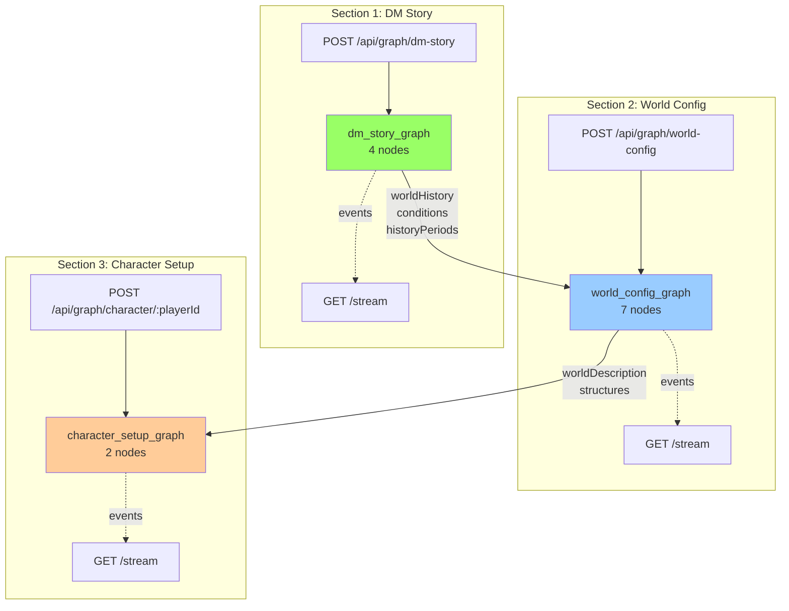

# LangGraph State Machine

Deterministic, time-travelable game orchestration engine. The graph is the authoritative source of truth for all game state transitions.

---

## Architecture Overview

**NEW (Phase 1-5 Complete):** Section Graph Architecture

DAICE now uses **3 independent section graphs** instead of one monolithic graph:



**Benefits:**

- ✅ Independent section invocation
- ✅ Isolated state with clear boundaries
- ✅ Section-level retry capability
- ✅ Simple LangSmith traces (one per section)
- ✅ SSE streaming per section

---

## Section Graphs

### Section 1: DM Story Graph

**Location:** `backend/src/graph/world/dm-story/`

**Purpose:** Generate world history, conditions, and narrative seed

**State:** `DMStoryState` from `@daicer/shared/graph-states`

**Nodes:** 4

- `init_world` - Initialize history generation
- `generate_conditions` - Create 5 world conditions
- `generate_history_period` - Generate one 50-year period (loops)
- `synthesize_history` - Create overall summary

**API:**

- POST `/api/graph/dm-story` - Invoke graph
- GET `/api/graph/dm-story/stream` - SSE streaming

**Dependencies:** None (first section)

**📖 See:** [[world/dm-story/README.md|Complete Section 1 Documentation]]

---

### Section 2: World Config Graph

**Location:** `backend/src/graph/world/world-config/`

**Purpose:** Generate physical world (structures, roads, terrain, chunks)

**State:** `WorldConfigState` from `@daicer/shared/graph-states`

**Nodes:** 7

- `place_structures` - Convert history structures to map coordinates
- `materialize_structures` - Generate voxel data
- `generate_roads` - Create road network (conditional)
- `collapse_terrain` - WFC terrain generation
- `pregenerate_chunks` - 3x3 chunk grid
- `grid_generation` - Tactical grid (BSP + CA + WFC)
- `generate_lore` - Final world description

**API:**

- POST `/api/graph/world-config` - Invoke graph
- GET `/api/graph/world-config/stream` - SSE streaming

**Dependencies:** Requires Section 1 output (historyPeriods, conditions, worldHistory)

**📖 See:** [[world/world-config/README.md|Complete Section 2 Documentation]]

---

### Section 3: Character Setup Graph

**Location:** `backend/src/graph/character/setup/`

**Purpose:** Generate character opening narratives and apply equipment bonuses

**State:** `CharacterState` from `@daicer/shared/graph-states`

**Nodes:** 2

- `character_openings` - Generate personalized intro
- `equipment_management` - Apply equipment stat bonuses

**API:**

- POST `/api/graph/character/:playerId` - Invoke graph (per-player)
- GET `/api/graph/character/:playerId/stream` - SSE streaming

**Dependencies:** Requires Section 1 (worldHistory) and Section 2 (worldDescription)

**Pattern:** Invoked once per player, not once per room

**📖 See:** [[character/setup/README.md|Complete Section 3 Documentation]]

---

## Shared Utilities

### Shared Nodes Library

**Location:** `backend/src/graph/shared-nodes/`

**Purpose:** Reusable atomic nodes used across all section graphs

**Nodes:**

- `llm-generate.ts` - Generic LLM invocation wrapper with task()
- `validate-input.ts` - Zod validation at graph entry
- `stream-progress.ts` - Real-time event emission

**Pattern:** DRY principle - write once, use everywhere

---

## State Schemas

**Location:** `shared/graph-states/`

**Purpose:** Isolated state schemas for each section with explicit dependencies

**Schemas:**

- `DMStoryState` - Section 1 state
- `WorldConfigState` - Section 2 state (depends on Section 1)
- `CharacterState` - Section 3 state (depends on Sections 1 & 2)

**Utilities:**

- `mergeSectionOutputs()` - Combine all 3 sections into final GameState
- `validateSection1Dependencies()` - Ensure Section 2 has Section 1 data
- `validateSection2Dependencies()` - Ensure Section 3 has Section 2 data

**📖 See:** [[../../shared/graph-states/README.md|Complete Schema Documentation]]

---

## Migration from Monolithic Graph

### Old Architecture (DEPRECATED)

**File:** `backend/src/graph/DEPRECATED/session-initialization-graph.ts`

**Problems:**

- ❌ All-or-nothing invocation (all 3 sections in one call)
- ❌ Cannot retry individual sections
- ❌ Complex nested structure (sub-sub-subgraphs)
- ❌ State coupling across sections
- ❌ relativePosition ZodError due to lack of boundaries

**Archived:** All old code moved to `DEPRECATED/` directory

**📖 See:** [[DEPRECATED/README.md|Migration Guide]]

### New Architecture (Current)

**Benefits:**

- ✅ Independent section invocation
- ✅ Can retry failed sections
- ✅ Clear state boundaries
- ✅ Simple LangSmith traces
- ✅ Frontend auto-invocation support
- ✅ relativePosition bug fixed

---

## Gameplay Graphs (Unchanged)

These graphs were not affected by the Section Graph redesign:

### Gameplay Graph

**Location:** `backend/src/graph/gameplay-graph.ts`

**Purpose:** Main narrative + combat orchestration

**Nodes:**

- `turn_processing` - Process player actions, generate DM responses
- `combat_coordinator` - Check for combat triggers

**State:** `GameplayState`

---

### Grid Generation Graph

**Location:** `backend/src/graph/grid-generation-graph.ts`

**Purpose:** Tactical grid generation (BSP + CA + WFC pipeline)

**Nodes:** 8 (init → BSP → CA → WFC → biome → features → chunks → persist)

**Used by:** Section 2 (World Config) via `grid_generation` node wrapper

---

## Testing

### Unit Tests

**Run tests:**

```bash
# Shared package tests
yarn workspace @daicer/shared test

# Backend graph tests
yarn workspace @daicer/backend test graph
```

**Coverage:**

- Shared graph-states: 97.22% ✅
- Graph nodes: Target 90%

### Integration Tests

**Location:** `backend/src/graph/*/__tests__/*-graph.spec.ts`

**Tests:** Complete graph invocation with mocked LLM

### E2E Tests

**Location:** `e2e/wizard-section-invocation.spec.ts`

**Tests:** Infrastructure readiness, endpoint availability

**Run:**

```bash
yarn e2e
```

---

## LangSmith Observability

### Tracing Config

**Location:** `backend/src/services/langsmith/config.ts`

**Builders:**

- `buildDMStoryTracingConfig()` - Section 1 metadata/tags
- `buildWorldConfigTracingConfig()` - Section 2 metadata/tags
- `buildCharacterTracingConfig()` - Section 3 metadata/tags

### Query Examples

**Location:** `backend/src/services/langsmith/queries.ts`

**Common queries:**

- Find all traces for a room: `tags includes "room:abc123"`
- Find Section 1 traces: `tags includes "wizard-section-1"`
- Find failed traces: `status = "error"`
- Performance analysis: Group by `metadata.section`

**📖 See:** [[../services/langsmith/queries.ts|Complete Query Documentation]]

---

## SSE Streaming

### Endpoints

**Section 1:** GET `/api/graph/dm-story/stream?roomId=abc`
**Section 2:** GET `/api/graph/world-config/stream?roomId=abc`
**Section 3:** GET `/api/graph/character/:playerId/stream?roomId=abc`

### Event Types

- `connected` - Initial connection established
- `node_start` - Node execution began
- `node_complete` - Node finished
- `period_start` - History period started (Section 1)
- `period_complete` - History period finished
- `node_error` - Error occurred

**Test SSE:**

```bash
curl -N -H "Authorization: Bearer <token>" \
  "http://localhost:3001/api/graph/dm-story/stream?roomId=test"
```

---

## Implementation Phases

This architecture was implemented in 5 phases:

1. **Phase 1:** State Schemas - Isolated state for each section
2. **Phase 2:** Graph Decomposition - 3 independent graphs
3. **Phase 3:** API Endpoints - REST APIs per section
4. **Phase 4:** Frontend Infrastructure - Components, hooks, caching
5. **Phase 5:** Streaming & Observability - SSE + LangSmith

**📖 See Phase Summaries:**

- [[../../thoughts/2025-11-17_phase-1-completion-summary.md|Phase 1: State Schemas]]
- [[../../thoughts/2025-11-17_phase-2-completion-summary.md|Phase 2: Graph Decomposition]]
- [[../../thoughts/2025-11-17_phase-3-completion-summary.md|Phase 3: API Endpoints]]
- [[../../thoughts/2025-11-17_phase-4-completion-summary.md|Phase 4: Frontend Infrastructure]]
- [[../../thoughts/2025-11-17_phase-5-completion-summary.md|Phase 5: Streaming & Observability]]

---

## Quick Start

### Invoke Section Graphs Programmatically

```typescript
import { createDMStoryGraph } from '@/graph/world/dm-story';
import { DMStoryInputSchema } from '@daicer/shared/graph-states';

// Section 1
const dmStoryGraph = createDMStoryGraph();
const section1Result = await dmStoryGraph.invoke({
  roomId: 'test-room',
  language: 'en',
  settings: { theme: 'High Fantasy', ... },
});

// Section 2 (include Section 1 outputs)
const worldConfigGraph = createWorldConfigGraph();
const section2Result = await worldConfigGraph.invoke({
  roomId: 'test-room',
  settings: { structureDensity: 5, ... },
  ...section1Result, // historyPeriods, conditions, worldHistory
});

// Section 3 (per-player)
const characterGraph = createCharacterSetupGraph();
const section3Result = await characterGraph.invoke({
  playerId: 'player-1',
  roomId: 'test-room',
  character: {...},
  worldHistory: section1Result.worldHistory,
  worldDescription: section2Result.worldDescription,
});
```

### Merge Section Outputs

```typescript
import { mergeSectionOutputs } from '@daicer/shared/graph-states';

const finalState = mergeSectionOutputs(section1Result, section2Result, [section3ResultPlayer1, section3ResultPlayer2]);

// Save to Firestore
await saveGameState(finalState);
```

---

## Related Documentation

- [[world/dm-story/README.md|Section 1: DM Story Graph]]
- [[world/world-config/README.md|Section 2: World Config Graph]]
- [[character/setup/README.md|Section 3: Character Setup Graph]]
- [[shared-nodes/README.md|Shared Node Library]] (TODO: create)
- [[../../shared/graph-states/README.md|State Schemas]]
- [[../api/README.md|API Endpoints]]
- [[../../thoughts/2025-11-17_daice-graph-architecture-master-plan.md|Master Plan]]

---

## Troubleshooting

### Section graphs not working

1. **Check TypeScript compiles:**

   ```bash
   yarn workspace @daicer/backend tsc --noEmit
   ```

2. **Check tests pass:**

   ```bash
   yarn workspace @daicer/backend test graph
   ```

3. **Check endpoints registered:**
   ```bash
   # Start server, check logs for:
   # "Registered route: POST /api/graph/dm-story"
   yarn workspace @daicer/backend dev
   ```

### LangSmith traces not appearing

1. Check environment variables set:

   ```bash
   LANGSMITH_TRACING=true
   LANGSMITH_API_KEY=<your-key>
   ```

2. Verify tags/metadata in LangSmith dashboard

### SSE not streaming

1. Check connection exists in `sseConnections` Map
2. Verify `writer` passed to `graph.invoke()`
3. Check browser console for EventSource errors

---

**Last Updated:** 2025-11-17 (Phase 1-5 Complete)
