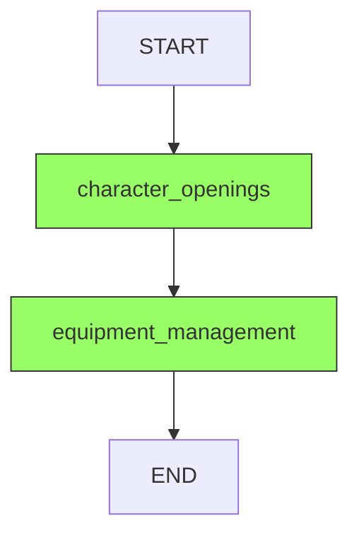

# Character Setup Graph (Section 3)

**Purpose:** Generate character opening narratives and apply equipment bonuses

**Wizard Section:** "Character Setup" (per-player)

**State:** `CharacterState` from `@daicer/shared/graph-states`

**Dependencies:** Requires Section 1 (worldHistory) and Section 2 (worldDescription)

**Pattern:** Invoked once per player, not once per room

---

## Graph Structure



**Nodes:** 2

- `character_openings` - Generate personalized introduction
- `equipment_management` - Calculate and apply equipment stat bonuses

---

## API Endpoints

### POST /api/graph/character/:playerId

**Per-player invocation**

**Request:**

```typescript
{
  roomId: string;
  character: CharacterSheet; // Full character data
  // REQUIRED from Section 1 & 2:
  worldHistory: string;
  worldDescription: string;
  spawnPoint?: { x: number, y: number, z: number };
}
```

**Response:**

```typescript
{
  success: true,
  data: {
    playerId: string;
    openingNarrative: string;
    character: CharacterSheet; // With equipment bonuses applied
  }
}
```

### GET /api/graph/character/:playerId/stream

**SSE endpoint:** `?roomId=abc123`

---

## Nodes

### character_openings

**File:** `nodes/openings.ts`

**Purpose:** Generate personalized character introduction

**LLM Call:**

```typescript
generateOpeningTask({
  character: { name, race, characterClass, background },
  worldHistory,
  worldDescription,
  language: 'en',
});
```

**Output:**

```typescript
{
  openingNarrative: 'You stand at the edge of Hollowspire, battleaxe in hand...';
}
```

**Duration:** ~28s

---

### equipment_management

**File:** `nodes/equipment.ts`

**Purpose:** Calculate and apply equipment stat bonuses

**Logic:**

1. Check if equipment in structured format
2. Calculate bonuses (AC, attack, saves)
3. Apply additively to character sheet

**Skips:** If equipment is old string format

**Duration:** < 1s

---

## State Schema

**Dependencies:**

```typescript
worldHistory: z.string().min(1, 'Required from Section 1');
worldDescription: z.string().min(1, 'Required from Section 2');
```

**Per-player pattern:**

```typescript
playerId: z.string().min(1);
roomId: z.string().min(1);
character: CharacterSheetSchema;
```

---

## Testing

```bash
yarn workspace @daicer/backend test graph/character/setup
```

---

## Performance

**Average Duration:** 30s per player

**Parallel Execution:** Can invoke for 4 players simultaneously (4× speedup)

---

## Related Documentation

- [[../world/dm-story/README.md|Section 1: DM Story]]
- [[../world/world-config/README.md|Section 2: World Config]]
- [[../README.md|Graph Architecture Overview]]
- [[../../../shared/graph-states/README.md|State Schemas]]
