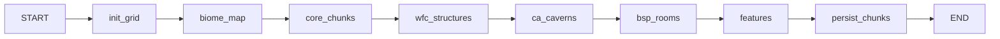

# Grid Generation Nodes

LangGraph nodes for infinite, deterministic grid world generation.

## Flow

## Nodes

### init_grid

Initializes grid parameters (32x32 chunk starting area).

### biome_map

Generates biome distribution using noise + Voronoi (task-wrapped).

### core_chunks

Pre-generates 1024 chunks (32x32 = 256x256 tiles = 2048x2048 pixels) for starting area (task-wrapped).

### wfc_structures

Applies Wave Function Collapse for structure layouts (task-wrapped).

### ca_caverns

Generates underground caves using Cellular Automata (task-wrapped).

### bsp_rooms

Creates building interiors using Binary Space Partitioning (task-wrapped).

### features

Populates chunks with entities (trees, creatures, resources).

### persist_chunks

Batch saves all generated chunks to Firestore.

## Determinism

All nodes use seeded generation:

- Noise functions seeded with `roomId`
- Task wrapping ensures LangGraph checkpoints decisions
- Same seed → identical world every time

## Performance

- **Starting area:** 1024 chunks × 64 tiles = 65,536 tiles (~2-5 seconds)
- **Firestore batching:** 500 chunks per batch write
- **On-demand generation:** Chunks outside starting area generated via API

## Integration

Called from `terrain-generation` subgraph after `pregenerate_chunks` node.
