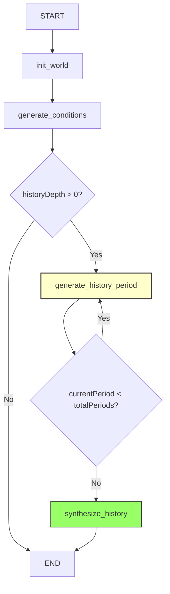

# DM Story Graph (Section 1)

**Purpose:** Generate world history, conditions, and narrative seed

**Wizard Section:** "DM Personality, Scope & Story"

**State:** `DMStoryState` from `@daicer/shared/graph-states`

**Dependencies:** None (first section)

---

## Graph Structure



**Nodes:** 4

- `init_world` - Initialize history generation state
- `generate_conditions` - Create 5 world conditions
- `generate_history_period` - Generate one 50-year period (loops)
- `synthesize_history` - Create overall history summary

**Conditional Logic:**

- Skip history if `historyDepth = 0`
- Loop periods until `currentPeriod >= totalPeriods`

---

## API Endpoints

### POST /api/graph/dm-story

**Invoke Section 1 graph**

**Request:**

```typescript
{
  roomId: string;
  language?: 'en' | 'es' | 'pt-BR';
  settings: {
    theme: string;
    tone: string;
    setting: string;
    worldType: 'terra' | 'water' | ...;
    dmStyle: { verbosity: 0-6, detail: 0-6, ... };
    worldSize: 'intimate' | 'small' | ...;
    adventureLength: 'flash' | 'short' | ...;
    difficulty: 'storyteller' | 'easy' | ...;
    historyDepth: 0-2000;
    eraCount: 1-10;
  }
}
```

**Response:**

```typescript
{
  success: true,
  data: {
    roomId: string;
    worldHistory: string;
    conditions: WorldCondition[]; // 5 items
    historyPeriods: HistoricalPeriod[];
  }
}
```

### GET /api/graph/dm-story/stream

**SSE streaming endpoint for real-time progress**

**Query params:** `?roomId=abc123`

**Events:**

- `connected` - Connection established
- `node_start` - Node execution began
- `node_complete` - Node finished
- `period_start` - History period started (periodNumber, totalPeriods)
- `period_complete` - History period finished
- `node_error` - Error occurred

---

## Nodes

### init_world

**File:** `nodes/init.ts`

**Purpose:** Initialize history generation state

**Logic:**

```typescript
const totalPeriods = historyDepth === 0 ? 0 : Math.ceil(historyDepth / 50);

return {
  historyPeriods: [],
  currentPeriod: 0,
  totalPeriods,
};
```

**Duration:** < 100ms

---

### generate_conditions

**File:** `nodes/conditions.ts`

**Purpose:** Generate 5 world conditions via deterministic entropy engine

**Logic:**

- Use `roomId` as seed
- Select 5 random conditions from pool
- Set initial values

**Output:**

```typescript
{
  conditions: [
    { key: 'Political Climate', currentValue: 'Tense', ... },
    { key: 'Wilderness Aggression', currentValue: 'High', ... },
    { key: 'Sky Sentinel', currentValue: 'Active', ... },
    { key: 'Planar Alignment', currentValue: 'Stable', ... },
    { key: 'Trade & Commerce', currentValue: 'Moderate', ... },
  ]
}
```

**Duration:** < 500ms

---

### generate_history_period

**File:** `nodes/history-period.ts`

**Purpose:** Generate one 50-year historical period with structures

**CRITICAL FIX:** This node includes the `relativePosition` transformation that fixes the ZodError bug.

**Logic:**

1. Call `generateSinglePeriodTask()` (wrapped in `task()` for determinism)
2. LLM generates narrative + 0-2 structures
3. **Transform relativePosition:**
   ```typescript
   const transformedStructures = period.structures.map((s) => {
     if (s.relativePosition && typeof s.relativePosition === 'object') {
       return {
         ...s,
         relativePosition: `${s.relativePosition.direction}-${s.relativePosition.distance}`,
       };
     }
     return s;
   });
   ```
4. Append to `historyPeriods` array
5. Increment `currentPeriod`

**Loop:** Continues until all periods generated

**Duration:** ~10s per period (LLM call)

---

### synthesize_history

**File:** `nodes/history-summary.ts`

**Purpose:** Create overall world history summary from all periods

**Logic:**

1. Collect all period narratives
2. Call `generateOverallSummaryTask()` with context
3. Return synthesized summary string

**Output:**

```typescript
{
  worldHistory: 'The Crownmarch of Hollowspire stood for centuries...';
}
```

**Duration:** ~8s (LLM synthesis)

---

## State Schema

**Import:**

```typescript
import { DMStoryStateSchema, type DMStoryState } from '@daicer/shared/graph-states';
```

**Fields:**

- `roomId` - Room identifier
- `language` - 'en' | 'es' | 'pt-BR'
- `settings` - DM personality, theme, scope
- `historyPeriods` - Generated periods (array)
- `currentPeriod` - Loop counter
- `totalPeriods` - Target count
- `worldHistory` - Final summary (output)
- `conditions` - 5 world conditions (output)

**📖 See:** `shared/graph-states/README.md` for complete schema documentation

---

## Testing

### Run Unit Tests

```bash
yarn workspace @daicer/backend test graph/world/dm-story
```

### Integration Test

**File:** `__tests__/dm-story-graph.spec.ts`

**Scenario:** Generate 10 periods for 500-year history

**Mocks:** LLM services mocked to avoid real API calls

### Manual Test

```bash
# Start backend
yarn workspace @daicer/backend dev

# Call API
curl -X POST http://localhost:3001/api/graph/dm-story \
  -H "Authorization: Bearer <token>" \
  -H "Content-Type: application/json" \
  -d '{
    "roomId": "test",
    "language": "en",
    "settings": {
      "theme": "High Fantasy",
      "tone": "Heroic",
      "setting": "Medieval Kingdom",
      "worldType": "terra",
      "dmStyle": { "verbosity": 3, "detail": 3, "engagement": 3, "narrative": 3, "specialMode": null },
      "worldSize": "medium",
      "adventureLength": "medium",
      "difficulty": "medium",
      "historyDepth": 500,
      "eraCount": 3
    }
  }'
```

---

## LangSmith Debugging

### Find Section 1 Traces

**Query:** `tags includes "wizard-section-1"`

**Filter by room:** `tags includes "room:abc123" AND tags includes "wizard-section-1"`

**Find failures:** `tags includes "wizard-section-1" AND status = "error"`

### Trace Metadata

```typescript
{
  section: 'dm_story',
  wizard_section: 1,
  room_id: 'abc123',
  user_id: 'user-xyz',
  theme: 'High Fantasy',
  history_depth: 500,
  era_count: 3
}
```

### Common Issues

**Issue:** LLM timeout at history_period

**Solution:**

1. Find trace: `span_name = "history_period_node" AND status = "error"`
2. Check span input: Period number, context
3. Reduce history complexity or increase timeout

**📖 See:** `backend/src/services/langsmith/queries.ts` for complete query cheat sheet

---

## Performance

**Average Duration:** 120s (2 minutes) for 10 periods

**Breakdown:**

- init_world: < 0.1s
- generate_conditions: ~3s
- generate_history_period: ~10s × 10 = 100s
- synthesize_history: ~8s

**Optimization:** Use Flash model instead of Pro (50% faster, slightly lower quality)

---

## Related Documentation

- [[../../README.md|Graph Architecture Overview]]
- [[../world-config/README.md|Section 2: World Config Graph]]
- [[../../character/setup/README.md|Section 3: Character Setup Graph]]
- [[../../../../shared/graph-states/README.md|State Schemas]]
- [[../../../api/README.md|API Endpoints]]
- [[../../../../thoughts/2025-11-17_phase-2-completion-summary.md|Phase 2 Implementation]]
