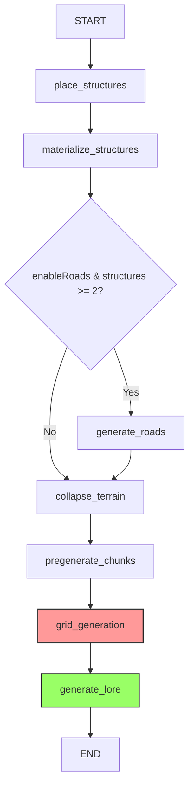

# World Config Graph (Section 2)

**Purpose:** Generate physical world (structures, roads, terrain, chunks)

**Wizard Section:** "World Configuration"

**State:** `WorldConfigState` from `@daicer/shared/graph-states`

**Dependencies:** Requires Section 1 output (historyPeriods, conditions, worldHistory)

---

## Graph Structure



**Nodes:** 7

- `place_structures` - Convert history structures to map coordinates
- `materialize_structures` - Generate voxel data, save to Firestore
- `generate_roads` - Create road network (conditional)
- `collapse_terrain` - Wave Function Collapse terrain generation
- `pregenerate_chunks` - Generate 3x3 chunk grid
- `grid_generation` - Tactical grid (BSP + CA + WFC pipeline)
- `generate_lore` - Final world description synthesis

**Conditional Logic:**

- Skip roads if `enableRoads = false` OR `structures.length < 2`

---

## API Endpoints

### POST /api/graph/world-config

**Request:**

```typescript
{
  roomId: string;
  settings: {
    structureDensity: 1-20;
    structureTypes: string[];
    enableRoads: boolean;
    roadQuality: 'trail' | 'path' | 'road' | 'highway';
    terrainComplexity: 1-5;
  },
  // REQUIRED from Section 1:
  historyPeriods: HistoricalPeriod[];
  conditions: WorldCondition[];
  worldHistory: string;
}
```

**Response:**

```typescript
{
  success: true,
  data: {
    structures: Structure[];
    roads: Road[];
    worldDescription: string;
    generatedChunks: any[];
    gridState?: any;
    terrainMap?: any;
  }
}
```

### GET /api/graph/world-config/stream

**SSE endpoint:** `?roomId=abc123`

**Events:** node_start, node_complete, node_error

---

## Nodes

### place_structures

**File:** `nodes/structures.ts`

**Purpose:** Convert structures from history to map coordinates

**Input:** `state.historyPeriods` (from Section 1)

**Logic:**

1. Flatten all structures from history periods
2. Parse `relativePosition` string: `"northeast-far"` → `{direction, distance}`
3. Calculate (x, y) coordinates
4. Return placed structures

**relativePosition transformation:**

- LLM generates: `{direction: "northeast", distance: "far"}`
- Stored as string: `"northeast-far"`
- Parsed here: `const [direction, distance] = s.relativePosition.split('-')`

---

### materialize_structures

**File:** `nodes/materialize.ts`

**Purpose:** Generate voxel data and save to Firestore (3 levels)

**Firestore writes:**

1. **Global metadata:** `structures/{id}`
2. **Room-scoped:** `rooms/{roomId}/structures/{id}`
3. **Chunked voxels:** `structures/{id}/chunks/{chunkId}`

---

### generate_roads

**File:** `nodes/roads.ts`

**Purpose:** Create road network using pathfinding

**Conditional:** Only runs if `settings.enableRoads = true` AND `structures.length >= 2`

**Logic:** Dijkstra pathfinding between settlements

---

### collapse_terrain

**File:** `nodes/terrain.ts`

**Purpose:** Wave Function Collapse terrain generation

**Duration:** ~35s (algorithmic, not LLM)

---

### pregenerate_chunks

**File:** `nodes/chunks.ts`

**Purpose:** Pre-generate 3x3 chunk grid around spawn

**Duration:** ~12s

---

### grid_generation

**File:** `nodes/grid.ts`

**Purpose:** Wrapper for `grid-generation-graph` subgraph

**Subgraph nodes:** 8 (BSP rooms, CA caverns, WFC structures, etc.)

**Duration:** ~90s (bottleneck)

---

### generate_lore

**File:** `nodes/lore.ts`

**Purpose:** Final world description synthesis

**LLM Call:** Synthesizes history + structures + terrain into narrative

**Duration:** ~40s

---

## State Schema

**Dependencies enforced:**

```typescript
historyPeriods: z.array(...).min(1, 'Section 1 must complete first')
conditions: z.array(...).length(5, 'Exactly 5 conditions required')
worldHistory: z.string().min(1, 'World history required from Section 1')
```

**Output guarantees:**

```typescript
structures: Structure[] // Required
worldDescription: string // Required
roads: Road[]
generatedChunks: any[]
gridState?: any
terrainMap?: any
```

---

## Testing

```bash
yarn workspace @daicer/backend test graph/world/world-config
```

---

## Performance

**Average Duration:** 180s (3 minutes)

**Bottleneck:** grid_generation subgraph (~90s)

---

## Related Documentation

- [[../dm-story/README.md|Section 1: DM Story]]
- [[../../character/setup/README.md|Section 3: Character Setup]]
- [[../../README.md|Graph Architecture Overview]]
- [[../../../../shared/graph-states/README.md|State Schemas]]
