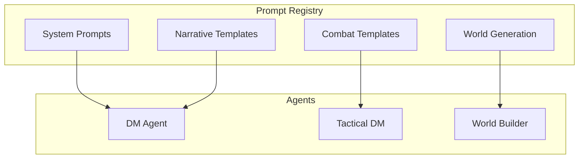

# Prompt Library

Reusable prompt templates for AI agents. Future module for centralizing LLM prompts across DM Agent, World Builder, and tactical systems.

---

## Current State

```
prompts/
└── registry.ts    Prompt catalog and template registry (planned)
```

**Status:** Placeholder module. Prompts are currently embedded in agent configs and graph nodes.

---

## Planned Architecture



---

## Future Design

### Prompt Template Structure

```typescript
export interface PromptTemplate {
  id: string;
  name: string;
  description: string;
  category: 'system' | 'narrative' | 'combat' | 'world_building' | 'character';
  template: string;
  variables: PromptVariable[];
  examples?: FewShotExample[];
  version: string;
}

export interface PromptVariable {
  name: string;
  type: 'string' | 'number' | 'array' | 'object';
  required: boolean;
  description: string;
  default?: unknown;
}

export interface FewShotExample {
  input: Record<string, unknown>;
  output: string;
}
```

### Example Templates

**DM Narrative:**

```typescript
export const DM_TURN_NARRATIVE = {
  id: 'dm_turn_narrative',
  name: 'DM Turn Processing',
  category: 'narrative',
  template: `You are the Dungeon Master for {{campaignTitle}}.

Current Scene: {{sceneDescription}}
Players: {{playerList}}
Recent Events: {{recentEvents}}

Process the following player actions:
{{playerActions}}

Generate:
1. Overall narrative summary
2. Personalized perspectives for each player based on their position
3. Suggested next actions`,
  variables: [
    { name: 'campaignTitle', type: 'string', required: true },
    { name: 'sceneDescription', type: 'string', required: true },
    { name: 'playerList', type: 'array', required: true },
    { name: 'recentEvents', type: 'string', required: false },
    { name: 'playerActions', type: 'array', required: true },
  ],
};
```

**Tactical Command Parsing:**

```typescript
export const TACTICAL_COMMAND_PARSER = {
  id: 'tactical_command_parser',
  name: 'Tactical Combat Command Parser',
  category: 'combat',
  template: `Parse the following tactical combat command into structured actions.

Grid Size: {{gridWidth}}x{{gridHeight}}
Active Unit: {{activeUnitName}} ({{activeUnitClass}})
Available Actions: {{availableActions}}
Nearby Units: {{nearbyUnits}}

Player Command: "{{command}}"

Output a structured action with:
- Intent (move, attack, cast_spell, etc.)
- Target (if applicable)
- Parameters (position, spell, etc.)
- Confidence level (0-1)
- Any ambiguities requiring clarification`,
  variables: [
    { name: 'gridWidth', type: 'number', required: true },
    { name: 'gridHeight', type: 'number', required: true },
    { name: 'activeUnitName', type: 'string', required: true },
    { name: 'activeUnitClass', type: 'string', required: true },
    { name: 'availableActions', type: 'array', required: true },
    { name: 'nearbyUnits', type: 'array', required: true },
    { name: 'command', type: 'string', required: true },
  ],
};
```

---

## Current Workaround

Prompts are currently hardcoded in:

1. **Agent Configs** (`src/agents/catalog.ts`):

   ```typescript
   systemInstructions: `You are the Dungeon Master...`;
   ```

2. **Graph Nodes** (e.g., `src/graph/nodes/turn-processing.ts`):

   ```typescript
   const systemPrompt = `Process player turn with...`;
   ```

3. **Services** (e.g., `src/services/asset-prompts.ts`):
   ```typescript
   export function buildCharacterPrompt(character: Character): string {
     return `Generate a ${character.race} ${character.class}...`;
   }
   ```

---

## Migration Plan

1. **Extract hardcoded prompts** to this registry
2. **Create template engine** (Handlebars or similar)
3. **Add versioning** for prompt iteration
4. **Implement A/B testing** framework
5. **Export to LangSmith** for prompt engineering

---

## Related Documentation

- [[../agents/README.md|Agent System]] - Where prompts will be consumed
- [[../services/asset-prompts.ts|Asset Prompts]] - Current prompt implementations
- [[../../.cursor/rules/README.md#rule-26|Rule 26: Composable & Functional First]] - Reusability principle

---

**Status:** Future enhancement. Prompts currently managed inline.
