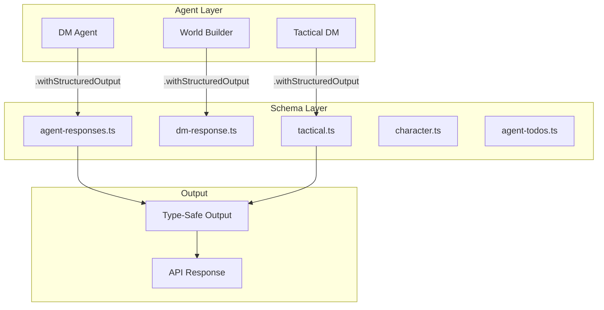

# Schema Catalog

Zod schemas for structured LLM outputs and API validation. All agent responses use these schemas with `.withStructuredOutput()`.

---

## Overview



---

## Module Structure

```
schemas/
├── agent-responses.ts    Main DM turn responses, world generation
├── dm-response.ts        DM narrative structures (deprecated, use agent-responses)
├── tactical.ts           Tactical combat command parsing
├── character.ts          Character sheet validation schemas
└── agent-todos.ts        DM self-planning structures
```

---

## Core Schemas

### 1. Agent Responses (`agent-responses.ts`)

**Primary schema for DM turn processing.**

```typescript
export const TurnResponseSchema = z.object({
  overall_summary: z.string().describe('Main narrative summary visible to all players'),

  player_perspectives: z
    .array(
      z.object({
        playerName: z.string().describe('Name of the player character'),
        perspective: z.string().describe('Personalized perspective based on position and senses'),
      })
    )
    .describe('Individual perspectives for each player based on location'),

  metadata: z
    .object({
      tone: z.enum(['dramatic', 'casual', 'epic', 'tense', 'mysterious']).describe('Narrative tone'),
      containsCombat: z.boolean().describe('Whether combat is starting'),
      suggestedActions: z.array(z.string()).optional().describe('Optional suggested next actions'),
    })
    .optional(),
});

export type TurnResponse = z.infer<typeof TurnResponseSchema>;
```

**Usage:**

```typescript
import { getChatModel } from '@/config/langchain';
import { TurnResponseSchema } from '@/schemas/agent-responses';

const model = getChatModel();
const structuredModel = model.withStructuredOutput(TurnResponseSchema);

const result = await structuredModel.invoke([
  { role: 'system', content: 'You are a DM processing a turn' },
  { role: 'user', content: 'Alice: I search the room' },
]);

// Fully typed and validated
console.log(result.overall_summary); // string
console.log(result.player_perspectives[0].playerName); // string
console.log(result.metadata?.tone); // 'dramatic' | 'casual' | ...
```

---

### 2. World Generation (`agent-responses.ts`)

```typescript
export const WorldDescriptionSchema = z.object({
  title: z.string().describe('Campaign title'),

  description: z.string().describe('Rich markdown-formatted world description (2-3 paragraphs)'),

  atmosphere: z.string().describe('Single sentence capturing mood and atmosphere'),

  keyLocations: z
    .array(
      z.object({
        name: z.string(),
        description: z.string(),
      })
    )
    .min(3)
    .max(5)
    .describe('3-5 key locations in the world'),

  majorNPCs: z
    .array(
      z.object({
        name: z.string(),
        role: z.string(),
        personality: z.string(),
      })
    )
    .min(2)
    .max(4)
    .describe('2-4 major NPCs'),

  questHooks: z.array(z.string()).min(2).max(3).describe('2-3 initial quest hooks to engage players'),

  themes: z.array(z.string()).describe('Central themes (e.g., "betrayal", "redemption", "survival")'),
});

export type WorldDescription = z.infer<typeof WorldDescriptionSchema>;
```

**Usage:**

```typescript
const worldModel = model.withStructuredOutput(WorldDescriptionSchema);

const world = await worldModel.invoke([
  {
    role: 'system',
    content: 'Generate a dark fantasy campaign world',
  },
  {
    role: 'user',
    content: 'Theme: Gothic Horror, Difficulty: Medium, Adventure Length: Long',
  },
]);

console.log(world.title); // "The Crimson Veil"
console.log(world.keyLocations); // [{ name: "Castle Ravenloft", ... }]
```

---

### 3. Tactical Combat (`tactical.ts`)

**Natural language command parsing for grid-based combat.**

```typescript
export const ParsedCommandSchema = z.object({
  intent: z
    .enum(['move', 'attack', 'cast_spell', 'dodge', 'dash', 'help', 'disengage', 'ready'])
    .describe('Parsed player intent'),

  actorId: z.string().describe('ID of character performing action'),

  targetId: z.string().optional().describe('ID of target character (for attacks/spells)'),

  targetPosition: z
    .object({
      x: z.number().int(),
      y: z.number().int(),
    })
    .optional()
    .describe('Target grid position (for movement/area spells)'),

  spellId: z.string().optional().describe('Spell ID if casting spell'),

  movementPath: z
    .array(
      z.object({
        x: z.number().int(),
        y: z.number().int(),
      })
    )
    .optional()
    .describe('Planned movement path'),

  confidence: z.number().min(0).max(1).describe('Parser confidence (0-1)'),

  ambiguities: z.array(z.string()).optional().describe('Potential ambiguities requiring clarification'),
});

export type ParsedCommand = z.infer<typeof ParsedCommandSchema>;
```

**Example:**

```typescript
const tacticalModel = model.withStructuredOutput(ParsedCommandSchema);

const parsed = await tacticalModel.invoke([
  { role: 'system', content: 'Parse tactical combat commands' },
  { role: 'user', content: 'Gandalf moves to (5,3) and casts fireball at the goblins' },
]);

console.log(parsed.intent); // 'cast_spell'
console.log(parsed.actorId); // 'gandalf-1'
console.log(parsed.targetPosition); // { x: 5, y: 3 }
console.log(parsed.spellId); // 'fireball'
console.log(parsed.confidence); // 0.95
```

---

### 4. Action Preview (`tactical.ts`)

```typescript
export const ActionPreviewSchema = z.object({
  planId: z.string().describe('Unique ID for this action plan'),

  validation: z
    .object({
      valid: z.boolean(),
      errors: z.array(z.string()),
      warnings: z.array(z.string()),
    })
    .describe('Rule validation results'),

  preview: z
    .object({
      movementPath: z.array(z.object({ x: z.number(), y: z.number() })).optional(),

      hitChance: z.number().min(0).max(1).optional().describe('Probability of attack hitting (0-1)'),

      diceNeeded: z.array(z.string()).describe('Dice formulas needed (e.g., "1d20+5", "2d6+3")'),

      affectedUnits: z
        .array(
          z.object({
            unitId: z.string(),
            effect: z.string(),
            predictedDamage: z
              .object({
                min: z.number(),
                max: z.number(),
                avg: z.number(),
              })
              .optional(),
          })
        )
        .describe('Units affected by this action'),

      resourceCosts: z
        .object({
          actionUsed: z.boolean(),
          bonusActionUsed: z.boolean(),
          reactionUsed: z.boolean(),
          movementUsed: z.number(),
          spellSlotUsed: z
            .object({
              level: z.number(),
              remaining: z.number(),
            })
            .optional(),
        })
        .optional(),
    })
    .describe('Action preview with predictions'),
});

export type ActionPreview = z.infer<typeof ActionPreviewSchema>;
```

---

### 5. Character Validation (`character.ts`)

```typescript
export const CharacterValidationSchema = z.object({
  isValid: z.boolean(),

  errors: z
    .array(
      z.object({
        field: z.string(),
        message: z.string(),
        severity: z.enum(['error', 'warning']),
      })
    )
    .describe('Validation errors'),

  suggestions: z.array(z.string()).describe('Helpful suggestions for fixing issues'),

  derivedStats: z
    .object({
      armorClass: z.number(),
      initiative: z.number(),
      proficiencyBonus: z.number(),
      passivePerception: z.number(),
    })
    .describe('Auto-calculated stats'),
});

export type CharacterValidation = z.infer<typeof CharacterValidationSchema>;
```

**Usage:**

```typescript
const validationModel = model.withStructuredOutput(CharacterValidationSchema);

const result = await validationModel.invoke([
  { role: 'system', content: 'Validate D&D 5e character sheet' },
  { role: 'user', content: JSON.stringify(characterSheet) },
]);

if (!result.isValid) {
  console.log('Errors:', result.errors);
  console.log('Suggestions:', result.suggestions);
}
```

---

### 6. DM Todos (`agent-todos.ts`)

**Self-planning structures for complex DM scenarios.**

```typescript
export const TodoSchema = z.object({
  id: z.string(),

  task: z.string().describe('Clear, actionable task description'),

  priority: z.enum(['critical', 'high', 'medium', 'low']).describe('Task priority'),

  status: z.enum(['pending', 'in_progress', 'completed', 'blocked']).default('pending'),

  dependencies: z.array(z.string()).describe('IDs of tasks that must complete first'),

  estimatedTurns: z.number().int().min(1).describe('Estimated turns to complete'),

  context: z.string().optional().describe('Additional context or notes'),

  createdAt: z.number(),
  updatedAt: z.number(),
});

export type Todo = z.infer<typeof TodoSchema>;

export const TodoListSchema = z.object({
  todos: z.array(TodoSchema),
  nextActionable: z.string().optional().describe('ID of next todo to work on'),
});
```

**Example:**

```typescript
const todoModel = model.withStructuredOutput(TodoListSchema);

const plan = await todoModel.invoke([
  {
    role: 'system',
    content: 'Plan a complex encounter with multiple phases',
  },
  {
    role: 'user',
    content: 'Setup: Dragon ambush with environmental hazards',
  },
]);

console.log(plan.todos);
// [
//   { id: '1', task: 'Describe dragon arrival', priority: 'critical', ... },
//   { id: '2', task: 'Trigger lava flow', priority: 'high', dependencies: ['1'], ... },
// ]
```

---

## Schema Design Principles

### 1. Descriptions Are Prompts

Every field has a `.describe()` that guides the LLM.

```typescript
// ❌ BAD: No description
z.object({
  tone: z.string(),
});

// ✅ GOOD: Clear description
z.object({
  tone: z.enum(['dramatic', 'casual', 'epic']).describe('Narrative tone matching the current scene intensity'),
});
```

### 2. Constrain Outputs

Use enums, min/max, and refinements to prevent hallucinations.

```typescript
// ❌ BAD: Unbounded string
z.object({
  description: z.string(),
});

// ✅ GOOD: Constrained length
z.object({
  description: z.string().min(100).max(500).describe('Rich description between 100-500 characters'),
});
```

### 3. Optional vs Required

Make fields optional only when truly optional. Require critical data.

```typescript
export const ResponseSchema = z.object({
  // Required: Core narrative
  overall_summary: z.string(),

  // Optional: Metadata that might not apply
  metadata: z
    .object({
      suggestedActions: z.array(z.string()).optional(),
    })
    .optional(),
});
```

### 4. Nested Structures

Use nested objects for complex domains.

```typescript
export const CombatActionSchema = z.object({
  validation: z.object({
    valid: z.boolean(),
    errors: z.array(z.string()),
  }),

  preview: z.object({
    hitChance: z.number(),
    damage: z.object({
      min: z.number(),
      max: z.number(),
    }),
  }),
});
```

---

## Testing Schemas

### Unit Tests

```typescript
describe('TurnResponseSchema', () => {
  it('validates correct structure', () => {
    const valid = {
      overall_summary: 'You enter a dark cave',
      player_perspectives: [{ playerName: 'Alice', perspective: 'You see shadows moving' }],
    };

    const result = TurnResponseSchema.safeParse(valid);
    expect(result.success).toBe(true);
  });

  it('rejects missing required fields', () => {
    const invalid = {
      player_perspectives: [],
    };

    const result = TurnResponseSchema.safeParse(invalid);
    expect(result.success).toBe(false);
    expect(result.error.issues[0].path).toEqual(['overall_summary']);
  });
});
```

### Integration Tests

Test with real LLM to ensure reliable parsing.

```typescript
describe('LLM structured output', () => {
  it('produces valid TurnResponse', async () => {
    const model = getChatModel();
    const structuredModel = model.withStructuredOutput(TurnResponseSchema);

    const result = await structuredModel.invoke([{ role: 'user', content: 'Generate a turn response' }]);

    // Should be valid without safeParse (throws on invalid)
    expect(result.overall_summary).toBeTruthy();
    expect(result.player_perspectives).toBeInstanceOf(Array);
  });
});
```

---

## Common Patterns

### Multi-Step Responses

For complex agent workflows, combine schemas.

```typescript
export const MultiStepResponseSchema = z.object({
  step: z.enum(['planning', 'execution', 'reflection']),

  planning: z
    .object({
      todos: z.array(TodoSchema),
      strategy: z.string(),
    })
    .optional(),

  execution: z
    .object({
      actions: z.array(z.string()),
      toolCalls: z.array(z.string()),
    })
    .optional(),

  reflection: z
    .object({
      outcome: z.string(),
      lessonsLearned: z.array(z.string()),
    })
    .optional(),
});
```

### Confidence & Ambiguity

Include metadata for human-in-the-loop decisions.

```typescript
export const CommandParseSchema = z.object({
  intent: z.enum(['move', 'attack', 'cast_spell']),
  confidence: z.number().min(0).max(1),
  ambiguities: z.array(z.string()).optional(),
  requiresHumanInput: z.boolean(),
});
```

---

## Migration Guide

### From `dm-response.ts` to `agent-responses.ts`

`dm-response.ts` is deprecated. Use `agent-responses.ts` schemas.

```typescript
// ❌ OLD (deprecated)
import { DmResponseSchema } from '@/schemas/dm-response';

// ✅ NEW
import { TurnResponseSchema } from '@/schemas/agent-responses';
```

---

## Related Documentation

- [[../agents/README.md|Agent System]] - How schemas are used by agents
- [[../graph/README.md|LangGraph]] - How schemas validate state transitions
- [[../api/README.md|API Layer]] - How schemas validate API inputs/outputs
- [[../../.cursor/rules/README.md#rule-11|Rule 11: Structured Output is Non-Negotiable]] - Why we use schemas

---

Built following [[../../.cursor/rules/README.md|Rule 14: Type is King]] - all LLM outputs are validated with Zod.
