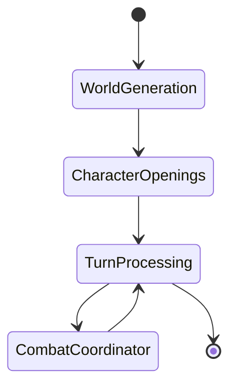

# Utility Scripts

One-off scripts for data migration, seeding, and development utilities.

---

## Scripts

```
scripts/
├── parse-spells.ts         Parse SRD HTML → JSON spell dataset
├── seed-role-users.ts      Create test users with roles (free/premium/god)
└── visualize-graphs.ts     Generate Mermaid diagrams from LangGraph definitions
```

---

## Parse Spells (`parse-spells.ts`)

Converts raw D&D 5e SRD HTML into structured JSON spell dataset.

**Input:** `raw_spell_book.html`  
**Output:** `seeds/game-data/spells.json` (487 spells)

**Usage:**

```bash
yarn ts-node backend/src/scripts/parse-spells.ts
```

**Output Example:**

```json
{
  "id": "fireball",
  "name": "Fireball",
  "level": 3,
  "school": "evocation",
  "effectShape": "SPHERE",
  "effectDimensions": { "radius": 20 },
  "damage": { "formula": "8d6", "type": "fire", "saveForHalf": true },
  "savingThrow": "dexterity",
  "castingTime": "1 action",
  "range": "150 feet",
  "duration": "Instantaneous",
  "concentration": false,
  "components": { "verbal": true, "somatic": true, "material": true },
  "description": "..."
}
```

**Features:**

- Extracts spell school, level, components
- Parses damage formulas
- Infers effect shapes from descriptions
- Validates against D&D 5e rules

**See:** [[../types/README-SPELLS.md|Spell System Documentation]]

---

## Seed Role Users (`seed-role-users.ts`)

Creates test users in Firebase Auth emulator with custom role claims.

**Usage:**

```bash
yarn ts-node backend/src/scripts/seed-role-users.ts
```

**Creates:**

| Email                | Password         | Role      | Custom Claims         |
| -------------------- | ---------------- | --------- | --------------------- |
| `free@daicer.com`    | `freepass123`    | `free`    | `{ role: 'free' }`    |
| `premium@daicer.com` | `premiumpass123` | `premium` | `{ role: 'premium' }` |
| `god@daicer.com`     | `godpass123`     | `god`     | `{ role: 'god' }`     |

**Environment:**

- Requires Firebase Auth emulator running
- Uses `FIREBASE_AUTH_EMULATOR_HOST` env var

**Testing Role Guards:**

```bash
# 1. Seed users
yarn ts-node backend/src/scripts/seed-role-users.ts

# 2. Login as premium user in frontend
# Email: premium@daicer.com
# Password: premiumpass123

# 3. Test premium-only endpoints
curl -H "Authorization: Bearer <token>" http://localhost:3001/api/premium-feature
```

**See:** [[../README.md#role-based-authorization|Backend README - Roles]]

---

## Visualize Graphs (`visualize-graphs.ts`)

Generates Mermaid diagrams from LangGraph state machine definitions.

**Usage:**

```bash
yarn ts-node backend/src/scripts/visualize-graphs.ts
```

**Output:**

- `docs/graphs/gameplay-graph.mmd`
- `docs/graphs/character-creation-graph.mmd`
- `docs/graphs/combat-graph.mmd`

**Example Output:**



**Features:**

- Auto-generates diagrams from graph code
- Includes node names and edges
- Exports to Mermaid format for documentation

**Future:** Integrate with LangSmith for runtime graph visualization.

---

## Running Scripts

### Development

```bash
# Run with ts-node (no compilation)
yarn ts-node backend/src/scripts/<script-name>.ts
```

### Production

```bash
# Compile first
yarn build

# Run compiled script
node dist/scripts/<script-name>.js
```

### In CI/CD

```bash
# Example: Seed data in deployment
gcloud builds submit --config cloudbuild.seed.yaml
```

---

## Adding New Scripts

1. Create script in `src/scripts/<name>.ts`
2. Add shebang for direct execution:

   ```typescript
   #!/usr/bin/env ts-node
   import { db } from '@/config/firebase';

   async function main() {
     // Script logic
   }

   main().catch(console.error);
   ```

3. Make executable:

   ```bash
   chmod +x backend/src/scripts/<name>.ts
   ```

4. Document in this README
5. Add to `package.json` scripts (optional):
   ```json
   {
     "scripts": {
       "seed:roles": "ts-node src/scripts/seed-role-users.ts"
     }
   }
   ```

---

## Related Documentation

- [[../../seeds/README.md|Seeds]] - Data population and SRD imports
- [[../types/README-SPELLS.md|Spell System]] - Spell parsing output
- [[../graph/README.md|LangGraph]] - Graph visualization source
- [[../README.md|Backend README]] - Environment setup

---

**Note:** Scripts are development utilities, not part of runtime application.
