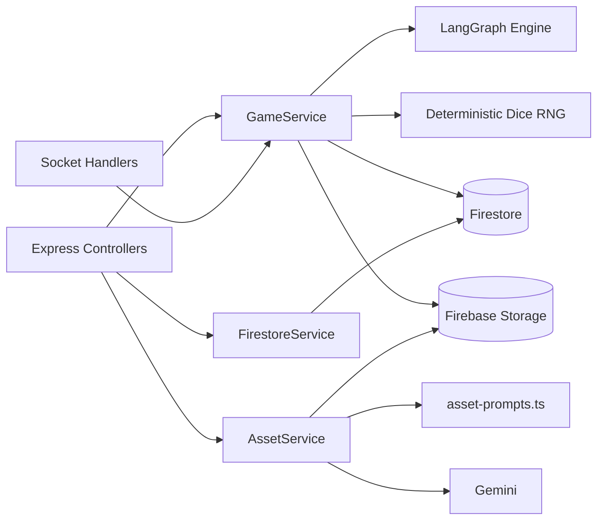
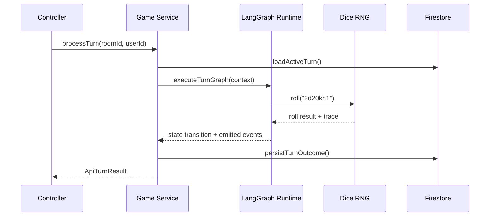

# Services Layer

Encapsulated orchestration between APIs, sockets, Firestore, LangGraph, and external AI providers.

---

## High-Level Topology



Principles:

- Services own _domain_ decisions, not HTTP details.
- Always return typed `Result` objects or throw domain-specific errors (see `utils/response.ts`).
- No direct Express/Socket references — keep functions framework-agnostic for testability.

---

## Module Breakdown

| File                     | Responsibility                                                     | Key Exports                                                       |
| ------------------------ | ------------------------------------------------------------------ | ----------------------------------------------------------------- |
| `firestore.ts`           | Typed Firestore reads/writes, transactional helpers, converters    | `getRoom`, `saveTurn`, `withTransaction`                          |
| `game.ts`                | Narrative + combat orchestration, LangGraph execution, time travel | `generateWorld`, `submitCharacter`, `processTurn`, `rewindCombat` |
| `llm.ts`                 | LangChain runners, provider fallbacks, prompt config               | `invokeModel`, `streamToolCalls`, `withRetry`                     |
| `asset-prompts.ts`       | Prompt builders for art generation                                 | `buildCharacterPrompt`, `buildActionFramePrompt`                  |
| `asset-storage.ts`       | Firebase Storage uploads, signed URLs                              | `storeImage`, `getAssetUrl`                                       |
| `rag.ts`                 | Retrieval augmented generation helpers for compendium              | `searchBestiary`, `summarizeLore`                                 |
| `srd-tools.ts`           | System Reference Document utilities                                | `listSpellByShape`, `lookupCondition`                             |
| `character-templates.ts` | Prebuilt archetypes for fast onboarding                            | `generateTemplate`                                                |

Supporting modules in `services/` follow the same pattern: pure, typed functions with dependency injection.

---

## Execution Flow: Process Turn



Every LangGraph execution produces:

- Updated turn state snapshot
- Audit trail of tool calls + dice rolls
- Broadcast-ready payload (fed to sockets)

---

## Dependency Injection & Testing

All services accept optional overrides. Example from `game.ts`:

```typescript
export async function processTurn(
  params: ProcessTurnParams,
  deps: Partial<GameDependencies> = {}
): Promise<ProcessTurnResult> {
  const { graphRunner = runTurnGraph, clock = defaultClock } = {
    ...defaultDependencies,
    ...deps,
  };
  // ...
}
```

Benefits:

- Unit tests can inject fake Firestore clients, LangGraph runners, or deterministic timestamps.
- Integration tests rely on real emulators by omitting overrides.

---

## Error Strategy

- Throw `DomainError` derivatives (`RoomNotFoundError`, `TurnConflictError`) when invariants break.
- Convert provider-specific failures (Gemini, OpenAI) into `ExternalServiceError` with context.
- Services never send HTTP responses; controllers map errors to proper status codes.
- Log once per failure in services; controllers should not duplicate logs.

---

## Idempotency & Concurrency

- Writes use Firestore transactions (`withTransaction`) and a `version` field to prevent double processing.
- Turn processing enforces optimistic locking: if a second request detects stale data it throws `TurnConflictError`.
- Asset generation uses dedup keys in Storage (`roomId/characterId/<size>.png`) to avoid duplicates.

---

## Observability

- Logging: pass `logger` dependency to capture structured events (`service`, `operation`, `durationMs`).
- Metrics hooks (future): wrap long-running calls with `recordHistogram`.
- Traces: LangGraph already emits per-node telemetry; services forward trace IDs to clients for debugging.

---

## Adding a Service

1. Create file under `src/services/<name>.ts`.
2. Define interfaces for dependencies and exported functions.
3. Maintain pure business logic (no Express, no React).
4. Provide unit tests in `src/services/__tests__/<name>.spec.ts`.
5. Document usage and expected contracts here.

---

## Testing Playbook

```bash
# All service tests
yarn test backend/src/services/__tests__

# Focused suite
yarn test backend/src/services/__tests__/game.spec.ts

# Watch mode while developing
yarn test --watch backend/src/services
```

Guidelines:

- Use Firestore emulator via `setup-emulators.ts`.
- Mock external providers with `vi.fn()` / `jest.fn()` returning deterministic payloads.
- Assert on emitted domain events and Firestore writes, not only return payloads.
- Snapshot complex LangGraph outputs to catch regressions.

---

## Related Docs

- `backend/README.md` — high-level architecture and workflows.
- `src/api/README.md` — controllers and HTTP contracts.
- `src/socket/README.md` — WebSocket message flow using these services.
- `docs/graphs/combat-graph.mmd` — visual of combat LangGraph.
