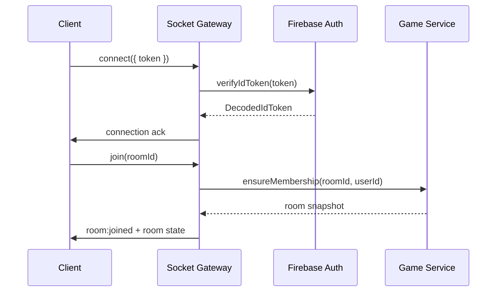

# Socket Layer

High-frequency, low-latency channel for multiplayer state sync: room lifecycle, combat turns, and DM narration.

---

## Connection Flow



Notes:

- Socket.IO server is initialized in `src/socket/index.ts` and bound to the HTTP server.
- All events namespaced under `/room` (e.g. `/room/<roomId>`).
- JWT is passed via `auth.token` in connection handshake.

---

## Event Catalogue

### Client → Server

| Event           | Payload                   | Description                              |
| --------------- | ------------------------- | ---------------------------------------- |
| `room:join`     | `{ roomId: string }`      | Join namespace, receive initial state    |
| `room:leave`    | `{ roomId: string }`      | Leave namespace and clean up listeners   |
| `player:action` | `{ roomId, action }`      | Submit narrative action for current turn |
| `turn:process`  | `{ roomId }`              | DM triggers LangGraph turn resolution    |
| `combat:select` | `{ roomId, characterId }` | Toggle active combatant (debug)          |

Validation:

- Payloads validated with `zod` before hitting services.
- Invalid payloads emit `error` event with `code=VALIDATION_ERROR`.

### Server → Client

| Event             | Payload             | Description                                  |
| ----------------- | ------------------- | -------------------------------------------- |
| `room:updated`    | `RoomState`         | Broadcast on membership or settings changes  |
| `player:joined`   | `{ player }`        | New player connected                         |
| `player:left`     | `{ playerId }`      | Player disconnected                          |
| `game:state`      | `TurnState`         | Canonical turn snapshot after every mutation |
| `game:messages`   | `Message[]`         | Streaming DM narration + player chat         |
| `combat:timeline` | `TimelineEntry[]`   | Combat history for time-travel UI            |
| `error`           | `{ code, message }` | Non-fatal issues                             |

All outgoing payloads are serialized using shared types from `src/types/game.ts`.

---

## Rooms & Namespaces

- Namespace per room: `/room/<roomId>`.
- Server joins user to `socket.join(roomId)` after verifying membership.
- Disconnections invoke `cleanupPlayerSession` to release their turn state.
- `adapter` is Redis-ready; currently uses default in-memory adapter (scale out work item).

---

## Backpressure & Ordering

- Socket emits are queued and awaited to guarantee order.
- Combat turn events carry `version` fields — clients discard stale payloads.
- Large payloads (e.g. combat history) paged via `game:timeline:request`.

---

## Error Strategy

- Any thrown error is caught, logged, and emitted to the originating socket via `error`.
- Known error codes come from `DomainError` subclasses (`ROOM_NOT_FOUND`, `TURN_CONFLICT`).
- Unauthenticated sockets are disconnected with reason `io server disconnect`.
- Rate limiting applied per socket for `player:action` to prevent spam (see `socket/guards/rate-limit.ts`).

---

## Testing

```bash
# Socket integration tests
yarn test backend/src/socket/__tests__
```

Guidance:

- Use `socket.io-client` in tests to assert handshake and event flows.
- Stub services with `createMockGameService` where appropriate.
- Verify namespace isolation by simulating multiple rooms.
- Assert reconnection logic retains pending actions.

---

## Extending Socket Functionality

1. Define payload schema in `socket/schemas.ts`.
2. Implement handler in `socket/handlers.ts`.
3. Wire into `registerSocketHandlers` with validation + auth guards.
4. Document event contract in this README and frontend counterpart.
5. Add tests covering join, payload validation, successful execution, and error branch.
