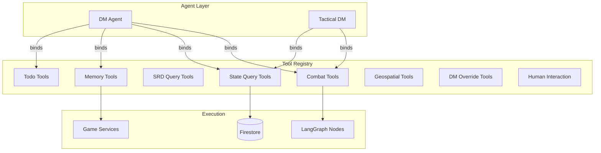
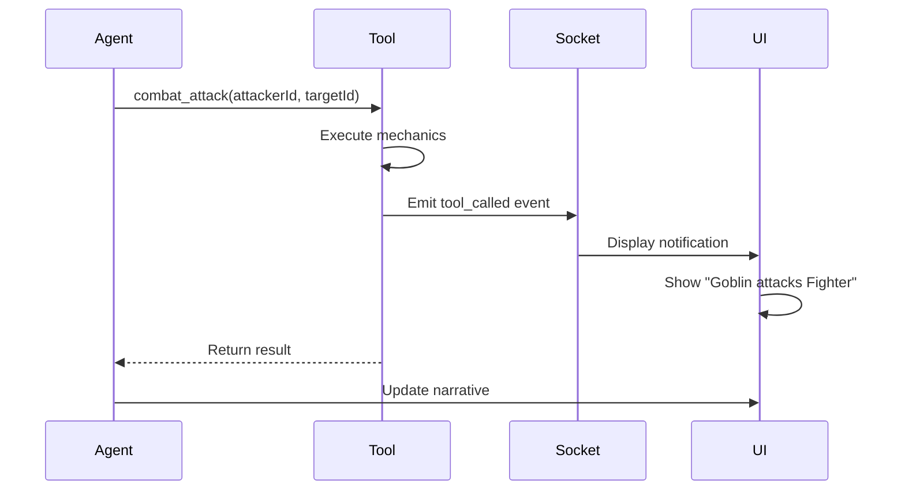

# Tool Registry

Central catalog of all LangChain tools available to AI agents. Tools are the bridge between LLM intent and deterministic game mechanics.

---

## Architecture

> **Rule #10: All Agent Abilities are LangChain Tools with Zod Schemas**
>
> Any discrete capability the LLM can perform—rolling dice, casting a spell, starting combat—must be exposed as a `tool` with a strict Zod schema.



---

## Module Structure

```
tools/
└── registry.ts    Complete tool catalog with metadata and bindings
```

**Related tool implementations:**

```
combat/tools/
├── combat-tools.ts         Core combat actions (start, attack, move, end)
├── state-tools.ts          State queries and mutations
├── srd-query-tools.ts      D&D 5e SRD lookups (spells, monsters, conditions)
├── memory-tools.ts         Semantic memory storage/retrieval
├── todo-tools.ts           DM self-planning (create/update/complete todos)
├── geospatial-tools.ts     Vision and perception based on position
├── dm-override-tools.ts    Rule-bending (dice overrides, rule of cool)
├── human-interaction.ts    Ask human for clarification
├── schemas.ts              Zod schemas for all tool inputs
└── session.ts              Tool session management
```

---

## Tool Catalog

### Combat Tools (8 tools)

Control combat flow and execute combat actions.

```typescript
// combat/tools/combat-tools.ts

export const startCombatTool = tool(
  async ({ characters, terrain, seed }) => {
    // Initialize combat, roll initiative
    return { encounterId, turnOrder, initialPositions };
  },
  {
    name: 'start_combat',
    description: 'Initiate combat encounter with given characters and terrain grid',
    schema: z.object({
      characters: z.array(CharacterSchema),
      terrain: z.array(TerrainCellSchema).optional(),
      seed: z.number().describe('Dice roller seed for determinism'),
    }),
  }
);

export const attackTool = tool(
  async ({ attackerId, targetId, weaponId, hasAdvantage }) => {
    // Execute attack: roll attack, check hit, roll damage
    return {
      hit: true,
      damage: 12,
      isCritical: false,
      attackRoll: 18,
      newTargetHP: 23,
    };
  },
  {
    name: 'combat_attack',
    description: 'Perform melee or ranged attack against target',
    schema: AttackSchema,
  }
);

export const moveTool = tool(
  async ({ characterId, targetPosition }) => {
    // Validate movement, check opportunity attacks
    return {
      newPosition: { x: 10, y: 5 },
      opportunityAttacks: ['goblin-1'],
      movementCost: 15,
    };
  },
  {
    name: 'combat_move',
    description: 'Move character to target position, respecting speed and terrain',
    schema: MoveSchema,
  }
);
```

**Full list:**

- `start_combat` - Initialize combat encounter
- `combat_attack` - Melee/ranged attack
- `combat_move` - Movement with OA checks
- `cast_spell` - Spell targeting and effects
- `end_turn` - Finish active character's turn
- `end_combat` - Conclude combat encounter
- `use_ability` - Use class features/abilities
- `take_action` - Generic action (dodge, dash, help, etc.)

---

### State Query Tools (9 tools)

Read-only access to game state.

```typescript
// combat/tools/state-tools.ts

export const queryCharacterSheetTool = tool(
  async ({ characterId }) => {
    // Return full D&D 5e character sheet
    return characterSheet;
  },
  {
    name: 'query_character_sheet',
    description: 'Get complete character sheet for a character',
    schema: z.object({
      characterId: z.string(),
    }),
  }
);

export const queryCombatStatusTool = tool(
  async ({ encounterId }) => {
    return {
      currentTurn: 'fighter-1',
      roundNumber: 3,
      activeCombatants: [...],
      defeatedEnemies: [...],
      turnOrder: [...],
    };
  },
  {
    name: 'query_combat_status',
    description: 'Get current combat state (turn order, round, active combatants)',
    schema: QueryCombatStatusSchema,
  }
);

export const queryTacticalGridTool = tool(
  async ({ encounterId }) => {
    return {
      gridWidth: 30,
      gridHeight: 30,
      units: [{ id: '...', position: { x: 5, y: 10 }, hp: 45 }],
      terrain: [...],
    };
  },
  {
    name: 'query_tactical_grid',
    description: 'Get tactical grid state with unit positions and terrain',
    schema: QueryTacticalGridSchema,
  }
);
```

**Full list:**

- `query_character_sheet` - Full character data
- `query_combat_log` - Combat history
- `query_tactical_grid` - Grid positions and terrain
- `query_combat_status` - Current turn/round info
- `query_initiative_order` - Initiative tracker
- `query_spell_slots` - Remaining spell slots
- `query_conditions` - Active conditions on characters
- `query_inventory` - Character inventory
- `query_nearby_units` - Units within range

---

### State Mutation Tools (6 tools)

Write access to modify game state.

```typescript
export const updateCharacterHPTool = tool(
  async ({ characterId, hpChange, source }) => {
    return {
      characterId,
      oldHP: 45,
      newHP: 33,
      isDead: false,
      isUnconscious: false,
    };
  },
  {
    name: 'update_character_hp',
    description: 'Modify character HP (positive for healing, negative for damage)',
    schema: z.object({
      characterId: z.string(),
      hpChange: z.number(),
      source: z.string().describe('Source of HP change (e.g., "goblin attack", "healing potion")'),
    }),
  }
);

export const applyConditionTool = tool(
  async ({ characterId, condition, duration }) => {
    return {
      characterId,
      conditionsApplied: ['poisoned'],
      expiresAt: 'end of turn 5',
    };
  },
  {
    name: 'apply_condition',
    description: 'Apply D&D 5e condition to character (e.g., poisoned, stunned)',
    schema: ApplyConditionSchema,
  }
);
```

**Full list:**

- `update_character_hp` - Damage/healing
- `apply_condition` - Add status effects
- `remove_condition` - Remove status effects
- `update_inventory` - Add/remove items
- `grant_xp` - Award experience points
- `update_spell_slots` - Modify spell slot usage

---

### SRD Query Tools (8 tools)

D&D 5e System Reference Document lookups.

```typescript
// combat/tools/srd-query-tools.ts

export const querySpellsTool = tool(
  async ({ level, school, name }) => {
    // Return filtered spell list
    return {
      spells: [
        { id: 'fireball', name: 'Fireball', level: 3, school: 'evocation', ... },
      ],
      total: 48,
    };
  },
  {
    name: 'query_spells',
    description: 'Search D&D 5e spells by level, school, or name',
    schema: QuerySpellsSchema,
  }
);

export const queryMonstersTool = tool(
  async ({ challengeRating, type, name }) => {
    return {
      monsters: [
        { id: 'goblin', name: 'Goblin', cr: 0.25, hp: 7, ac: 15, ... },
      ],
      total: 12,
    };
  },
  {
    name: 'query_monsters',
    description: 'Search D&D 5e monster stat blocks by CR, type, or name',
    schema: QueryMonstersSchema,
  }
);
```

**Full list:**

- `query_spells` - Spell catalog search
- `query_monsters` - Monster stat blocks
- `query_conditions` - Condition effects
- `query_races` - Player races
- `query_classes` - Player classes
- `query_abilities` - Ability scores and skills
- `query_skills` - Skill proficiencies
- `query_equipment` - Items and weapons

---

### Memory Tools (2 tools)

Semantic memory for long-term campaign context.

```typescript
// combat/tools/memory-tools.ts

export const storeMemoryTool = tool(
  async ({ content, tags, importance }) => {
    return {
      memoryId: 'mem-123',
      stored: true,
      embeddingGenerated: true,
    };
  },
  {
    name: 'store_memory',
    description: 'Store important event in semantic memory for later retrieval',
    schema: z.object({
      content: z.string().describe('Event description'),
      tags: z.array(z.string()).describe('Tags for categorization'),
      importance: z.enum(['low', 'medium', 'high', 'critical']),
    }),
  }
);

export const recallMemoryTool = tool(
  async ({ query, limit }) => {
    return {
      memories: [
        { content: 'Party defeated the dragon', relevance: 0.95, timestamp: ... },
      ],
      totalFound: 3,
    };
  },
  {
    name: 'recall_memory',
    description: 'Retrieve relevant memories from semantic store',
    schema: RecallMemorySchema,
  }
);
```

---

### Todo Tools (4 tools)

DM self-planning for complex scenarios.

```typescript
// combat/tools/todo-tools.ts

export const createTodoTool = tool(
  async ({ task, priority, estimatedTurns }) => {
    return {
      todoId: 'todo-123',
      task: 'Trigger dragon ambush',
      status: 'pending',
    };
  },
  {
    name: 'create_todo',
    description: 'Create a planning todo for complex multi-step scenarios',
    schema: z.object({
      task: z.string().describe('Clear, actionable task'),
      priority: z.enum(['critical', 'high', 'medium', 'low']),
      estimatedTurns: z.number().int().min(1),
      dependencies: z.array(z.string()).optional(),
    }),
  }
);

export const completeTodoTool = tool(
  async ({ todoId, outcome }) => {
    return { todoId, status: 'completed', completedAt: Date.now() };
  },
  {
    name: 'complete_todo',
    description: 'Mark todo as completed with outcome notes',
    schema: CompleteTodoSchema,
  }
);
```

**Full list:**

- `create_todo` - Plan new task
- `update_todo` - Modify existing todo
- `complete_todo` - Mark as done
- `list_todos` - Query all todos

---

### Geospatial Tools (1 tool)

Vision and perception based on player position.

```typescript
// combat/tools/geospatial-tools.ts

export const queryGeospatialContextTool = tool(
  async ({ playerId, radius }) => {
    return {
      visibleCharacters: ['goblin-1', 'fighter-2'],
      visibleObjects: ['treasure chest', 'altar'],
      terrain: ['forest', 'difficult_terrain'],
      lighting: 'dim',
      weather: 'light rain',
      sounds: ['rustling leaves', 'distant howl'],
    };
  },
  {
    name: 'query_geospatial_context',
    description: 'Get what a player can perceive from their current position',
    schema: z.object({
      playerId: z.string(),
      radius: z.number().describe('Vision radius in feet'),
    }),
  }
);
```

---

### DM Override Tools (6 tools)

Rule-bending for dramatic moments.

```typescript
// combat/tools/dm-override-tools.ts

export const overrideDiceRollTool = tool(
  async ({ rollId, overrideValue, reason }) => {
    return {
      original: 3,
      override: 20,
      reason: 'Epic moment for player',
    };
  },
  {
    name: 'override_dice_roll',
    description: 'DM can override a dice roll for dramatic effect',
    schema: z.object({
      rollId: z.string(),
      overrideValue: z.number().int().min(1).max(20),
      reason: z.string().describe('Narrative justification'),
    }),
  }
);

export const applyRuleOfCoolTool = tool(
  async ({ playerId, action, narrativeJustification }) => {
    return {
      allowed: true,
      modifiedEffect: "Player's creative action succeeds with style",
    };
  },
  {
    name: 'apply_rule_of_cool',
    description: 'Allow creative player action that bends rules',
    schema: ApplyRuleOfCoolSchema,
  }
);
```

**Full list:**

- `override_dice_roll` - Modify roll result
- `veto_tool_result` - Cancel a tool execution
- `apply_narrative_modifier` - Add story-based bonus/penalty
- `invoke_legendary_action` - Trigger legendary action
- `apply_rule_of_cool` - Allow awesome player idea
- `declare_narrative_immunity` - Story-based damage immunity

---

### Human Interaction (1 tool)

Ask player for clarification.

```typescript
// combat/tools/human-interaction.ts

export const askHumanTool = tool(
  async ({ question, options }) => {
    return {
      questionId: 'q-123',
      status: 'pending',
      // Response comes later via Socket.IO
    };
  },
  {
    name: 'ask_human',
    description: 'Request clarification from player when intent is ambiguous',
    schema: z.object({
      question: z.string(),
      options: z.array(z.string()).optional().describe('Multiple choice options'),
      playerId: z.string(),
    }),
  }
);
```

---

## Tool Registry System

The `registry.ts` file maintains a catalog of all tools with metadata.

```typescript
// tools/registry.ts

export interface ToolMetadata {
  id: string;
  name: string;
  description: string;
  category: 'combat' | 'state_query' | 'state_mutation' | 'srd' | 'memory' | 'planning' | 'override' | 'interaction';
  requiredCapabilities: string[];
  isExperimental: boolean;
  version: string;
}

export const TOOL_REGISTRY: Record<string, ToolMetadata> = {
  start_combat: {
    id: 'start_combat',
    name: 'Start Combat',
    description: 'Initiate a combat encounter',
    category: 'combat',
    requiredCapabilities: ['combat_initiation'],
    isExperimental: false,
    version: '1.0.0',
  },
  // ... 48 total tools
};

export function bindToolsFromRegistry(toolIds: string[]): Tool[] {
  return toolIds.map((id) => {
    const metadata = TOOL_REGISTRY[id];
    if (!metadata) throw new Error(`Tool ${id} not found in registry`);

    return getToolImplementation(id); // Returns actual LangChain tool
  });
}
```

---

## Usage in Agents

```typescript
import { DM_AGENT_CONFIG } from '@/agents/catalog';
import { bindToolsFromRegistry } from '@/tools/registry';
import { createReactAgent } from '@langchain/langgraph/prebuilt';

const model = getChatModel({
  modelName: DM_AGENT_CONFIG.model,
  temperature: DM_AGENT_CONFIG.temperature,
});

// Bind only the tools this agent needs
const tools = bindToolsFromRegistry(DM_AGENT_CONFIG.availableTools);

const agent = await createReactAgent({
  llm: model,
  tools,
  checkpointer: firestoreCheckpointer,
});

// Agent can now call any bound tool
const result = await agent.invoke({
  messages: [{ role: 'user', content: 'Start combat with the goblins' }],
});
```

---

## Tool Design Principles

### 1. Strict Input Schemas

Every tool has a Zod schema for validation.

```typescript
// ✅ GOOD: Strict schema with descriptions
export const attackSchema = z.object({
  attackerId: z.string().describe('ID of attacking character'),
  targetId: z.string().describe('ID of target character'),
  weaponId: z.string().optional().describe('Weapon to use (defaults to equipped)'),
  hasAdvantage: z.boolean().default(false),
});

// ❌ BAD: No schema, no validation
export const attackTool = tool(
  async (params: any) => { ... },
  { name: 'attack', description: '...' }
);
```

### 2. Deterministic Execution

Tools must be idempotent when given the same inputs.

```typescript
// ✅ GOOD: Uses seeded dice roller
export const attackTool = tool(
  async ({ attackerId, targetId, seed }) => {
    const roller = new DiceRoller({ seed });
    const result = roller.roll('1d20+5');
    return { hit: result >= targetAC, ... };
  },
  { ... }
);
```

### 3. Rich Return Values

Return all relevant data for narrative generation.

```typescript
// ✅ GOOD: Detailed result
return {
  hit: true,
  damage: 12,
  isCritical: false,
  attackRoll: 18,
  targetNewHP: 23,
  targetStatus: 'bloodied',
  narrativeHook: 'The sword strikes true, leaving a deep gash',
};

// ❌ BAD: Minimal result
return { success: true };
```

---

## Frontend Integration

Tools display notifications when called.



**Frontend displays:**

- Tool name and parameters
- Execution result
- Narrative description

---

## Testing Tools

```typescript
describe('attackTool', () => {
  it('executes attack with advantage', async () => {
    const result = await attackTool.invoke({
      attackerId: 'fighter-1',
      targetId: 'goblin-1',
      hasAdvantage: true,
      seed: 42, // Deterministic
    });

    expect(result.hit).toBe(true);
    expect(result.damage).toBeGreaterThan(0);
  });

  it('validates schema', () => {
    expect(() => {
      attackTool.invoke({ invalid: 'data' });
    }).toThrow();
  });
});
```

---

## Adding New Tools

1. Create tool implementation in appropriate file (`combat/tools/*.ts`)
2. Define Zod schema for inputs
3. Add to `TOOL_REGISTRY` in `tools/registry.ts`
4. Add to agent configs in `agents/catalog.ts`
5. Write tests in `combat/tools/__tests__/*.test.ts`
6. Document in this README

---

## Related Documentation

- [[../agents/README.md|Agent System]] - How tools are bound to agents
- [[../combat/README.md|Combat System]] - Combat tool implementations
- [[../schemas/README.md|Schema Catalog]] - Tool input/output schemas
- [[../graph/README.md|LangGraph]] - How tools integrate with graph nodes
- [[../../.cursor/rules/README.md#rule-10|Rule 10: All Agent Abilities are Tools]] - Architectural principle

---

Built following [[../../.cursor/rules/README.md|DAICE Architectural Principles]] - every capability is a validated, testable tool.
