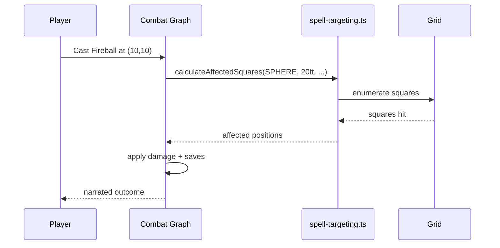

# Spell System Reference

Single source of truth for spell data, spatial effect types, and combat integration across backend + frontend.

---

## End-to-End Pipeline

```mermaid
flowchart LR
    RawHTML[raw_spell_book.html] --> Parser[parse-spells.ts]
    Parser --> JSON[spells.json (487 spells)]
    JSON --> Seeder[seed-spells.ts]
    Seeder --> Firestore[(Firestore Collection: spells)]

    JSON --> Types[backend/src/types/spells.ts]
    Types --> Combat[combat/spell-targeting.ts]
    Types --> API[api/spells.ts]
    Types --> FrontendTypes[frontend/src/types/spells.ts]
    FrontendTypes --> Overlay[SpellEffectOverlay]
```

Key properties:

- **Deterministic source**: Derived from SRD HTML. Parsing script owned here.
- **Type safe**: Shared enums/interfaces enforce identical shapes across stack.
- **Tested**: Geometry functions backed by snapshot + numeric tests.

---

## Core Types

```typescript
export enum SpellEffectShape {
  MELEE_TOUCH = 'MELEE_TOUCH',
  RANGED_SINGLE = 'RANGED_SINGLE',
  PROJECTILE_STRAIGHT = 'PROJECTILE_STRAIGHT',
  CONE = 'CONE',
  LINE = 'LINE',
  SPHERE = 'SPHERE',
  CUBE = 'CUBE',
  CYLINDER = 'CYLINDER',
  SELF_ONLY = 'SELF_ONLY',
  SELF_AURA = 'SELF_AURA',
  WALL = 'WALL',
}

export interface SpellEffectDimensions {
  radius?: number;
  length?: number;
  lineLength?: number;
  lineWidth?: number;
  height?: number;
  cubeSize?: number;
}

export interface SpellData {
  id: string;
  name: string;
  level: 0 | 1 | 2 | 3 | 4 | 5 | 6 | 7 | 8 | 9;
  school: SpellSchool;
  effectShape: SpellEffectShape;
  effectDimensions?: SpellEffectDimensions;
  damage?: DamageProfile;
  savingThrow?: AbilityScore;
  castingTime: string;
  range: string;
  duration: string;
  concentration: boolean;
  description: string;
  higherLevel?: string;
}
```

See `backend/src/types/spells.ts` for the complete set (damage types, components, flags).

---

## Spatial Effect Shapes

| Shape                 | Typical Range           | Friendly Fire | Line of Sight   | Examples                    |
| --------------------- | ----------------------- | ------------- | --------------- | --------------------------- |
| `MELEE_TOUCH`         | 5 ft                    | No            | Yes             | Cure Wounds, Shocking Grasp |
| `RANGED_SINGLE`       | 30–120 ft               | No            | Yes             | Eldritch Blast, Fire Bolt   |
| `PROJECTILE_STRAIGHT` | Variable                | Usually No    | Yes             | Scorching Ray               |
| `CONE`                | 15–60 ft length         | Yes           | Yes             | Burning Hands, Cone of Cold |
| `LINE`                | 60–120 ft length        | Yes           | Yes             | Lightning Bolt              |
| `SPHERE`              | 5–40 ft radius          | Yes           | To target point | Fireball, Thunderwave       |
| `CUBE`                | 10–30 ft edges          | Yes           | To target point | Thunderwave                 |
| `CYLINDER`            | Radius + height         | Yes           | Partial         | Flame Strike                |
| `SELF_ONLY`           | Self                    | No            | No              | Shield                      |
| `SELF_AURA`           | Radius (moving)         | Possible      | No              | Spirit Guardians            |
| `WALL`                | Length/height/thickness | Blocks LOS    | To placement    | Wall of Fire                |

Helpers:

- `canCauseFriendlyFire(shape)` — warn UI players of risk.
- `requiresLineOfSight(shape)` — ensures DM checks visibility.
- `requiresConcentration(spell)` — evaluate disruption rules.

---

## Combat Integration



Primary functions (`backend/src/combat/spell-targeting.ts`):

- `calculateAffectedSquares(shape, dimensions, casterPos, targetPos, gridWidth, gridHeight)`
- `calculateConeArea`, `calculateSphereArea`, `calculateLineArea`, `calculateCubeArea`, etc.
- `determineRequiredSaves(spell, targets)`
- `outlineWallSegments(spell, wallOrigin)`

All geometry functions operate on 5 ft squares (grid coordinates). They are deterministic given identical inputs, enabling combat time-travel.

---

## Dataset Stats

- **Total spells**: 487
  - Level 0 (Cantrips): 50
  - Level 1–9: 437
- Each spell entry contains:
  - Localization-ready name + description
  - Components (V/S/M) with material text
  - Tags (`ritual`, `concentration`)
  - Damage profile (dice formula + type)
  - Saving throw ability (if any)
  - Effect shape + dimensions
  - Source reference (SRD page)

---

## API Surface

```bash
GET /api/spells
GET /api/spells?level=3
GET /api/spells?school=evocation
GET /api/spells?effectShape=cone
GET /api/spells/:id
GET /api/spells/shapes/:shape
GET /api/spells/levels/:level
```

Responses adhere to shared `SpellData` type. Filtering performed in Firestore via composite indexes (see `firestore.indexes.json`).

---

## Frontend Usage

- `frontend/src/types/spells.ts` re-exports the same enums/interfaces.
- `SpellEffectOverlay` Storybook stories visualize every shape (28+ stories).
- Combat UI uses `useCombat` hook to render affected squares and friendly fire warnings.
- Spell search UI uses filters identical to API query parameters.

---

## Testing

Backend:

```bash
yarn test backend/src/combat/__tests__/spell-targeting.test.ts
yarn test backend/src/api/__tests__/spells.spec.ts
```

- 46 geometry tests (snapshots + numeric assertions).
- 12 API tests covering filters, pagination, caching.
- Golden fixtures stored under `backend/src/combat/__tests__/fixtures/`.

Frontend:

```bash
yarn test frontend/src/components/combat/__tests__/SpellEffectOverlay.spec.tsx
yarn storybook
```

Storybook manual QA ensures visuals match calculations.

---

## Extending the System

1. Update parser (`backend/src/scripts/parse-spells.ts`) if SRD format changes.
2. Regenerate JSON dataset (`yarn ts-node backend/src/scripts/parse-spells.ts`).
3. Rerun seed script or import via Firebase console.
4. Add/adjust type definitions in `spells.ts`.
5. Extend geometry helpers + tests for new shapes.
6. Sync frontend types + stories.
7. Update this README with the new shape or capability.

---

## References

- `backend/src/combat/README.md` (coming soon) — broader combat engine docs.
- `docs/graphs/combat-graph.mmd` — Mermaid of combat LangGraph.
- `frontend/src/components/combat/README.md` — UI integration.
- SRD license: `docs/LICENSE-SRD.md`.
