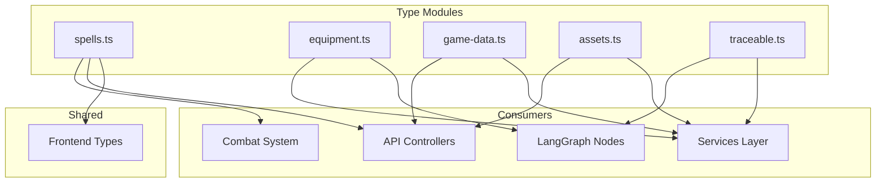

# Type Definitions

Shared TypeScript types and interfaces for domain models across backend services.

---

## Overview



---

## Module Structure

```
types/
├── spells.ts          D&D 5e spell data, effect shapes, targeting
├── equipment.ts       Items, weapons, armor, inventory
├── game-data.ts       SRD reference data (races, classes, skills)
├── assets.ts          AI-generated asset metadata
├── traceable.ts       Execution trace metadata for observability
├── index.ts           Barrel export
└── README-SPELLS.md   Detailed spell system documentation
```

---

## Spell Types (`spells.ts`)

**See [[README-SPELLS.md|Spell System Documentation]] for complete reference.**

### Core Enums

```typescript
export enum SpellEffectShape {
  MELEE_TOUCH = 'MELEE_TOUCH', // 5ft single target
  RANGED_SINGLE = 'RANGED_SINGLE', // Ray to single target
  PROJECTILE_STRAIGHT = 'PROJECTILE_STRAIGHT', // Straight-line projectile
  CONE = 'CONE', // Expanding wedge
  LINE = 'LINE', // Straight line
  SPHERE = 'SPHERE', // Radius from point (Fireball)
  CUBE = 'CUBE', // Cubic volume
  CYLINDER = 'CYLINDER', // Radius + height
  SELF_ONLY = 'SELF_ONLY', // Caster only
  SELF_AURA = 'SELF_AURA', // Moving radius
  WALL = 'WALL', // Barrier placement
}

export enum SpellSchool {
  ABJURATION = 'abjuration',
  CONJURATION = 'conjuration',
  DIVINATION = 'divination',
  ENCHANTMENT = 'enchantment',
  EVOCATION = 'evocation',
  ILLUSION = 'illusion',
  NECROMANCY = 'necromancy',
  TRANSMUTATION = 'transmutation',
}

export enum DamageType {
  ACID = 'acid',
  BLUDGEONING = 'bludgeoning',
  COLD = 'cold',
  FIRE = 'fire',
  FORCE = 'force',
  LIGHTNING = 'lightning',
  NECROTIC = 'necrotic',
  PIERCING = 'piercing',
  POISON = 'poison',
  PSYCHIC = 'psychic',
  RADIANT = 'radiant',
  SLASHING = 'slashing',
  THUNDER = 'thunder',
}
```

### Spell Data Interface

```typescript
export interface SpellData {
  // Identity
  id: string;
  name: string;
  level: 0 | 1 | 2 | 3 | 4 | 5 | 6 | 7 | 8 | 9;
  school: SpellSchool;

  // Mechanics
  effectShape: SpellEffectShape;
  effectDimensions?: SpellEffectDimensions;
  damage?: DamageProfile;
  savingThrow?: AbilityScore;

  // Casting
  castingTime: string;
  range: string;
  duration: string;
  concentration: boolean;
  ritual: boolean;

  // Components
  components: {
    verbal: boolean;
    somatic: boolean;
    material: boolean;
    materialDescription?: string;
  };

  // Description
  description: string;
  higherLevel?: string;

  // Metadata
  source: string;
  classes: string[];
}

export interface SpellEffectDimensions {
  radius?: number; // Feet (for SPHERE, CYLINDER)
  length?: number; // Feet (for CONE)
  lineLength?: number; // Feet (for LINE)
  lineWidth?: number; // Feet (for LINE)
  height?: number; // Feet (for CYLINDER)
  cubeSize?: number; // Feet per side (for CUBE)
}

export interface DamageProfile {
  formula: string; // Dice notation (e.g., "8d6")
  type: DamageType;
  saveForHalf: boolean;
}
```

### Helper Functions

```typescript
export function canCauseFriendlyFire(shape: SpellEffectShape): boolean {
  return [
    SpellEffectShape.CONE,
    SpellEffectShape.LINE,
    SpellEffectShape.SPHERE,
    SpellEffectShape.CUBE,
    SpellEffectShape.CYLINDER,
  ].includes(shape);
}

export function requiresLineOfSight(shape: SpellEffectShape): boolean {
  return ![SpellEffectShape.SELF_ONLY, SpellEffectShape.SELF_AURA].includes(shape);
}

export function requiresConcentration(spell: SpellData): boolean {
  return spell.concentration;
}
```

**Usage:**

```typescript
import { SpellData, SpellEffectShape, canCauseFriendlyFire } from '@/types/spells';

const fireball: SpellData = {
  id: 'fireball',
  name: 'Fireball',
  level: 3,
  school: SpellSchool.EVOCATION,
  effectShape: SpellEffectShape.SPHERE,
  effectDimensions: { radius: 20 },
  damage: { formula: '8d6', type: DamageType.FIRE, saveForHalf: true },
  savingThrow: 'dexterity',
  // ...
};

if (canCauseFriendlyFire(fireball.effectShape)) {
  console.warn('Watch for friendly fire!');
}
```

---

## Equipment Types (`equipment.ts`)

### Item Base

```typescript
export interface Item {
  itemIndex: string; // Unique SRD index
  name: string;
  type: ItemType;
  rarity: Rarity;
  value: number; // Gold pieces
  weight: number; // Pounds
  description: string;
  properties: string[];
}

export enum ItemType {
  WEAPON = 'weapon',
  ARMOR = 'armor',
  SHIELD = 'shield',
  POTION = 'potion',
  SCROLL = 'scroll',
  WAND = 'wand',
  RING = 'ring',
  WONDROUS = 'wondrous',
  AMMUNITION = 'ammunition',
  TOOL = 'tool',
  GEAR = 'gear',
}

export enum Rarity {
  COMMON = 'common',
  UNCOMMON = 'uncommon',
  RARE = 'rare',
  VERY_RARE = 'very_rare',
  LEGENDARY = 'legendary',
  ARTIFACT = 'artifact',
}
```

### Weapons

```typescript
export interface Weapon extends Item {
  type: ItemType.WEAPON;
  weaponType: 'simple' | 'martial';
  category: 'melee' | 'ranged';
  damage: {
    dice: string; // e.g., "1d8"
    type: DamageType;
  };
  range?: {
    normal: number; // Feet
    long: number; // Feet
  };
  reach?: number; // Feet (default 5)
  properties: WeaponProperty[];
}

export enum WeaponProperty {
  AMMUNITION = 'ammunition',
  FINESSE = 'finesse',
  HEAVY = 'heavy',
  LIGHT = 'light',
  LOADING = 'loading',
  REACH = 'reach',
  THROWN = 'thrown',
  TWO_HANDED = 'two_handed',
  VERSATILE = 'versatile',
}
```

### Armor

```typescript
export interface Armor extends Item {
  type: ItemType.ARMOR;
  armorType: 'light' | 'medium' | 'heavy';
  baseAC: number;
  dexModifierCap?: number; // Max DEX bonus (null for light armor)
  stealthDisadvantage: boolean;
  strengthRequirement?: number;
}
```

### Inventory System

```typescript
export interface InventorySlot {
  itemIndex: string;
  quantity: number;
}

export interface EquippedItems {
  mainHand: string | null;
  offHand: string | null;
  armor: string | null;
  shield: string | null;
  accessory1: string | null;
  accessory2: string | null;
}

export interface Inventory {
  equippedItems: EquippedItems;
  inventory: InventorySlot[];
  totalWeight: number;
  capacity: number; // Based on STR score
}
```

---

## Game Data Types (`game-data.ts`)

### SRD Reference Data

```typescript
export interface Race {
  index: string;
  name: string;
  speed: number;
  abilityBonuses: AbilityBonus[];
  size: 'Small' | 'Medium' | 'Large';
  languages: string[];
  traits: Trait[];
  subraces: Subrace[];
}

export interface Class {
  index: string;
  name: string;
  hitDie: number;
  primaryAbility: AbilityScore;
  savingThrows: AbilityScore[];
  proficiencies: Proficiency[];
  spellcasting?: SpellcastingInfo;
  subclasses: Subclass[];
}

export interface Monster {
  index: string;
  name: string;
  size: string;
  type: string;
  alignment: string;
  armorClass: number;
  hitPoints: number;
  hitDice: string;
  speed: Record<string, string>;
  abilityScores: Record<AbilityScore, number>;
  challengeRating: number;
  xp: number;
  actions: Action[];
  specialAbilities: SpecialAbility[];
}

export interface Skill {
  index: string;
  name: string;
  ability: AbilityScore;
  description: string;
}

export interface Condition {
  index: string;
  name: string;
  description: string[];
  effects: ConditionEffect[];
}

export type AbilityScore = 'strength' | 'dexterity' | 'constitution' | 'intelligence' | 'wisdom' | 'charisma';
```

**Usage:**

```typescript
import { Monster, Race, Class } from '@/types/game-data';

// Query SRD data
const goblin: Monster = await db.collection('monsters').doc('goblin').get();
const dwarf: Race = await db.collection('races').doc('dwarf').get();
const fighter: Class = await db.collection('classes').doc('fighter').get();
```

---

## Asset Types (`assets.ts`)

AI-generated asset metadata.

```typescript
export interface AssetMetadata {
  id: string;
  type: AssetType;
  prompt: string;
  modelUsed: 'gemini-1.5-pro' | 'gemini-2.0-flash-exp';
  generatedAt: number;
  storageUrl: string;
  thumbnailUrl?: string;
}

export enum AssetType {
  CHARACTER_AVATAR = 'character_avatar',
  ACTION_FRAME = 'action_frame',
  GRID_BACKGROUND = 'grid_background',
  SPELL_EFFECT = 'spell_effect',
  ITEM_ICON = 'item_icon',
}

export interface CharacterAvatarAsset extends AssetMetadata {
  type: AssetType.CHARACTER_AVATAR;
  characterId: string;
  style: 'portrait' | 'full_body' | 'action';
  dimensions: {
    width: number;
    height: number;
  };
}

export interface GridBackgroundAsset extends AssetMetadata {
  type: AssetType.GRID_BACKGROUND;
  biome: string;
  gridSize: {
    width: number;
    height: number;
  };
  tileSize: number;
}
```

**Usage:**

```typescript
import { AssetType, CharacterAvatarAsset } from '@/types/assets';

const avatar: CharacterAvatarAsset = {
  id: 'asset-123',
  type: AssetType.CHARACTER_AVATAR,
  characterId: 'char-456',
  prompt: 'Epic dwarf fighter in plate armor',
  modelUsed: 'gemini-1.5-pro',
  style: 'portrait',
  dimensions: { width: 512, height: 512 },
  generatedAt: Date.now(),
  storageUrl: 'gs://bucket/avatars/char-456.png',
};
```

---

## Traceable Types (`traceable.ts`)

Execution trace metadata for LangSmith and observability.

```typescript
export interface TraceMetadata {
  traceId: string;
  parentTraceId?: string;
  spanId: string;

  operation: string; // e.g., 'turn_processing', 'combat_attack'
  startTime: number;
  endTime?: number;
  duration?: number;

  tags: Record<string, string | number | boolean>;
  metadata: Record<string, unknown>;

  status: 'success' | 'error' | 'pending';
  error?: ErrorInfo;
}

export interface ErrorInfo {
  code: string;
  message: string;
  stack?: string;
  details?: unknown;
}

export interface LangSmithTrace extends TraceMetadata {
  sessionId: string; // Room ID for grouping
  userId?: string;

  modelName?: string;
  temperature?: number;
  tokenUsage?: {
    prompt: number;
    completion: number;
    total: number;
  };

  toolCalls?: ToolCallTrace[];
}

export interface ToolCallTrace {
  toolName: string;
  input: unknown;
  output: unknown;
  duration: number;
  success: boolean;
}
```

**Usage:**

```typescript
import { TraceMetadata } from '@/types/traceable';

const trace: TraceMetadata = {
  traceId: 'trace-123',
  spanId: 'span-456',
  operation: 'turn_processing',
  startTime: Date.now(),
  tags: {
    roomId: 'room-abc',
    phase: 'GAMEPLAY',
    turnNumber: 5,
  },
  metadata: {
    playerCount: 4,
    combatActive: false,
  },
  status: 'pending',
};

// Complete trace
trace.endTime = Date.now();
trace.duration = trace.endTime - trace.startTime;
trace.status = 'success';
```

---

## Type Re-exports

`index.ts` provides a barrel export for convenience.

```typescript
// types/index.ts
export * from './spells';
export * from './equipment';
export * from './game-data';
export * from './assets';
export * from './traceable';
```

**Usage:**

```typescript
// ✅ GOOD: Single import
import { SpellData, Weapon, Monster, AssetMetadata } from '@/types';

// ❌ BAD: Multiple imports
import { SpellData } from '@/types/spells';
import { Weapon } from '@/types/equipment';
import { Monster } from '@/types/game-data';
import { AssetMetadata } from '@/types/assets';
```

---

## Type Safety Best Practices

### 1. Use Discriminated Unions

```typescript
// ✅ GOOD: Type-safe discrimination
type Asset = CharacterAvatarAsset | GridBackgroundAsset | SpellEffectAsset;

function processAsset(asset: Asset) {
  switch (asset.type) {
    case AssetType.CHARACTER_AVATAR:
      // TypeScript knows asset is CharacterAvatarAsset
      console.log(asset.characterId);
      break;
    case AssetType.GRID_BACKGROUND:
      // TypeScript knows asset is GridBackgroundAsset
      console.log(asset.biome);
      break;
  }
}
```

### 2. Prefer `type` over `interface` for Unions

```typescript
// ✅ GOOD: Use type for complex unions
export type ItemType = Weapon | Armor | Potion | Scroll;

// ❌ BAD: Interface can't express unions
export interface ItemType { ... }
```

### 3. Use `const` Enums Sparingly

```typescript
// ✅ GOOD: Regular enum (can be imported by frontend)
export enum SpellSchool { ... }

// ❌ BAD: const enum (inlined at compile time, breaks Zod integration)
export const enum SpellSchool { ... }
```

---

## Frontend Synchronization

Many types are shared with frontend via `shared/` package.

```typescript
// shared/src/types/spells.ts (identical to backend)
export enum SpellEffectShape { ... }
export interface SpellData { ... }

// Backend imports from shared
import { SpellData } from '@shared/types';

// Frontend imports from shared
import { SpellData } from '@shared/types';
```

**Workflow:**

1. Define types in `shared/src/types/`
2. Backend re-exports: `export * from '@shared/types'`
3. Frontend re-exports: `export * from '@shared/types'`
4. Single source of truth for both stacks

---

## Testing Types

Use TypeScript's `satisfies` operator for type tests.

```typescript
import { SpellData, SpellEffectShape } from '@/types/spells';

const testSpell = {
  id: 'test',
  name: 'Test Spell',
  level: 1,
  school: 'evocation' as const,
  effectShape: SpellEffectShape.SPHERE,
  // ...
} satisfies SpellData; // Compile-time type check
```

---

## Related Documentation

- [[README-SPELLS.md|Spell System]] - Complete spell type documentation
- [[../combat/README.md|Combat System]] - How spell types are used in combat
- [[../api/README.md|API Layer]] - API payload types
- [[../../shared/README.md|Shared Package]] - Cross-stack type sharing
- [[../../.cursor/rules/README.md#rule-14|Rule 14: Type is King]] - Type safety principle

---

Built following [[../../.cursor/rules/README.md|Rule 14: Type is King]] - strict TypeScript with zero `any`.
