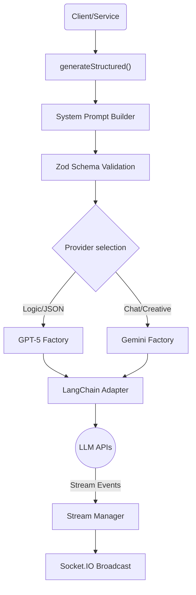

# 🧠 LLM Utilities System

> **Namespace**: `utils::llm`  
> **Core Logic**: `structured.ts`, `stream-manager.ts`

The **LLM Utilities** directory provides a centralized abstraction layer for interacting with Large Language Models (Gemini & OpenAI) within the Daicer backend. It handles provider instantiation, prompt injection, structured output validation (Zod), and real-time streaming via WebSockets.

## 🏗 Architecture Overview

The system uses a **Hybrid Provider** approach:

- **Gemini (Google)**: Used primarily for creative chat, high-context tasks, and multimodal inputs (via `gemini.ts`).
- **GPT-5 (OpenAI)**: Used extensively for **Structured Outputs** (JSON generation) due to strict schema adherence (via `openai.ts`).



## 🛠 Core Components

### 1. Structured Generation (`structured.ts`)

The main entry point for most game logic. It guarantees that the LLM output matches a specific TypeScript/Zod schema.

```typescript
import { generateStructured } from '../utils/llm/structured';
import { z } from 'zod';

const schema = z.object({
  action: z.enum(['attack', 'defend']),
  damage: z.number(),
});

const result = await generateStructured(
  schema,
  'You are a battle referee...', // System Prompt
  'I cast Fireball!', // User Input
  'en' // Language
);
```

### 2. Stream Manager (`stream-manager.ts`)

A singleton service that broadcasts LLM thinking processes, tool usage, and text chunks to the frontend via Socket.IO.

- **Events**: `text`, `tool_start`, `tool_end`, `reasoning`, `error`, `done`.
- **Usage**: Automatically hooked into `generateStructured` if a `streamId` is provided in metadata.

### 3. Model Factories

- **`gemini.ts`**: Instantiates `ChatGoogleGenerativeAI`. Handles `GEMINI_API_KEY`.
- **`openai.ts`**: Instantiates `ChatOpenAI`. Handles `OPENAI_API_KEY`.

## ⚙️ Configuration (`types.ts`)

Supported models are defined in the `GeminiModel` enums.

| Model              | Enum    | Best For                                     |
| :----------------- | :------ | :------------------------------------------- |
| **Gemini 3 Flash** | `FLASH` | `gemini-3-flash-preview`. Fast & Creative.   |
| **Gemini 3 Pro**   | `PRO`   | `gemini-3-pro-preview`. High reasoning SOTA. |

## 🌐 Localization

The `structured.ts` module automatically injects "System Instructions" to enforce the requested language (`en`, `es`, `pt-BR`).

- It prevents "Meta-talk" (e.g., "Here is your JSON...").
- It forces the Persona ("You are THE DUNGEON MASTER").

## 🧪 Best Practices

1.  **Always use `generateStructured`** for game logic. Never parse raw text manually.
2.  **Define Zod Schemas** in your service or controller, not inside this utility folder.
3.  **Use `streamId`** in metadata if the operation takes > 1 second, so the user sees progress.
4.  **Fallback**: The system currently defaults to `GPT-5 Mini` for structured tasks if no specific model is requested.
