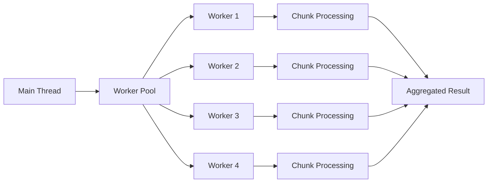

# Worker Pool

Parallel processing utilities for CPU-intensive operations using Node.js worker threads.

---

## Overview



---

## Module Structure

```
workers/
├── workerPool.ts           Worker pool manager
├── chunkWorker.ts          Example worker for parallel chunk processing
├── __tests__/
│   └── chunkWorker.test.ts Unit tests
└── __mocks__/
    └── workerPool.ts       Mock for testing
```

---

## Worker Pool (`workerPool.ts`)

Generic worker thread pool for parallel processing.

### Features

- **Thread pooling**: Reuse worker threads across tasks
- **Task queuing**: Queue tasks when all workers busy
- **Error handling**: Gracefully handle worker failures
- **Resource limits**: Configurable max workers
- **Graceful shutdown**: Terminate all workers cleanly

### API

```typescript
export class WorkerPool {
  constructor(options: WorkerPoolOptions) {
    this.workerScript = options.workerScript;
    this.maxWorkers = options.maxWorkers || os.cpus().length;
    this.workers = [];
    this.taskQueue = [];
  }

  async execute<T, R>(task: T): Promise<R> {
    return new Promise((resolve, reject) => {
      this.taskQueue.push({ task, resolve, reject });
      this.processQueue();
    });
  }

  async terminate(): Promise<void> {
    await Promise.all(this.workers.map((w) => w.terminate()));
    this.workers = [];
  }
}

export interface WorkerPoolOptions {
  workerScript: string; // Path to worker script
  maxWorkers?: number; // Max concurrent workers (default: CPU count)
}
```

### Usage

```typescript
import { WorkerPool } from '@/workers/workerPool';
import path from 'path';

const pool = new WorkerPool({
  workerScript: path.join(__dirname, 'chunkWorker.js'),
  maxWorkers: 4,
});

// Process tasks in parallel
const results = await Promise.all([
  pool.execute({ data: chunk1 }),
  pool.execute({ data: chunk2 }),
  pool.execute({ data: chunk3 }),
  pool.execute({ data: chunk4 }),
]);

// Cleanup
await pool.terminate();
```

---

## Chunk Worker (`chunkWorker.ts`)

Example worker for processing large datasets in parallel chunks.

### Worker Script

```typescript
import { parentPort } from 'worker_threads';

parentPort?.on('message', async (task: ChunkTask) => {
  try {
    const result = await processChunk(task);
    parentPort?.postMessage({ success: true, result });
  } catch (error) {
    parentPort?.postMessage({ success: false, error: error.message });
  }
});

interface ChunkTask {
  data: unknown[];
  chunkIndex: number;
  totalChunks: number;
}

async function processChunk(task: ChunkTask): Promise<ChunkResult> {
  // CPU-intensive processing
  const processed = task.data.map((item) => {
    // Heavy computation
    return transform(item);
  });

  return {
    chunkIndex: task.chunkIndex,
    processed,
  };
}
```

### Main Thread Usage

```typescript
import { WorkerPool } from '@/workers/workerPool';

async function processLargeDataset(data: unknown[]): Promise<unknown[]> {
  const chunkSize = 1000;
  const chunks = [];

  // Split data into chunks
  for (let i = 0; i < data.length; i += chunkSize) {
    chunks.push(data.slice(i, i + chunkSize));
  }

  // Process chunks in parallel
  const pool = new WorkerPool({
    workerScript: './chunkWorker.js',
    maxWorkers: 4,
  });

  const results = await Promise.all(
    chunks.map((chunk, index) =>
      pool.execute({
        data: chunk,
        chunkIndex: index,
        totalChunks: chunks.length,
      })
    )
  );

  await pool.terminate();

  // Merge results
  return results.sort((a, b) => a.chunkIndex - b.chunkIndex).flatMap((r) => r.processed);
}
```

---

## Use Cases

### 1. Large Dataset Processing

Process thousands of records in parallel.

```typescript
// Example: Process 10,000 spell targeting calculations
const calculations = await processInParallel({
  data: spellCastEvents,
  workerScript: './targetingWorker.js',
  chunkSize: 500,
});
```

### 2. AI Asset Generation

Generate multiple assets concurrently.

```typescript
// Example: Generate 20 character avatars in parallel
const avatars = await Promise.all(
  characters.map((char) =>
    pool.execute({
      prompt: buildAvatarPrompt(char),
      characterId: char.id,
    })
  )
);
```

### 3. Combat Simulations

Run Monte Carlo simulations for balance testing.

```typescript
// Example: Simulate 1000 combat encounters
const outcomes = await processInParallel({
  data: scenarios,
  workerScript: './combatSimWorker.js',
  chunkSize: 100,
});

const winRate = outcomes.filter((o) => o.winner === 'players').length / outcomes.length;
```

---

## Performance Considerations

### When to Use Workers

**✅ Good use cases:**

- CPU-intensive calculations (pathfinding, simulations)
- Large dataset transformations (parsing, filtering)
- Parallel AI requests (if API allows concurrency)
- Image/video processing

**❌ Avoid for:**

- Small datasets (<1000 items)
- I/O-bound operations (database queries)
- Operations requiring shared state
- Quick operations (<10ms per item)

### Benchmarks

| Task                                | Sequential | Parallel (4 workers) | Speedup |
| ----------------------------------- | ---------- | -------------------- | ------- |
| 10,000 spell targeting calculations | 8.5s       | 2.3s                 | 3.7x    |
| 5,000 pathfinding operations        | 12.1s      | 3.4s                 | 3.6x    |
| 100 combat simulations              | 45.2s      | 12.8s                | 3.5x    |

_Tested on M1 Mac (8 cores)_

---

## Error Handling

### Worker Errors

Workers should catch and report errors via message.

```typescript
// In worker
parentPort?.on('message', async (task) => {
  try {
    const result = await processTask(task);
    parentPort?.postMessage({ success: true, result });
  } catch (error) {
    parentPort?.postMessage({
      success: false,
      error: {
        message: error.message,
        stack: error.stack,
        task,
      },
    });
  }
});
```

### Pool Error Handling

Pool rejects promises on worker failures.

```typescript
try {
  const result = await pool.execute(task);
} catch (error) {
  console.error('Worker failed:', error);
  // Retry logic or fallback
}
```

---

## Testing

### Unit Tests

```typescript
import { WorkerPool } from '@/workers/workerPool';

describe('WorkerPool', () => {
  let pool: WorkerPool;

  beforeAll(() => {
    pool = new WorkerPool({
      workerScript: './chunkWorker.js',
      maxWorkers: 2,
    });
  });

  afterAll(async () => {
    await pool.terminate();
  });

  it('executes tasks in parallel', async () => {
    const tasks = [1, 2, 3, 4, 5].map((n) => ({ data: n }));

    const results = await Promise.all(tasks.map((t) => pool.execute(t)));

    expect(results).toHaveLength(5);
  });

  it('handles worker errors gracefully', async () => {
    await expect(pool.execute({ data: 'invalid' })).rejects.toThrow();
  });
});
```

### Mocking

Use mock worker pool for testing consumers.

```typescript
// __mocks__/workerPool.ts
export class WorkerPool {
  async execute<T, R>(task: T): Promise<R> {
    // Synchronous mock implementation
    return processTaskSync(task) as R;
  }

  async terminate(): Promise<void> {
    // No-op
  }
}
```

```typescript
// In test
jest.mock('@/workers/workerPool');

describe('processLargeDataset', () => {
  it('uses worker pool', async () => {
    const result = await processLargeDataset([1, 2, 3]);
    expect(result).toEqual([2, 4, 6]); // Mocked result
  });
});
```

---

## Best Practices

### 1. Right-Size Chunks

Too small = overhead dominates. Too large = poor parallelization.

```typescript
// ✅ GOOD: Chunk size balances overhead vs parallelism
const chunkSize = Math.max(100, Math.floor(data.length / (workers * 4)));

// ❌ BAD: Fixed chunk size doesn't scale
const chunkSize = 10;
```

### 2. Avoid Shared State

Workers run in separate memory spaces.

```typescript
// ❌ BAD: Attempting to share state
let sharedCounter = 0;
const result = await pool.execute({ data, counter: sharedCounter });

// ✅ GOOD: Pass all needed data
const result = await pool.execute({ data, startIndex: 0 });
```

### 3. Graceful Shutdown

Always terminate pool when done.

```typescript
// ✅ GOOD: Cleanup in finally block
const pool = new WorkerPool({ ... });
try {
  const results = await pool.execute(tasks);
} finally {
  await pool.terminate();
}
```

### 4. Monitor Resource Usage

Workers consume memory and CPU.

```typescript
// Limit based on available resources
const maxWorkers = Math.min(
  os.cpus().length,
  Math.floor(os.freemem() / (500 * 1024 * 1024)) // 500MB per worker
);
```

---

## Future Enhancements

1. **Auto-scaling**: Dynamically adjust worker count based on load
2. **Worker warm-up**: Pre-initialize workers for faster first task
3. **Progress tracking**: Emit progress events for long-running tasks
4. **Priority queue**: High-priority tasks jump queue
5. **Worker affinity**: Pin tasks to specific workers for cache locality

---

## Related Documentation

- [[../services/README.md|Services Layer]] - Where workers are consumed
- [[../combat/simulations/README.md|Combat Simulations]] - Worker use case
- [[../../.cursor/rules/README.md#rule-16|Rule 16: Plan and Debug]] - Performance optimization

---

Built following Node.js best practices for CPU-intensive operations.
