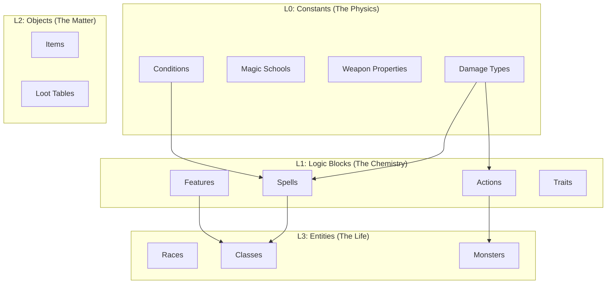

# Daicer Genesis Service: SOTA Data Population Architecture

> **Philosophy**: "The Schema is the Map."
> We do not simply "insert text." We **hydrate** the Engine with computable, strictly-typed rules.
> We separate **Extraction** (converting text to JSON) from **Ingestion** (loading JSON to DB) to ensure determinism.

---

## 1. Directory Structure

We will establish a dedicated `backend/data` workspace to manage the lifecycle of game data.

```text
backend/
+-- data/
    |-- raw/                  # Source of Truth (Markdown/PDFs)
    |   +-- rules.md          # The master rulebook
    |-- library/              # The Verified Intermediate Representation (JSON)
    |   |-- atoms/            # L0: DamageTypes, Conditions
    |   |-- molecules/        # L1: Traits, Spells, Features
    |   |-- compounds/        # L2: Items, Loot Tables
    |   +-- blueprints/       # L3: Monsters, Classes, Races
    |-- schemas/              # Zod Schemas for the Library JSONs
    +-- scripts/              # The Machinery
        |-- extractors/       # LLM/Regex pipelines (Raw -> Library)
        |-- loaders/          # Deterministic seeders (Library -> DB)
        +-- verify.ts         # Integrity checker
```

---

## 2. The Dependency Graph (The "Why")

To maintain referential integrity in a Relational/Graph-like system (Strapi), we must respect the hierarchy of existence.



---

## 3. The Workflow Stages

### Stage A: Extraction (The "Smart" Part)

_Goal: Convert unstructured text into strictly typed JSON._
_Tools: LLM (Gemini/OpenAI), Regex, TypeScript._

1.  **Read** `backend/data/raw/rules.md`.
2.  **Parse** using `backend/data/scripts/extractors/parse-spells.ts`.
3.  **Validate** against `backend/data/schemas/Spell.ts` (Zod).
4.  **Write** to `backend/data/library/molecules/spells.json`.

> **SOTA Feature**: "Human-in-the-Loop Validation."
> Because the output is a JSON file on disk, the Developer (User) can manually review diffs in Git before the database is ever touched. This prevents "LLM Hallucinations" from corrupting the production DB.

### Stage B: Ingestion (The "Fast" Part)

_Goal: Hydrate the database idempotently._
_Tools: Strapi Entity Service._

1.  **Read** `backend/data/library/**/*.json`.
2.  **Upsert** (Update or Create) based on `slug`.
3.  **Link** relations automatically (e.g., finding the ID for "Fire" damage type when ingesting a "Fireball" spell).

---

## 4. Component Mapping & "Engine Compliance"

We populate data specifically to enable the **Deterministic Engine**.

### Example: The "Fireball" Spell

**Raw Text:**

> "A bright streak flashes... 8d6 fire damage... Dex save halves."

**Derived JSON (`library/molecules/spells.json`):**

```json
{
  "slug": "fireball",
  "name": "Fireball",
  "level": 3,
  "casting_config": {
    "time_value": 1,
    "time_unit": "Action"
  },
  "damage_instances": [
    {
      "dice_count": 8,
      "dice_value": 6,
      "damage_type": "fire" // Links to L0 Atom
    }
  ],
  "save": {
    "stat": "dex",
    "dc": 0, // Calculated at runtime
    "success_type": "half"
  }
}
```

**SOTA Requirement**: The Ingestor must fail if "fire" damage type does not exist in L0.

---

## 5. Execution Roadmap

### Phase 1: The Foundation (Atoms)

- [ ] Create `backend/data/library/atoms/*.json` (Manual/Static definition).
- [ ] Write `loaders/load-atoms.ts`.
- [ ] **Deliverable**: DB populated with Damage Types, Conditions, Schools.

### Phase 2: The Magic (Spells & Features)

- [ ] Define Zod Schemas for Spells and Features.
- [ ] Write `extractors/extract-spells.ts` (LLM-assisted).
- [ ] Write `loaders/load-molecules.ts`.
- [ ] **Deliverable**: Full spellbook searchable and linked.

### Phase 3: The Bestiary (Entities)

- [ ] **Critical**: Monsters are not just text blocks. They are pre-assembled Entities.
- [ ] Auto-create `api::action` generated items for their attacks (e.g., "Goblin Scimitar").
- [ ] **Deliverable**: Spawnable Goblins that can actually fight in the Engine.

### Phase 4: The Archives (Items)

- [ ] Populate Equipment (`api::item`).
- [ ] Link `weapon_properties` (Finesse, etc.) correctly so the Engine handles Dex-attacking.

---

## 6. Next Steps

1.  Create the folder structure.
2.  Initialize the **Atoms** JSON files.
3.  Write the `Loader` class (abstracts the Strapi `updateOrCreate` logic).

# Appendix

The Database TOON schema:

```toon
tables: items[162]:
    - name: files
    indexes: items[9]:
        - name: upload_files_folder_path_index
        columns: items[1]:
            - folder_path
        type:
        - name: upload_files_created_at_index
        columns: items[1]:
            - created_at
        type:
        - name: upload_files_updated_at_index
        columns: items[1]:
            - updated_at
        type:
        - name: upload_files_name_index
        columns: items[1]:
            - name
        type:
        - name: upload_files_size_index
        columns: items[1]:
            - size
        type:
        - name: upload_files_ext_index
        columns: items[1]:
            - ext
        type:
        - name: files_documents_idx
        columns: items[3]:
            - document_id
            - locale
            - published_at
        - name: files_created_by_id_fk
        columns: items[1]:
            - created_by_id
        - name: files_updated_by_id_fk
        columns: items[1]:
            - updated_by_id
    foreignKeys: items[2]:
        - name: files_created_by_id_fk
        columns: items[1]:
            - created_by_id
        referencedTable: admin_users
        referencedColumns: items[1]:
            - id
        onDelete: SET NULL
        - name: files_updated_by_id_fk
        columns: items[1]:
            - updated_by_id
        referencedTable: admin_users
        referencedColumns: items[1]:
            - id
        onDelete: SET NULL
    columns: items[23]:
        - name: id
        type: increments
        args: items[1]{primary,primaryKey}:
            true,true
        defaultTo:
        notNullable: true
        unsigned: false
        - name: document_id
        type: string
        args: []        defaultTo:
        notNullable: false
        unsigned: false
        - name: name
        type: string
        args: []        defaultTo:
        notNullable: false
        unsigned: false
        - name: alternative_text
        type: text
        args: items[1]:
            - longtext
        defaultTo:
        notNullable: false
        unsigned: false
        - name: caption
        type: text
        args: items[1]:
            - longtext
        defaultTo:
        notNullable: false
        unsigned: false
        - name: width
        type: integer
        args: []        defaultTo:
        notNullable: false
        unsigned: false
        - name: height
        type: integer
        args: []        defaultTo:
        notNullable: false
        unsigned: false
        - name: formats
        type: jsonb
        args: []        defaultTo:
        notNullable: false
        unsigned: false
        - name: hash
        type: string
        args: []        defaultTo:
        notNullable: false
        unsigned: false
        - name: ext
        type: string
        args: []        defaultTo:
        notNullable: false
        unsigned: false
        - name: mime
        type: string
        args: []        defaultTo:
        notNullable: false
        unsigned: false
        - name: size
        type: decimal
        args: items[2]:
            - 10
            - 2
        defaultTo:
        notNullable: false
        unsigned: false
        - name: url
        type: text
        args: items[1]:
            - longtext
        defaultTo:
        notNullable: false
        unsigned: false
        - name: preview_url
        type: text
        args: items[1]:
            - longtext
        defaultTo:
        notNullable: false
        unsigned: false
        - name: provider
        type: string
        args: []        defaultTo:
        notNullable: false
        unsigned: false
        - name: provider_metadata
        type: jsonb
        args: []        defaultTo:
        notNullable: false
        unsigned: false
        - name: folder_path
        type: string
        args: []        defaultTo:
        notNullable: false
        unsigned: false
        - name: created_at
        type: datetime
        args: items[1]{useTz,precision}:
            false,6
        defaultTo:
        notNullable: false
        unsigned: false
        - name: updated_at
        type: datetime
        args: items[1]{useTz,precision}:
            false,6
        defaultTo:
        notNullable: false
        unsigned: false
        - name: published_at
        type: datetime
        args: items[1]{useTz,precision}:
            false,6
        defaultTo:
        notNullable: false
        unsigned: false
        - name: created_by_id
        type: integer
        args: []        defaultTo:
        notNullable: false
        unsigned: true
        - name: updated_by_id
        type: integer
        args: []        defaultTo:
        notNullable: false
        unsigned: true
        - name: locale
        type: string
        args: []        defaultTo:
        notNullable: false
        unsigned: false
    - name: upload_folders
    indexes: items[5]:
        - name: upload_folders_path_id_index
        columns: items[1]:
            - path_id
        type: unique
        - name: upload_folders_path_index
        columns: items[1]:
            - path
        type: unique
        - name: upload_folders_documents_idx
        columns: items[3]:
            - document_id
            - locale
            - published_at
        - name: upload_folders_created_by_id_fk
        columns: items[1]:
            - created_by_id
        - name: upload_folders_updated_by_id_fk
        columns: items[1]:
            - updated_by_id
    foreignKeys: items[2]:
        - name: upload_folders_created_by_id_fk
        columns: items[1]:
            - created_by_id
        referencedTable: admin_users
        referencedColumns: items[1]:
            - id
        onDelete: SET NULL
        - name: upload_folders_updated_by_id_fk
        columns: items[1]:
            - updated_by_id
        referencedTable: admin_users
        referencedColumns: items[1]:
            - id
        onDelete: SET NULL
    columns: items[11]:
        - name: id
        type: increments
        args: items[1]{primary,primaryKey}:
            true,true
        defaultTo:
        notNullable: true
        unsigned: false
        - name: document_id
        type: string
        args: []        defaultTo:
        notNullable: false
        unsigned: false
        - name: name
        type: string
        args: []        defaultTo:
        notNullable: false
        unsigned: false
        - name: path_id
        type: integer
        args: []        defaultTo:
        notNullable: false
        unsigned: false
        - name: path
        type: string
        args: []        defaultTo:
        notNullable: false
        unsigned: false
        - name: created_at
        type: datetime
        args: items[1]{useTz,precision}:
            false,6
        defaultTo:
        notNullable: false
        unsigned: false
        - name: updated_at
        type: datetime
        args: items[1]{useTz,precision}:
            false,6
        defaultTo:
        notNullable: false
        unsigned: false
        - name: published_at
        type: datetime
        args: items[1]{useTz,precision}:
            false,6
        defaultTo:
        notNullable: false
        unsigned: false
        - name: created_by_id
        type: integer
        args: []        defaultTo:
        notNullable: false
        unsigned: true
        - name: updated_by_id
        type: integer
        args: []        defaultTo:
        notNullable: false
        unsigned: true
        - name: locale
        type: string
        args: []        defaultTo:
        notNullable: false
        unsigned: false
    - name: i18n_locale
    indexes: items[3]:
        - name: i18n_locale_documents_idx
        columns: items[3]:
            - document_id
            - locale
            - published_at
        - name: i18n_locale_created_by_id_fk
        columns: items[1]:
            - created_by_id
        - name: i18n_locale_updated_by_id_fk
        columns: items[1]:
            - updated_by_id
    foreignKeys: items[2]:
        - name: i18n_locale_created_by_id_fk
        columns: items[1]:
            - created_by_id
        referencedTable: admin_users
        referencedColumns: items[1]:
            - id
        onDelete: SET NULL
        - name: i18n_locale_updated_by_id_fk
        columns: items[1]:
            - updated_by_id
        referencedTable: admin_users
        referencedColumns: items[1]:
            - id
        onDelete: SET NULL
    columns: items[10]:
        - name: id
        type: increments
        args: items[1]{primary,primaryKey}:
            true,true
        defaultTo:
        notNullable: true
        unsigned: false
        - name: document_id
        type: string
        args: []        defaultTo:
        notNullable: false
        unsigned: false
        - name: name
        type: string
        args: []        defaultTo:
        notNullable: false
        unsigned: false
        - name: code
        type: string
        args: []        defaultTo:
        notNullable: false
        unsigned: false
        - name: created_at
        type: datetime
        args: items[1]{useTz,precision}:
            false,6
        defaultTo:
        notNullable: false
        unsigned: false
        - name: updated_at
        type: datetime
        args: items[1]{useTz,precision}:
            false,6
        defaultTo:
        notNullable: false
        unsigned: false
        - name: published_at
        type: datetime
        args: items[1]{useTz,precision}:
            false,6
        defaultTo:
        notNullable: false
        unsigned: false
        - name: created_by_id
        type: integer
        args: []        defaultTo:
        notNullable: false
        unsigned: true
        - name: updated_by_id
        type: integer
        args: []        defaultTo:
        notNullable: false
        unsigned: true
        - name: locale
        type: string
        args: []        defaultTo:
        notNullable: false
        unsigned: false
    - name: strapi_releases
    indexes: items[3]:
        - name: strapi_releases_documents_idx
        columns: items[3]:
            - document_id
            - locale
            - published_at
        - name: strapi_releases_created_by_id_fk
        columns: items[1]:
            - created_by_id
        - name: strapi_releases_updated_by_id_fk
        columns: items[1]:
            - updated_by_id
    foreignKeys: items[2]:
        - name: strapi_releases_created_by_id_fk
        columns: items[1]:
            - created_by_id
        referencedTable: admin_users
        referencedColumns: items[1]:
            - id
        onDelete: SET NULL
        - name: strapi_releases_updated_by_id_fk
        columns: items[1]:
            - updated_by_id
        referencedTable: admin_users
        referencedColumns: items[1]:
            - id
        onDelete: SET NULL
    columns: items[13]:
        - name: id
        type: increments
        args: items[1]{primary,primaryKey}:
            true,true
        defaultTo:
        notNullable: true
        unsigned: false
        - name: document_id
        type: string
        args: []        defaultTo:
        notNullable: false
        unsigned: false
        - name: name
        type: string
        args: []        defaultTo:
        notNullable: false
        unsigned: false
        - name: released_at
        type: datetime
        args: items[1]{useTz,precision}:
            false,6
        defaultTo:
        notNullable: false
        unsigned: false
        - name: scheduled_at
        type: datetime
        args: items[1]{useTz,precision}:
            false,6
        defaultTo:
        notNullable: false
        unsigned: false
        - name: timezone
        type: string
        args: []        defaultTo:
        notNullable: false
        unsigned: false
        - name: status
        type: string
        args: []        defaultTo:
        notNullable: false
        unsigned: false
        - name: created_at
        type: datetime
        args: items[1]{useTz,precision}:
            false,6
        defaultTo:
        notNullable: false
        unsigned: false
        - name: updated_at
        type: datetime
        args: items[1]{useTz,precision}:
            false,6
        defaultTo:
        notNullable: false
        unsigned: false
        - name: published_at
        type: datetime
        args: items[1]{useTz,precision}:
            false,6
        defaultTo:
        notNullable: false
        unsigned: false
        - name: created_by_id
        type: integer
        args: []        defaultTo:
        notNullable: false
        unsigned: true
        - name: updated_by_id
        type: integer
        args: []        defaultTo:
        notNullable: false
        unsigned: true
        - name: locale
        type: string
        args: []        defaultTo:
        notNullable: false
        unsigned: false
    - name: strapi_release_actions
    indexes: items[3]:
        - name: strapi_release_actions_documents_idx
        columns: items[3]:
            - document_id
            - locale
            - published_at
        - name: strapi_release_actions_created_by_id_fk
        columns: items[1]:
            - created_by_id
        - name: strapi_release_actions_updated_by_id_fk
        columns: items[1]:
            - updated_by_id
    foreignKeys: items[2]:
        - name: strapi_release_actions_created_by_id_fk
        columns: items[1]:
            - created_by_id
        referencedTable: admin_users
        referencedColumns: items[1]:
            - id
        onDelete: SET NULL
        - name: strapi_release_actions_updated_by_id_fk
        columns: items[1]:
            - updated_by_id
        referencedTable: admin_users
        referencedColumns: items[1]:
            - id
        onDelete: SET NULL
    columns: items[12]:
        - name: id
        type: increments
        args: items[1]{primary,primaryKey}:
            true,true
        defaultTo:
        notNullable: true
        unsigned: false
        - name: document_id
        type: string
        args: []        defaultTo:
        notNullable: false
        unsigned: false
        - name: type
        type: string
        args: []        defaultTo:
        notNullable: false
        unsigned: false
        - name: content_type
        type: string
        args: []        defaultTo:
        notNullable: false
        unsigned: false
        - name: entry_document_id
        type: string
        args: []        defaultTo:
        notNullable: false
        unsigned: false
        - name: locale
        type: string
        args: []        defaultTo:
        notNullable: false
        unsigned: false
        - name: is_entry_valid
        type: boolean
        args: []        defaultTo:
        notNullable: false
        unsigned: false
        - name: created_at
        type: datetime
        args: items[1]{useTz,precision}:
            false,6
        defaultTo:
        notNullable: false
        unsigned: false
        - name: updated_at
        type: datetime
        args: items[1]{useTz,precision}:
            false,6
        defaultTo:
        notNullable: false
        unsigned: false
        - name: published_at
        type: datetime
        args: items[1]{useTz,precision}:
            false,6
        defaultTo:
        notNullable: false
        unsigned: false
        - name: created_by_id
        type: integer
        args: []        defaultTo:
        notNullable: false
        unsigned: true
        - name: updated_by_id
        type: integer
        args: []        defaultTo:
        notNullable: false
        unsigned: true
    - name: strapi_workflows
    indexes: items[3]:
        - name: strapi_workflows_documents_idx
        columns: items[3]:
            - document_id
            - locale
            - published_at
        - name: strapi_workflows_created_by_id_fk
        columns: items[1]:
            - created_by_id
        - name: strapi_workflows_updated_by_id_fk
        columns: items[1]:
            - updated_by_id
    foreignKeys: items[2]:
        - name: strapi_workflows_created_by_id_fk
        columns: items[1]:
            - created_by_id
        referencedTable: admin_users
        referencedColumns: items[1]:
            - id
        onDelete: SET NULL
        - name: strapi_workflows_updated_by_id_fk
        columns: items[1]:
            - updated_by_id
        referencedTable: admin_users
        referencedColumns: items[1]:
            - id
        onDelete: SET NULL
    columns: items[10]:
        - name: id
        type: increments
        args: items[1]{primary,primaryKey}:
            true,true
        defaultTo:
        notNullable: true
        unsigned: false
        - name: document_id
        type: string
        args: []        defaultTo:
        notNullable: false
        unsigned: false
        - name: name
        type: string
        args: []        defaultTo:
        notNullable: false
        unsigned: false
        - name: content_types
        type: jsonb
        args: []        defaultTo:
        notNullable: false
        unsigned: false
        - name: created_at
        type: datetime
        args: items[1]{useTz,precision}:
            false,6
        defaultTo:
        notNullable: false
        unsigned: false
        - name: updated_at
        type: datetime
        args: items[1]{useTz,precision}:
            false,6
        defaultTo:
        notNullable: false
        unsigned: false
        - name: published_at
        type: datetime
        args: items[1]{useTz,precision}:
            false,6
        defaultTo:
        notNullable: false
        unsigned: false
        - name: created_by_id
        type: integer
        args: []        defaultTo:
        notNullable: false
        unsigned: true
        - name: updated_by_id
        type: integer
        args: []        defaultTo:
        notNullable: false
        unsigned: true
        - name: locale
        type: string
        args: []        defaultTo:
        notNullable: false
        unsigned: false
    - name: strapi_workflows_stages
    indexes: items[3]:
        - name: strapi_workflows_stages_documents_idx
        columns: items[3]:
            - document_id
            - locale
            - published_at
        - name: strapi_workflows_stages_created_by_id_fk
        columns: items[1]:
            - created_by_id
        - name: strapi_workflows_stages_updated_by_id_fk
        columns: items[1]:
            - updated_by_id
    foreignKeys: items[2]:
        - name: strapi_workflows_stages_created_by_id_fk
        columns: items[1]:
            - created_by_id
        referencedTable: admin_users
        referencedColumns: items[1]:
            - id
        onDelete: SET NULL
        - name: strapi_workflows_stages_updated_by_id_fk
        columns: items[1]:
            - updated_by_id
        referencedTable: admin_users
        referencedColumns: items[1]:
            - id
        onDelete: SET NULL
    columns: items[10]:
        - name: id
        type: increments
        args: items[1]{primary,primaryKey}:
            true,true
        defaultTo:
        notNullable: true
        unsigned: false
        - name: document_id
        type: string
        args: []        defaultTo:
        notNullable: false
        unsigned: false
        - name: name
        type: string
        args: []        defaultTo:
        notNullable: false
        unsigned: false
        - name: color
        type: string
        args: []        defaultTo:
        notNullable: false
        unsigned: false
        - name: created_at
        type: datetime
        args: items[1]{useTz,precision}:
            false,6
        defaultTo:
        notNullable: false
        unsigned: false
        - name: updated_at
        type: datetime
        args: items[1]{useTz,precision}:
            false,6
        defaultTo:
        notNullable: false
        unsigned: false
        - name: published_at
        type: datetime
        args: items[1]{useTz,precision}:
            false,6
        defaultTo:
        notNullable: false
        unsigned: false
        - name: created_by_id
        type: integer
        args: []        defaultTo:
        notNullable: false
        unsigned: true
        - name: updated_by_id
        type: integer
        args: []        defaultTo:
        notNullable: false
        unsigned: true
        - name: locale
        type: string
        args: []        defaultTo:
        notNullable: false
        unsigned: false
    - name: up_permissions
    indexes: items[3]:
        - name: up_permissions_documents_idx
        columns: items[3]:
            - document_id
            - locale
            - published_at
        - name: up_permissions_created_by_id_fk
        columns: items[1]:
            - created_by_id
        - name: up_permissions_updated_by_id_fk
        columns: items[1]:
            - updated_by_id
    foreignKeys: items[2]:
        - name: up_permissions_created_by_id_fk
        columns: items[1]:
            - created_by_id
        referencedTable: admin_users
        referencedColumns: items[1]:
            - id
        onDelete: SET NULL
        - name: up_permissions_updated_by_id_fk
        columns: items[1]:
            - updated_by_id
        referencedTable: admin_users
        referencedColumns: items[1]:
            - id
        onDelete: SET NULL
    columns: items[9]:
        - name: id
        type: increments
        args: items[1]{primary,primaryKey}:
            true,true
        defaultTo:
        notNullable: true
        unsigned: false
        - name: document_id
        type: string
        args: []        defaultTo:
        notNullable: false
        unsigned: false
        - name: action
        type: string
        args: []        defaultTo:
        notNullable: false
        unsigned: false
        - name: created_at
        type: datetime
        args: items[1]{useTz,precision}:
            false,6
        defaultTo:
        notNullable: false
        unsigned: false
        - name: updated_at
        type: datetime
        args: items[1]{useTz,precision}:
            false,6
        defaultTo:
        notNullable: false
        unsigned: false
        - name: published_at
        type: datetime
        args: items[1]{useTz,precision}:
            false,6
        defaultTo:
        notNullable: false
        unsigned: false
        - name: created_by_id
        type: integer
        args: []        defaultTo:
        notNullable: false
        unsigned: true
        - name: updated_by_id
        type: integer
        args: []        defaultTo:
        notNullable: false
        unsigned: true
        - name: locale
        type: string
        args: []        defaultTo:
        notNullable: false
        unsigned: false
    - name: up_roles
    indexes: items[3]:
        - name: up_roles_documents_idx
        columns: items[3]:
            - document_id
            - locale
            - published_at
        - name: up_roles_created_by_id_fk
        columns: items[1]:
            - created_by_id
        - name: up_roles_updated_by_id_fk
        columns: items[1]:
            - updated_by_id
    foreignKeys: items[2]:
        - name: up_roles_created_by_id_fk
        columns: items[1]:
            - created_by_id
        referencedTable: admin_users
        referencedColumns: items[1]:
            - id
        onDelete: SET NULL
        - name: up_roles_updated_by_id_fk
        columns: items[1]:
            - updated_by_id
        referencedTable: admin_users
        referencedColumns: items[1]:
            - id
        onDelete: SET NULL
    columns: items[11]:
        - name: id
        type: increments
        args: items[1]{primary,primaryKey}:
            true,true
        defaultTo:
        notNullable: true
        unsigned: false
        - name: document_id
        type: string
        args: []        defaultTo:
        notNullable: false
        unsigned: false
        - name: name
        type: string
        args: []        defaultTo:
        notNullable: false
        unsigned: false
        - name: description
        type: string
        args: []        defaultTo:
        notNullable: false
        unsigned: false
        - name: type
        type: string
        args: []        defaultTo:
        notNullable: false
        unsigned: false
        - name: created_at
        type: datetime
        args: items[1]{useTz,precision}:
            false,6
        defaultTo:
        notNullable: false
        unsigned: false
        - name: updated_at
        type: datetime
        args: items[1]{useTz,precision}:
            false,6
        defaultTo:
        notNullable: false
        unsigned: false
        - name: published_at
        type: datetime
        args: items[1]{useTz,precision}:
            false,6
        defaultTo:
        notNullable: false
        unsigned: false
        - name: created_by_id
        type: integer
        args: []        defaultTo:
        notNullable: false
        unsigned: true
        - name: updated_by_id
        type: integer
        args: []        defaultTo:
        notNullable: false
        unsigned: true
        - name: locale
        type: string
        args: []        defaultTo:
        notNullable: false
        unsigned: false
    - name: up_users
    indexes: items[3]:
        - name: up_users_documents_idx
        columns: items[3]:
            - document_id
            - locale
            - published_at
        - name: up_users_created_by_id_fk
        columns: items[1]:
            - created_by_id
        - name: up_users_updated_by_id_fk
        columns: items[1]:
            - updated_by_id
    foreignKeys: items[2]:
        - name: up_users_created_by_id_fk
        columns: items[1]:
            - created_by_id
        referencedTable: admin_users
        referencedColumns: items[1]:
            - id
        onDelete: SET NULL
        - name: up_users_updated_by_id_fk
        columns: items[1]:
            - updated_by_id
        referencedTable: admin_users
        referencedColumns: items[1]:
            - id
        onDelete: SET NULL
    columns: items[16]:
        - name: id
        type: increments
        args: items[1]{primary,primaryKey}:
            true,true
        defaultTo:
        notNullable: true
        unsigned: false
        - name: document_id
        type: string
        args: []        defaultTo:
        notNullable: false
        unsigned: false
        - name: username
        type: string
        args: []        defaultTo:
        notNullable: false
        unsigned: false
        - name: email
        type: string
        args: []        defaultTo:
        notNullable: false
        unsigned: false
        - name: provider
        type: string
        args: []        defaultTo:
        notNullable: false
        unsigned: false
        - name: password
        type: string
        args: []        defaultTo:
        notNullable: false
        unsigned: false
        - name: reset_password_token
        type: string
        args: []        defaultTo:
        notNullable: false
        unsigned: false
        - name: confirmation_token
        type: string
        args: []        defaultTo:
        notNullable: false
        unsigned: false
        - name: confirmed
        type: boolean
        args: []        defaultTo:
        notNullable: false
        unsigned: false
        - name: blocked
        type: boolean
        args: []        defaultTo:
        notNullable: false
        unsigned: false
        - name: created_at
        type: datetime
        args: items[1]{useTz,precision}:
            false,6
        defaultTo:
        notNullable: false
        unsigned: false
        - name: updated_at
        type: datetime
        args: items[1]{useTz,precision}:
            false,6
        defaultTo:
        notNullable: false
        unsigned: false
        - name: published_at
        type: datetime
        args: items[1]{useTz,precision}:
            false,6
        defaultTo:
        notNullable: false
        unsigned: false
        - name: created_by_id
        type: integer
        args: []        defaultTo:
        notNullable: false
        unsigned: true
        - name: updated_by_id
        type: integer
        args: []        defaultTo:
        notNullable: false
        unsigned: true
        - name: locale
        type: string
        args: []        defaultTo:
        notNullable: false
        unsigned: false
    - name: actions_cmps
    indexes: items[4]:
        - name: actions_field_idx
        columns: items[1]:
            - field
        - name: actions_component_type_idx
        columns: items[1]:
            - component_type
        - name: actions_entity_fk
        columns: items[1]:
            - entity_id
        - name: actions_uq
        columns: items[4]:
            - entity_id
            - cmp_id
            - field
            - component_type
        type: unique
    foreignKeys: items[1]:
        - name: actions_entity_fk
        columns: items[1]:
            - entity_id
        referencedColumns: items[1]:
            - id
        referencedTable: actions
        onDelete: CASCADE
    columns: items[6]:
        - name: id
        type: increments
        args: items[1]{primary,primaryKey}:
            true,true
        defaultTo:
        notNullable: true
        unsigned: false
        - name: entity_id
        type: integer
        args: []        defaultTo:
        notNullable: false
        unsigned: true
        - name: cmp_id
        type: integer
        args: []        defaultTo:
        notNullable: false
        unsigned: true
        - name: component_type
        type: string
        args: []        defaultTo:
        notNullable: false
        unsigned: false
        - name: field
        type: string
        args: []        defaultTo:
        notNullable: false
        unsigned: false
        - name: order
        type: double
        args: []        defaultTo:
        notNullable: false
        unsigned: true
    - name: actions
    indexes: items[3]:
        - name: actions_documents_idx
        columns: items[3]:
            - document_id
            - locale
            - published_at
        - name: actions_created_by_id_fk
        columns: items[1]:
            - created_by_id
        - name: actions_updated_by_id_fk
        columns: items[1]:
            - updated_by_id
    foreignKeys: items[2]:
        - name: actions_created_by_id_fk
        columns: items[1]:
            - created_by_id
        referencedTable: admin_users
        referencedColumns: items[1]:
            - id
        onDelete: SET NULL
        - name: actions_updated_by_id_fk
        columns: items[1]:
            - updated_by_id
        referencedTable: admin_users
        referencedColumns: items[1]:
            - id
        onDelete: SET NULL
    columns: items[13]:
        - name: id
        type: increments
        args: items[1]{primary,primaryKey}:
            true,true
        defaultTo:
        notNullable: true
        unsigned: false
        - name: document_id
        type: string
        args: []        defaultTo:
        notNullable: false
        unsigned: false
        - name: name
        type: string
        args: []        defaultTo:
        notNullable: false
        unsigned: false
        - name: slug
        type: string
        args: []        defaultTo:
        notNullable: false
        unsigned: false
        - name: description
        type: text
        args: items[1]:
            - longtext
        defaultTo:
        notNullable: false
        unsigned: false
        - name: type
        type: string
        args: []        defaultTo:
        notNullable: false
        unsigned: false
        - name: to_hit
        type: integer
        args: []        defaultTo:
        notNullable: false
        unsigned: false
        - name: created_at
        type: datetime
        args: items[1]{useTz,precision}:
            false,6
        defaultTo:
        notNullable: false
        unsigned: false
        - name: updated_at
        type: datetime
        args: items[1]{useTz,precision}:
            false,6
        defaultTo:
        notNullable: false
        unsigned: false
        - name: published_at
        type: datetime
        args: items[1]{useTz,precision}:
            false,6
        defaultTo:
        notNullable: false
        unsigned: false
        - name: created_by_id
        type: integer
        args: []        defaultTo:
        notNullable: false
        unsigned: true
        - name: updated_by_id
        type: integer
        args: []        defaultTo:
        notNullable: false
        unsigned: true
        - name: locale
        type: string
        args: []        defaultTo:
        notNullable: false
        unsigned: false
    - name: characters_cmps
    indexes: items[4]:
        - name: characters_field_idx
        columns: items[1]:
            - field
        - name: characters_component_type_idx
        columns: items[1]:
            - component_type
        - name: characters_entity_fk
        columns: items[1]:
            - entity_id
        - name: characters_uq
        columns: items[4]:
            - entity_id
            - cmp_id
            - field
            - component_type
        type: unique
    foreignKeys: items[1]:
        - name: characters_entity_fk
        columns: items[1]:
            - entity_id
        referencedColumns: items[1]:
            - id
        referencedTable: characters
        onDelete: CASCADE
    columns: items[6]:
        - name: id
        type: increments
        args: items[1]{primary,primaryKey}:
            true,true
        defaultTo:
        notNullable: true
        unsigned: false
        - name: entity_id
        type: integer
        args: []        defaultTo:
        notNullable: false
        unsigned: true
        - name: cmp_id
        type: integer
        args: []        defaultTo:
        notNullable: false
        unsigned: true
        - name: component_type
        type: string
        args: []        defaultTo:
        notNullable: false
        unsigned: false
        - name: field
        type: string
        args: []        defaultTo:
        notNullable: false
        unsigned: false
        - name: order
        type: double
        args: []        defaultTo:
        notNullable: false
        unsigned: true
    - name: characters
    indexes: items[3]:
        - name: characters_documents_idx
        columns: items[3]:
            - document_id
            - locale
            - published_at
        - name: characters_created_by_id_fk
        columns: items[1]:
            - created_by_id
        - name: characters_updated_by_id_fk
        columns: items[1]:
            - updated_by_id
    foreignKeys: items[2]:
        - name: characters_created_by_id_fk
        columns: items[1]:
            - created_by_id
        referencedTable: admin_users
        referencedColumns: items[1]:
            - id
        onDelete: SET NULL
        - name: characters_updated_by_id_fk
        columns: items[1]:
            - updated_by_id
        referencedTable: admin_users
        referencedColumns: items[1]:
            - id
        onDelete: SET NULL
    columns: items[13]:
        - name: id
        type: increments
        args: items[1]{primary,primaryKey}:
            true,true
        defaultTo:
        notNullable: true
        unsigned: false
        - name: document_id
        type: string
        args: []        defaultTo:
        notNullable: false
        unsigned: false
        - name: name
        type: string
        args: []        defaultTo:
        notNullable: false
        unsigned: false
        - name: embedding
        type: jsonb
        args: []        defaultTo:
        notNullable: false
        unsigned: false
        - name: level
        type: integer
        args: []        defaultTo:
        notNullable: false
        unsigned: false
        - name: appearance
        type: jsonb
        args: []        defaultTo:
        notNullable: false
        unsigned: false
        - name: backstory
        type: text
        args: items[1]:
            - longtext
        defaultTo:
        notNullable: false
        unsigned: false
        - name: created_at
        type: datetime
        args: items[1]{useTz,precision}:
            false,6
        defaultTo:
        notNullable: false
        unsigned: false
        - name: updated_at
        type: datetime
        args: items[1]{useTz,precision}:
            false,6
        defaultTo:
        notNullable: false
        unsigned: false
        - name: published_at
        type: datetime
        args: items[1]{useTz,precision}:
            false,6
        defaultTo:
        notNullable: false
        unsigned: false
        - name: created_by_id
        type: integer
        args: []        defaultTo:
        notNullable: false
        unsigned: true
        - name: updated_by_id
        type: integer
        args: []        defaultTo:
        notNullable: false
        unsigned: true
        - name: locale
        type: string
        args: []        defaultTo:
        notNullable: false
        unsigned: false
    - name: classes_cmps
    indexes: items[4]:
        - name: classes_field_idx
        columns: items[1]:
            - field
        - name: classes_component_type_idx
        columns: items[1]:
            - component_type
        - name: classes_entity_fk
        columns: items[1]:
            - entity_id
        - name: classes_uq
        columns: items[4]:
            - entity_id
            - cmp_id
            - field
            - component_type
        type: unique
    foreignKeys: items[1]:
        - name: classes_entity_fk
        columns: items[1]:
            - entity_id
        referencedColumns: items[1]:
            - id
        referencedTable: classes
        onDelete: CASCADE
    columns: items[6]:
        - name: id
        type: increments
        args: items[1]{primary,primaryKey}:
            true,true
        defaultTo:
        notNullable: true
        unsigned: false
        - name: entity_id
        type: integer
        args: []        defaultTo:
        notNullable: false
        unsigned: true
        - name: cmp_id
        type: integer
        args: []        defaultTo:
        notNullable: false
        unsigned: true
        - name: component_type
        type: string
        args: []        defaultTo:
        notNullable: false
        unsigned: false
        - name: field
        type: string
        args: []        defaultTo:
        notNullable: false
        unsigned: false
        - name: order
        type: double
        args: []        defaultTo:
        notNullable: false
        unsigned: true
    - name: classes
    indexes: items[3]:
        - name: classes_documents_idx
        columns: items[3]:
            - document_id
            - locale
            - published_at
        - name: classes_created_by_id_fk
        columns: items[1]:
            - created_by_id
        - name: classes_updated_by_id_fk
        columns: items[1]:
            - updated_by_id
    foreignKeys: items[2]:
        - name: classes_created_by_id_fk
        columns: items[1]:
            - created_by_id
        referencedTable: admin_users
        referencedColumns: items[1]:
            - id
        onDelete: SET NULL
        - name: classes_updated_by_id_fk
        columns: items[1]:
            - updated_by_id
        referencedTable: admin_users
        referencedColumns: items[1]:
            - id
        onDelete: SET NULL
    columns: items[13]:
        - name: id
        type: increments
        args: items[1]{primary,primaryKey}:
            true,true
        defaultTo:
        notNullable: true
        unsigned: false
        - name: document_id
        type: string
        args: []        defaultTo:
        notNullable: false
        unsigned: false
        - name: slug
        type: string
        args: []        defaultTo:
        notNullable: false
        unsigned: false
        - name: name
        type: string
        args: []        defaultTo:
        notNullable: false
        unsigned: false
        - name: embedding
        type: jsonb
        args: []        defaultTo:
        notNullable: false
        unsigned: false
        - name: description
        type: text
        args: items[1]:
            - longtext
        defaultTo:
        notNullable: false
        unsigned: false
        - name: hit_die
        type: string
        args: []        defaultTo:
        notNullable: false
        unsigned: false
        - name: created_at
        type: datetime
        args: items[1]{useTz,precision}:
            false,6
        defaultTo:
        notNullable: false
        unsigned: false
        - name: updated_at
        type: datetime
        args: items[1]{useTz,precision}:
            false,6
        defaultTo:
        notNullable: false
        unsigned: false
        - name: published_at
        type: datetime
        args: items[1]{useTz,precision}:
            false,6
        defaultTo:
        notNullable: false
        unsigned: false
        - name: created_by_id
        type: integer
        args: []        defaultTo:
        notNullable: false
        unsigned: true
        - name: updated_by_id
        type: integer
        args: []        defaultTo:
        notNullable: false
        unsigned: true
        - name: locale
        type: string
        args: []        defaultTo:
        notNullable: false
        unsigned: false
    - name: damage_types
    indexes: items[3]:
        - name: damage_types_documents_idx
        columns: items[3]:
            - document_id
            - locale
            - published_at
        - name: damage_types_created_by_id_fk
        columns: items[1]:
            - created_by_id
        - name: damage_types_updated_by_id_fk
        columns: items[1]:
            - updated_by_id
    foreignKeys: items[2]:
        - name: damage_types_created_by_id_fk
        columns: items[1]:
            - created_by_id
        referencedTable: admin_users
        referencedColumns: items[1]:
            - id
        onDelete: SET NULL
        - name: damage_types_updated_by_id_fk
        columns: items[1]:
            - updated_by_id
        referencedTable: admin_users
        referencedColumns: items[1]:
            - id
        onDelete: SET NULL
    columns: items[12]:
        - name: id
        type: increments
        args: items[1]{primary,primaryKey}:
            true,true
        defaultTo:
        notNullable: true
        unsigned: false
        - name: document_id
        type: string
        args: []        defaultTo:
        notNullable: false
        unsigned: false
        - name: slug
        type: string
        args: []        defaultTo:
        notNullable: false
        unsigned: false
        - name: name
        type: string
        args: []        defaultTo:
        notNullable: false
        unsigned: false
        - name: embedding
        type: jsonb
        args: []        defaultTo:
        notNullable: false
        unsigned: false
        - name: description
        type: text
        args: items[1]:
            - longtext
        defaultTo:
        notNullable: false
        unsigned: false
        - name: created_at
        type: datetime
        args: items[1]{useTz,precision}:
            false,6
        defaultTo:
        notNullable: false
        unsigned: false
        - name: updated_at
        type: datetime
        args: items[1]{useTz,precision}:
            false,6
        defaultTo:
        notNullable: false
        unsigned: false
        - name: published_at
        type: datetime
        args: items[1]{useTz,precision}:
            false,6
        defaultTo:
        notNullable: false
        unsigned: false
        - name: created_by_id
        type: integer
        args: []        defaultTo:
        notNullable: false
        unsigned: true
        - name: updated_by_id
        type: integer
        args: []        defaultTo:
        notNullable: false
        unsigned: true
        - name: locale
        type: string
        args: []        defaultTo:
        notNullable: false
        unsigned: false
    - name: dm_settings_cmps
    indexes: items[4]:
        - name: dm_settings_field_idx
        columns: items[1]:
            - field
        - name: dm_settings_component_type_idx
        columns: items[1]:
            - component_type
        - name: dm_settings_entity_fk
        columns: items[1]:
            - entity_id
        - name: dm_settings_uq
        columns: items[4]:
            - entity_id
            - cmp_id
            - field
            - component_type
        type: unique
    foreignKeys: items[1]:
        - name: dm_settings_entity_fk
        columns: items[1]:
            - entity_id
        referencedColumns: items[1]:
            - id
        referencedTable: dm_settings
        onDelete: CASCADE
    columns: items[6]:
        - name: id
        type: increments
        args: items[1]{primary,primaryKey}:
            true,true
        defaultTo:
        notNullable: true
        unsigned: false
        - name: entity_id
        type: integer
        args: []        defaultTo:
        notNullable: false
        unsigned: true
        - name: cmp_id
        type: integer
        args: []        defaultTo:
        notNullable: false
        unsigned: true
        - name: component_type
        type: string
        args: []        defaultTo:
        notNullable: false
        unsigned: false
        - name: field
        type: string
        args: []        defaultTo:
        notNullable: false
        unsigned: false
        - name: order
        type: double
        args: []        defaultTo:
        notNullable: false
        unsigned: true
    - name: dm_settings
    indexes: items[3]:
        - name: dm_settings_documents_idx
        columns: items[3]:
            - document_id
            - locale
            - published_at
        - name: dm_settings_created_by_id_fk
        columns: items[1]:
            - created_by_id
        - name: dm_settings_updated_by_id_fk
        columns: items[1]:
            - updated_by_id
    foreignKeys: items[2]:
        - name: dm_settings_created_by_id_fk
        columns: items[1]:
            - created_by_id
        referencedTable: admin_users
        referencedColumns: items[1]:
            - id
        onDelete: SET NULL
        - name: dm_settings_updated_by_id_fk
        columns: items[1]:
            - updated_by_id
        referencedTable: admin_users
        referencedColumns: items[1]:
            - id
        onDelete: SET NULL
    columns: items[17]:
        - name: id
        type: increments
        args: items[1]{primary,primaryKey}:
            true,true
        defaultTo:
        notNullable: true
        unsigned: false
        - name: document_id
        type: string
        args: []        defaultTo:
        notNullable: false
        unsigned: false
        - name: dm_system_prompt
        type: text
        args: items[1]:
            - longtext
        defaultTo:
        notNullable: false
        unsigned: false
        - name: difficulty
        type: string
        args: []        defaultTo:
        notNullable: false
        unsigned: false
        - name: adventure_length
        type: string
        args: []        defaultTo:
        notNullable: false
        unsigned: false
        - name: theme
        type: string
        args: []        defaultTo:
        notNullable: false
        unsigned: false
        - name: setting
        type: string
        args: []        defaultTo:
        notNullable: false
        unsigned: false
        - name: tone
        type: string
        args: []        defaultTo:
        notNullable: false
        unsigned: false
        - name: player_count
        type: integer
        args: []        defaultTo:
        notNullable: false
        unsigned: false
        - name: starting_level
        type: integer
        args: []        defaultTo:
        notNullable: false
        unsigned: false
        - name: attribute_point_budget
        type: integer
        args: []        defaultTo:
        notNullable: false
        unsigned: false
        - name: created_at
        type: datetime
        args: items[1]{useTz,precision}:
            false,6
        defaultTo:
        notNullable: false
        unsigned: false
        - name: updated_at
        type: datetime
        args: items[1]{useTz,precision}:
            false,6
        defaultTo:
        notNullable: false
        unsigned: false
        - name: published_at
        type: datetime
        args: items[1]{useTz,precision}:
            false,6
        defaultTo:
        notNullable: false
        unsigned: false
        - name: created_by_id
        type: integer
        args: []        defaultTo:
        notNullable: false
        unsigned: true
        - name: updated_by_id
        type: integer
        args: []        defaultTo:
        notNullable: false
        unsigned: true
        - name: locale
        type: string
        args: []        defaultTo:
        notNullable: false
        unsigned: false
    - name: entities_cmps
    indexes: items[4]:
        - name: entities_field_idx
        columns: items[1]:
            - field
        - name: entities_component_type_idx
        columns: items[1]:
            - component_type
        - name: entities_entity_fk
        columns: items[1]:
            - entity_id
        - name: entities_uq
        columns: items[4]:
            - entity_id
            - cmp_id
            - field
            - component_type
        type: unique
    foreignKeys: items[1]:
        - name: entities_entity_fk
        columns: items[1]:
            - entity_id
        referencedColumns: items[1]:
            - id
        referencedTable: entities
        onDelete: CASCADE
    columns: items[6]:
        - name: id
        type: increments
        args: items[1]{primary,primaryKey}:
            true,true
        defaultTo:
        notNullable: true
        unsigned: false
        - name: entity_id
        type: integer
        args: []        defaultTo:
        notNullable: false
        unsigned: true
        - name: cmp_id
        type: integer
        args: []        defaultTo:
        notNullable: false
        unsigned: true
        - name: component_type
        type: string
        args: []        defaultTo:
        notNullable: false
        unsigned: false
        - name: field
        type: string
        args: []        defaultTo:
        notNullable: false
        unsigned: false
        - name: order
        type: double
        args: []        defaultTo:
        notNullable: false
        unsigned: true
    - name: entities
    indexes: items[3]:
        - name: entities_documents_idx
        columns: items[3]:
            - document_id
            - locale
            - published_at
        - name: entities_created_by_id_fk
        columns: items[1]:
            - created_by_id
        - name: entities_updated_by_id_fk
        columns: items[1]:
            - updated_by_id
    foreignKeys: items[2]:
        - name: entities_created_by_id_fk
        columns: items[1]:
            - created_by_id
        referencedTable: admin_users
        referencedColumns: items[1]:
            - id
        onDelete: SET NULL
        - name: entities_updated_by_id_fk
        columns: items[1]:
            - updated_by_id
        referencedTable: admin_users
        referencedColumns: items[1]:
            - id
        onDelete: SET NULL
    columns: items[23]:
        - name: id
        type: increments
        args: items[1]{primary,primaryKey}:
            true,true
        defaultTo:
        notNullable: true
        unsigned: false
        - name: document_id
        type: string
        args: []        defaultTo:
        notNullable: false
        unsigned: false
        - name: slug
        type: string
        args: []        defaultTo:
        notNullable: false
        unsigned: false
        - name: embedding
        type: jsonb
        args: []        defaultTo:
        notNullable: false
        unsigned: false
        - name: embedding_metadata
        type: jsonb
        args: []        defaultTo:
        notNullable: false
        unsigned: false
        - name: name
        type: string
        args: []        defaultTo:
        notNullable: false
        unsigned: false
        - name: description
        type: text
        args: items[1]:
            - longtext
        defaultTo:
        notNullable: false
        unsigned: false
        - name: size
        type: string
        args: []        defaultTo:
        notNullable: false
        unsigned: false
        - name: type
        type: string
        args: []        defaultTo:
        notNullable: false
        unsigned: false
        - name: alignment
        type: string
        args: []        defaultTo:
        notNullable: false
        unsigned: false
        - name: level
        type: integer
        args: []        defaultTo:
        notNullable: false
        unsigned: false
        - name: ac
        type: integer
        args: []        defaultTo:
        notNullable: false
        unsigned: false
        - name: hp
        type: integer
        args: []        defaultTo:
        notNullable: false
        unsigned: false
        - name: hit_dice
        type: string
        args: []        defaultTo:
        notNullable: false
        unsigned: false
        - name: challenge_rating
        type: decimal
        args: items[2]:
            - 10
            - 2
        defaultTo:
        notNullable: false
        unsigned: false
        - name: xp
        type: integer
        args: []        defaultTo:
        notNullable: false
        unsigned: false
        - name: background
        type: text
        args: items[1]:
            - longtext
        defaultTo:
        notNullable: false
        unsigned: false
        - name: created_at
        type: datetime
        args: items[1]{useTz,precision}:
            false,6
        defaultTo:
        notNullable: false
        unsigned: false
        - name: updated_at
        type: datetime
        args: items[1]{useTz,precision}:
            false,6
        defaultTo:
        notNullable: false
        unsigned: false
        - name: published_at
        type: datetime
        args: items[1]{useTz,precision}:
            false,6
        defaultTo:
        notNullable: false
        unsigned: false
        - name: created_by_id
        type: integer
        args: []        defaultTo:
        notNullable: false
        unsigned: true
        - name: updated_by_id
        type: integer
        args: []        defaultTo:
        notNullable: false
        unsigned: true
        - name: locale
        type: string
        args: []        defaultTo:
        notNullable: false
        unsigned: false
    - name: entity_sheets_cmps
    indexes: items[4]:
        - name: entity_sheets_field_idx
        columns: items[1]:
            - field
        - name: entity_sheets_component_type_idx
        columns: items[1]:
            - component_type
        - name: entity_sheets_entity_fk
        columns: items[1]:
            - entity_id
        - name: entity_sheets_uq
        columns: items[4]:
            - entity_id
            - cmp_id
            - field
            - component_type
        type: unique
    foreignKeys: items[1]:
        - name: entity_sheets_entity_fk
        columns: items[1]:
            - entity_id
        referencedColumns: items[1]:
            - id
        referencedTable: entity_sheets
        onDelete: CASCADE
    columns: items[6]:
        - name: id
        type: increments
        args: items[1]{primary,primaryKey}:
            true,true
        defaultTo:
        notNullable: true
        unsigned: false
        - name: entity_id
        type: integer
        args: []        defaultTo:
        notNullable: false
        unsigned: true
        - name: cmp_id
        type: integer
        args: []        defaultTo:
        notNullable: false
        unsigned: true
        - name: component_type
        type: string
        args: []        defaultTo:
        notNullable: false
        unsigned: false
        - name: field
        type: string
        args: []        defaultTo:
        notNullable: false
        unsigned: false
        - name: order
        type: double
        args: []        defaultTo:
        notNullable: false
        unsigned: true
    - name: entity_sheets
    indexes: items[3]:
        - name: entity_sheets_documents_idx
        columns: items[3]:
            - document_id
            - locale
            - published_at
        - name: entity_sheets_created_by_id_fk
        columns: items[1]:
            - created_by_id
        - name: entity_sheets_updated_by_id_fk
        columns: items[1]:
            - updated_by_id
    foreignKeys: items[2]:
        - name: entity_sheets_created_by_id_fk
        columns: items[1]:
            - created_by_id
        referencedTable: admin_users
        referencedColumns: items[1]:
            - id
        onDelete: SET NULL
        - name: entity_sheets_updated_by_id_fk
        columns: items[1]:
            - updated_by_id
        referencedTable: admin_users
        referencedColumns: items[1]:
            - id
        onDelete: SET NULL
    columns: items[20]:
        - name: id
        type: increments
        args: items[1]{primary,primaryKey}:
            true,true
        defaultTo:
        notNullable: true
        unsigned: false
        - name: document_id
        type: string
        args: []        defaultTo:
        notNullable: false
        unsigned: false
        - name: name
        type: string
        args: []        defaultTo:
        notNullable: false
        unsigned: false
        - name: type
        type: string
        args: []        defaultTo:
        notNullable: false
        unsigned: false
        - name: current_hp
        type: integer
        args: []        defaultTo:
        notNullable: false
        unsigned: false
        - name: max_hp
        type: integer
        args: []        defaultTo:
        notNullable: false
        unsigned: false
        - name: ac
        type: integer
        args: []        defaultTo:
        notNullable: false
        unsigned: false
        - name: level
        type: integer
        args: []        defaultTo:
        notNullable: false
        unsigned: false
        - name: experience
        type: integer
        args: []        defaultTo:
        notNullable: false
        unsigned: false
        - name: backstory
        type: text
        args: items[1]:
            - longtext
        defaultTo:
        notNullable: false
        unsigned: false
        - name: active_effects
        type: jsonb
        args: []        defaultTo:
        notNullable: false
        unsigned: false
        - name: temp_hp
        type: integer
        args: []        defaultTo:
        notNullable: false
        unsigned: false
        - name: initiative_bonus
        type: integer
        args: []        defaultTo:
        notNullable: false
        unsigned: false
        - name: passive_perception
        type: integer
        args: []        defaultTo:
        notNullable: false
        unsigned: false
        - name: created_at
        type: datetime
        args: items[1]{useTz,precision}:
            false,6
        defaultTo:
        notNullable: false
        unsigned: false
        - name: updated_at
        type: datetime
        args: items[1]{useTz,precision}:
            false,6
        defaultTo:
        notNullable: false
        unsigned: false
        - name: published_at
        type: datetime
        args: items[1]{useTz,precision}:
            false,6
        defaultTo:
        notNullable: false
        unsigned: false
        - name: created_by_id
        type: integer
        args: []        defaultTo:
        notNullable: false
        unsigned: true
        - name: updated_by_id
        type: integer
        args: []        defaultTo:
        notNullable: false
        unsigned: true
        - name: locale
        type: string
        args: []        defaultTo:
        notNullable: false
        unsigned: false
    - name: equipment_categories
    indexes: items[3]:
        - name: equipment_categories_documents_idx
        columns: items[3]:
            - document_id
            - locale
            - published_at
        - name: equipment_categories_created_by_id_fk
        columns: items[1]:
            - created_by_id
        - name: equipment_categories_updated_by_id_fk
        columns: items[1]:
            - updated_by_id
    foreignKeys: items[2]:
        - name: equipment_categories_created_by_id_fk
        columns: items[1]:
            - created_by_id
        referencedTable: admin_users
        referencedColumns: items[1]:
            - id
        onDelete: SET NULL
        - name: equipment_categories_updated_by_id_fk
        columns: items[1]:
            - updated_by_id
        referencedTable: admin_users
        referencedColumns: items[1]:
            - id
        onDelete: SET NULL
    columns: items[12]:
        - name: id
        type: increments
        args: items[1]{primary,primaryKey}:
            true,true
        defaultTo:
        notNullable: true
        unsigned: false
        - name: document_id
        type: string
        args: []        defaultTo:
        notNullable: false
        unsigned: false
        - name: slug
        type: string
        args: []        defaultTo:
        notNullable: false
        unsigned: false
        - name: embedding
        type: jsonb
        args: []        defaultTo:
        notNullable: false
        unsigned: false
        - name: name
        type: string
        args: []        defaultTo:
        notNullable: false
        unsigned: false
        - name: description
        type: text
        args: items[1]:
            - longtext
        defaultTo:
        notNullable: false
        unsigned: false
        - name: created_at
        type: datetime
        args: items[1]{useTz,precision}:
            false,6
        defaultTo:
        notNullable: false
        unsigned: false
        - name: updated_at
        type: datetime
        args: items[1]{useTz,precision}:
            false,6
        defaultTo:
        notNullable: false
        unsigned: false
        - name: published_at
        type: datetime
        args: items[1]{useTz,precision}:
            false,6
        defaultTo:
        notNullable: false
        unsigned: false
        - name: created_by_id
        type: integer
        args: []        defaultTo:
        notNullable: false
        unsigned: true
        - name: updated_by_id
        type: integer
        args: []        defaultTo:
        notNullable: false
        unsigned: true
        - name: locale
        type: string
        args: []        defaultTo:
        notNullable: false
        unsigned: false
    - name: features
    indexes: items[3]:
        - name: features_documents_idx
        columns: items[3]:
            - document_id
            - locale
            - published_at
        - name: features_created_by_id_fk
        columns: items[1]:
            - created_by_id
        - name: features_updated_by_id_fk
        columns: items[1]:
            - updated_by_id
    foreignKeys: items[2]:
        - name: features_created_by_id_fk
        columns: items[1]:
            - created_by_id
        referencedTable: admin_users
        referencedColumns: items[1]:
            - id
        onDelete: SET NULL
        - name: features_updated_by_id_fk
        columns: items[1]:
            - updated_by_id
        referencedTable: admin_users
        referencedColumns: items[1]:
            - id
        onDelete: SET NULL
    columns: items[13]:
        - name: id
        type: increments
        args: items[1]{primary,primaryKey}:
            true,true
        defaultTo:
        notNullable: true
        unsigned: false
        - name: document_id
        type: string
        args: []        defaultTo:
        notNullable: false
        unsigned: false
        - name: slug
        type: string
        args: []        defaultTo:
        notNullable: false
        unsigned: false
        - name: embedding
        type: jsonb
        args: []        defaultTo:
        notNullable: false
        unsigned: false
        - name: name
        type: string
        args: []        defaultTo:
        notNullable: false
        unsigned: false
        - name: description
        type: text
        args: items[1]:
            - longtext
        defaultTo:
        notNullable: false
        unsigned: false
        - name: level
        type: integer
        args: []        defaultTo:
        notNullable: false
        unsigned: false
        - name: created_at
        type: datetime
        args: items[1]{useTz,precision}:
            false,6
        defaultTo:
        notNullable: false
        unsigned: false
        - name: updated_at
        type: datetime
        args: items[1]{useTz,precision}:
            false,6
        defaultTo:
        notNullable: false
        unsigned: false
        - name: published_at
        type: datetime
        args: items[1]{useTz,precision}:
            false,6
        defaultTo:
        notNullable: false
        unsigned: false
        - name: created_by_id
        type: integer
        args: []        defaultTo:
        notNullable: false
        unsigned: true
        - name: updated_by_id
        type: integer
        args: []        defaultTo:
        notNullable: false
        unsigned: true
        - name: locale
        type: string
        args: []        defaultTo:
        notNullable: false
        unsigned: false
    - name: game_events
    indexes: items[3]:
        - name: game_events_documents_idx
        columns: items[3]:
            - document_id
            - locale
            - published_at
        - name: game_events_created_by_id_fk
        columns: items[1]:
            - created_by_id
        - name: game_events_updated_by_id_fk
        columns: items[1]:
            - updated_by_id
    foreignKeys: items[2]:
        - name: game_events_created_by_id_fk
        columns: items[1]:
            - created_by_id
        referencedTable: admin_users
        referencedColumns: items[1]:
            - id
        onDelete: SET NULL
        - name: game_events_updated_by_id_fk
        columns: items[1]:
            - updated_by_id
        referencedTable: admin_users
        referencedColumns: items[1]:
            - id
        onDelete: SET NULL
    columns: items[12]:
        - name: id
        type: increments
        args: items[1]{primary,primaryKey}:
            true,true
        defaultTo:
        notNullable: true
        unsigned: false
        - name: document_id
        type: string
        args: []        defaultTo:
        notNullable: false
        unsigned: false
        - name: type
        type: string
        args: []        defaultTo:
        notNullable: false
        unsigned: false
        - name: payload
        type: jsonb
        args: []        defaultTo:
        notNullable: false
        unsigned: false
        - name: timestamp
        type: bigInteger
        args: []        defaultTo:
        notNullable: false
        unsigned: false
        - name: turn_number
        type: integer
        args: []        defaultTo:
        notNullable: false
        unsigned: false
        - name: created_at
        type: datetime
        args: items[1]{useTz,precision}:
            false,6
        defaultTo:
        notNullable: false
        unsigned: false
        - name: updated_at
        type: datetime
        args: items[1]{useTz,precision}:
            false,6
        defaultTo:
        notNullable: false
        unsigned: false
        - name: published_at
        type: datetime
        args: items[1]{useTz,precision}:
            false,6
        defaultTo:
        notNullable: false
        unsigned: false
        - name: created_by_id
        type: integer
        args: []        defaultTo:
        notNullable: false
        unsigned: true
        - name: updated_by_id
        type: integer
        args: []        defaultTo:
        notNullable: false
        unsigned: true
        - name: locale
        type: string
        args: []        defaultTo:
        notNullable: false
        unsigned: false
    - name: items_cmps
    indexes: items[4]:
        - name: items_field_idx
        columns: items[1]:
            - field
        - name: items_component_type_idx
        columns: items[1]:
            - component_type
        - name: items_entity_fk
        columns: items[1]:
            - entity_id
        - name: items_uq
        columns: items[4]:
            - entity_id
            - cmp_id
            - field
            - component_type
        type: unique
    foreignKeys: items[1]:
        - name: items_entity_fk
        columns: items[1]:
            - entity_id
        referencedColumns: items[1]:
            - id
        referencedTable: items
        onDelete: CASCADE
    columns: items[6]:
        - name: id
        type: increments
        args: items[1]{primary,primaryKey}:
            true,true
        defaultTo:
        notNullable: true
        unsigned: false
        - name: entity_id
        type: integer
        args: []        defaultTo:
        notNullable: false
        unsigned: true
        - name: cmp_id
        type: integer
        args: []        defaultTo:
        notNullable: false
        unsigned: true
        - name: component_type
        type: string
        args: []        defaultTo:
        notNullable: false
        unsigned: false
        - name: field
        type: string
        args: []        defaultTo:
        notNullable: false
        unsigned: false
        - name: order
        type: double
        args: []        defaultTo:
        notNullable: false
        unsigned: true
    - name: items
    indexes: items[3]:
        - name: items_documents_idx
        columns: items[3]:
            - document_id
            - locale
            - published_at
        - name: items_created_by_id_fk
        columns: items[1]:
            - created_by_id
        - name: items_updated_by_id_fk
        columns: items[1]:
            - updated_by_id
    foreignKeys: items[2]:
        - name: items_created_by_id_fk
        columns: items[1]:
            - created_by_id
        referencedTable: admin_users
        referencedColumns: items[1]:
            - id
        onDelete: SET NULL
        - name: items_updated_by_id_fk
        columns: items[1]:
            - updated_by_id
        referencedTable: admin_users
        referencedColumns: items[1]:
            - id
        onDelete: SET NULL
    columns: items[16]:
        - name: id
        type: increments
        args: items[1]{primary,primaryKey}:
            true,true
        defaultTo:
        notNullable: true
        unsigned: false
        - name: document_id
        type: string
        args: []        defaultTo:
        notNullable: false
        unsigned: false
        - name: name
        type: string
        args: []        defaultTo:
        notNullable: false
        unsigned: false
        - name: slug
        type: string
        args: []        defaultTo:
        notNullable: false
        unsigned: false
        - name: description
        type: text
        args: items[1]:
            - longtext
        defaultTo:
        notNullable: false
        unsigned: false
        - name: type
        type: string
        args: []        defaultTo:
        notNullable: false
        unsigned: false
        - name: rarity
        type: string
        args: []        defaultTo:
        notNullable: false
        unsigned: false
        - name: value
        type: integer
        args: []        defaultTo:
        notNullable: false
        unsigned: false
        - name: weight
        type: double
        args: []        defaultTo:
        notNullable: false
        unsigned: false
        - name: custom_data
        type: jsonb
        args: []        defaultTo:
        notNullable: false
        unsigned: false
        - name: created_at
        type: datetime
        args: items[1]{useTz,precision}:
            false,6
        defaultTo:
        notNullable: false
        unsigned: false
        - name: updated_at
        type: datetime
        args: items[1]{useTz,precision}:
            false,6
        defaultTo:
        notNullable: false
        unsigned: false
        - name: published_at
        type: datetime
        args: items[1]{useTz,precision}:
            false,6
        defaultTo:
        notNullable: false
        unsigned: false
        - name: created_by_id
        type: integer
        args: []        defaultTo:
        notNullable: false
        unsigned: true
        - name: updated_by_id
        type: integer
        args: []        defaultTo:
        notNullable: false
        unsigned: true
        - name: locale
        type: string
        args: []        defaultTo:
        notNullable: false
        unsigned: false
    - name: knowledge_snippets
    indexes: items[3]:
        - name: knowledge_snippets_documents_idx
        columns: items[3]:
            - document_id
            - locale
            - published_at
        - name: knowledge_snippets_created_by_id_fk
        columns: items[1]:
            - created_by_id
        - name: knowledge_snippets_updated_by_id_fk
        columns: items[1]:
            - updated_by_id
    foreignKeys: items[2]:
        - name: knowledge_snippets_created_by_id_fk
        columns: items[1]:
            - created_by_id
        referencedTable: admin_users
        referencedColumns: items[1]:
            - id
        onDelete: SET NULL
        - name: knowledge_snippets_updated_by_id_fk
        columns: items[1]:
            - updated_by_id
        referencedTable: admin_users
        referencedColumns: items[1]:
            - id
        onDelete: SET NULL
    columns: items[11]:
        - name: id
        type: increments
        args: items[1]{primary,primaryKey}:
            true,true
        defaultTo:
        notNullable: true
        unsigned: false
        - name: document_id
        type: string
        args: []        defaultTo:
        notNullable: false
        unsigned: false
        - name: title
        type: string
        args: []        defaultTo:
        notNullable: false
        unsigned: false
        - name: content
        type: text
        args: items[1]:
            - longtext
        defaultTo:
        notNullable: false
        unsigned: false
        - name: embedding
        type: jsonb
        args: []        defaultTo:
        notNullable: false
        unsigned: false
        - name: created_at
        type: datetime
        args: items[1]{useTz,precision}:
            false,6
        defaultTo:
        notNullable: false
        unsigned: false
        - name: updated_at
        type: datetime
        args: items[1]{useTz,precision}:
            false,6
        defaultTo:
        notNullable: false
        unsigned: false
        - name: published_at
        type: datetime
        args: items[1]{useTz,precision}:
            false,6
        defaultTo:
        notNullable: false
        unsigned: false
        - name: created_by_id
        type: integer
        args: []        defaultTo:
        notNullable: false
        unsigned: true
        - name: updated_by_id
        type: integer
        args: []        defaultTo:
        notNullable: false
        unsigned: true
        - name: locale
        type: string
        args: []        defaultTo:
        notNullable: false
        unsigned: false
    - name: knowledge_sources
    indexes: items[3]:
        - name: knowledge_sources_documents_idx
        columns: items[3]:
            - document_id
            - locale
            - published_at
        - name: knowledge_sources_created_by_id_fk
        columns: items[1]:
            - created_by_id
        - name: knowledge_sources_updated_by_id_fk
        columns: items[1]:
            - updated_by_id
    foreignKeys: items[2]:
        - name: knowledge_sources_created_by_id_fk
        columns: items[1]:
            - created_by_id
        referencedTable: admin_users
        referencedColumns: items[1]:
            - id
        onDelete: SET NULL
        - name: knowledge_sources_updated_by_id_fk
        columns: items[1]:
            - updated_by_id
        referencedTable: admin_users
        referencedColumns: items[1]:
            - id
        onDelete: SET NULL
    columns: items[14]:
        - name: id
        type: increments
        args: items[1]{primary,primaryKey}:
            true,true
        defaultTo:
        notNullable: true
        unsigned: false
        - name: document_id
        type: string
        args: []        defaultTo:
        notNullable: false
        unsigned: false
        - name: name
        type: string
        args: []        defaultTo:
        notNullable: false
        unsigned: false
        - name: content
        type: text
        args: items[1]:
            - longtext
        defaultTo:
        notNullable: false
        unsigned: false
        - name: tags
        type: jsonb
        args: []        defaultTo:
        notNullable: false
        unsigned: false
        - name: origin
        type: string
        args: []        defaultTo:
        notNullable: false
        unsigned: false
        - name: embedding
        type: jsonb
        args: []        defaultTo:
        notNullable: false
        unsigned: false
        - name: embedding_metadata
        type: jsonb
        args: []        defaultTo:
        notNullable: false
        unsigned: false
        - name: created_at
        type: datetime
        args: items[1]{useTz,precision}:
            false,6
        defaultTo:
        notNullable: false
        unsigned: false
        - name: updated_at
        type: datetime
        args: items[1]{useTz,precision}:
            false,6
        defaultTo:
        notNullable: false
        unsigned: false
        - name: published_at
        type: datetime
        args: items[1]{useTz,precision}:
            false,6
        defaultTo:
        notNullable: false
        unsigned: false
        - name: created_by_id
        type: integer
        args: []        defaultTo:
        notNullable: false
        unsigned: true
        - name: updated_by_id
        type: integer
        args: []        defaultTo:
        notNullable: false
        unsigned: true
        - name: locale
        type: string
        args: []        defaultTo:
        notNullable: false
        unsigned: false
    - name: languages
    indexes: items[3]:
        - name: languages_documents_idx
        columns: items[3]:
            - document_id
            - locale
            - published_at
        - name: languages_created_by_id_fk
        columns: items[1]:
            - created_by_id
        - name: languages_updated_by_id_fk
        columns: items[1]:
            - updated_by_id
    foreignKeys: items[2]:
        - name: languages_created_by_id_fk
        columns: items[1]:
            - created_by_id
        referencedTable: admin_users
        referencedColumns: items[1]:
            - id
        onDelete: SET NULL
        - name: languages_updated_by_id_fk
        columns: items[1]:
            - updated_by_id
        referencedTable: admin_users
        referencedColumns: items[1]:
            - id
        onDelete: SET NULL
    columns: items[13]:
        - name: id
        type: increments
        args: items[1]{primary,primaryKey}:
            true,true
        defaultTo:
        notNullable: true
        unsigned: false
        - name: document_id
        type: string
        args: []        defaultTo:
        notNullable: false
        unsigned: false
        - name: slug
        type: string
        args: []        defaultTo:
        notNullable: false
        unsigned: false
        - name: embedding
        type: jsonb
        args: []        defaultTo:
        notNullable: false
        unsigned: false
        - name: name
        type: string
        args: []        defaultTo:
        notNullable: false
        unsigned: false
        - name: is_rare
        type: boolean
        args: []        defaultTo:
        notNullable: false
        unsigned: false
        - name: note
        type: text
        args: items[1]:
            - longtext
        defaultTo:
        notNullable: false
        unsigned: false
        - name: created_at
        type: datetime
        args: items[1]{useTz,precision}:
            false,6
        defaultTo:
        notNullable: false
        unsigned: false
        - name: updated_at
        type: datetime
        args: items[1]{useTz,precision}:
            false,6
        defaultTo:
        notNullable: false
        unsigned: false
        - name: published_at
        type: datetime
        args: items[1]{useTz,precision}:
            false,6
        defaultTo:
        notNullable: false
        unsigned: false
        - name: created_by_id
        type: integer
        args: []        defaultTo:
        notNullable: false
        unsigned: true
        - name: updated_by_id
        type: integer
        args: []        defaultTo:
        notNullable: false
        unsigned: true
        - name: locale
        type: string
        args: []        defaultTo:
        notNullable: false
        unsigned: false
    - name: magic_schools
    indexes: items[3]:
        - name: magic_schools_documents_idx
        columns: items[3]:
            - document_id
            - locale
            - published_at
        - name: magic_schools_created_by_id_fk
        columns: items[1]:
            - created_by_id
        - name: magic_schools_updated_by_id_fk
        columns: items[1]:
            - updated_by_id
    foreignKeys: items[2]:
        - name: magic_schools_created_by_id_fk
        columns: items[1]:
            - created_by_id
        referencedTable: admin_users
        referencedColumns: items[1]:
            - id
        onDelete: SET NULL
        - name: magic_schools_updated_by_id_fk
        columns: items[1]:
            - updated_by_id
        referencedTable: admin_users
        referencedColumns: items[1]:
            - id
        onDelete: SET NULL
    columns: items[12]:
        - name: id
        type: increments
        args: items[1]{primary,primaryKey}:
            true,true
        defaultTo:
        notNullable: true
        unsigned: false
        - name: document_id
        type: string
        args: []        defaultTo:
        notNullable: false
        unsigned: false
        - name: slug
        type: string
        args: []        defaultTo:
        notNullable: false
        unsigned: false
        - name: embedding
        type: jsonb
        args: []        defaultTo:
        notNullable: false
        unsigned: false
        - name: name
        type: string
        args: []        defaultTo:
        notNullable: false
        unsigned: false
        - name: description
        type: text
        args: items[1]:
            - longtext
        defaultTo:
        notNullable: false
        unsigned: false
        - name: created_at
        type: datetime
        args: items[1]{useTz,precision}:
            false,6
        defaultTo:
        notNullable: false
        unsigned: false
        - name: updated_at
        type: datetime
        args: items[1]{useTz,precision}:
            false,6
        defaultTo:
        notNullable: false
        unsigned: false
        - name: published_at
        type: datetime
        args: items[1]{useTz,precision}:
            false,6
        defaultTo:
        notNullable: false
        unsigned: false
        - name: created_by_id
        type: integer
        args: []        defaultTo:
        notNullable: false
        unsigned: true
        - name: updated_by_id
        type: integer
        args: []        defaultTo:
        notNullable: false
        unsigned: true
        - name: locale
        type: string
        args: []        defaultTo:
        notNullable: false
        unsigned: false
    - name: messages
    indexes: items[3]:
        - name: messages_documents_idx
        columns: items[3]:
            - document_id
            - locale
            - published_at
        - name: messages_created_by_id_fk
        columns: items[1]:
            - created_by_id
        - name: messages_updated_by_id_fk
        columns: items[1]:
            - updated_by_id
    foreignKeys: items[2]:
        - name: messages_created_by_id_fk
        columns: items[1]:
            - created_by_id
        referencedTable: admin_users
        referencedColumns: items[1]:
            - id
        onDelete: SET NULL
        - name: messages_updated_by_id_fk
        columns: items[1]:
            - updated_by_id
        referencedTable: admin_users
        referencedColumns: items[1]:
            - id
        onDelete: SET NULL
    columns: items[13]:
        - name: id
        type: increments
        args: items[1]{primary,primaryKey}:
            true,true
        defaultTo:
        notNullable: true
        unsigned: false
        - name: document_id
        type: string
        args: []        defaultTo:
        notNullable: false
        unsigned: false
        - name: content
        type: text
        args: items[1]:
            - longtext
        defaultTo:
        notNullable: false
        unsigned: false
        - name: sender_name
        type: string
        args: []        defaultTo:
        notNullable: false
        unsigned: false
        - name: sender_type
        type: string
        args: []        defaultTo:
        notNullable: false
        unsigned: false
        - name: timestamp
        type: bigInteger
        args: []        defaultTo:
        notNullable: false
        unsigned: false
        - name: images
        type: jsonb
        args: []        defaultTo:
        notNullable: false
        unsigned: false
        - name: created_at
        type: datetime
        args: items[1]{useTz,precision}:
            false,6
        defaultTo:
        notNullable: false
        unsigned: false
        - name: updated_at
        type: datetime
        args: items[1]{useTz,precision}:
            false,6
        defaultTo:
        notNullable: false
        unsigned: false
        - name: published_at
        type: datetime
        args: items[1]{useTz,precision}:
            false,6
        defaultTo:
        notNullable: false
        unsigned: false
        - name: created_by_id
        type: integer
        args: []        defaultTo:
        notNullable: false
        unsigned: true
        - name: updated_by_id
        type: integer
        args: []        defaultTo:
        notNullable: false
        unsigned: true
        - name: locale
        type: string
        args: []        defaultTo:
        notNullable: false
        unsigned: false
    - name: proficiencies
    indexes: items[3]:
        - name: proficiencies_documents_idx
        columns: items[3]:
            - document_id
            - locale
            - published_at
        - name: proficiencies_created_by_id_fk
        columns: items[1]:
            - created_by_id
        - name: proficiencies_updated_by_id_fk
        columns: items[1]:
            - updated_by_id
    foreignKeys: items[2]:
        - name: proficiencies_created_by_id_fk
        columns: items[1]:
            - created_by_id
        referencedTable: admin_users
        referencedColumns: items[1]:
            - id
        onDelete: SET NULL
        - name: proficiencies_updated_by_id_fk
        columns: items[1]:
            - updated_by_id
        referencedTable: admin_users
        referencedColumns: items[1]:
            - id
        onDelete: SET NULL
    columns: items[12]:
        - name: id
        type: increments
        args: items[1]{primary,primaryKey}:
            true,true
        defaultTo:
        notNullable: true
        unsigned: false
        - name: document_id
        type: string
        args: []        defaultTo:
        notNullable: false
        unsigned: false
        - name: slug
        type: string
        args: []        defaultTo:
        notNullable: false
        unsigned: false
        - name: name
        type: string
        args: []        defaultTo:
        notNullable: false
        unsigned: false
        - name: embedding
        type: jsonb
        args: []        defaultTo:
        notNullable: false
        unsigned: false
        - name: type
        type: string
        args: []        defaultTo:
        notNullable: false
        unsigned: false
        - name: created_at
        type: datetime
        args: items[1]{useTz,precision}:
            false,6
        defaultTo:
        notNullable: false
        unsigned: false
        - name: updated_at
        type: datetime
        args: items[1]{useTz,precision}:
            false,6
        defaultTo:
        notNullable: false
        unsigned: false
        - name: published_at
        type: datetime
        args: items[1]{useTz,precision}:
            false,6
        defaultTo:
        notNullable: false
        unsigned: false
        - name: created_by_id
        type: integer
        args: []        defaultTo:
        notNullable: false
        unsigned: true
        - name: updated_by_id
        type: integer
        args: []        defaultTo:
        notNullable: false
        unsigned: true
        - name: locale
        type: string
        args: []        defaultTo:
        notNullable: false
        unsigned: false
    - name: prompts
    indexes: items[3]:
        - name: prompts_documents_idx
        columns: items[3]:
            - document_id
            - locale
            - published_at
        - name: prompts_created_by_id_fk
        columns: items[1]:
            - created_by_id
        - name: prompts_updated_by_id_fk
        columns: items[1]:
            - updated_by_id
    foreignKeys: items[2]:
        - name: prompts_created_by_id_fk
        columns: items[1]:
            - created_by_id
        referencedTable: admin_users
        referencedColumns: items[1]:
            - id
        onDelete: SET NULL
        - name: prompts_updated_by_id_fk
        columns: items[1]:
            - updated_by_id
        referencedTable: admin_users
        referencedColumns: items[1]:
            - id
        onDelete: SET NULL
    columns: items[11]:
        - name: id
        type: increments
        args: items[1]{primary,primaryKey}:
            true,true
        defaultTo:
        notNullable: true
        unsigned: false
        - name: document_id
        type: string
        args: []        defaultTo:
        notNullable: false
        unsigned: false
        - name: key
        type: string
        args: []        defaultTo:
        notNullable: false
        unsigned: false
        - name: text
        type: text
        args: items[1]:
            - longtext
        defaultTo:
        notNullable: false
        unsigned: false
        - name: category
        type: string
        args: []        defaultTo:
        notNullable: false
        unsigned: false
        - name: created_at
        type: datetime
        args: items[1]{useTz,precision}:
            false,6
        defaultTo:
        notNullable: false
        unsigned: false
        - name: updated_at
        type: datetime
        args: items[1]{useTz,precision}:
            false,6
        defaultTo:
        notNullable: false
        unsigned: false
        - name: published_at
        type: datetime
        args: items[1]{useTz,precision}:
            false,6
        defaultTo:
        notNullable: false
        unsigned: false
        - name: created_by_id
        type: integer
        args: []        defaultTo:
        notNullable: false
        unsigned: true
        - name: updated_by_id
        type: integer
        args: []        defaultTo:
        notNullable: false
        unsigned: true
        - name: locale
        type: string
        args: []        defaultTo:
        notNullable: false
        unsigned: false
    - name: races
    indexes: items[3]:
        - name: races_documents_idx
        columns: items[3]:
            - document_id
            - locale
            - published_at
        - name: races_created_by_id_fk
        columns: items[1]:
            - created_by_id
        - name: races_updated_by_id_fk
        columns: items[1]:
            - updated_by_id
    foreignKeys: items[2]:
        - name: races_created_by_id_fk
        columns: items[1]:
            - created_by_id
        referencedTable: admin_users
        referencedColumns: items[1]:
            - id
        onDelete: SET NULL
        - name: races_updated_by_id_fk
        columns: items[1]:
            - updated_by_id
        referencedTable: admin_users
        referencedColumns: items[1]:
            - id
        onDelete: SET NULL
    columns: items[14]:
        - name: id
        type: increments
        args: items[1]{primary,primaryKey}:
            true,true
        defaultTo:
        notNullable: true
        unsigned: false
        - name: document_id
        type: string
        args: []        defaultTo:
        notNullable: false
        unsigned: false
        - name: slug
        type: string
        args: []        defaultTo:
        notNullable: false
        unsigned: false
        - name: embedding
        type: jsonb
        args: []        defaultTo:
        notNullable: false
        unsigned: false
        - name: name
        type: string
        args: []        defaultTo:
        notNullable: false
        unsigned: false
        - name: description
        type: text
        args: items[1]:
            - longtext
        defaultTo:
        notNullable: false
        unsigned: false
        - name: speed
        type: jsonb
        args: []        defaultTo:
        notNullable: false
        unsigned: false
        - name: size
        type: string
        args: []        defaultTo:
        notNullable: false
        unsigned: false
        - name: created_at
        type: datetime
        args: items[1]{useTz,precision}:
            false,6
        defaultTo:
        notNullable: false
        unsigned: false
        - name: updated_at
        type: datetime
        args: items[1]{useTz,precision}:
            false,6
        defaultTo:
        notNullable: false
        unsigned: false
        - name: published_at
        type: datetime
        args: items[1]{useTz,precision}:
            false,6
        defaultTo:
        notNullable: false
        unsigned: false
        - name: created_by_id
        type: integer
        args: []        defaultTo:
        notNullable: false
        unsigned: true
        - name: updated_by_id
        type: integer
        args: []        defaultTo:
        notNullable: false
        unsigned: true
        - name: locale
        type: string
        args: []        defaultTo:
        notNullable: false
        unsigned: false
    - name: rooms_cmps
    indexes: items[4]:
        - name: rooms_field_idx
        columns: items[1]:
            - field
        - name: rooms_component_type_idx
        columns: items[1]:
            - component_type
        - name: rooms_entity_fk
        columns: items[1]:
            - entity_id
        - name: rooms_uq
        columns: items[4]:
            - entity_id
            - cmp_id
            - field
            - component_type
        type: unique
    foreignKeys: items[1]:
        - name: rooms_entity_fk
        columns: items[1]:
            - entity_id
        referencedColumns: items[1]:
            - id
        referencedTable: rooms
        onDelete: CASCADE
    columns: items[6]:
        - name: id
        type: increments
        args: items[1]{primary,primaryKey}:
            true,true
        defaultTo:
        notNullable: true
        unsigned: false
        - name: entity_id
        type: integer
        args: []        defaultTo:
        notNullable: false
        unsigned: true
        - name: cmp_id
        type: integer
        args: []        defaultTo:
        notNullable: false
        unsigned: true
        - name: component_type
        type: string
        args: []        defaultTo:
        notNullable: false
        unsigned: false
        - name: field
        type: string
        args: []        defaultTo:
        notNullable: false
        unsigned: false
        - name: order
        type: double
        args: []        defaultTo:
        notNullable: false
        unsigned: true
    - name: rooms
    indexes: items[3]:
        - name: rooms_documents_idx
        columns: items[3]:
            - document_id
            - locale
            - published_at
        - name: rooms_created_by_id_fk
        columns: items[1]:
            - created_by_id
        - name: rooms_updated_by_id_fk
        columns: items[1]:
            - updated_by_id
    foreignKeys: items[2]:
        - name: rooms_created_by_id_fk
        columns: items[1]:
            - created_by_id
        referencedTable: admin_users
        referencedColumns: items[1]:
            - id
        onDelete: SET NULL
        - name: rooms_updated_by_id_fk
        columns: items[1]:
            - updated_by_id
        referencedTable: admin_users
        referencedColumns: items[1]:
            - id
        onDelete: SET NULL
    columns: items[17]:
        - name: id
        type: increments
        args: items[1]{primary,primaryKey}:
            true,true
        defaultTo:
        notNullable: true
        unsigned: false
        - name: document_id
        type: string
        args: []        defaultTo:
        notNullable: false
        unsigned: false
        - name: room_id
        type: string
        args: []        defaultTo:
        notNullable: false
        unsigned: false
        - name: phase
        type: string
        args: []        defaultTo:
        notNullable: false
        unsigned: false
        - name: turn_data
        type: jsonb
        args: []        defaultTo:
        notNullable: false
        unsigned: false
        - name: explored_tiles
        type: jsonb
        args: []        defaultTo:
        notNullable: false
        unsigned: false
        - name: explored_chunks
        type: jsonb
        args: []        defaultTo:
        notNullable: false
        unsigned: false
        - name: entropy_state
        type: jsonb
        args: []        defaultTo:
        notNullable: false
        unsigned: false
        - name: is_active
        type: boolean
        args: []        defaultTo:
        notNullable: false
        unsigned: false
        - name: is_processing
        type: boolean
        args: []        defaultTo:
        notNullable: false
        unsigned: false
        - name: code
        type: string
        args: []        defaultTo:
        notNullable: false
        unsigned: false
        - name: created_at
        type: datetime
        args: items[1]{useTz,precision}:
            false,6
        defaultTo:
        notNullable: false
        unsigned: false
        - name: updated_at
        type: datetime
        args: items[1]{useTz,precision}:
            false,6
        defaultTo:
        notNullable: false
        unsigned: false
        - name: published_at
        type: datetime
        args: items[1]{useTz,precision}:
            false,6
        defaultTo:
        notNullable: false
        unsigned: false
        - name: created_by_id
        type: integer
        args: []        defaultTo:
        notNullable: false
        unsigned: true
        - name: updated_by_id
        type: integer
        args: []        defaultTo:
        notNullable: false
        unsigned: true
        - name: locale
        type: string
        args: []        defaultTo:
        notNullable: false
        unsigned: false
    - name: rule_sets
    indexes: items[3]:
        - name: rule_sets_documents_idx
        columns: items[3]:
            - document_id
            - locale
            - published_at
        - name: rule_sets_created_by_id_fk
        columns: items[1]:
            - created_by_id
        - name: rule_sets_updated_by_id_fk
        columns: items[1]:
            - updated_by_id
    foreignKeys: items[2]:
        - name: rule_sets_created_by_id_fk
        columns: items[1]:
            - created_by_id
        referencedTable: admin_users
        referencedColumns: items[1]:
            - id
        onDelete: SET NULL
        - name: rule_sets_updated_by_id_fk
        columns: items[1]:
            - updated_by_id
        referencedTable: admin_users
        referencedColumns: items[1]:
            - id
        onDelete: SET NULL
    columns: items[12]:
        - name: id
        type: increments
        args: items[1]{primary,primaryKey}:
            true,true
        defaultTo:
        notNullable: true
        unsigned: false
        - name: document_id
        type: string
        args: []        defaultTo:
        notNullable: false
        unsigned: false
        - name: xp_table
        type: jsonb
        args: []        defaultTo:
        notNullable: false
        unsigned: false
        - name: proficiency_table
        type: jsonb
        args: []        defaultTo:
        notNullable: false
        unsigned: false
        - name: full_caster_slots
        type: jsonb
        args: []        defaultTo:
        notNullable: false
        unsigned: false
        - name: ability_caps
        type: jsonb
        args: []        defaultTo:
        notNullable: false
        unsigned: false
        - name: created_at
        type: datetime
        args: items[1]{useTz,precision}:
            false,6
        defaultTo:
        notNullable: false
        unsigned: false
        - name: updated_at
        type: datetime
        args: items[1]{useTz,precision}:
            false,6
        defaultTo:
        notNullable: false
        unsigned: false
        - name: published_at
        type: datetime
        args: items[1]{useTz,precision}:
            false,6
        defaultTo:
        notNullable: false
        unsigned: false
        - name: created_by_id
        type: integer
        args: []        defaultTo:
        notNullable: false
        unsigned: true
        - name: updated_by_id
        type: integer
        args: []        defaultTo:
        notNullable: false
        unsigned: true
        - name: locale
        type: string
        args: []        defaultTo:
        notNullable: false
        unsigned: false
    - name: spells_cmps
    indexes: items[4]:
        - name: spells_field_idx
        columns: items[1]:
            - field
        - name: spells_component_type_idx
        columns: items[1]:
            - component_type
        - name: spells_entity_fk
        columns: items[1]:
            - entity_id
        - name: spells_uq
        columns: items[4]:
            - entity_id
            - cmp_id
            - field
            - component_type
        type: unique
    foreignKeys: items[1]:
        - name: spells_entity_fk
        columns: items[1]:
            - entity_id
        referencedColumns: items[1]:
            - id
        referencedTable: spells
        onDelete: CASCADE
    columns: items[6]:
        - name: id
        type: increments
        args: items[1]{primary,primaryKey}:
            true,true
        defaultTo:
        notNullable: true
        unsigned: false
        - name: entity_id
        type: integer
        args: []        defaultTo:
        notNullable: false
        unsigned: true
        - name: cmp_id
        type: integer
        args: []        defaultTo:
        notNullable: false
        unsigned: true
        - name: component_type
        type: string
        args: []        defaultTo:
        notNullable: false
        unsigned: false
        - name: field
        type: string
        args: []        defaultTo:
        notNullable: false
        unsigned: false
        - name: order
        type: double
        args: []        defaultTo:
        notNullable: false
        unsigned: true
    - name: spells
    indexes: items[3]:
        - name: spells_documents_idx
        columns: items[3]:
            - document_id
            - locale
            - published_at
        - name: spells_created_by_id_fk
        columns: items[1]:
            - created_by_id
        - name: spells_updated_by_id_fk
        columns: items[1]:
            - updated_by_id
    foreignKeys: items[2]:
        - name: spells_created_by_id_fk
        columns: items[1]:
            - created_by_id
        referencedTable: admin_users
        referencedColumns: items[1]:
            - id
        onDelete: SET NULL
        - name: spells_updated_by_id_fk
        columns: items[1]:
            - updated_by_id
        referencedTable: admin_users
        referencedColumns: items[1]:
            - id
        onDelete: SET NULL
    columns: items[15]:
        - name: id
        type: increments
        args: items[1]{primary,primaryKey}:
            true,true
        defaultTo:
        notNullable: true
        unsigned: false
        - name: document_id
        type: string
        args: []        defaultTo:
        notNullable: false
        unsigned: false
        - name: slug
        type: string
        args: []        defaultTo:
        notNullable: false
        unsigned: false
        - name: name
        type: string
        args: []        defaultTo:
        notNullable: false
        unsigned: false
        - name: level
        type: integer
        args: []        defaultTo:
        notNullable: false
        unsigned: false
        - name: school
        type: string
        args: []        defaultTo:
        notNullable: false
        unsigned: false
        - name: description
        type: text
        args: items[1]:
            - longtext
        defaultTo:
        notNullable: false
        unsigned: false
        - name: embedding
        type: jsonb
        args: []        defaultTo:
        notNullable: false
        unsigned: false
        - name: embedding_metadata
        type: jsonb
        args: []        defaultTo:
        notNullable: false
        unsigned: false
        - name: created_at
        type: datetime
        args: items[1]{useTz,precision}:
            false,6
        defaultTo:
        notNullable: false
        unsigned: false
        - name: updated_at
        type: datetime
        args: items[1]{useTz,precision}:
            false,6
        defaultTo:
        notNullable: false
        unsigned: false
        - name: published_at
        type: datetime
        args: items[1]{useTz,precision}:
            false,6
        defaultTo:
        notNullable: false
        unsigned: false
        - name: created_by_id
        type: integer
        args: []        defaultTo:
        notNullable: false
        unsigned: true
        - name: updated_by_id
        type: integer
        args: []        defaultTo:
        notNullable: false
        unsigned: true
        - name: locale
        type: string
        args: []        defaultTo:
        notNullable: false
        unsigned: false
    - name: subclasses
    indexes: items[3]:
        - name: subclasses_documents_idx
        columns: items[3]:
            - document_id
            - locale
            - published_at
        - name: subclasses_created_by_id_fk
        columns: items[1]:
            - created_by_id
        - name: subclasses_updated_by_id_fk
        columns: items[1]:
            - updated_by_id
    foreignKeys: items[2]:
        - name: subclasses_created_by_id_fk
        columns: items[1]:
            - created_by_id
        referencedTable: admin_users
        referencedColumns: items[1]:
            - id
        onDelete: SET NULL
        - name: subclasses_updated_by_id_fk
        columns: items[1]:
            - updated_by_id
        referencedTable: admin_users
        referencedColumns: items[1]:
            - id
        onDelete: SET NULL
    columns: items[13]:
        - name: id
        type: increments
        args: items[1]{primary,primaryKey}:
            true,true
        defaultTo:
        notNullable: true
        unsigned: false
        - name: document_id
        type: string
        args: []        defaultTo:
        notNullable: false
        unsigned: false
        - name: slug
        type: string
        args: []        defaultTo:
        notNullable: false
        unsigned: false
        - name: embedding
        type: jsonb
        args: []        defaultTo:
        notNullable: false
        unsigned: false
        - name: name
        type: string
        args: []        defaultTo:
        notNullable: false
        unsigned: false
        - name: description
        type: text
        args: items[1]:
            - longtext
        defaultTo:
        notNullable: false
        unsigned: false
        - name: subclass_flavor
        type: string
        args: []        defaultTo:
        notNullable: false
        unsigned: false
        - name: created_at
        type: datetime
        args: items[1]{useTz,precision}:
            false,6
        defaultTo:
        notNullable: false
        unsigned: false
        - name: updated_at
        type: datetime
        args: items[1]{useTz,precision}:
            false,6
        defaultTo:
        notNullable: false
        unsigned: false
        - name: published_at
        type: datetime
        args: items[1]{useTz,precision}:
            false,6
        defaultTo:
        notNullable: false
        unsigned: false
        - name: created_by_id
        type: integer
        args: []        defaultTo:
        notNullable: false
        unsigned: true
        - name: updated_by_id
        type: integer
        args: []        defaultTo:
        notNullable: false
        unsigned: true
        - name: locale
        type: string
        args: []        defaultTo:
        notNullable: false
        unsigned: false
    - name: time_frames
    indexes: items[3]:
        - name: time_frames_documents_idx
        columns: items[3]:
            - document_id
            - locale
            - published_at
        - name: time_frames_created_by_id_fk
        columns: items[1]:
            - created_by_id
        - name: time_frames_updated_by_id_fk
        columns: items[1]:
            - updated_by_id
    foreignKeys: items[2]:
        - name: time_frames_created_by_id_fk
        columns: items[1]:
            - created_by_id
        referencedTable: admin_users
        referencedColumns: items[1]:
            - id
        onDelete: SET NULL
        - name: time_frames_updated_by_id_fk
        columns: items[1]:
            - updated_by_id
        referencedTable: admin_users
        referencedColumns: items[1]:
            - id
        onDelete: SET NULL
    columns: items[12]:
        - name: id
        type: increments
        args: items[1]{primary,primaryKey}:
            true,true
        defaultTo:
        notNullable: true
        unsigned: false
        - name: document_id
        type: string
        args: []        defaultTo:
        notNullable: false
        unsigned: false
        - name: turn_number
        type: integer
        args: []        defaultTo:
        notNullable: false
        unsigned: false
        - name: timestamp
        type: datetime
        args: items[1]{useTz,precision}:
            false,6
        defaultTo:
        notNullable: false
        unsigned: false
        - name: game_state
        type: jsonb
        args: []        defaultTo:
        notNullable: false
        unsigned: false
        - name: entropy_snapshot
        type: jsonb
        args: []        defaultTo:
        notNullable: false
        unsigned: false
        - name: created_at
        type: datetime
        args: items[1]{useTz,precision}:
            false,6
        defaultTo:
        notNullable: false
        unsigned: false
        - name: updated_at
        type: datetime
        args: items[1]{useTz,precision}:
            false,6
        defaultTo:
        notNullable: false
        unsigned: false
        - name: published_at
        type: datetime
        args: items[1]{useTz,precision}:
            false,6
        defaultTo:
        notNullable: false
        unsigned: false
        - name: created_by_id
        type: integer
        args: []        defaultTo:
        notNullable: false
        unsigned: true
        - name: updated_by_id
        type: integer
        args: []        defaultTo:
        notNullable: false
        unsigned: true
        - name: locale
        type: string
        args: []        defaultTo:
        notNullable: false
        unsigned: false
    - name: traits
    indexes: items[3]:
        - name: traits_documents_idx
        columns: items[3]:
            - document_id
            - locale
            - published_at
        - name: traits_created_by_id_fk
        columns: items[1]:
            - created_by_id
        - name: traits_updated_by_id_fk
        columns: items[1]:
            - updated_by_id
    foreignKeys: items[2]:
        - name: traits_created_by_id_fk
        columns: items[1]:
            - created_by_id
        referencedTable: admin_users
        referencedColumns: items[1]:
            - id
        onDelete: SET NULL
        - name: traits_updated_by_id_fk
        columns: items[1]:
            - updated_by_id
        referencedTable: admin_users
        referencedColumns: items[1]:
            - id
        onDelete: SET NULL
    columns: items[12]:
        - name: id
        type: increments
        args: items[1]{primary,primaryKey}:
            true,true
        defaultTo:
        notNullable: true
        unsigned: false
        - name: document_id
        type: string
        args: []        defaultTo:
        notNullable: false
        unsigned: false
        - name: slug
        type: string
        args: []        defaultTo:
        notNullable: false
        unsigned: false
        - name: embedding
        type: jsonb
        args: []        defaultTo:
        notNullable: false
        unsigned: false
        - name: name
        type: string
        args: []        defaultTo:
        notNullable: false
        unsigned: false
        - name: description
        type: text
        args: items[1]:
            - longtext
        defaultTo:
        notNullable: false
        unsigned: false
        - name: created_at
        type: datetime
        args: items[1]{useTz,precision}:
            false,6
        defaultTo:
        notNullable: false
        unsigned: false
        - name: updated_at
        type: datetime
        args: items[1]{useTz,precision}:
            false,6
        defaultTo:
        notNullable: false
        unsigned: false
        - name: published_at
        type: datetime
        args: items[1]{useTz,precision}:
            false,6
        defaultTo:
        notNullable: false
        unsigned: false
        - name: created_by_id
        type: integer
        args: []        defaultTo:
        notNullable: false
        unsigned: true
        - name: updated_by_id
        type: integer
        args: []        defaultTo:
        notNullable: false
        unsigned: true
        - name: locale
        type: string
        args: []        defaultTo:
        notNullable: false
        unsigned: false
    - name: turns
    indexes: items[3]:
        - name: turns_documents_idx
        columns: items[3]:
            - document_id
            - locale
            - published_at
        - name: turns_created_by_id_fk
        columns: items[1]:
            - created_by_id
        - name: turns_updated_by_id_fk
        columns: items[1]:
            - updated_by_id
    foreignKeys: items[2]:
        - name: turns_created_by_id_fk
        columns: items[1]:
            - created_by_id
        referencedTable: admin_users
        referencedColumns: items[1]:
            - id
        onDelete: SET NULL
        - name: turns_updated_by_id_fk
        columns: items[1]:
            - updated_by_id
        referencedTable: admin_users
        referencedColumns: items[1]:
            - id
        onDelete: SET NULL
    columns: items[16]:
        - name: id
        type: increments
        args: items[1]{primary,primaryKey}:
            true,true
        defaultTo:
        notNullable: true
        unsigned: false
        - name: document_id
        type: string
        args: []        defaultTo:
        notNullable: false
        unsigned: false
        - name: turn_number
        type: integer
        args: []        defaultTo:
        notNullable: false
        unsigned: false
        - name: narrative
        type: text
        args: items[1]:
            - longtext
        defaultTo:
        notNullable: false
        unsigned: false
        - name: summary
        type: text
        args: items[1]:
            - longtext
        defaultTo:
        notNullable: false
        unsigned: false
        - name: type
        type: string
        args: []        defaultTo:
        notNullable: false
        unsigned: false
        - name: status
        type: string
        args: []        defaultTo:
        notNullable: false
        unsigned: false
        - name: actions
        type: jsonb
        args: []        defaultTo:
        notNullable: false
        unsigned: false
        - name: metadata
        type: jsonb
        args: []        defaultTo:
        notNullable: false
        unsigned: false
        - name: character_snapshots
        type: jsonb
        args: []        defaultTo:
        notNullable: false
        unsigned: false
        - name: created_at
        type: datetime
        args: items[1]{useTz,precision}:
            false,6
        defaultTo:
        notNullable: false
        unsigned: false
        - name: updated_at
        type: datetime
        args: items[1]{useTz,precision}:
            false,6
        defaultTo:
        notNullable: false
        unsigned: false
        - name: published_at
        type: datetime
        args: items[1]{useTz,precision}:
            false,6
        defaultTo:
        notNullable: false
        unsigned: false
        - name: created_by_id
        type: integer
        args: []        defaultTo:
        notNullable: false
        unsigned: true
        - name: updated_by_id
        type: integer
        args: []        defaultTo:
        notNullable: false
        unsigned: true
        - name: locale
        type: string
        args: []        defaultTo:
        notNullable: false
        unsigned: false
    - name: turn_locks
    indexes: items[3]:
        - name: turn_locks_documents_idx
        columns: items[3]:
            - document_id
            - locale
            - published_at
        - name: turn_locks_created_by_id_fk
        columns: items[1]:
            - created_by_id
        - name: turn_locks_updated_by_id_fk
        columns: items[1]:
            - updated_by_id
    foreignKeys: items[2]:
        - name: turn_locks_created_by_id_fk
        columns: items[1]:
            - created_by_id
        referencedTable: admin_users
        referencedColumns: items[1]:
            - id
        onDelete: SET NULL
        - name: turn_locks_updated_by_id_fk
        columns: items[1]:
            - updated_by_id
        referencedTable: admin_users
        referencedColumns: items[1]:
            - id
        onDelete: SET NULL
    columns: items[11]:
        - name: id
        type: increments
        args: items[1]{primary,primaryKey}:
            true,true
        defaultTo:
        notNullable: true
        unsigned: false
        - name: document_id
        type: string
        args: []        defaultTo:
        notNullable: false
        unsigned: false
        - name: locked_at
        type: datetime
        args: items[1]{useTz,precision}:
            false,6
        defaultTo:
        notNullable: false
        unsigned: false
        - name: expires_at
        type: datetime
        args: items[1]{useTz,precision}:
            false,6
        defaultTo:
        notNullable: false
        unsigned: false
        - name: holder_id
        type: string
        args: []        defaultTo:
        notNullable: false
        unsigned: false
        - name: created_at
        type: datetime
        args: items[1]{useTz,precision}:
            false,6
        defaultTo:
        notNullable: false
        unsigned: false
        - name: updated_at
        type: datetime
        args: items[1]{useTz,precision}:
            false,6
        defaultTo:
        notNullable: false
        unsigned: false
        - name: published_at
        type: datetime
        args: items[1]{useTz,precision}:
            false,6
        defaultTo:
        notNullable: false
        unsigned: false
        - name: created_by_id
        type: integer
        args: []        defaultTo:
        notNullable: false
        unsigned: true
        - name: updated_by_id
        type: integer
        args: []        defaultTo:
        notNullable: false
        unsigned: true
        - name: locale
        type: string
        args: []        defaultTo:
        notNullable: false
        unsigned: false
    - name: voxel_changes
    indexes: items[3]:
        - name: voxel_changes_documents_idx
        columns: items[3]:
            - document_id
            - locale
            - published_at
        - name: voxel_changes_created_by_id_fk
        columns: items[1]:
            - created_by_id
        - name: voxel_changes_updated_by_id_fk
        columns: items[1]:
            - updated_by_id
    foreignKeys: items[2]:
        - name: voxel_changes_created_by_id_fk
        columns: items[1]:
            - created_by_id
        referencedTable: admin_users
        referencedColumns: items[1]:
            - id
        onDelete: SET NULL
        - name: voxel_changes_updated_by_id_fk
        columns: items[1]:
            - updated_by_id
        referencedTable: admin_users
        referencedColumns: items[1]:
            - id
        onDelete: SET NULL
    columns: items[18]:
        - name: id
        type: increments
        args: items[1]{primary,primaryKey}:
            true,true
        defaultTo:
        notNullable: true
        unsigned: false
        - name: document_id
        type: string
        args: []        defaultTo:
        notNullable: false
        unsigned: false
        - name: chunk_x
        type: integer
        args: []        defaultTo:
        notNullable: false
        unsigned: false
        - name: chunk_y
        type: integer
        args: []        defaultTo:
        notNullable: false
        unsigned: false
        - name: voxel_x
        type: integer
        args: []        defaultTo:
        notNullable: false
        unsigned: false
        - name: voxel_y
        type: integer
        args: []        defaultTo:
        notNullable: false
        unsigned: false
        - name: voxel_z
        type: integer
        args: []        defaultTo:
        notNullable: false
        unsigned: false
        - name: new_type
        type: string
        args: []        defaultTo:
        notNullable: false
        unsigned: false
        - name: previous_type
        type: string
        args: []        defaultTo:
        notNullable: false
        unsigned: false
        - name: reason
        type: string
        args: []        defaultTo:
        notNullable: false
        unsigned: false
        - name: metadata
        type: jsonb
        args: []        defaultTo:
        notNullable: false
        unsigned: false
        - name: timestamp
        type: bigInteger
        args: []        defaultTo:
        notNullable: false
        unsigned: false
        - name: created_at
        type: datetime
        args: items[1]{useTz,precision}:
            false,6
        defaultTo:
        notNullable: false
        unsigned: false
        - name: updated_at
        type: datetime
        args: items[1]{useTz,precision}:
            false,6
        defaultTo:
        notNullable: false
        unsigned: false
        - name: published_at
        type: datetime
        args: items[1]{useTz,precision}:
            false,6
        defaultTo:
        notNullable: false
        unsigned: false
        - name: created_by_id
        type: integer
        args: []        defaultTo:
        notNullable: false
        unsigned: true
        - name: updated_by_id
        type: integer
        args: []        defaultTo:
        notNullable: false
        unsigned: true
        - name: locale
        type: string
        args: []        defaultTo:
        notNullable: false
        unsigned: false
    - name: weapon_properties
    indexes: items[3]:
        - name: weapon_properties_documents_idx
        columns: items[3]:
            - document_id
            - locale
            - published_at
        - name: weapon_properties_created_by_id_fk
        columns: items[1]:
            - created_by_id
        - name: weapon_properties_updated_by_id_fk
        columns: items[1]:
            - updated_by_id
    foreignKeys: items[2]:
        - name: weapon_properties_created_by_id_fk
        columns: items[1]:
            - created_by_id
        referencedTable: admin_users
        referencedColumns: items[1]:
            - id
        onDelete: SET NULL
        - name: weapon_properties_updated_by_id_fk
        columns: items[1]:
            - updated_by_id
        referencedTable: admin_users
        referencedColumns: items[1]:
            - id
        onDelete: SET NULL
    columns: items[12]:
        - name: id
        type: increments
        args: items[1]{primary,primaryKey}:
            true,true
        defaultTo:
        notNullable: true
        unsigned: false
        - name: document_id
        type: string
        args: []        defaultTo:
        notNullable: false
        unsigned: false
        - name: slug
        type: string
        args: []        defaultTo:
        notNullable: false
        unsigned: false
        - name: embedding
        type: jsonb
        args: []        defaultTo:
        notNullable: false
        unsigned: false
        - name: name
        type: string
        args: []        defaultTo:
        notNullable: false
        unsigned: false
        - name: description
        type: text
        args: items[1]:
            - longtext
        defaultTo:
        notNullable: false
        unsigned: false
        - name: created_at
        type: datetime
        args: items[1]{useTz,precision}:
            false,6
        defaultTo:
        notNullable: false
        unsigned: false
        - name: updated_at
        type: datetime
        args: items[1]{useTz,precision}:
            false,6
        defaultTo:
        notNullable: false
        unsigned: false
        - name: published_at
        type: datetime
        args: items[1]{useTz,precision}:
            false,6
        defaultTo:
        notNullable: false
        unsigned: false
        - name: created_by_id
        type: integer
        args: []        defaultTo:
        notNullable: false
        unsigned: true
        - name: updated_by_id
        type: integer
        args: []        defaultTo:
        notNullable: false
        unsigned: true
        - name: locale
        type: string
        args: []        defaultTo:
        notNullable: false
        unsigned: false
    - name: worlds
    indexes: items[3]:
        - name: worlds_documents_idx
        columns: items[3]:
            - document_id
            - locale
            - published_at
        - name: worlds_created_by_id_fk
        columns: items[1]:
            - created_by_id
        - name: worlds_updated_by_id_fk
        columns: items[1]:
            - updated_by_id
    foreignKeys: items[2]:
        - name: worlds_created_by_id_fk
        columns: items[1]:
            - created_by_id
        referencedTable: admin_users
        referencedColumns: items[1]:
            - id
        onDelete: SET NULL
        - name: worlds_updated_by_id_fk
        columns: items[1]:
            - updated_by_id
        referencedTable: admin_users
        referencedColumns: items[1]:
            - id
        onDelete: SET NULL
    columns: items[30]:
        - name: id
        type: increments
        args: items[1]{primary,primaryKey}:
            true,true
        defaultTo:
        notNullable: true
        unsigned: false
        - name: document_id
        type: string
        args: []        defaultTo:
        notNullable: false
        unsigned: false
        - name: name
        type: string
        args: []        defaultTo:
        notNullable: false
        unsigned: false
        - name: description
        type: text
        args: items[1]:
            - longtext
        defaultTo:
        notNullable: false
        unsigned: false
        - name: history
        type: text
        args: items[1]:
            - longtext
        defaultTo:
        notNullable: false
        unsigned: false
        - name: world_background
        type: text
        args: items[1]:
            - longtext
        defaultTo:
        notNullable: false
        unsigned: false
        - name: seed
        type: string
        args: []        defaultTo:
        notNullable: false
        unsigned: false
        - name: language
        type: string
        args: []        defaultTo:
        notNullable: false
        unsigned: false
        - name: chunk_size
        type: integer
        args: []        defaultTo:
        notNullable: false
        unsigned: false
        - name: detail
        type: integer
        args: []        defaultTo:
        notNullable: false
        unsigned: false
        - name: fog_radius
        type: integer
        args: []        defaultTo:
        notNullable: false
        unsigned: false
        - name: global_scale
        type: double
        args: []        defaultTo:
        notNullable: false
        unsigned: false
        - name: sea_level
        type: double
        args: []        defaultTo:
        notNullable: false
        unsigned: false
        - name: elevation_scale
        type: double
        args: []        defaultTo:
        notNullable: false
        unsigned: false
        - name: roughness
        type: double
        args: []        defaultTo:
        notNullable: false
        unsigned: false
        - name: moisture_scale
        type: double
        args: []        defaultTo:
        notNullable: false
        unsigned: false
        - name: temperature_offset
        type: double
        args: []        defaultTo:
        notNullable: false
        unsigned: false
        - name: road_density
        type: double
        args: []        defaultTo:
        notNullable: false
        unsigned: false
        - name: structure_chance
        type: double
        args: []        defaultTo:
        notNullable: false
        unsigned: false
        - name: structure_spacing
        type: integer
        args: []        defaultTo:
        notNullable: false
        unsigned: false
        - name: structure_size_avg
        type: integer
        args: []        defaultTo:
        notNullable: false
        unsigned: false
        - name: world_size
        type: string
        args: []        defaultTo:
        notNullable: false
        unsigned: false
        - name: world_type
        type: string
        args: []        defaultTo:
        notNullable: false
        unsigned: false
        - name: adventure_length
        type: string
        args: []        defaultTo:
        notNullable: false
        unsigned: false
        - name: created_at
        type: datetime
        args: items[1]{useTz,precision}:
            false,6
        defaultTo:
        notNullable: false
        unsigned: false
        - name: updated_at
        type: datetime
        args: items[1]{useTz,precision}:
            false,6
        defaultTo:
        notNullable: false
        unsigned: false
        - name: published_at
        type: datetime
        args: items[1]{useTz,precision}:
            false,6
        defaultTo:
        notNullable: false
        unsigned: false
        - name: created_by_id
        type: integer
        args: []        defaultTo:
        notNullable: false
        unsigned: true
        - name: updated_by_id
        type: integer
        args: []        defaultTo:
        notNullable: false
        unsigned: true
        - name: locale
        type: string
        args: []        defaultTo:
        notNullable: false
        unsigned: false
    - name: admin_permissions
    indexes: items[3]:
        - name: admin_permissions_documents_idx
        columns: items[3]:
            - document_id
            - locale
            - published_at
        - name: admin_permissions_created_by_id_fk
        columns: items[1]:
            - created_by_id
        - name: admin_permissions_updated_by_id_fk
        columns: items[1]:
            - updated_by_id
    foreignKeys: items[2]:
        - name: admin_permissions_created_by_id_fk
        columns: items[1]:
            - created_by_id
        referencedTable: admin_users
        referencedColumns: items[1]:
            - id
        onDelete: SET NULL
        - name: admin_permissions_updated_by_id_fk
        columns: items[1]:
            - updated_by_id
        referencedTable: admin_users
        referencedColumns: items[1]:
            - id
        onDelete: SET NULL
    columns: items[13]:
        - name: id
        type: increments
        args: items[1]{primary,primaryKey}:
            true,true
        defaultTo:
        notNullable: true
        unsigned: false
        - name: document_id
        type: string
        args: []        defaultTo:
        notNullable: false
        unsigned: false
        - name: action
        type: string
        args: []        defaultTo:
        notNullable: false
        unsigned: false
        - name: action_parameters
        type: jsonb
        args: []        defaultTo:
        notNullable: false
        unsigned: false
        - name: subject
        type: string
        args: []        defaultTo:
        notNullable: false
        unsigned: false
        - name: properties
        type: jsonb
        args: []        defaultTo:
        notNullable: false
        unsigned: false
        - name: conditions
        type: jsonb
        args: []        defaultTo:
        notNullable: false
        unsigned: false
        - name: created_at
        type: datetime
        args: items[1]{useTz,precision}:
            false,6
        defaultTo:
        notNullable: false
        unsigned: false
        - name: updated_at
        type: datetime
        args: items[1]{useTz,precision}:
            false,6
        defaultTo:
        notNullable: false
        unsigned: false
        - name: published_at
        type: datetime
        args: items[1]{useTz,precision}:
            false,6
        defaultTo:
        notNullable: false
        unsigned: false
        - name: created_by_id
        type: integer
        args: []        defaultTo:
        notNullable: false
        unsigned: true
        - name: updated_by_id
        type: integer
        args: []        defaultTo:
        notNullable: false
        unsigned: true
        - name: locale
        type: string
        args: []        defaultTo:
        notNullable: false
        unsigned: false
    - name: admin_users
    indexes: items[3]:
        - name: admin_users_documents_idx
        columns: items[3]:
            - document_id
            - locale
            - published_at
        - name: admin_users_created_by_id_fk
        columns: items[1]:
            - created_by_id
        - name: admin_users_updated_by_id_fk
        columns: items[1]:
            - updated_by_id
    foreignKeys: items[2]:
        - name: admin_users_created_by_id_fk
        columns: items[1]:
            - created_by_id
        referencedTable: admin_users
        referencedColumns: items[1]:
            - id
        onDelete: SET NULL
        - name: admin_users_updated_by_id_fk
        columns: items[1]:
            - updated_by_id
        referencedTable: admin_users
        referencedColumns: items[1]:
            - id
        onDelete: SET NULL
    columns: items[18]:
        - name: id
        type: increments
        args: items[1]{primary,primaryKey}:
            true,true
        defaultTo:
        notNullable: true
        unsigned: false
        - name: document_id
        type: string
        args: []        defaultTo:
        notNullable: false
        unsigned: false
        - name: firstname
        type: string
        args: []        defaultTo:
        notNullable: false
        unsigned: false
        - name: lastname
        type: string
        args: []        defaultTo:
        notNullable: false
        unsigned: false
        - name: username
        type: string
        args: []        defaultTo:
        notNullable: false
        unsigned: false
        - name: email
        type: string
        args: []        defaultTo:
        notNullable: false
        unsigned: false
        - name: password
        type: string
        args: []        defaultTo:
        notNullable: false
        unsigned: false
        - name: reset_password_token
        type: string
        args: []        defaultTo:
        notNullable: false
        unsigned: false
        - name: registration_token
        type: string
        args: []        defaultTo:
        notNullable: false
        unsigned: false
        - name: is_active
        type: boolean
        args: []        defaultTo:
        notNullable: false
        unsigned: false
        - name: blocked
        type: boolean
        args: []        defaultTo:
        notNullable: false
        unsigned: false
        - name: prefered_language
        type: string
        args: []        defaultTo:
        notNullable: false
        unsigned: false
        - name: created_at
        type: datetime
        args: items[1]{useTz,precision}:
            false,6
        defaultTo:
        notNullable: false
        unsigned: false
        - name: updated_at
        type: datetime
        args: items[1]{useTz,precision}:
            false,6
        defaultTo:
        notNullable: false
        unsigned: false
        - name: published_at
        type: datetime
        args: items[1]{useTz,precision}:
            false,6
        defaultTo:
        notNullable: false
        unsigned: false
        - name: created_by_id
        type: integer
        args: []        defaultTo:
        notNullable: false
        unsigned: true
        - name: updated_by_id
        type: integer
        args: []        defaultTo:
        notNullable: false
        unsigned: true
        - name: locale
        type: string
        args: []        defaultTo:
        notNullable: false
        unsigned: false
    - name: admin_roles
    indexes: items[3]:
        - name: admin_roles_documents_idx
        columns: items[3]:
            - document_id
            - locale
            - published_at
        - name: admin_roles_created_by_id_fk
        columns: items[1]:
            - created_by_id
        - name: admin_roles_updated_by_id_fk
        columns: items[1]:
            - updated_by_id
    foreignKeys: items[2]:
        - name: admin_roles_created_by_id_fk
        columns: items[1]:
            - created_by_id
        referencedTable: admin_users
        referencedColumns: items[1]:
            - id
        onDelete: SET NULL
        - name: admin_roles_updated_by_id_fk
        columns: items[1]:
            - updated_by_id
        referencedTable: admin_users
        referencedColumns: items[1]:
            - id
        onDelete: SET NULL
    columns: items[11]:
        - name: id
        type: increments
        args: items[1]{primary,primaryKey}:
            true,true
        defaultTo:
        notNullable: true
        unsigned: false
        - name: document_id
        type: string
        args: []        defaultTo:
        notNullable: false
        unsigned: false
        - name: name
        type: string
        args: []        defaultTo:
        notNullable: false
        unsigned: false
        - name: code
        type: string
        args: []        defaultTo:
        notNullable: false
        unsigned: false
        - name: description
        type: string
        args: []        defaultTo:
        notNullable: false
        unsigned: false
        - name: created_at
        type: datetime
        args: items[1]{useTz,precision}:
            false,6
        defaultTo:
        notNullable: false
        unsigned: false
        - name: updated_at
        type: datetime
        args: items[1]{useTz,precision}:
            false,6
        defaultTo:
        notNullable: false
        unsigned: false
        - name: published_at
        type: datetime
        args: items[1]{useTz,precision}:
            false,6
        defaultTo:
        notNullable: false
        unsigned: false
        - name: created_by_id
        type: integer
        args: []        defaultTo:
        notNullable: false
        unsigned: true
        - name: updated_by_id
        type: integer
        args: []        defaultTo:
        notNullable: false
        unsigned: true
        - name: locale
        type: string
        args: []        defaultTo:
        notNullable: false
        unsigned: false
    - name: strapi_api_tokens
    indexes: items[3]:
        - name: strapi_api_tokens_documents_idx
        columns: items[3]:
            - document_id
            - locale
            - published_at
        - name: strapi_api_tokens_created_by_id_fk
        columns: items[1]:
            - created_by_id
        - name: strapi_api_tokens_updated_by_id_fk
        columns: items[1]:
            - updated_by_id
    foreignKeys: items[2]:
        - name: strapi_api_tokens_created_by_id_fk
        columns: items[1]:
            - created_by_id
        referencedTable: admin_users
        referencedColumns: items[1]:
            - id
        onDelete: SET NULL
        - name: strapi_api_tokens_updated_by_id_fk
        columns: items[1]:
            - updated_by_id
        referencedTable: admin_users
        referencedColumns: items[1]:
            - id
        onDelete: SET NULL
    columns: items[16]:
        - name: id
        type: increments
        args: items[1]{primary,primaryKey}:
            true,true
        defaultTo:
        notNullable: true
        unsigned: false
        - name: document_id
        type: string
        args: []        defaultTo:
        notNullable: false
        unsigned: false
        - name: name
        type: string
        args: []        defaultTo:
        notNullable: false
        unsigned: false
        - name: description
        type: string
        args: []        defaultTo:
        notNullable: false
        unsigned: false
        - name: type
        type: string
        args: []        defaultTo:
        notNullable: false
        unsigned: false
        - name: access_key
        type: string
        args: []        defaultTo:
        notNullable: false
        unsigned: false
        - name: encrypted_key
        type: text
        args: items[1]:
            - longtext
        defaultTo:
        notNullable: false
        unsigned: false
        - name: last_used_at
        type: datetime
        args: items[1]{useTz,precision}:
            false,6
        defaultTo:
        notNullable: false
        unsigned: false
        - name: expires_at
        type: datetime
        args: items[1]{useTz,precision}:
            false,6
        defaultTo:
        notNullable: false
        unsigned: false
        - name: lifespan
        type: bigInteger
        args: []        defaultTo:
        notNullable: false
        unsigned: false
        - name: created_at
        type: datetime
        args: items[1]{useTz,precision}:
            false,6
        defaultTo:
        notNullable: false
        unsigned: false
        - name: updated_at
        type: datetime
        args: items[1]{useTz,precision}:
            false,6
        defaultTo:
        notNullable: false
        unsigned: false
        - name: published_at
        type: datetime
        args: items[1]{useTz,precision}:
            false,6
        defaultTo:
        notNullable: false
        unsigned: false
        - name: created_by_id
        type: integer
        args: []        defaultTo:
        notNullable: false
        unsigned: true
        - name: updated_by_id
        type: integer
        args: []        defaultTo:
        notNullable: false
        unsigned: true
        - name: locale
        type: string
        args: []        defaultTo:
        notNullable: false
        unsigned: false
    - name: strapi_api_token_permissions
    indexes: items[3]:
        - name: strapi_api_token_permissions_documents_idx
        columns: items[3]:
            - document_id
            - locale
            - published_at
        - name: strapi_api_token_permissions_created_by_id_fk
        columns: items[1]:
            - created_by_id
        - name: strapi_api_token_permissions_updated_by_id_fk
        columns: items[1]:
            - updated_by_id
    foreignKeys: items[2]:
        - name: strapi_api_token_permissions_created_by_id_fk
        columns: items[1]:
            - created_by_id
        referencedTable: admin_users
        referencedColumns: items[1]:
            - id
        onDelete: SET NULL
        - name: strapi_api_token_permissions_updated_by_id_fk
        columns: items[1]:
            - updated_by_id
        referencedTable: admin_users
        referencedColumns: items[1]:
            - id
        onDelete: SET NULL
    columns: items[9]:
        - name: id
        type: increments
        args: items[1]{primary,primaryKey}:
            true,true
        defaultTo:
        notNullable: true
        unsigned: false
        - name: document_id
        type: string
        args: []        defaultTo:
        notNullable: false
        unsigned: false
        - name: action
        type: string
        args: []        defaultTo:
        notNullable: false
        unsigned: false
        - name: created_at
        type: datetime
        args: items[1]{useTz,precision}:
            false,6
        defaultTo:
        notNullable: false
        unsigned: false
        - name: updated_at
        type: datetime
        args: items[1]{useTz,precision}:
            false,6
        defaultTo:
        notNullable: false
        unsigned: false
        - name: published_at
        type: datetime
        args: items[1]{useTz,precision}:
            false,6
        defaultTo:
        notNullable: false
        unsigned: false
        - name: created_by_id
        type: integer
        args: []        defaultTo:
        notNullable: false
        unsigned: true
        - name: updated_by_id
        type: integer
        args: []        defaultTo:
        notNullable: false
        unsigned: true
        - name: locale
        type: string
        args: []        defaultTo:
        notNullable: false
        unsigned: false
    - name: strapi_transfer_tokens
    indexes: items[3]:
        - name: strapi_transfer_tokens_documents_idx
        columns: items[3]:
            - document_id
            - locale
            - published_at
        - name: strapi_transfer_tokens_created_by_id_fk
        columns: items[1]:
            - created_by_id
        - name: strapi_transfer_tokens_updated_by_id_fk
        columns: items[1]:
            - updated_by_id
    foreignKeys: items[2]:
        - name: strapi_transfer_tokens_created_by_id_fk
        columns: items[1]:
            - created_by_id
        referencedTable: admin_users
        referencedColumns: items[1]:
            - id
        onDelete: SET NULL
        - name: strapi_transfer_tokens_updated_by_id_fk
        columns: items[1]:
            - updated_by_id
        referencedTable: admin_users
        referencedColumns: items[1]:
            - id
        onDelete: SET NULL
    columns: items[14]:
        - name: id
        type: increments
        args: items[1]{primary,primaryKey}:
            true,true
        defaultTo:
        notNullable: true
        unsigned: false
        - name: document_id
        type: string
        args: []        defaultTo:
        notNullable: false
        unsigned: false
        - name: name
        type: string
        args: []        defaultTo:
        notNullable: false
        unsigned: false
        - name: description
        type: string
        args: []        defaultTo:
        notNullable: false
        unsigned: false
        - name: access_key
        type: string
        args: []        defaultTo:
        notNullable: false
        unsigned: false
        - name: last_used_at
        type: datetime
        args: items[1]{useTz,precision}:
            false,6
        defaultTo:
        notNullable: false
        unsigned: false
        - name: expires_at
        type: datetime
        args: items[1]{useTz,precision}:
            false,6
        defaultTo:
        notNullable: false
        unsigned: false
        - name: lifespan
        type: bigInteger
        args: []        defaultTo:
        notNullable: false
        unsigned: false
        - name: created_at
        type: datetime
        args: items[1]{useTz,precision}:
            false,6
        defaultTo:
        notNullable: false
        unsigned: false
        - name: updated_at
        type: datetime
        args: items[1]{useTz,precision}:
            false,6
        defaultTo:
        notNullable: false
        unsigned: false
        - name: published_at
        type: datetime
        args: items[1]{useTz,precision}:
            false,6
        defaultTo:
        notNullable: false
        unsigned: false
        - name: created_by_id
        type: integer
        args: []        defaultTo:
        notNullable: false
        unsigned: true
        - name: updated_by_id
        type: integer
        args: []        defaultTo:
        notNullable: false
        unsigned: true
        - name: locale
        type: string
        args: []        defaultTo:
        notNullable: false
        unsigned: false
    - name: strapi_transfer_token_permissions
    indexes: items[3]:
        - name: strapi_transfer_token_permissions_documents_idx
        columns: items[3]:
            - document_id
            - locale
            - published_at
        - name: strapi_transfer_token_permissions_created_by_id_fk
        columns: items[1]:
            - created_by_id
        - name: strapi_transfer_token_permissions_updated_by_id_fk
        columns: items[1]:
            - updated_by_id
    foreignKeys: items[2]:
        - name: strapi_transfer_token_permissions_created_by_id_fk
        columns: items[1]:
            - created_by_id
        referencedTable: admin_users
        referencedColumns: items[1]:
            - id
        onDelete: SET NULL
        - name: strapi_transfer_token_permissions_updated_by_id_fk
        columns: items[1]:
            - updated_by_id
        referencedTable: admin_users
        referencedColumns: items[1]:
            - id
        onDelete: SET NULL
    columns: items[9]:
        - name: id
        type: increments
        args: items[1]{primary,primaryKey}:
            true,true
        defaultTo:
        notNullable: true
        unsigned: false
        - name: document_id
        type: string
        args: []        defaultTo:
        notNullable: false
        unsigned: false
        - name: action
        type: string
        args: []        defaultTo:
        notNullable: false
        unsigned: false
        - name: created_at
        type: datetime
        args: items[1]{useTz,precision}:
            false,6
        defaultTo:
        notNullable: false
        unsigned: false
        - name: updated_at
        type: datetime
        args: items[1]{useTz,precision}:
            false,6
        defaultTo:
        notNullable: false
        unsigned: false
        - name: published_at
        type: datetime
        args: items[1]{useTz,precision}:
            false,6
        defaultTo:
        notNullable: false
        unsigned: false
        - name: created_by_id
        type: integer
        args: []        defaultTo:
        notNullable: false
        unsigned: true
        - name: updated_by_id
        type: integer
        args: []        defaultTo:
        notNullable: false
        unsigned: true
        - name: locale
        type: string
        args: []        defaultTo:
        notNullable: false
        unsigned: false
    - name: strapi_sessions
    indexes: items[3]:
        - name: strapi_sessions_documents_idx
        columns: items[3]:
            - document_id
            - locale
            - published_at
        - name: strapi_sessions_created_by_id_fk
        columns: items[1]:
            - created_by_id
        - name: strapi_sessions_updated_by_id_fk
        columns: items[1]:
            - updated_by_id
    foreignKeys: items[2]:
        - name: strapi_sessions_created_by_id_fk
        columns: items[1]:
            - created_by_id
        referencedTable: admin_users
        referencedColumns: items[1]:
            - id
        onDelete: SET NULL
        - name: strapi_sessions_updated_by_id_fk
        columns: items[1]:
            - updated_by_id
        referencedTable: admin_users
        referencedColumns: items[1]:
            - id
        onDelete: SET NULL
    columns: items[17]:
        - name: id
        type: increments
        args: items[1]{primary,primaryKey}:
            true,true
        defaultTo:
        notNullable: true
        unsigned: false
        - name: document_id
        type: string
        args: []        defaultTo:
        notNullable: false
        unsigned: false
        - name: user_id
        type: string
        args: []        defaultTo:
        notNullable: false
        unsigned: false
        - name: session_id
        type: string
        args: []        defaultTo:
        notNullable: false
        unsigned: false
        - name: child_id
        type: string
        args: []        defaultTo:
        notNullable: false
        unsigned: false
        - name: device_id
        type: string
        args: []        defaultTo:
        notNullable: false
        unsigned: false
        - name: origin
        type: string
        args: []        defaultTo:
        notNullable: false
        unsigned: false
        - name: expires_at
        type: datetime
        args: items[1]{useTz,precision}:
            false,6
        defaultTo:
        notNullable: false
        unsigned: false
        - name: absolute_expires_at
        type: datetime
        args: items[1]{useTz,precision}:
            false,6
        defaultTo:
        notNullable: false
        unsigned: false
        - name: status
        type: string
        args: []        defaultTo:
        notNullable: false
        unsigned: false
        - name: type
        type: string
        args: []        defaultTo:
        notNullable: false
        unsigned: false
        - name: created_at
        type: datetime
        args: items[1]{useTz,precision}:
            false,6
        defaultTo:
        notNullable: false
        unsigned: false
        - name: updated_at
        type: datetime
        args: items[1]{useTz,precision}:
            false,6
        defaultTo:
        notNullable: false
        unsigned: false
        - name: published_at
        type: datetime
        args: items[1]{useTz,precision}:
            false,6
        defaultTo:
        notNullable: false
        unsigned: false
        - name: created_by_id
        type: integer
        args: []        defaultTo:
        notNullable: false
        unsigned: true
        - name: updated_by_id
        type: integer
        args: []        defaultTo:
        notNullable: false
        unsigned: true
        - name: locale
        type: string
        args: []        defaultTo:
        notNullable: false
        unsigned: false
    - name: components_game_stats
    indexes: []    foreignKeys: []    columns: items[20]:
        - name: id
        type: increments
        args: items[1]{primary,primaryKey}:
            true,true
        defaultTo:
        notNullable: true
        unsigned: false
        - name: strength
        type: integer
        args: []        defaultTo:
        notNullable: false
        unsigned: false
        - name: dexterity
        type: integer
        args: []        defaultTo:
        notNullable: false
        unsigned: false
        - name: constitution
        type: integer
        args: []        defaultTo:
        notNullable: false
        unsigned: false
        - name: intelligence
        type: integer
        args: []        defaultTo:
        notNullable: false
        unsigned: false
        - name: wisdom
        type: integer
        args: []        defaultTo:
        notNullable: false
        unsigned: false
        - name: charisma
        type: integer
        args: []        defaultTo:
        notNullable: false
        unsigned: false
        - name: walk_speed
        type: integer
        args: []        defaultTo:
        notNullable: false
        unsigned: false
        - name: fly_speed
        type: integer
        args: []        defaultTo:
        notNullable: false
        unsigned: false
        - name: swim_speed
        type: integer
        args: []        defaultTo:
        notNullable: false
        unsigned: false
        - name: climb_speed
        type: integer
        args: []        defaultTo:
        notNullable: false
        unsigned: false
        - name: burrow_speed
        type: integer
        args: []        defaultTo:
        notNullable: false
        unsigned: false
        - name: hover
        type: boolean
        args: []        defaultTo:
        notNullable: false
        unsigned: false
        - name: saves
        type: jsonb
        args: []        defaultTo:
        notNullable: false
        unsigned: false
        - name: skills
        type: jsonb
        args: []        defaultTo:
        notNullable: false
        unsigned: false
        - name: passive_perception
        type: integer
        args: []        defaultTo:
        notNullable: false
        unsigned: false
        - name: darkvision
        type: integer
        args: []        defaultTo:
        notNullable: false
        unsigned: false
        - name: blindsight
        type: integer
        args: []        defaultTo:
        notNullable: false
        unsigned: false
        - name: truesight
        type: integer
        args: []        defaultTo:
        notNullable: false
        unsigned: false
        - name: tremorsense
        type: integer
        args: []        defaultTo:
        notNullable: false
        unsigned: false
    - name: components_game_spellbooks
    indexes: []    foreignKeys: []    columns: items[4]:
        - name: id
        type: increments
        args: items[1]{primary,primaryKey}:
            true,true
        defaultTo:
        notNullable: true
        unsigned: false
        - name: spellcasting_ability
        type: string
        args: []        defaultTo:
        notNullable: false
        unsigned: false
        - name: spell_save_dc
        type: integer
        args: []        defaultTo:
        notNullable: false
        unsigned: false
        - name: spell_attack_bonus
        type: integer
        args: []        defaultTo:
        notNullable: false
        unsigned: false
    - name: components_game_spell_data_cmps
    indexes: items[4]:
        - name: components_game_spell_data_field_idx
        columns: items[1]:
            - field
        - name: components_game_spell_data_component_type_idx
        columns: items[1]:
            - component_type
        - name: components_game_spell_data_entity_fk
        columns: items[1]:
            - entity_id
        - name: components_game_spell_data_uq
        columns: items[4]:
            - entity_id
            - cmp_id
            - field
            - component_type
        type: unique
    foreignKeys: items[1]:
        - name: components_game_spell_data_entity_fk
        columns: items[1]:
            - entity_id
        referencedColumns: items[1]:
            - id
        referencedTable: components_game_spell_data
        onDelete: CASCADE
    columns: items[6]:
        - name: id
        type: increments
        args: items[1]{primary,primaryKey}:
            true,true
        defaultTo:
        notNullable: true
        unsigned: false
        - name: entity_id
        type: integer
        args: []        defaultTo:
        notNullable: false
        unsigned: true
        - name: cmp_id
        type: integer
        args: []        defaultTo:
        notNullable: false
        unsigned: true
        - name: component_type
        type: string
        args: []        defaultTo:
        notNullable: false
        unsigned: false
        - name: field
        type: string
        args: []        defaultTo:
        notNullable: false
        unsigned: false
        - name: order
        type: double
        args: []        defaultTo:
        notNullable: false
        unsigned: true
    - name: components_game_spell_data
    indexes: []    foreignKeys: []    columns: items[3]:
        - name: id
        type: increments
        args: items[1]{primary,primaryKey}:
            true,true
        defaultTo:
        notNullable: true
        unsigned: false
        - name: level
        type: integer
        args: []        defaultTo:
        notNullable: false
        unsigned: false
        - name: school
        type: string
        args: []        defaultTo:
        notNullable: false
        unsigned: false
    - name: components_game_spell_components
    indexes: []    foreignKeys: []    columns: items[7]:
        - name: id
        type: increments
        args: items[1]{primary,primaryKey}:
            true,true
        defaultTo:
        notNullable: true
        unsigned: false
        - name: verbal
        type: boolean
        args: []        defaultTo:
        notNullable: false
        unsigned: false
        - name: somatic
        type: boolean
        args: []        defaultTo:
        notNullable: false
        unsigned: false
        - name: material
        type: boolean
        args: []        defaultTo:
        notNullable: false
        unsigned: false
        - name: material_description
        type: string
        args: []        defaultTo:
        notNullable: false
        unsigned: false
        - name: cost_gp
        type: integer
        args: []        defaultTo:
        notNullable: false
        unsigned: false
        - name: consumed
        type: boolean
        args: []        defaultTo:
        notNullable: false
        unsigned: false
    - name: components_game_skill_bonuses
    indexes: []    foreignKeys: []    columns: items[4]:
        - name: id
        type: increments
        args: items[1]{primary,primaryKey}:
            true,true
        defaultTo:
        notNullable: true
        unsigned: false
        - name: name
        type: string
        args: []        defaultTo:
        notNullable: false
        unsigned: false
        - name: value
        type: integer
        args: []        defaultTo:
        notNullable: false
        unsigned: false
        - name: proficient
        type: boolean
        args: []        defaultTo:
        notNullable: false
        unsigned: false
    - name: components_game_scaling_configs
    indexes: []    foreignKeys: []    columns: items[6]:
        - name: id
        type: increments
        args: items[1]{primary,primaryKey}:
            true,true
        defaultTo:
        notNullable: true
        unsigned: false
        - name: scales
        type: boolean
        args: []        defaultTo:
        notNullable: false
        unsigned: false
        - name: type
        type: string
        args: []        defaultTo:
        notNullable: false
        unsigned: false
        - name: method
        type: string
        args: []        defaultTo:
        notNullable: false
        unsigned: false
        - name: dice_count
        type: integer
        args: []        defaultTo:
        notNullable: false
        unsigned: false
        - name: dice_value
        type: integer
        args: []        defaultTo:
        notNullable: false
        unsigned: false
    - name: components_game_save_dcs
    indexes: []    foreignKeys: []    columns: items[4]:
        - name: id
        type: increments
        args: items[1]{primary,primaryKey}:
            true,true
        defaultTo:
        notNullable: true
        unsigned: false
        - name: dc
        type: integer
        args: []        defaultTo:
        notNullable: false
        unsigned: false
        - name: stat
        type: string
        args: []        defaultTo:
        notNullable: false
        unsigned: false
        - name: success_type
        type: string
        args: []        defaultTo:
        notNullable: false
        unsigned: false
    - name: components_game_save_bonuses
    indexes: []    foreignKeys: []    columns: items[4]:
        - name: id
        type: increments
        args: items[1]{primary,primaryKey}:
            true,true
        defaultTo:
        notNullable: true
        unsigned: false
        - name: stat
        type: string
        args: []        defaultTo:
        notNullable: false
        unsigned: false
        - name: value
        type: integer
        args: []        defaultTo:
        notNullable: false
        unsigned: false
        - name: proficient
        type: boolean
        args: []        defaultTo:
        notNullable: false
        unsigned: false
    - name: components_game_resource_pools
    indexes: []    foreignKeys: []    columns: items[5]:
        - name: id
        type: increments
        args: items[1]{primary,primaryKey}:
            true,true
        defaultTo:
        notNullable: true
        unsigned: false
        - name: name
        type: string
        args: []        defaultTo:
        notNullable: false
        unsigned: false
        - name: current
        type: integer
        args: []        defaultTo:
        notNullable: false
        unsigned: false
        - name: max
        type: integer
        args: []        defaultTo:
        notNullable: false
        unsigned: false
        - name: reset_on
        type: string
        args: []        defaultTo:
        notNullable: false
        unsigned: false
    - name: components_game_range_configs
    indexes: []    foreignKeys: []    columns: items[6]:
        - name: id
        type: increments
        args: items[1]{primary,primaryKey}:
            true,true
        defaultTo:
        notNullable: true
        unsigned: false
        - name: type
        type: string
        args: []        defaultTo:
        notNullable: false
        unsigned: false
        - name: distance
        type: integer
        args: []        defaultTo:
        notNullable: false
        unsigned: false
        - name: aoe_shape
        type: string
        args: []        defaultTo:
        notNullable: false
        unsigned: false
        - name: aoe_size
        type: integer
        args: []        defaultTo:
        notNullable: false
        unsigned: false
        - name: aoe_height
        type: integer
        args: []        defaultTo:
        notNullable: false
        unsigned: false
    - name: components_game_positions
    indexes: []    foreignKeys: []    columns: items[5]:
        - name: id
        type: increments
        args: items[1]{primary,primaryKey}:
            true,true
        defaultTo:
        notNullable: true
        unsigned: false
        - name: x
        type: integer
        args: []        defaultTo:
        notNullable: false
        unsigned: false
        - name: y
        type: integer
        args: []        defaultTo:
        notNullable: false
        unsigned: false
        - name: z
        type: integer
        args: []        defaultTo:
        notNullable: false
        unsigned: false
        - name: map_id
        type: string
        args: []        defaultTo:
        notNullable: false
        unsigned: false
    - name: components_game_players
    indexes: []    foreignKeys: []    columns: items[6]:
        - name: id
        type: increments
        args: items[1]{primary,primaryKey}:
            true,true
        defaultTo:
        notNullable: true
        unsigned: false
        - name: is_ready
        type: boolean
        args: []        defaultTo:
        notNullable: false
        unsigned: false
        - name: is_online
        type: boolean
        args: []        defaultTo:
        notNullable: false
        unsigned: false
        - name: name
        type: string
        args: []        defaultTo:
        notNullable: false
        unsigned: false
        - name: joined_at
        type: datetime
        args: items[1]{useTz,precision}:
            false,6
        defaultTo:
        notNullable: false
        unsigned: false
        - name: action
        type: string
        args: []        defaultTo:
        notNullable: false
        unsigned: false
    - name: components_game_mechanics_configs
    indexes: []    foreignKeys: []    columns: items[3]:
        - name: id
        type: increments
        args: items[1]{primary,primaryKey}:
            true,true
        defaultTo:
        notNullable: true
        unsigned: false
        - name: action_type
        type: string
        args: []        defaultTo:
        notNullable: false
        unsigned: false
        - name: save_effect
        type: string
        args: []        defaultTo:
        notNullable: false
        unsigned: false
    - name: components_game_inventory_items
    indexes: []    foreignKeys: []    columns: items[4]:
        - name: id
        type: increments
        args: items[1]{primary,primaryKey}:
            true,true
        defaultTo:
        notNullable: true
        unsigned: false
        - name: quantity
        type: integer
        args: []        defaultTo:
        notNullable: false
        unsigned: false
        - name: slot
        type: string
        args: []        defaultTo:
        notNullable: false
        unsigned: false
        - name: is_equipped
        type: boolean
        args: []        defaultTo:
        notNullable: false
        unsigned: false
    - name: components_game_features
    indexes: []    foreignKeys: []    columns: items[6]:
        - name: id
        type: increments
        args: items[1]{primary,primaryKey}:
            true,true
        defaultTo:
        notNullable: true
        unsigned: false
        - name: name
        type: string
        args: []        defaultTo:
        notNullable: false
        unsigned: false
        - name: description
        type: text
        args: items[1]:
            - longtext
        defaultTo:
        notNullable: false
        unsigned: false
        - name: source
        type: string
        args: []        defaultTo:
        notNullable: false
        unsigned: false
        - name: usage_max
        type: integer
        args: []        defaultTo:
        notNullable: false
        unsigned: false
        - name: usage_per
        type: string
        args: []        defaultTo:
        notNullable: false
        unsigned: false
    - name: components_game_equipment_data
    indexes: []    foreignKeys: []    columns: items[8]:
        - name: id
        type: increments
        args: items[1]{primary,primaryKey}:
            true,true
        defaultTo:
        notNullable: true
        unsigned: false
        - name: damage_dice
        type: string
        args: []        defaultTo:
        notNullable: false
        unsigned: false
        - name: range_normal
        type: integer
        args: []        defaultTo:
        notNullable: false
        unsigned: false
        - name: range_long
        type: integer
        args: []        defaultTo:
        notNullable: false
        unsigned: false
        - name: armor_class_base
        type: integer
        args: []        defaultTo:
        notNullable: false
        unsigned: false
        - name: armor_class_dex_bonus
        type: boolean
        args: []        defaultTo:
        notNullable: false
        unsigned: false
        - name: str_minimum
        type: integer
        args: []        defaultTo:
        notNullable: false
        unsigned: false
        - name: stealth_disadvantage
        type: boolean
        args: []        defaultTo:
        notNullable: false
        unsigned: false
    - name: components_game_duration_configs
    indexes: []    foreignKeys: []    columns: items[5]:
        - name: id
        type: increments
        args: items[1]{primary,primaryKey}:
            true,true
        defaultTo:
        notNullable: true
        unsigned: false
        - name: type
        type: string
        args: []        defaultTo:
        notNullable: false
        unsigned: false
        - name: value
        type: integer
        args: []        defaultTo:
        notNullable: false
        unsigned: false
        - name: unit
        type: string
        args: []        defaultTo:
        notNullable: false
        unsigned: false
        - name: concentration
        type: boolean
        args: []        defaultTo:
        notNullable: false
        unsigned: false
    - name: components_game_dm_styles
    indexes: []    foreignKeys: []    columns: items[7]:
        - name: id
        type: increments
        args: items[1]{primary,primaryKey}:
            true,true
        defaultTo:
        notNullable: true
        unsigned: false
        - name: verbosity
        type: integer
        args: []        defaultTo:
        notNullable: false
        unsigned: false
        - name: detail
        type: integer
        args: []        defaultTo:
        notNullable: false
        unsigned: false
        - name: engagement
        type: integer
        args: []        defaultTo:
        notNullable: false
        unsigned: false
        - name: narrative
        type: integer
        args: []        defaultTo:
        notNullable: false
        unsigned: false
        - name: special_mode
        type: string
        args: []        defaultTo:
        notNullable: false
        unsigned: false
        - name: custom_directives
        type: text
        args: items[1]:
            - longtext
        defaultTo:
        notNullable: false
        unsigned: false
    - name: components_game_damage_modifiers
    indexes: []    foreignKeys: []    columns: items[3]:
        - name: id
        type: increments
        args: items[1]{primary,primaryKey}:
            true,true
        defaultTo:
        notNullable: true
        unsigned: false
        - name: damage_type
        type: string
        args: []        defaultTo:
        notNullable: false
        unsigned: false
        - name: modifier
        type: string
        args: []        defaultTo:
        notNullable: false
        unsigned: false
    - name: components_game_damage_instances
    indexes: []    foreignKeys: []    columns: items[7]:
        - name: id
        type: increments
        args: items[1]{primary,primaryKey}:
            true,true
        defaultTo:
        notNullable: true
        unsigned: false
        - name: effect_type
        type: string
        args: []        defaultTo:
        notNullable: false
        unsigned: false
        - name: damage_type
        type: string
        args: []        defaultTo:
        notNullable: false
        unsigned: false
        - name: dice_count
        type: integer
        args: []        defaultTo:
        notNullable: false
        unsigned: false
        - name: dice_value
        type: integer
        args: []        defaultTo:
        notNullable: false
        unsigned: false
        - name: flat_bonus
        type: integer
        args: []        defaultTo:
        notNullable: false
        unsigned: false
        - name: timing
        type: string
        args: []        defaultTo:
        notNullable: false
        unsigned: false
    - name: components_game_damage_dice
    indexes: []    foreignKeys: []    columns: items[4]:
        - name: id
        type: increments
        args: items[1]{primary,primaryKey}:
            true,true
        defaultTo:
        notNullable: true
        unsigned: false
        - name: dice
        type: string
        args: []        defaultTo:
        notNullable: false
        unsigned: false
        - name: bonus
        type: integer
        args: []        defaultTo:
        notNullable: false
        unsigned: false
        - name: type
        type: string
        args: []        defaultTo:
        notNullable: false
        unsigned: false
    - name: components_game_condition_instances
    indexes: []    foreignKeys: []    columns: items[5]:
        - name: id
        type: increments
        args: items[1]{primary,primaryKey}:
            true,true
        defaultTo:
        notNullable: true
        unsigned: false
        - name: condition
        type: string
        args: []        defaultTo:
        notNullable: false
        unsigned: false
        - name: description
        type: string
        args: []        defaultTo:
        notNullable: false
        unsigned: false
        - name: chance
        type: integer
        args: []        defaultTo:
        notNullable: false
        unsigned: false
        - name: duration_rounds
        type: integer
        args: []        defaultTo:
        notNullable: false
        unsigned: false
    - name: components_game_computed_actions
    indexes: []    foreignKeys: []    columns: items[12]:
        - name: id
        type: increments
        args: items[1]{primary,primaryKey}:
            true,true
        defaultTo:
        notNullable: true
        unsigned: false
        - name: name
        type: string
        args: []        defaultTo:
        notNullable: false
        unsigned: false
        - name: type
        type: string
        args: []        defaultTo:
        notNullable: false
        unsigned: false
        - name: to_hit
        type: integer
        args: []        defaultTo:
        notNullable: false
        unsigned: false
        - name: damage_dice
        type: string
        args: []        defaultTo:
        notNullable: false
        unsigned: false
        - name: damage_bonus
        type: integer
        args: []        defaultTo:
        notNullable: false
        unsigned: false
        - name: damage_type
        type: string
        args: []        defaultTo:
        notNullable: false
        unsigned: false
        - name: save_ability
        type: string
        args: []        defaultTo:
        notNullable: false
        unsigned: false
        - name: save_dc
        type: integer
        args: []        defaultTo:
        notNullable: false
        unsigned: false
        - name: range
        type: integer
        args: []        defaultTo:
        notNullable: false
        unsigned: false
        - name: description
        type: text
        args: items[1]:
            - longtext
        defaultTo:
        notNullable: false
        unsigned: false
        - name: resource_cost
        type: jsonb
        args: []        defaultTo:
        notNullable: false
        unsigned: false
    - name: components_game_class_progressions
    indexes: []    foreignKeys: []    columns: items[4]:
        - name: id
        type: increments
        args: items[1]{primary,primaryKey}:
            true,true
        defaultTo:
        notNullable: true
        unsigned: false
        - name: level
        type: integer
        args: []        defaultTo:
        notNullable: false
        unsigned: false
        - name: spell_slots
        type: jsonb
        args: []        defaultTo:
        notNullable: false
        unsigned: false
        - name: class_specifics
        type: jsonb
        args: []        defaultTo:
        notNullable: false
        unsigned: false
    - name: components_game_character_classes
    indexes: []    foreignKeys: []    columns: items[2]:
        - name: id
        type: increments
        args: items[1]{primary,primaryKey}:
            true,true
        defaultTo:
        notNullable: true
        unsigned: false
        - name: level
        type: integer
        args: []        defaultTo:
        notNullable: false
        unsigned: false
    - name: components_game_casting_configs_cmps
    indexes: items[4]:
        - name: components_game_casting_configs_field_idx
        columns: items[1]:
            - field
        - name: components_game_casting_configs_component_type_idx
        columns: items[1]:
            - component_type
        - name: components_game_casting_configs_entity_fk
        columns: items[1]:
            - entity_id
        - name: components_game_casting_configs_uq
        columns: items[4]:
            - entity_id
            - cmp_id
            - field
            - component_type
        type: unique
    foreignKeys: items[1]:
        - name: components_game_casting_configs_entity_fk
        columns: items[1]:
            - entity_id
        referencedColumns: items[1]:
            - id
        referencedTable: components_game_casting_configs
        onDelete: CASCADE
    columns: items[6]:
        - name: id
        type: increments
        args: items[1]{primary,primaryKey}:
            true,true
        defaultTo:
        notNullable: true
        unsigned: false
        - name: entity_id
        type: integer
        args: []        defaultTo:
        notNullable: false
        unsigned: true
        - name: cmp_id
        type: integer
        args: []        defaultTo:
        notNullable: false
        unsigned: true
        - name: component_type
        type: string
        args: []        defaultTo:
        notNullable: false
        unsigned: false
        - name: field
        type: string
        args: []        defaultTo:
        notNullable: false
        unsigned: false
        - name: order
        type: double
        args: []        defaultTo:
        notNullable: false
        unsigned: true
    - name: components_game_casting_configs
    indexes: []    foreignKeys: []    columns: items[6]:
        - name: id
        type: increments
        args: items[1]{primary,primaryKey}:
            true,true
        defaultTo:
        notNullable: true
        unsigned: false
        - name: time_value
        type: integer
        args: []        defaultTo:
        notNullable: false
        unsigned: false
        - name: time_unit
        type: string
        args: []        defaultTo:
        notNullable: false
        unsigned: false
        - name: reaction_trigger
        type: text
        args: items[1]:
            - longtext
        defaultTo:
        notNullable: false
        unsigned: false
        - name: is_ritual
        type: boolean
        args: []        defaultTo:
        notNullable: false
        unsigned: false
        - name: is_concentration
        type: boolean
        args: []        defaultTo:
        notNullable: false
        unsigned: false
    - name: components_game_area_effects
    indexes: []    foreignKeys: []    columns: items[4]:
        - name: id
        type: increments
        args: items[1]{primary,primaryKey}:
            true,true
        defaultTo:
        notNullable: true
        unsigned: false
        - name: shape
        type: string
        args: []        defaultTo:
        notNullable: false
        unsigned: false
        - name: size
        type: integer
        args: []        defaultTo:
        notNullable: false
        unsigned: false
        - name: width
        type: integer
        args: []        defaultTo:
        notNullable: false
        unsigned: false
    - name: components_game_appearances
    indexes: []    foreignKeys: []    columns: items[8]:
        - name: id
        type: increments
        args: items[1]{primary,primaryKey}:
            true,true
        defaultTo:
        notNullable: true
        unsigned: false
        - name: age
        type: integer
        args: []        defaultTo:
        notNullable: false
        unsigned: false
        - name: height
        type: decimal
        args: items[2]:
            - 10
            - 2
        defaultTo:
        notNullable: false
        unsigned: false
        - name: weight
        type: decimal
        args: items[2]:
            - 10
            - 2
        defaultTo:
        notNullable: false
        unsigned: false
        - name: eyes
        type: string
        args: []        defaultTo:
        notNullable: false
        unsigned: false
        - name: skin
        type: string
        args: []        defaultTo:
        notNullable: false
        unsigned: false
        - name: hair
        type: string
        args: []        defaultTo:
        notNullable: false
        unsigned: false
        - name: description
        type: text
        args: items[1]:
            - longtext
        defaultTo:
        notNullable: false
        unsigned: false
    - name: components_game_actions_cmps
    indexes: items[4]:
        - name: components_game_actions_field_idx
        columns: items[1]:
            - field
        - name: components_game_actions_component_type_idx
        columns: items[1]:
            - component_type
        - name: components_game_actions_entity_fk
        columns: items[1]:
            - entity_id
        - name: components_game_actions_uq
        columns: items[4]:
            - entity_id
            - cmp_id
            - field
            - component_type
        type: unique
    foreignKeys: items[1]:
        - name: components_game_actions_entity_fk
        columns: items[1]:
            - entity_id
        referencedColumns: items[1]:
            - id
        referencedTable: components_game_actions
        onDelete: CASCADE
    columns: items[6]:
        - name: id
        type: increments
        args: items[1]{primary,primaryKey}:
            true,true
        defaultTo:
        notNullable: true
        unsigned: false
        - name: entity_id
        type: integer
        args: []        defaultTo:
        notNullable: false
        unsigned: true
        - name: cmp_id
        type: integer
        args: []        defaultTo:
        notNullable: false
        unsigned: true
        - name: component_type
        type: string
        args: []        defaultTo:
        notNullable: false
        unsigned: false
        - name: field
        type: string
        args: []        defaultTo:
        notNullable: false
        unsigned: false
        - name: order
        type: double
        args: []        defaultTo:
        notNullable: false
        unsigned: true
    - name: components_game_actions
    indexes: []    foreignKeys: []    columns: items[7]:
        - name: id
        type: increments
        args: items[1]{primary,primaryKey}:
            true,true
        defaultTo:
        notNullable: true
        unsigned: false
        - name: name
        type: string
        args: []        defaultTo:
        notNullable: false
        unsigned: false
        - name: type
        type: string
        args: []        defaultTo:
        notNullable: false
        unsigned: false
        - name: to_hit
        type: integer
        args: []        defaultTo:
        notNullable: false
        unsigned: false
        - name: reach
        type: integer
        args: []        defaultTo:
        notNullable: false
        unsigned: false
        - name: duration
        type: string
        args: []        defaultTo:
        notNullable: false
        unsigned: false
        - name: description
        type: text
        args: items[1]:
            - longtext
        defaultTo:
        notNullable: false
        unsigned: false
    - name: strapi_core_store_settings
    indexes: []    foreignKeys: []    columns: items[6]:
        - name: id
        type: increments
        args: items[1]{primary,primaryKey}:
            true,true
        defaultTo:
        notNullable: true
        unsigned: false
        - name: key
        type: string
        args: []        defaultTo:
        notNullable: false
        unsigned: false
        - name: value
        type: text
        args: items[1]:
            - longtext
        defaultTo:
        notNullable: false
        unsigned: false
        - name: type
        type: string
        args: []        defaultTo:
        notNullable: false
        unsigned: false
        - name: environment
        type: string
        args: []        defaultTo:
        notNullable: false
        unsigned: false
        - name: tag
        type: string
        args: []        defaultTo:
        notNullable: false
        unsigned: false
    - name: strapi_webhooks
    indexes: []    foreignKeys: []    columns: items[6]:
        - name: id
        type: increments
        args: items[1]{primary,primaryKey}:
            true,true
        defaultTo:
        notNullable: true
        unsigned: false
        - name: name
        type: string
        args: []        defaultTo:
        notNullable: false
        unsigned: false
        - name: url
        type: text
        args: items[1]:
            - longtext
        defaultTo:
        notNullable: false
        unsigned: false
        - name: headers
        type: jsonb
        args: []        defaultTo:
        notNullable: false
        unsigned: false
        - name: events
        type: jsonb
        args: []        defaultTo:
        notNullable: false
        unsigned: false
        - name: enabled
        type: boolean
        args: []        defaultTo:
        notNullable: false
        unsigned: false
    - name: strapi_history_versions
    indexes: items[1]:
        - name: strapi_history_versions_created_by_id_fk
        columns: items[1]:
            - created_by_id
    foreignKeys: items[1]:
        - name: strapi_history_versions_created_by_id_fk
        columns: items[1]:
            - created_by_id
        referencedTable: admin_users
        referencedColumns: items[1]:
            - id
        onDelete: SET NULL
    columns: items[9]:
        - name: id
        type: increments
        args: items[1]{primary,primaryKey}:
            true,true
        defaultTo:
        notNullable: true
        unsigned: false
        - name: content_type
        type: string
        args: []        defaultTo:
        notNullable: true
        unsigned: false
        - name: related_document_id
        type: string
        args: []        defaultTo:
        notNullable: false
        unsigned: false
        - name: locale
        type: string
        args: []        defaultTo:
        notNullable: false
        unsigned: false
        - name: status
        type: string
        args: []        defaultTo:
        notNullable: false
        unsigned: false
        - name: data
        type: jsonb
        args: []        defaultTo:
        notNullable: false
        unsigned: false
        - name: schema
        type: jsonb
        args: []        defaultTo:
        notNullable: false
        unsigned: false
        - name: created_at
        type: datetime
        args: items[1]{useTz,precision}:
            false,6
        defaultTo:
        notNullable: false
        unsigned: false
        - name: created_by_id
        type: integer
        args: []        defaultTo:
        notNullable: false
        unsigned: true
    - name: strapi_ai_localization_jobs
    indexes: []    foreignKeys: []    columns: items[8]:
        - name: id
        type: increments
        args: items[1]{primary,primaryKey}:
            true,true
        defaultTo:
        notNullable: true
        unsigned: false
        - name: content_type
        type: string
        args: []        defaultTo:
        notNullable: true
        unsigned: false
        - name: related_document_id
        type: string
        args: []        defaultTo:
        notNullable: true
        unsigned: false
        - name: source_locale
        type: string
        args: []        defaultTo:
        notNullable: true
        unsigned: false
        - name: target_locales
        type: jsonb
        args: []        defaultTo:
        notNullable: true
        unsigned: false
        - name: status
        type: string
        args: []        defaultTo:
        notNullable: true
        unsigned: false
        - name: created_at
        type: datetime
        args: items[1]{useTz,precision}:
            false,6
        defaultTo:
        notNullable: false
        unsigned: false
        - name: updated_at
        type: datetime
        args: items[1]{useTz,precision}:
            false,6
        defaultTo:
        notNullable: false
        unsigned: false
    - name: files_related_mph
    indexes: items[3]:
        - name: files_related_mph_fk
        columns: items[1]:
            - file_id
        - name: files_related_mph_oidx
        columns: items[1]:
            - order
        - name: files_related_mph_idix
        columns: items[1]:
            - related_id
    foreignKeys: items[1]:
        - name: files_related_mph_fk
        columns: items[1]:
            - file_id
        referencedColumns: items[1]:
            - id
        referencedTable: files
        onDelete: CASCADE
    columns: items[6]:
        - name: id
        type: increments
        args: items[1]{primary,primaryKey}:
            true,true
        defaultTo:
        notNullable: true
        unsigned: false
        - name: file_id
        type: integer
        args: []        defaultTo:
        notNullable: false
        unsigned: true
        - name: related_id
        type: integer
        args: []        defaultTo:
        notNullable: false
        unsigned: true
        - name: related_type
        type: string
        args: []        defaultTo:
        notNullable: false
        unsigned: false
        - name: field
        type: string
        args: []        defaultTo:
        notNullable: false
        unsigned: false
        - name: order
        type: double
        args: []        defaultTo:
        notNullable: false
        unsigned: true
    - name: files_folder_lnk
    indexes: items[4]:
        - name: files_folder_lnk_fk
        columns: items[1]:
            - file_id
        - name: files_folder_lnk_ifk
        columns: items[1]:
            - folder_id
        - name: files_folder_lnk_uq
        columns: items[2]:
            - file_id
            - folder_id
        type: unique
        - name: files_folder_lnk_oifk
        columns: items[1]:
            - file_ord
    foreignKeys: items[2]:
        - name: files_folder_lnk_fk
        columns: items[1]:
            - file_id
        referencedColumns: items[1]:
            - id
        referencedTable: files
        onDelete: CASCADE
        - name: files_folder_lnk_ifk
        columns: items[1]:
            - folder_id
        referencedColumns: items[1]:
            - id
        referencedTable: upload_folders
        onDelete: CASCADE
    columns: items[4]:
        - name: id
        type: increments
        args: items[1]{primary,primaryKey}:
            true,true
        defaultTo:
        notNullable: true
        unsigned: false
        - name: file_id
        type: integer
        args: []        defaultTo:
        notNullable: false
        unsigned: true
        - name: folder_id
        type: integer
        args: []        defaultTo:
        notNullable: false
        unsigned: true
        - name: file_ord
        type: double
        args: []        defaultTo:
        notNullable: false
        unsigned: true
    - name: upload_folders_parent_lnk
    indexes: items[4]:
        - name: upload_folders_parent_lnk_fk
        columns: items[1]:
            - folder_id
        - name: upload_folders_parent_lnk_ifk
        columns: items[1]:
            - inv_folder_id
        - name: upload_folders_parent_lnk_uq
        columns: items[2]:
            - folder_id
            - inv_folder_id
        type: unique
        - name: upload_folders_parent_lnk_oifk
        columns: items[1]:
            - folder_ord
    foreignKeys: items[2]:
        - name: upload_folders_parent_lnk_fk
        columns: items[1]:
            - folder_id
        referencedColumns: items[1]:
            - id
        referencedTable: upload_folders
        onDelete: CASCADE
        - name: upload_folders_parent_lnk_ifk
        columns: items[1]:
            - inv_folder_id
        referencedColumns: items[1]:
            - id
        referencedTable: upload_folders
        onDelete: CASCADE
    columns: items[4]:
        - name: id
        type: increments
        args: items[1]{primary,primaryKey}:
            true,true
        defaultTo:
        notNullable: true
        unsigned: false
        - name: folder_id
        type: integer
        args: []        defaultTo:
        notNullable: false
        unsigned: true
        - name: inv_folder_id
        type: integer
        args: []        defaultTo:
        notNullable: false
        unsigned: true
        - name: folder_ord
        type: double
        args: []        defaultTo:
        notNullable: false
        unsigned: true
    - name: strapi_release_actions_release_lnk
    indexes: items[4]:
        - name: strapi_release_actions_release_lnk_fk
        columns: items[1]:
            - release_action_id
        - name: strapi_release_actions_release_lnk_ifk
        columns: items[1]:
            - release_id
        - name: strapi_release_actions_release_lnk_uq
        columns: items[2]:
            - release_action_id
            - release_id
        type: unique
        - name: strapi_release_actions_release_lnk_oifk
        columns: items[1]:
            - release_action_ord
    foreignKeys: items[2]:
        - name: strapi_release_actions_release_lnk_fk
        columns: items[1]:
            - release_action_id
        referencedColumns: items[1]:
            - id
        referencedTable: strapi_release_actions
        onDelete: CASCADE
        - name: strapi_release_actions_release_lnk_ifk
        columns: items[1]:
            - release_id
        referencedColumns: items[1]:
            - id
        referencedTable: strapi_releases
        onDelete: CASCADE
    columns: items[4]:
        - name: id
        type: increments
        args: items[1]{primary,primaryKey}:
            true,true
        defaultTo:
        notNullable: true
        unsigned: false
        - name: release_action_id
        type: integer
        args: []        defaultTo:
        notNullable: false
        unsigned: true
        - name: release_id
        type: integer
        args: []        defaultTo:
        notNullable: false
        unsigned: true
        - name: release_action_ord
        type: double
        args: []        defaultTo:
        notNullable: false
        unsigned: true
    - name: strapi_workflows_stage_required_to_publish_lnk
    indexes: items[3]:
        - name: strapi_workflows_stage_required_to_publish_lnk_fk
        columns: items[1]:
            - workflow_id
        - name: strapi_workflows_stage_required_to_publish_lnk_ifk
        columns: items[1]:
            - workflow_stage_id
        - name: strapi_workflows_stage_required_to_publish_lnk_uq
        columns: items[2]:
            - workflow_id
            - workflow_stage_id
        type: unique
    foreignKeys: items[2]:
        - name: strapi_workflows_stage_required_to_publish_lnk_fk
        columns: items[1]:
            - workflow_id
        referencedColumns: items[1]:
            - id
        referencedTable: strapi_workflows
        onDelete: CASCADE
        - name: strapi_workflows_stage_required_to_publish_lnk_ifk
        columns: items[1]:
            - workflow_stage_id
        referencedColumns: items[1]:
            - id
        referencedTable: strapi_workflows_stages
        onDelete: CASCADE
    columns: items[3]:
        - name: id
        type: increments
        args: items[1]{primary,primaryKey}:
            true,true
        defaultTo:
        notNullable: true
        unsigned: false
        - name: workflow_id
        type: integer
        args: []        defaultTo:
        notNullable: false
        unsigned: true
        - name: workflow_stage_id
        type: integer
        args: []        defaultTo:
        notNullable: false
        unsigned: true
    - name: strapi_workflows_stages_workflow_lnk
    indexes: items[4]:
        - name: strapi_workflows_stages_workflow_lnk_fk
        columns: items[1]:
            - workflow_stage_id
        - name: strapi_workflows_stages_workflow_lnk_ifk
        columns: items[1]:
            - workflow_id
        - name: strapi_workflows_stages_workflow_lnk_uq
        columns: items[2]:
            - workflow_stage_id
            - workflow_id
        type: unique
        - name: strapi_workflows_stages_workflow_lnk_oifk
        columns: items[1]:
            - workflow_stage_ord
    foreignKeys: items[2]:
        - name: strapi_workflows_stages_workflow_lnk_fk
        columns: items[1]:
            - workflow_stage_id
        referencedColumns: items[1]:
            - id
        referencedTable: strapi_workflows_stages
        onDelete: CASCADE
        - name: strapi_workflows_stages_workflow_lnk_ifk
        columns: items[1]:
            - workflow_id
        referencedColumns: items[1]:
            - id
        referencedTable: strapi_workflows
        onDelete: CASCADE
    columns: items[4]:
        - name: id
        type: increments
        args: items[1]{primary,primaryKey}:
            true,true
        defaultTo:
        notNullable: true
        unsigned: false
        - name: workflow_stage_id
        type: integer
        args: []        defaultTo:
        notNullable: false
        unsigned: true
        - name: workflow_id
        type: integer
        args: []        defaultTo:
        notNullable: false
        unsigned: true
        - name: workflow_stage_ord
        type: double
        args: []        defaultTo:
        notNullable: false
        unsigned: true
    - name: strapi_workflows_stages_permissions_lnk
    indexes: items[4]:
        - name: strapi_workflows_stages_permissions_lnk_fk
        columns: items[1]:
            - workflow_stage_id
        - name: strapi_workflows_stages_permissions_lnk_ifk
        columns: items[1]:
            - permission_id
        - name: strapi_workflows_stages_permissions_lnk_uq
        columns: items[2]:
            - workflow_stage_id
            - permission_id
        type: unique
        - name: strapi_workflows_stages_permissions_lnk_ofk
        columns: items[1]:
            - permission_ord
    foreignKeys: items[2]:
        - name: strapi_workflows_stages_permissions_lnk_fk
        columns: items[1]:
            - workflow_stage_id
        referencedColumns: items[1]:
            - id
        referencedTable: strapi_workflows_stages
        onDelete: CASCADE
        - name: strapi_workflows_stages_permissions_lnk_ifk
        columns: items[1]:
            - permission_id
        referencedColumns: items[1]:
            - id
        referencedTable: admin_permissions
        onDelete: CASCADE
    columns: items[4]:
        - name: id
        type: increments
        args: items[1]{primary,primaryKey}:
            true,true
        defaultTo:
        notNullable: true
        unsigned: false
        - name: workflow_stage_id
        type: integer
        args: []        defaultTo:
        notNullable: false
        unsigned: true
        - name: permission_id
        type: integer
        args: []        defaultTo:
        notNullable: false
        unsigned: true
        - name: permission_ord
        type: double
        args: []        defaultTo:
        notNullable: false
        unsigned: true
    - name: up_permissions_role_lnk
    indexes: items[4]:
        - name: up_permissions_role_lnk_fk
        columns: items[1]:
            - permission_id
        - name: up_permissions_role_lnk_ifk
        columns: items[1]:
            - role_id
        - name: up_permissions_role_lnk_uq
        columns: items[2]:
            - permission_id
            - role_id
        type: unique
        - name: up_permissions_role_lnk_oifk
        columns: items[1]:
            - permission_ord
    foreignKeys: items[2]:
        - name: up_permissions_role_lnk_fk
        columns: items[1]:
            - permission_id
        referencedColumns: items[1]:
            - id
        referencedTable: up_permissions
        onDelete: CASCADE
        - name: up_permissions_role_lnk_ifk
        columns: items[1]:
            - role_id
        referencedColumns: items[1]:
            - id
        referencedTable: up_roles
        onDelete: CASCADE
    columns: items[4]:
        - name: id
        type: increments
        args: items[1]{primary,primaryKey}:
            true,true
        defaultTo:
        notNullable: true
        unsigned: false
        - name: permission_id
        type: integer
        args: []        defaultTo:
        notNullable: false
        unsigned: true
        - name: role_id
        type: integer
        args: []        defaultTo:
        notNullable: false
        unsigned: true
        - name: permission_ord
        type: double
        args: []        defaultTo:
        notNullable: false
        unsigned: true
    - name: up_users_role_lnk
    indexes: items[4]:
        - name: up_users_role_lnk_fk
        columns: items[1]:
            - user_id
        - name: up_users_role_lnk_ifk
        columns: items[1]:
            - role_id
        - name: up_users_role_lnk_uq
        columns: items[2]:
            - user_id
            - role_id
        type: unique
        - name: up_users_role_lnk_oifk
        columns: items[1]:
            - user_ord
    foreignKeys: items[2]:
        - name: up_users_role_lnk_fk
        columns: items[1]:
            - user_id
        referencedColumns: items[1]:
            - id
        referencedTable: up_users
        onDelete: CASCADE
        - name: up_users_role_lnk_ifk
        columns: items[1]:
            - role_id
        referencedColumns: items[1]:
            - id
        referencedTable: up_roles
        onDelete: CASCADE
    columns: items[4]:
        - name: id
        type: increments
        args: items[1]{primary,primaryKey}:
            true,true
        defaultTo:
        notNullable: true
        unsigned: false
        - name: user_id
        type: integer
        args: []        defaultTo:
        notNullable: false
        unsigned: true
        - name: role_id
        type: integer
        args: []        defaultTo:
        notNullable: false
        unsigned: true
        - name: user_ord
        type: double
        args: []        defaultTo:
        notNullable: false
        unsigned: true
    - name: characters_race_lnk
    indexes: items[3]:
        - name: characters_race_lnk_fk
        columns: items[1]:
            - character_id
        - name: characters_race_lnk_ifk
        columns: items[1]:
            - race_id
        - name: characters_race_lnk_uq
        columns: items[2]:
            - character_id
            - race_id
        type: unique
    foreignKeys: items[2]:
        - name: characters_race_lnk_fk
        columns: items[1]:
            - character_id
        referencedColumns: items[1]:
            - id
        referencedTable: characters
        onDelete: CASCADE
        - name: characters_race_lnk_ifk
        columns: items[1]:
            - race_id
        referencedColumns: items[1]:
            - id
        referencedTable: races
        onDelete: CASCADE
    columns: items[3]:
        - name: id
        type: increments
        args: items[1]{primary,primaryKey}:
            true,true
        defaultTo:
        notNullable: true
        unsigned: false
        - name: character_id
        type: integer
        args: []        defaultTo:
        notNullable: false
        unsigned: true
        - name: race_id
        type: integer
        args: []        defaultTo:
        notNullable: false
        unsigned: true
    - name: characters_user_lnk
    indexes: items[4]:
        - name: characters_user_lnk_fk
        columns: items[1]:
            - character_id
        - name: characters_user_lnk_ifk
        columns: items[1]:
            - user_id
        - name: characters_user_lnk_uq
        columns: items[2]:
            - character_id
            - user_id
        type: unique
        - name: characters_user_lnk_oifk
        columns: items[1]:
            - character_ord
    foreignKeys: items[2]:
        - name: characters_user_lnk_fk
        columns: items[1]:
            - character_id
        referencedColumns: items[1]:
            - id
        referencedTable: characters
        onDelete: CASCADE
        - name: characters_user_lnk_ifk
        columns: items[1]:
            - user_id
        referencedColumns: items[1]:
            - id
        referencedTable: up_users
        onDelete: CASCADE
    columns: items[4]:
        - name: id
        type: increments
        args: items[1]{primary,primaryKey}:
            true,true
        defaultTo:
        notNullable: true
        unsigned: false
        - name: character_id
        type: integer
        args: []        defaultTo:
        notNullable: false
        unsigned: true
        - name: user_id
        type: integer
        args: []        defaultTo:
        notNullable: false
        unsigned: true
        - name: character_ord
        type: double
        args: []        defaultTo:
        notNullable: false
        unsigned: true
    - name: characters_actions_lnk
    indexes: items[4]:
        - name: characters_actions_lnk_fk
        columns: items[1]:
            - character_id
        - name: characters_actions_lnk_ifk
        columns: items[1]:
            - action_id
        - name: characters_actions_lnk_uq
        columns: items[2]:
            - character_id
            - action_id
        type: unique
        - name: characters_actions_lnk_ofk
        columns: items[1]:
            - action_ord
    foreignKeys: items[2]:
        - name: characters_actions_lnk_fk
        columns: items[1]:
            - character_id
        referencedColumns: items[1]:
            - id
        referencedTable: characters
        onDelete: CASCADE
        - name: characters_actions_lnk_ifk
        columns: items[1]:
            - action_id
        referencedColumns: items[1]:
            - id
        referencedTable: actions
        onDelete: CASCADE
    columns: items[4]:
        - name: id
        type: increments
        args: items[1]{primary,primaryKey}:
            true,true
        defaultTo:
        notNullable: true
        unsigned: false
        - name: character_id
        type: integer
        args: []        defaultTo:
        notNullable: false
        unsigned: true
        - name: action_id
        type: integer
        args: []        defaultTo:
        notNullable: false
        unsigned: true
        - name: action_ord
        type: double
        args: []        defaultTo:
        notNullable: false
        unsigned: true
    - name: characters_spells_lnk
    indexes: items[4]:
        - name: characters_spells_lnk_fk
        columns: items[1]:
            - character_id
        - name: characters_spells_lnk_ifk
        columns: items[1]:
            - spell_id
        - name: characters_spells_lnk_uq
        columns: items[2]:
            - character_id
            - spell_id
        type: unique
        - name: characters_spells_lnk_ofk
        columns: items[1]:
            - spell_ord
    foreignKeys: items[2]:
        - name: characters_spells_lnk_fk
        columns: items[1]:
            - character_id
        referencedColumns: items[1]:
            - id
        referencedTable: characters
        onDelete: CASCADE
        - name: characters_spells_lnk_ifk
        columns: items[1]:
            - spell_id
        referencedColumns: items[1]:
            - id
        referencedTable: spells
        onDelete: CASCADE
    columns: items[4]:
        - name: id
        type: increments
        args: items[1]{primary,primaryKey}:
            true,true
        defaultTo:
        notNullable: true
        unsigned: false
        - name: character_id
        type: integer
        args: []        defaultTo:
        notNullable: false
        unsigned: true
        - name: spell_id
        type: integer
        args: []        defaultTo:
        notNullable: false
        unsigned: true
        - name: spell_ord
        type: double
        args: []        defaultTo:
        notNullable: false
        unsigned: true
    - name: classes_proficiencies_lnk
    indexes: items[5]:
        - name: classes_proficiencies_lnk_fk
        columns: items[1]:
            - class_id
        - name: classes_proficiencies_lnk_ifk
        columns: items[1]:
            - proficiency_id
        - name: classes_proficiencies_lnk_uq
        columns: items[2]:
            - class_id
            - proficiency_id
        type: unique
        - name: classes_proficiencies_lnk_ofk
        columns: items[1]:
            - proficiency_ord
        - name: classes_proficiencies_lnk_oifk
        columns: items[1]:
            - class_ord
    foreignKeys: items[2]:
        - name: classes_proficiencies_lnk_fk
        columns: items[1]:
            - class_id
        referencedColumns: items[1]:
            - id
        referencedTable: classes
        onDelete: CASCADE
        - name: classes_proficiencies_lnk_ifk
        columns: items[1]:
            - proficiency_id
        referencedColumns: items[1]:
            - id
        referencedTable: proficiencies
        onDelete: CASCADE
    columns: items[5]:
        - name: id
        type: increments
        args: items[1]{primary,primaryKey}:
            true,true
        defaultTo:
        notNullable: true
        unsigned: false
        - name: class_id
        type: integer
        args: []        defaultTo:
        notNullable: false
        unsigned: true
        - name: proficiency_id
        type: integer
        args: []        defaultTo:
        notNullable: false
        unsigned: true
        - name: proficiency_ord
        type: double
        args: []        defaultTo:
        notNullable: false
        unsigned: true
        - name: class_ord
        type: double
        args: []        defaultTo:
        notNullable: false
        unsigned: true
    - name: dm_settings_room_lnk
    indexes: items[3]:
        - name: dm_settings_room_lnk_fk
        columns: items[1]:
            - dm_setting_id
        - name: dm_settings_room_lnk_ifk
        columns: items[1]:
            - room_id
        - name: dm_settings_room_lnk_uq
        columns: items[2]:
            - dm_setting_id
            - room_id
        type: unique
    foreignKeys: items[2]:
        - name: dm_settings_room_lnk_fk
        columns: items[1]:
            - dm_setting_id
        referencedColumns: items[1]:
            - id
        referencedTable: dm_settings
        onDelete: CASCADE
        - name: dm_settings_room_lnk_ifk
        columns: items[1]:
            - room_id
        referencedColumns: items[1]:
            - id
        referencedTable: rooms
        onDelete: CASCADE
    columns: items[3]:
        - name: id
        type: increments
        args: items[1]{primary,primaryKey}:
            true,true
        defaultTo:
        notNullable: true
        unsigned: false
        - name: dm_setting_id
        type: integer
        args: []        defaultTo:
        notNullable: false
        unsigned: true
        - name: room_id
        type: integer
        args: []        defaultTo:
        notNullable: false
        unsigned: true
    - name: entities_languages_lnk
    indexes: items[4]:
        - name: entities_languages_lnk_fk
        columns: items[1]:
            - entity_id
        - name: entities_languages_lnk_ifk
        columns: items[1]:
            - language_id
        - name: entities_languages_lnk_uq
        columns: items[2]:
            - entity_id
            - language_id
        type: unique
        - name: entities_languages_lnk_ofk
        columns: items[1]:
            - language_ord
    foreignKeys: items[2]:
        - name: entities_languages_lnk_fk
        columns: items[1]:
            - entity_id
        referencedColumns: items[1]:
            - id
        referencedTable: entities
        onDelete: CASCADE
        - name: entities_languages_lnk_ifk
        columns: items[1]:
            - language_id
        referencedColumns: items[1]:
            - id
        referencedTable: languages
        onDelete: CASCADE
    columns: items[4]:
        - name: id
        type: increments
        args: items[1]{primary,primaryKey}:
            true,true
        defaultTo:
        notNullable: true
        unsigned: false
        - name: entity_id
        type: integer
        args: []        defaultTo:
        notNullable: false
        unsigned: true
        - name: language_id
        type: integer
        args: []        defaultTo:
        notNullable: false
        unsigned: true
        - name: language_ord
        type: double
        args: []        defaultTo:
        notNullable: false
        unsigned: true
    - name: entities_features_lnk
    indexes: items[4]:
        - name: entities_features_lnk_fk
        columns: items[1]:
            - entity_id
        - name: entities_features_lnk_ifk
        columns: items[1]:
            - feature_id
        - name: entities_features_lnk_uq
        columns: items[2]:
            - entity_id
            - feature_id
        type: unique
        - name: entities_features_lnk_ofk
        columns: items[1]:
            - feature_ord
    foreignKeys: items[2]:
        - name: entities_features_lnk_fk
        columns: items[1]:
            - entity_id
        referencedColumns: items[1]:
            - id
        referencedTable: entities
        onDelete: CASCADE
        - name: entities_features_lnk_ifk
        columns: items[1]:
            - feature_id
        referencedColumns: items[1]:
            - id
        referencedTable: features
        onDelete: CASCADE
    columns: items[4]:
        - name: id
        type: increments
        args: items[1]{primary,primaryKey}:
            true,true
        defaultTo:
        notNullable: true
        unsigned: false
        - name: entity_id
        type: integer
        args: []        defaultTo:
        notNullable: false
        unsigned: true
        - name: feature_id
        type: integer
        args: []        defaultTo:
        notNullable: false
        unsigned: true
        - name: feature_ord
        type: double
        args: []        defaultTo:
        notNullable: false
        unsigned: true
    - name: entities_traits_lnk
    indexes: items[4]:
        - name: entities_traits_lnk_fk
        columns: items[1]:
            - entity_id
        - name: entities_traits_lnk_ifk
        columns: items[1]:
            - trait_id
        - name: entities_traits_lnk_uq
        columns: items[2]:
            - entity_id
            - trait_id
        type: unique
        - name: entities_traits_lnk_ofk
        columns: items[1]:
            - trait_ord
    foreignKeys: items[2]:
        - name: entities_traits_lnk_fk
        columns: items[1]:
            - entity_id
        referencedColumns: items[1]:
            - id
        referencedTable: entities
        onDelete: CASCADE
        - name: entities_traits_lnk_ifk
        columns: items[1]:
            - trait_id
        referencedColumns: items[1]:
            - id
        referencedTable: traits
        onDelete: CASCADE
    columns: items[4]:
        - name: id
        type: increments
        args: items[1]{primary,primaryKey}:
            true,true
        defaultTo:
        notNullable: true
        unsigned: false
        - name: entity_id
        type: integer
        args: []        defaultTo:
        notNullable: false
        unsigned: true
        - name: trait_id
        type: integer
        args: []        defaultTo:
        notNullable: false
        unsigned: true
        - name: trait_ord
        type: double
        args: []        defaultTo:
        notNullable: false
        unsigned: true
    - name: entities_proficiencies_lnk
    indexes: items[4]:
        - name: entities_proficiencies_lnk_fk
        columns: items[1]:
            - entity_id
        - name: entities_proficiencies_lnk_ifk
        columns: items[1]:
            - proficiency_id
        - name: entities_proficiencies_lnk_uq
        columns: items[2]:
            - entity_id
            - proficiency_id
        type: unique
        - name: entities_proficiencies_lnk_ofk
        columns: items[1]:
            - proficiency_ord
    foreignKeys: items[2]:
        - name: entities_proficiencies_lnk_fk
        columns: items[1]:
            - entity_id
        referencedColumns: items[1]:
            - id
        referencedTable: entities
        onDelete: CASCADE
        - name: entities_proficiencies_lnk_ifk
        columns: items[1]:
            - proficiency_id
        referencedColumns: items[1]:
            - id
        referencedTable: proficiencies
        onDelete: CASCADE
    columns: items[4]:
        - name: id
        type: increments
        args: items[1]{primary,primaryKey}:
            true,true
        defaultTo:
        notNullable: true
        unsigned: false
        - name: entity_id
        type: integer
        args: []        defaultTo:
        notNullable: false
        unsigned: true
        - name: proficiency_id
        type: integer
        args: []        defaultTo:
        notNullable: false
        unsigned: true
        - name: proficiency_ord
        type: double
        args: []        defaultTo:
        notNullable: false
        unsigned: true
    - name: entities_actions_lnk
    indexes: items[4]:
        - name: entities_actions_lnk_fk
        columns: items[1]:
            - entity_id
        - name: entities_actions_lnk_ifk
        columns: items[1]:
            - action_id
        - name: entities_actions_lnk_uq
        columns: items[2]:
            - entity_id
            - action_id
        type: unique
        - name: entities_actions_lnk_ofk
        columns: items[1]:
            - action_ord
    foreignKeys: items[2]:
        - name: entities_actions_lnk_fk
        columns: items[1]:
            - entity_id
        referencedColumns: items[1]:
            - id
        referencedTable: entities
        onDelete: CASCADE
        - name: entities_actions_lnk_ifk
        columns: items[1]:
            - action_id
        referencedColumns: items[1]:
            - id
        referencedTable: actions
        onDelete: CASCADE
    columns: items[4]:
        - name: id
        type: increments
        args: items[1]{primary,primaryKey}:
            true,true
        defaultTo:
        notNullable: true
        unsigned: false
        - name: entity_id
        type: integer
        args: []        defaultTo:
        notNullable: false
        unsigned: true
        - name: action_id
        type: integer
        args: []        defaultTo:
        notNullable: false
        unsigned: true
        - name: action_ord
        type: double
        args: []        defaultTo:
        notNullable: false
        unsigned: true
    - name: entities_spells_lnk
    indexes: items[4]:
        - name: entities_spells_lnk_fk
        columns: items[1]:
            - entity_id
        - name: entities_spells_lnk_ifk
        columns: items[1]:
            - spell_id
        - name: entities_spells_lnk_uq
        columns: items[2]:
            - entity_id
            - spell_id
        type: unique
        - name: entities_spells_lnk_ofk
        columns: items[1]:
            - spell_ord
    foreignKeys: items[2]:
        - name: entities_spells_lnk_fk
        columns: items[1]:
            - entity_id
        referencedColumns: items[1]:
            - id
        referencedTable: entities
        onDelete: CASCADE
        - name: entities_spells_lnk_ifk
        columns: items[1]:
            - spell_id
        referencedColumns: items[1]:
            - id
        referencedTable: spells
        onDelete: CASCADE
    columns: items[4]:
        - name: id
        type: increments
        args: items[1]{primary,primaryKey}:
            true,true
        defaultTo:
        notNullable: true
        unsigned: false
        - name: entity_id
        type: integer
        args: []        defaultTo:
        notNullable: false
        unsigned: true
        - name: spell_id
        type: integer
        args: []        defaultTo:
        notNullable: false
        unsigned: true
        - name: spell_ord
        type: double
        args: []        defaultTo:
        notNullable: false
        unsigned: true
    - name: entities_race_lnk
    indexes: items[3]:
        - name: entities_race_lnk_fk
        columns: items[1]:
            - entity_id
        - name: entities_race_lnk_ifk
        columns: items[1]:
            - race_id
        - name: entities_race_lnk_uq
        columns: items[2]:
            - entity_id
            - race_id
        type: unique
    foreignKeys: items[2]:
        - name: entities_race_lnk_fk
        columns: items[1]:
            - entity_id
        referencedColumns: items[1]:
            - id
        referencedTable: entities
        onDelete: CASCADE
        - name: entities_race_lnk_ifk
        columns: items[1]:
            - race_id
        referencedColumns: items[1]:
            - id
        referencedTable: races
        onDelete: CASCADE
    columns: items[3]:
        - name: id
        type: increments
        args: items[1]{primary,primaryKey}:
            true,true
        defaultTo:
        notNullable: true
        unsigned: false
        - name: entity_id
        type: integer
        args: []        defaultTo:
        notNullable: false
        unsigned: true
        - name: race_id
        type: integer
        args: []        defaultTo:
        notNullable: false
        unsigned: true
    - name: entity_sheets_entity_lnk
    indexes: items[3]:
        - name: entity_sheets_entity_lnk_fk
        columns: items[1]:
            - entity_sheet_id
        - name: entity_sheets_entity_lnk_ifk
        columns: items[1]:
            - entity_id
        - name: entity_sheets_entity_lnk_uq
        columns: items[2]:
            - entity_sheet_id
            - entity_id
        type: unique
    foreignKeys: items[2]:
        - name: entity_sheets_entity_lnk_fk
        columns: items[1]:
            - entity_sheet_id
        referencedColumns: items[1]:
            - id
        referencedTable: entity_sheets
        onDelete: CASCADE
        - name: entity_sheets_entity_lnk_ifk
        columns: items[1]:
            - entity_id
        referencedColumns: items[1]:
            - id
        referencedTable: entities
        onDelete: CASCADE
    columns: items[3]:
        - name: id
        type: increments
        args: items[1]{primary,primaryKey}:
            true,true
        defaultTo:
        notNullable: true
        unsigned: false
        - name: entity_sheet_id
        type: integer
        args: []        defaultTo:
        notNullable: false
        unsigned: true
        - name: entity_id
        type: integer
        args: []        defaultTo:
        notNullable: false
        unsigned: true
    - name: entity_sheets_owner_lnk
    indexes: items[3]:
        - name: entity_sheets_owner_lnk_fk
        columns: items[1]:
            - entity_sheet_id
        - name: entity_sheets_owner_lnk_ifk
        columns: items[1]:
            - user_id
        - name: entity_sheets_owner_lnk_uq
        columns: items[2]:
            - entity_sheet_id
            - user_id
        type: unique
    foreignKeys: items[2]:
        - name: entity_sheets_owner_lnk_fk
        columns: items[1]:
            - entity_sheet_id
        referencedColumns: items[1]:
            - id
        referencedTable: entity_sheets
        onDelete: CASCADE
        - name: entity_sheets_owner_lnk_ifk
        columns: items[1]:
            - user_id
        referencedColumns: items[1]:
            - id
        referencedTable: up_users
        onDelete: CASCADE
    columns: items[3]:
        - name: id
        type: increments
        args: items[1]{primary,primaryKey}:
            true,true
        defaultTo:
        notNullable: true
        unsigned: false
        - name: entity_sheet_id
        type: integer
        args: []        defaultTo:
        notNullable: false
        unsigned: true
        - name: user_id
        type: integer
        args: []        defaultTo:
        notNullable: false
        unsigned: true
    - name: entity_sheets_character_lnk
    indexes: items[3]:
        - name: entity_sheets_character_lnk_fk
        columns: items[1]:
            - entity_sheet_id
        - name: entity_sheets_character_lnk_ifk
        columns: items[1]:
            - character_id
        - name: entity_sheets_character_lnk_uq
        columns: items[2]:
            - entity_sheet_id
            - character_id
        type: unique
    foreignKeys: items[2]:
        - name: entity_sheets_character_lnk_fk
        columns: items[1]:
            - entity_sheet_id
        referencedColumns: items[1]:
            - id
        referencedTable: entity_sheets
        onDelete: CASCADE
        - name: entity_sheets_character_lnk_ifk
        columns: items[1]:
            - character_id
        referencedColumns: items[1]:
            - id
        referencedTable: characters
        onDelete: CASCADE
    columns: items[3]:
        - name: id
        type: increments
        args: items[1]{primary,primaryKey}:
            true,true
        defaultTo:
        notNullable: true
        unsigned: false
        - name: entity_sheet_id
        type: integer
        args: []        defaultTo:
        notNullable: false
        unsigned: true
        - name: character_id
        type: integer
        args: []        defaultTo:
        notNullable: false
        unsigned: true
    - name: entity_sheets_room_lnk
    indexes: items[4]:
        - name: entity_sheets_room_lnk_fk
        columns: items[1]:
            - entity_sheet_id
        - name: entity_sheets_room_lnk_ifk
        columns: items[1]:
            - room_id
        - name: entity_sheets_room_lnk_uq
        columns: items[2]:
            - entity_sheet_id
            - room_id
        type: unique
        - name: entity_sheets_room_lnk_oifk
        columns: items[1]:
            - entity_sheet_ord
    foreignKeys: items[2]:
        - name: entity_sheets_room_lnk_fk
        columns: items[1]:
            - entity_sheet_id
        referencedColumns: items[1]:
            - id
        referencedTable: entity_sheets
        onDelete: CASCADE
        - name: entity_sheets_room_lnk_ifk
        columns: items[1]:
            - room_id
        referencedColumns: items[1]:
            - id
        referencedTable: rooms
        onDelete: CASCADE
    columns: items[4]:
        - name: id
        type: increments
        args: items[1]{primary,primaryKey}:
            true,true
        defaultTo:
        notNullable: true
        unsigned: false
        - name: entity_sheet_id
        type: integer
        args: []        defaultTo:
        notNullable: false
        unsigned: true
        - name: room_id
        type: integer
        args: []        defaultTo:
        notNullable: false
        unsigned: true
        - name: entity_sheet_ord
        type: double
        args: []        defaultTo:
        notNullable: false
        unsigned: true
    - name: entity_sheets_race_lnk
    indexes: items[3]:
        - name: entity_sheets_race_lnk_fk
        columns: items[1]:
            - entity_sheet_id
        - name: entity_sheets_race_lnk_ifk
        columns: items[1]:
            - race_id
        - name: entity_sheets_race_lnk_uq
        columns: items[2]:
            - entity_sheet_id
            - race_id
        type: unique
    foreignKeys: items[2]:
        - name: entity_sheets_race_lnk_fk
        columns: items[1]:
            - entity_sheet_id
        referencedColumns: items[1]:
            - id
        referencedTable: entity_sheets
        onDelete: CASCADE
        - name: entity_sheets_race_lnk_ifk
        columns: items[1]:
            - race_id
        referencedColumns: items[1]:
            - id
        referencedTable: races
        onDelete: CASCADE
    columns: items[3]:
        - name: id
        type: increments
        args: items[1]{primary,primaryKey}:
            true,true
        defaultTo:
        notNullable: true
        unsigned: false
        - name: entity_sheet_id
        type: integer
        args: []        defaultTo:
        notNullable: false
        unsigned: true
        - name: race_id
        type: integer
        args: []        defaultTo:
        notNullable: false
        unsigned: true
    - name: entity_sheets_class_lnk
    indexes: items[3]:
        - name: entity_sheets_class_lnk_fk
        columns: items[1]:
            - entity_sheet_id
        - name: entity_sheets_class_lnk_ifk
        columns: items[1]:
            - class_id
        - name: entity_sheets_class_lnk_uq
        columns: items[2]:
            - entity_sheet_id
            - class_id
        type: unique
    foreignKeys: items[2]:
        - name: entity_sheets_class_lnk_fk
        columns: items[1]:
            - entity_sheet_id
        referencedColumns: items[1]:
            - id
        referencedTable: entity_sheets
        onDelete: CASCADE
        - name: entity_sheets_class_lnk_ifk
        columns: items[1]:
            - class_id
        referencedColumns: items[1]:
            - id
        referencedTable: classes
        onDelete: CASCADE
    columns: items[3]:
        - name: id
        type: increments
        args: items[1]{primary,primaryKey}:
            true,true
        defaultTo:
        notNullable: true
        unsigned: false
        - name: entity_sheet_id
        type: integer
        args: []        defaultTo:
        notNullable: false
        unsigned: true
        - name: class_id
        type: integer
        args: []        defaultTo:
        notNullable: false
        unsigned: true
    - name: entity_sheets_actions_lnk
    indexes: items[4]:
        - name: entity_sheets_actions_lnk_fk
        columns: items[1]:
            - entity_sheet_id
        - name: entity_sheets_actions_lnk_ifk
        columns: items[1]:
            - action_id
        - name: entity_sheets_actions_lnk_uq
        columns: items[2]:
            - entity_sheet_id
            - action_id
        type: unique
        - name: entity_sheets_actions_lnk_ofk
        columns: items[1]:
            - action_ord
    foreignKeys: items[2]:
        - name: entity_sheets_actions_lnk_fk
        columns: items[1]:
            - entity_sheet_id
        referencedColumns: items[1]:
            - id
        referencedTable: entity_sheets
        onDelete: CASCADE
        - name: entity_sheets_actions_lnk_ifk
        columns: items[1]:
            - action_id
        referencedColumns: items[1]:
            - id
        referencedTable: actions
        onDelete: CASCADE
    columns: items[4]:
        - name: id
        type: increments
        args: items[1]{primary,primaryKey}:
            true,true
        defaultTo:
        notNullable: true
        unsigned: false
        - name: entity_sheet_id
        type: integer
        args: []        defaultTo:
        notNullable: false
        unsigned: true
        - name: action_id
        type: integer
        args: []        defaultTo:
        notNullable: false
        unsigned: true
        - name: action_ord
        type: double
        args: []        defaultTo:
        notNullable: false
        unsigned: true
    - name: entity_sheets_proficiencies_lnk
    indexes: items[4]:
        - name: entity_sheets_proficiencies_lnk_fk
        columns: items[1]:
            - entity_sheet_id
        - name: entity_sheets_proficiencies_lnk_ifk
        columns: items[1]:
            - proficiency_id
        - name: entity_sheets_proficiencies_lnk_uq
        columns: items[2]:
            - entity_sheet_id
            - proficiency_id
        type: unique
        - name: entity_sheets_proficiencies_lnk_ofk
        columns: items[1]:
            - proficiency_ord
    foreignKeys: items[2]:
        - name: entity_sheets_proficiencies_lnk_fk
        columns: items[1]:
            - entity_sheet_id
        referencedColumns: items[1]:
            - id
        referencedTable: entity_sheets
        onDelete: CASCADE
        - name: entity_sheets_proficiencies_lnk_ifk
        columns: items[1]:
            - proficiency_id
        referencedColumns: items[1]:
            - id
        referencedTable: proficiencies
        onDelete: CASCADE
    columns: items[4]:
        - name: id
        type: increments
        args: items[1]{primary,primaryKey}:
            true,true
        defaultTo:
        notNullable: true
        unsigned: false
        - name: entity_sheet_id
        type: integer
        args: []        defaultTo:
        notNullable: false
        unsigned: true
        - name: proficiency_id
        type: integer
        args: []        defaultTo:
        notNullable: false
        unsigned: true
        - name: proficiency_ord
        type: double
        args: []        defaultTo:
        notNullable: false
        unsigned: true
    - name: entity_sheets_languages_lnk
    indexes: items[4]:
        - name: entity_sheets_languages_lnk_fk
        columns: items[1]:
            - entity_sheet_id
        - name: entity_sheets_languages_lnk_ifk
        columns: items[1]:
            - language_id
        - name: entity_sheets_languages_lnk_uq
        columns: items[2]:
            - entity_sheet_id
            - language_id
        type: unique
        - name: entity_sheets_languages_lnk_ofk
        columns: items[1]:
            - language_ord
    foreignKeys: items[2]:
        - name: entity_sheets_languages_lnk_fk
        columns: items[1]:
            - entity_sheet_id
        referencedColumns: items[1]:
            - id
        referencedTable: entity_sheets
        onDelete: CASCADE
        - name: entity_sheets_languages_lnk_ifk
        columns: items[1]:
            - language_id
        referencedColumns: items[1]:
            - id
        referencedTable: languages
        onDelete: CASCADE
    columns: items[4]:
        - name: id
        type: increments
        args: items[1]{primary,primaryKey}:
            true,true
        defaultTo:
        notNullable: true
        unsigned: false
        - name: entity_sheet_id
        type: integer
        args: []        defaultTo:
        notNullable: false
        unsigned: true
        - name: language_id
        type: integer
        args: []        defaultTo:
        notNullable: false
        unsigned: true
        - name: language_ord
        type: double
        args: []        defaultTo:
        notNullable: false
        unsigned: true
    - name: entity_sheets_traits_lnk
    indexes: items[4]:
        - name: entity_sheets_traits_lnk_fk
        columns: items[1]:
            - entity_sheet_id
        - name: entity_sheets_traits_lnk_ifk
        columns: items[1]:
            - trait_id
        - name: entity_sheets_traits_lnk_uq
        columns: items[2]:
            - entity_sheet_id
            - trait_id
        type: unique
        - name: entity_sheets_traits_lnk_ofk
        columns: items[1]:
            - trait_ord
    foreignKeys: items[2]:
        - name: entity_sheets_traits_lnk_fk
        columns: items[1]:
            - entity_sheet_id
        referencedColumns: items[1]:
            - id
        referencedTable: entity_sheets
        onDelete: CASCADE
        - name: entity_sheets_traits_lnk_ifk
        columns: items[1]:
            - trait_id
        referencedColumns: items[1]:
            - id
        referencedTable: traits
        onDelete: CASCADE
    columns: items[4]:
        - name: id
        type: increments
        args: items[1]{primary,primaryKey}:
            true,true
        defaultTo:
        notNullable: true
        unsigned: false
        - name: entity_sheet_id
        type: integer
        args: []        defaultTo:
        notNullable: false
        unsigned: true
        - name: trait_id
        type: integer
        args: []        defaultTo:
        notNullable: false
        unsigned: true
        - name: trait_ord
        type: double
        args: []        defaultTo:
        notNullable: false
        unsigned: true
    - name: entity_sheets_features_lnk
    indexes: items[4]:
        - name: entity_sheets_features_lnk_fk
        columns: items[1]:
            - entity_sheet_id
        - name: entity_sheets_features_lnk_ifk
        columns: items[1]:
            - feature_id
        - name: entity_sheets_features_lnk_uq
        columns: items[2]:
            - entity_sheet_id
            - feature_id
        type: unique
        - name: entity_sheets_features_lnk_ofk
        columns: items[1]:
            - feature_ord
    foreignKeys: items[2]:
        - name: entity_sheets_features_lnk_fk
        columns: items[1]:
            - entity_sheet_id
        referencedColumns: items[1]:
            - id
        referencedTable: entity_sheets
        onDelete: CASCADE
        - name: entity_sheets_features_lnk_ifk
        columns: items[1]:
            - feature_id
        referencedColumns: items[1]:
            - id
        referencedTable: features
        onDelete: CASCADE
    columns: items[4]:
        - name: id
        type: increments
        args: items[1]{primary,primaryKey}:
            true,true
        defaultTo:
        notNullable: true
        unsigned: false
        - name: entity_sheet_id
        type: integer
        args: []        defaultTo:
        notNullable: false
        unsigned: true
        - name: feature_id
        type: integer
        args: []        defaultTo:
        notNullable: false
        unsigned: true
        - name: feature_ord
        type: double
        args: []        defaultTo:
        notNullable: false
        unsigned: true
    - name: game_events_actor_lnk
    indexes: items[3]:
        - name: game_events_actor_lnk_fk
        columns: items[1]:
            - game_event_id
        - name: game_events_actor_lnk_ifk
        columns: items[1]:
            - entity_sheet_id
        - name: game_events_actor_lnk_uq
        columns: items[2]:
            - game_event_id
            - entity_sheet_id
        type: unique
    foreignKeys: items[2]:
        - name: game_events_actor_lnk_fk
        columns: items[1]:
            - game_event_id
        referencedColumns: items[1]:
            - id
        referencedTable: game_events
        onDelete: CASCADE
        - name: game_events_actor_lnk_ifk
        columns: items[1]:
            - entity_sheet_id
        referencedColumns: items[1]:
            - id
        referencedTable: entity_sheets
        onDelete: CASCADE
    columns: items[3]:
        - name: id
        type: increments
        args: items[1]{primary,primaryKey}:
            true,true
        defaultTo:
        notNullable: true
        unsigned: false
        - name: game_event_id
        type: integer
        args: []        defaultTo:
        notNullable: false
        unsigned: true
        - name: entity_sheet_id
        type: integer
        args: []        defaultTo:
        notNullable: false
        unsigned: true
    - name: game_events_room_lnk
    indexes: items[3]:
        - name: game_events_room_lnk_fk
        columns: items[1]:
            - game_event_id
        - name: game_events_room_lnk_ifk
        columns: items[1]:
            - room_id
        - name: game_events_room_lnk_uq
        columns: items[2]:
            - game_event_id
            - room_id
        type: unique
    foreignKeys: items[2]:
        - name: game_events_room_lnk_fk
        columns: items[1]:
            - game_event_id
        referencedColumns: items[1]:
            - id
        referencedTable: game_events
        onDelete: CASCADE
        - name: game_events_room_lnk_ifk
        columns: items[1]:
            - room_id
        referencedColumns: items[1]:
            - id
        referencedTable: rooms
        onDelete: CASCADE
    columns: items[3]:
        - name: id
        type: increments
        args: items[1]{primary,primaryKey}:
            true,true
        defaultTo:
        notNullable: true
        unsigned: false
        - name: game_event_id
        type: integer
        args: []        defaultTo:
        notNullable: false
        unsigned: true
        - name: room_id
        type: integer
        args: []        defaultTo:
        notNullable: false
        unsigned: true
    - name: knowledge_snippets_source_lnk
    indexes: items[4]:
        - name: knowledge_snippets_source_lnk_fk
        columns: items[1]:
            - knowledge_snippet_id
        - name: knowledge_snippets_source_lnk_ifk
        columns: items[1]:
            - knowledge_source_id
        - name: knowledge_snippets_source_lnk_uq
        columns: items[2]:
            - knowledge_snippet_id
            - knowledge_source_id
        type: unique
        - name: knowledge_snippets_source_lnk_oifk
        columns: items[1]:
            - knowledge_snippet_ord
    foreignKeys: items[2]:
        - name: knowledge_snippets_source_lnk_fk
        columns: items[1]:
            - knowledge_snippet_id
        referencedColumns: items[1]:
            - id
        referencedTable: knowledge_snippets
        onDelete: CASCADE
        - name: knowledge_snippets_source_lnk_ifk
        columns: items[1]:
            - knowledge_source_id
        referencedColumns: items[1]:
            - id
        referencedTable: knowledge_sources
        onDelete: CASCADE
    columns: items[4]:
        - name: id
        type: increments
        args: items[1]{primary,primaryKey}:
            true,true
        defaultTo:
        notNullable: true
        unsigned: false
        - name: knowledge_snippet_id
        type: integer
        args: []        defaultTo:
        notNullable: false
        unsigned: true
        - name: knowledge_source_id
        type: integer
        args: []        defaultTo:
        notNullable: false
        unsigned: true
        - name: knowledge_snippet_ord
        type: double
        args: []        defaultTo:
        notNullable: false
        unsigned: true
    - name: messages_room_lnk
    indexes: items[4]:
        - name: messages_room_lnk_fk
        columns: items[1]:
            - message_id
        - name: messages_room_lnk_ifk
        columns: items[1]:
            - room_id
        - name: messages_room_lnk_uq
        columns: items[2]:
            - message_id
            - room_id
        type: unique
        - name: messages_room_lnk_oifk
        columns: items[1]:
            - message_ord
    foreignKeys: items[2]:
        - name: messages_room_lnk_fk
        columns: items[1]:
            - message_id
        referencedColumns: items[1]:
            - id
        referencedTable: messages
        onDelete: CASCADE
        - name: messages_room_lnk_ifk
        columns: items[1]:
            - room_id
        referencedColumns: items[1]:
            - id
        referencedTable: rooms
        onDelete: CASCADE
    columns: items[4]:
        - name: id
        type: increments
        args: items[1]{primary,primaryKey}:
            true,true
        defaultTo:
        notNullable: true
        unsigned: false
        - name: message_id
        type: integer
        args: []        defaultTo:
        notNullable: false
        unsigned: true
        - name: room_id
        type: integer
        args: []        defaultTo:
        notNullable: false
        unsigned: true
        - name: message_ord
        type: double
        args: []        defaultTo:
        notNullable: false
        unsigned: true
    - name: messages_turn_lnk
    indexes: items[4]:
        - name: messages_turn_lnk_fk
        columns: items[1]:
            - message_id
        - name: messages_turn_lnk_ifk
        columns: items[1]:
            - turn_id
        - name: messages_turn_lnk_uq
        columns: items[2]:
            - message_id
            - turn_id
        type: unique
        - name: messages_turn_lnk_oifk
        columns: items[1]:
            - message_ord
    foreignKeys: items[2]:
        - name: messages_turn_lnk_fk
        columns: items[1]:
            - message_id
        referencedColumns: items[1]:
            - id
        referencedTable: messages
        onDelete: CASCADE
        - name: messages_turn_lnk_ifk
        columns: items[1]:
            - turn_id
        referencedColumns: items[1]:
            - id
        referencedTable: turns
        onDelete: CASCADE
    columns: items[4]:
        - name: id
        type: increments
        args: items[1]{primary,primaryKey}:
            true,true
        defaultTo:
        notNullable: true
        unsigned: false
        - name: message_id
        type: integer
        args: []        defaultTo:
        notNullable: false
        unsigned: true
        - name: turn_id
        type: integer
        args: []        defaultTo:
        notNullable: false
        unsigned: true
        - name: message_ord
        type: double
        args: []        defaultTo:
        notNullable: false
        unsigned: true
    - name: messages_recipient_lnk
    indexes: items[3]:
        - name: messages_recipient_lnk_fk
        columns: items[1]:
            - message_id
        - name: messages_recipient_lnk_ifk
        columns: items[1]:
            - user_id
        - name: messages_recipient_lnk_uq
        columns: items[2]:
            - message_id
            - user_id
        type: unique
    foreignKeys: items[2]:
        - name: messages_recipient_lnk_fk
        columns: items[1]:
            - message_id
        referencedColumns: items[1]:
            - id
        referencedTable: messages
        onDelete: CASCADE
        - name: messages_recipient_lnk_ifk
        columns: items[1]:
            - user_id
        referencedColumns: items[1]:
            - id
        referencedTable: up_users
        onDelete: CASCADE
    columns: items[3]:
        - name: id
        type: increments
        args: items[1]{primary,primaryKey}:
            true,true
        defaultTo:
        notNullable: true
        unsigned: false
        - name: message_id
        type: integer
        args: []        defaultTo:
        notNullable: false
        unsigned: true
        - name: user_id
        type: integer
        args: []        defaultTo:
        notNullable: false
        unsigned: true
    - name: races_proficiencies_lnk
    indexes: items[5]:
        - name: races_proficiencies_lnk_fk
        columns: items[1]:
            - race_id
        - name: races_proficiencies_lnk_ifk
        columns: items[1]:
            - proficiency_id
        - name: races_proficiencies_lnk_uq
        columns: items[2]:
            - race_id
            - proficiency_id
        type: unique
        - name: races_proficiencies_lnk_ofk
        columns: items[1]:
            - proficiency_ord
        - name: races_proficiencies_lnk_oifk
        columns: items[1]:
            - race_ord
    foreignKeys: items[2]:
        - name: races_proficiencies_lnk_fk
        columns: items[1]:
            - race_id
        referencedColumns: items[1]:
            - id
        referencedTable: races
        onDelete: CASCADE
        - name: races_proficiencies_lnk_ifk
        columns: items[1]:
            - proficiency_id
        referencedColumns: items[1]:
            - id
        referencedTable: proficiencies
        onDelete: CASCADE
    columns: items[5]:
        - name: id
        type: increments
        args: items[1]{primary,primaryKey}:
            true,true
        defaultTo:
        notNullable: true
        unsigned: false
        - name: race_id
        type: integer
        args: []        defaultTo:
        notNullable: false
        unsigned: true
        - name: proficiency_id
        type: integer
        args: []        defaultTo:
        notNullable: false
        unsigned: true
        - name: proficiency_ord
        type: double
        args: []        defaultTo:
        notNullable: false
        unsigned: true
        - name: race_ord
        type: double
        args: []        defaultTo:
        notNullable: false
        unsigned: true
    - name: rooms_owner_lnk
    indexes: items[4]:
        - name: rooms_owner_lnk_fk
        columns: items[1]:
            - room_id
        - name: rooms_owner_lnk_ifk
        columns: items[1]:
            - user_id
        - name: rooms_owner_lnk_uq
        columns: items[2]:
            - room_id
            - user_id
        type: unique
        - name: rooms_owner_lnk_oifk
        columns: items[1]:
            - room_ord
    foreignKeys: items[2]:
        - name: rooms_owner_lnk_fk
        columns: items[1]:
            - room_id
        referencedColumns: items[1]:
            - id
        referencedTable: rooms
        onDelete: CASCADE
        - name: rooms_owner_lnk_ifk
        columns: items[1]:
            - user_id
        referencedColumns: items[1]:
            - id
        referencedTable: up_users
        onDelete: CASCADE
    columns: items[4]:
        - name: id
        type: increments
        args: items[1]{primary,primaryKey}:
            true,true
        defaultTo:
        notNullable: true
        unsigned: false
        - name: room_id
        type: integer
        args: []        defaultTo:
        notNullable: false
        unsigned: true
        - name: user_id
        type: integer
        args: []        defaultTo:
        notNullable: false
        unsigned: true
        - name: room_ord
        type: double
        args: []        defaultTo:
        notNullable: false
        unsigned: true
    - name: rooms_current_time_frame_lnk
    indexes: items[3]:
        - name: rooms_current_time_frame_lnk_fk
        columns: items[1]:
            - room_id
        - name: rooms_current_time_frame_lnk_ifk
        columns: items[1]:
            - time_frame_id
        - name: rooms_current_time_frame_lnk_uq
        columns: items[2]:
            - room_id
            - time_frame_id
        type: unique
    foreignKeys: items[2]:
        - name: rooms_current_time_frame_lnk_fk
        columns: items[1]:
            - room_id
        referencedColumns: items[1]:
            - id
        referencedTable: rooms
        onDelete: CASCADE
        - name: rooms_current_time_frame_lnk_ifk
        columns: items[1]:
            - time_frame_id
        referencedColumns: items[1]:
            - id
        referencedTable: time_frames
        onDelete: CASCADE
    columns: items[3]:
        - name: id
        type: increments
        args: items[1]{primary,primaryKey}:
            true,true
        defaultTo:
        notNullable: true
        unsigned: false
        - name: room_id
        type: integer
        args: []        defaultTo:
        notNullable: false
        unsigned: true
        - name: time_frame_id
        type: integer
        args: []        defaultTo:
        notNullable: false
        unsigned: true
    - name: subclasses_class_lnk
    indexes: items[4]:
        - name: subclasses_class_lnk_fk
        columns: items[1]:
            - subclass_id
        - name: subclasses_class_lnk_ifk
        columns: items[1]:
            - class_id
        - name: subclasses_class_lnk_uq
        columns: items[2]:
            - subclass_id
            - class_id
        type: unique
        - name: subclasses_class_lnk_oifk
        columns: items[1]:
            - subclass_ord
    foreignKeys: items[2]:
        - name: subclasses_class_lnk_fk
        columns: items[1]:
            - subclass_id
        referencedColumns: items[1]:
            - id
        referencedTable: subclasses
        onDelete: CASCADE
        - name: subclasses_class_lnk_ifk
        columns: items[1]:
            - class_id
        referencedColumns: items[1]:
            - id
        referencedTable: classes
        onDelete: CASCADE
    columns: items[4]:
        - name: id
        type: increments
        args: items[1]{primary,primaryKey}:
            true,true
        defaultTo:
        notNullable: true
        unsigned: false
        - name: subclass_id
        type: integer
        args: []        defaultTo:
        notNullable: false
        unsigned: true
        - name: class_id
        type: integer
        args: []        defaultTo:
        notNullable: false
        unsigned: true
        - name: subclass_ord
        type: double
        args: []        defaultTo:
        notNullable: false
        unsigned: true
    - name: time_frames_room_lnk
    indexes: items[4]:
        - name: time_frames_room_lnk_fk
        columns: items[1]:
            - time_frame_id
        - name: time_frames_room_lnk_ifk
        columns: items[1]:
            - room_id
        - name: time_frames_room_lnk_uq
        columns: items[2]:
            - time_frame_id
            - room_id
        type: unique
        - name: time_frames_room_lnk_oifk
        columns: items[1]:
            - time_frame_ord
    foreignKeys: items[2]:
        - name: time_frames_room_lnk_fk
        columns: items[1]:
            - time_frame_id
        referencedColumns: items[1]:
            - id
        referencedTable: time_frames
        onDelete: CASCADE
        - name: time_frames_room_lnk_ifk
        columns: items[1]:
            - room_id
        referencedColumns: items[1]:
            - id
        referencedTable: rooms
        onDelete: CASCADE
    columns: items[4]:
        - name: id
        type: increments
        args: items[1]{primary,primaryKey}:
            true,true
        defaultTo:
        notNullable: true
        unsigned: false
        - name: time_frame_id
        type: integer
        args: []        defaultTo:
        notNullable: false
        unsigned: true
        - name: room_id
        type: integer
        args: []        defaultTo:
        notNullable: false
        unsigned: true
        - name: time_frame_ord
        type: double
        args: []        defaultTo:
        notNullable: false
        unsigned: true
    - name: traits_races_lnk
    indexes: items[5]:
        - name: traits_races_lnk_fk
        columns: items[1]:
            - trait_id
        - name: traits_races_lnk_ifk
        columns: items[1]:
            - race_id
        - name: traits_races_lnk_uq
        columns: items[2]:
            - trait_id
            - race_id
        type: unique
        - name: traits_races_lnk_ofk
        columns: items[1]:
            - race_ord
        - name: traits_races_lnk_oifk
        columns: items[1]:
            - trait_ord
    foreignKeys: items[2]:
        - name: traits_races_lnk_fk
        columns: items[1]:
            - trait_id
        referencedColumns: items[1]:
            - id
        referencedTable: traits
        onDelete: CASCADE
        - name: traits_races_lnk_ifk
        columns: items[1]:
            - race_id
        referencedColumns: items[1]:
            - id
        referencedTable: races
        onDelete: CASCADE
    columns: items[5]:
        - name: id
        type: increments
        args: items[1]{primary,primaryKey}:
            true,true
        defaultTo:
        notNullable: true
        unsigned: false
        - name: trait_id
        type: integer
        args: []        defaultTo:
        notNullable: false
        unsigned: true
        - name: race_id
        type: integer
        args: []        defaultTo:
        notNullable: false
        unsigned: true
        - name: race_ord
        type: double
        args: []        defaultTo:
        notNullable: false
        unsigned: true
        - name: trait_ord
        type: double
        args: []        defaultTo:
        notNullable: false
        unsigned: true
    - name: traits_proficiencies_lnk
    indexes: items[5]:
        - name: traits_proficiencies_lnk_fk
        columns: items[1]:
            - trait_id
        - name: traits_proficiencies_lnk_ifk
        columns: items[1]:
            - proficiency_id
        - name: traits_proficiencies_lnk_uq
        columns: items[2]:
            - trait_id
            - proficiency_id
        type: unique
        - name: traits_proficiencies_lnk_ofk
        columns: items[1]:
            - proficiency_ord
        - name: traits_proficiencies_lnk_oifk
        columns: items[1]:
            - trait_ord
    foreignKeys: items[2]:
        - name: traits_proficiencies_lnk_fk
        columns: items[1]:
            - trait_id
        referencedColumns: items[1]:
            - id
        referencedTable: traits
        onDelete: CASCADE
        - name: traits_proficiencies_lnk_ifk
        columns: items[1]:
            - proficiency_id
        referencedColumns: items[1]:
            - id
        referencedTable: proficiencies
        onDelete: CASCADE
    columns: items[5]:
        - name: id
        type: increments
        args: items[1]{primary,primaryKey}:
            true,true
        defaultTo:
        notNullable: true
        unsigned: false
        - name: trait_id
        type: integer
        args: []        defaultTo:
        notNullable: false
        unsigned: true
        - name: proficiency_id
        type: integer
        args: []        defaultTo:
        notNullable: false
        unsigned: true
        - name: proficiency_ord
        type: double
        args: []        defaultTo:
        notNullable: false
        unsigned: true
        - name: trait_ord
        type: double
        args: []        defaultTo:
        notNullable: false
        unsigned: true
    - name: turns_room_lnk
    indexes: items[4]:
        - name: turns_room_lnk_fk
        columns: items[1]:
            - turn_id
        - name: turns_room_lnk_ifk
        columns: items[1]:
            - room_id
        - name: turns_room_lnk_uq
        columns: items[2]:
            - turn_id
            - room_id
        type: unique
        - name: turns_room_lnk_oifk
        columns: items[1]:
            - turn_ord
    foreignKeys: items[2]:
        - name: turns_room_lnk_fk
        columns: items[1]:
            - turn_id
        referencedColumns: items[1]:
            - id
        referencedTable: turns
        onDelete: CASCADE
        - name: turns_room_lnk_ifk
        columns: items[1]:
            - room_id
        referencedColumns: items[1]:
            - id
        referencedTable: rooms
        onDelete: CASCADE
    columns: items[4]:
        - name: id
        type: increments
        args: items[1]{primary,primaryKey}:
            true,true
        defaultTo:
        notNullable: true
        unsigned: false
        - name: turn_id
        type: integer
        args: []        defaultTo:
        notNullable: false
        unsigned: true
        - name: room_id
        type: integer
        args: []        defaultTo:
        notNullable: false
        unsigned: true
        - name: turn_ord
        type: double
        args: []        defaultTo:
        notNullable: false
        unsigned: true
    - name: turns_context_image_lnk
    indexes: items[3]:
        - name: turns_context_image_lnk_fk
        columns: items[1]:
            - turn_id
        - name: turns_context_image_lnk_ifk
        columns: items[1]:
            - file_id
        - name: turns_context_image_lnk_uq
        columns: items[2]:
            - turn_id
            - file_id
        type: unique
    foreignKeys: items[2]:
        - name: turns_context_image_lnk_fk
        columns: items[1]:
            - turn_id
        referencedColumns: items[1]:
            - id
        referencedTable: turns
        onDelete: CASCADE
        - name: turns_context_image_lnk_ifk
        columns: items[1]:
            - file_id
        referencedColumns: items[1]:
            - id
        referencedTable: files
        onDelete: CASCADE
    columns: items[3]:
        - name: id
        type: increments
        args: items[1]{primary,primaryKey}:
            true,true
        defaultTo:
        notNullable: true
        unsigned: false
        - name: turn_id
        type: integer
        args: []        defaultTo:
        notNullable: false
        unsigned: true
        - name: file_id
        type: integer
        args: []        defaultTo:
        notNullable: false
        unsigned: true
    - name: turn_locks_room_lnk
    indexes: items[3]:
        - name: turn_locks_room_lnk_fk
        columns: items[1]:
            - turn_lock_id
        - name: turn_locks_room_lnk_ifk
        columns: items[1]:
            - room_id
        - name: turn_locks_room_lnk_uq
        columns: items[2]:
            - turn_lock_id
            - room_id
        type: unique
    foreignKeys: items[2]:
        - name: turn_locks_room_lnk_fk
        columns: items[1]:
            - turn_lock_id
        referencedColumns: items[1]:
            - id
        referencedTable: turn_locks
        onDelete: CASCADE
        - name: turn_locks_room_lnk_ifk
        columns: items[1]:
            - room_id
        referencedColumns: items[1]:
            - id
        referencedTable: rooms
        onDelete: CASCADE
    columns: items[3]:
        - name: id
        type: increments
        args: items[1]{primary,primaryKey}:
            true,true
        defaultTo:
        notNullable: true
        unsigned: false
        - name: turn_lock_id
        type: integer
        args: []        defaultTo:
        notNullable: false
        unsigned: true
        - name: room_id
        type: integer
        args: []        defaultTo:
        notNullable: false
        unsigned: true
    - name: worlds_room_lnk
    indexes: items[3]:
        - name: worlds_room_lnk_fk
        columns: items[1]:
            - world_id
        - name: worlds_room_lnk_ifk
        columns: items[1]:
            - room_id
        - name: worlds_room_lnk_uq
        columns: items[2]:
            - world_id
            - room_id
        type: unique
    foreignKeys: items[2]:
        - name: worlds_room_lnk_fk
        columns: items[1]:
            - world_id
        referencedColumns: items[1]:
            - id
        referencedTable: worlds
        onDelete: CASCADE
        - name: worlds_room_lnk_ifk
        columns: items[1]:
            - room_id
        referencedColumns: items[1]:
            - id
        referencedTable: rooms
        onDelete: CASCADE
    columns: items[3]:
        - name: id
        type: increments
        args: items[1]{primary,primaryKey}:
            true,true
        defaultTo:
        notNullable: true
        unsigned: false
        - name: world_id
        type: integer
        args: []        defaultTo:
        notNullable: false
        unsigned: true
        - name: room_id
        type: integer
        args: []        defaultTo:
        notNullable: false
        unsigned: true
    - name: admin_permissions_role_lnk
    indexes: items[4]:
        - name: admin_permissions_role_lnk_fk
        columns: items[1]:
            - permission_id
        - name: admin_permissions_role_lnk_ifk
        columns: items[1]:
            - role_id
        - name: admin_permissions_role_lnk_uq
        columns: items[2]:
            - permission_id
            - role_id
        type: unique
        - name: admin_permissions_role_lnk_oifk
        columns: items[1]:
            - permission_ord
    foreignKeys: items[2]:
        - name: admin_permissions_role_lnk_fk
        columns: items[1]:
            - permission_id
        referencedColumns: items[1]:
            - id
        referencedTable: admin_permissions
        onDelete: CASCADE
        - name: admin_permissions_role_lnk_ifk
        columns: items[1]:
            - role_id
        referencedColumns: items[1]:
            - id
        referencedTable: admin_roles
        onDelete: CASCADE
    columns: items[4]:
        - name: id
        type: increments
        args: items[1]{primary,primaryKey}:
            true,true
        defaultTo:
        notNullable: true
        unsigned: false
        - name: permission_id
        type: integer
        args: []        defaultTo:
        notNullable: false
        unsigned: true
        - name: role_id
        type: integer
        args: []        defaultTo:
        notNullable: false
        unsigned: true
        - name: permission_ord
        type: double
        args: []        defaultTo:
        notNullable: false
        unsigned: true
    - name: admin_users_roles_lnk
    indexes: items[5]:
        - name: admin_users_roles_lnk_fk
        columns: items[1]:
            - user_id
        - name: admin_users_roles_lnk_ifk
        columns: items[1]:
            - role_id
        - name: admin_users_roles_lnk_uq
        columns: items[2]:
            - user_id
            - role_id
        type: unique
        - name: admin_users_roles_lnk_ofk
        columns: items[1]:
            - role_ord
        - name: admin_users_roles_lnk_oifk
        columns: items[1]:
            - user_ord
    foreignKeys: items[2]:
        - name: admin_users_roles_lnk_fk
        columns: items[1]:
            - user_id
        referencedColumns: items[1]:
            - id
        referencedTable: admin_users
        onDelete: CASCADE
        - name: admin_users_roles_lnk_ifk
        columns: items[1]:
            - role_id
        referencedColumns: items[1]:
            - id
        referencedTable: admin_roles
        onDelete: CASCADE
    columns: items[5]:
        - name: id
        type: increments
        args: items[1]{primary,primaryKey}:
            true,true
        defaultTo:
        notNullable: true
        unsigned: false
        - name: user_id
        type: integer
        args: []        defaultTo:
        notNullable: false
        unsigned: true
        - name: role_id
        type: integer
        args: []        defaultTo:
        notNullable: false
        unsigned: true
        - name: role_ord
        type: double
        args: []        defaultTo:
        notNullable: false
        unsigned: true
        - name: user_ord
        type: double
        args: []        defaultTo:
        notNullable: false
        unsigned: true
    - name: strapi_api_token_permissions_token_lnk
    indexes: items[4]:
        - name: strapi_api_token_permissions_token_lnk_fk
        columns: items[1]:
            - api_token_permission_id
        - name: strapi_api_token_permissions_token_lnk_ifk
        columns: items[1]:
            - api_token_id
        - name: strapi_api_token_permissions_token_lnk_uq
        columns: items[2]:
            - api_token_permission_id
            - api_token_id
        type: unique
        - name: strapi_api_token_permissions_token_lnk_oifk
        columns: items[1]:
            - api_token_permission_ord
    foreignKeys: items[2]:
        - name: strapi_api_token_permissions_token_lnk_fk
        columns: items[1]:
            - api_token_permission_id
        referencedColumns: items[1]:
            - id
        referencedTable: strapi_api_token_permissions
        onDelete: CASCADE
        - name: strapi_api_token_permissions_token_lnk_ifk
        columns: items[1]:
            - api_token_id
        referencedColumns: items[1]:
            - id
        referencedTable: strapi_api_tokens
        onDelete: CASCADE
    columns: items[4]:
        - name: id
        type: increments
        args: items[1]{primary,primaryKey}:
            true,true
        defaultTo:
        notNullable: true
        unsigned: false
        - name: api_token_permission_id
        type: integer
        args: []        defaultTo:
        notNullable: false
        unsigned: true
        - name: api_token_id
        type: integer
        args: []        defaultTo:
        notNullable: false
        unsigned: true
        - name: api_token_permission_ord
        type: double
        args: []        defaultTo:
        notNullable: false
        unsigned: true
    - name: strapi_transfer_token_permissions_token_lnk
    indexes: items[4]:
        - name: strapi_transfer_token_permissions_token_lnk_fk
        columns: items[1]:
            - transfer_token_permission_id
        - name: strapi_transfer_token_permissions_token_lnk_ifk
        columns: items[1]:
            - transfer_token_id
        - name: strapi_transfer_token_permissions_token_lnk_uq
        columns: items[2]:
            - transfer_token_permission_id
            - transfer_token_id
        type: unique
        - name: strapi_transfer_token_permissions_token_lnk_oifk
        columns: items[1]:
            - transfer_token_permission_ord
    foreignKeys: items[2]:
        - name: strapi_transfer_token_permissions_token_lnk_fk
        columns: items[1]:
            - transfer_token_permission_id
        referencedColumns: items[1]:
            - id
        referencedTable: strapi_transfer_token_permissions
        onDelete: CASCADE
        - name: strapi_transfer_token_permissions_token_lnk_ifk
        columns: items[1]:
            - transfer_token_id
        referencedColumns: items[1]:
            - id
        referencedTable: strapi_transfer_tokens
        onDelete: CASCADE
    columns: items[4]:
        - name: id
        type: increments
        args: items[1]{primary,primaryKey}:
            true,true
        defaultTo:
        notNullable: true
        unsigned: false
        - name: transfer_token_permission_id
        type: integer
        args: []        defaultTo:
        notNullable: false
        unsigned: true
        - name: transfer_token_id
        type: integer
        args: []        defaultTo:
        notNullable: false
        unsigned: true
        - name: transfer_token_permission_ord
        type: double
        args: []        defaultTo:
        notNullable: false
        unsigned: true
    - name: components_game_stats_languages_lnk
    indexes: items[4]:
        - name: components_game_stats_languages_lnk_fk
        columns: items[1]:
            - stats_id
        - name: components_game_stats_languages_lnk_ifk
        columns: items[1]:
            - language_id
        - name: components_game_stats_languages_lnk_uq
        columns: items[2]:
            - stats_id
            - language_id
        type: unique
        - name: components_game_stats_languages_lnk_ofk
        columns: items[1]:
            - language_ord
    foreignKeys: items[2]:
        - name: components_game_stats_languages_lnk_fk
        columns: items[1]:
            - stats_id
        referencedColumns: items[1]:
            - id
        referencedTable: components_game_stats
        onDelete: CASCADE
        - name: components_game_stats_languages_lnk_ifk
        columns: items[1]:
            - language_id
        referencedColumns: items[1]:
            - id
        referencedTable: languages
        onDelete: CASCADE
    columns: items[4]:
        - name: id
        type: increments
        args: items[1]{primary,primaryKey}:
            true,true
        defaultTo:
        notNullable: true
        unsigned: false
        - name: stats_id
        type: integer
        args: []        defaultTo:
        notNullable: false
        unsigned: true
        - name: language_id
        type: integer
        args: []        defaultTo:
        notNullable: false
        unsigned: true
        - name: language_ord
        type: double
        args: []        defaultTo:
        notNullable: false
        unsigned: true
    - name: components_game_spellbooks_known_spells_lnk
    indexes: items[4]:
        - name: components_game_spellbooks_known_spells_lnk_fk
        columns: items[1]:
            - spellbook_id
        - name: components_game_spellbooks_known_spells_lnk_ifk
        columns: items[1]:
            - spell_id
        - name: components_game_spellbooks_known_spells_lnk_uq
        columns: items[2]:
            - spellbook_id
            - spell_id
        type: unique
        - name: components_game_spellbooks_known_spells_lnk_ofk
        columns: items[1]:
            - spell_ord
    foreignKeys: items[2]:
        - name: components_game_spellbooks_known_spells_lnk_fk
        columns: items[1]:
            - spellbook_id
        referencedColumns: items[1]:
            - id
        referencedTable: components_game_spellbooks
        onDelete: CASCADE
        - name: components_game_spellbooks_known_spells_lnk_ifk
        columns: items[1]:
            - spell_id
        referencedColumns: items[1]:
            - id
        referencedTable: spells
        onDelete: CASCADE
    columns: items[4]:
        - name: id
        type: increments
        args: items[1]{primary,primaryKey}:
            true,true
        defaultTo:
        notNullable: true
        unsigned: false
        - name: spellbook_id
        type: integer
        args: []        defaultTo:
        notNullable: false
        unsigned: true
        - name: spell_id
        type: integer
        args: []        defaultTo:
        notNullable: false
        unsigned: true
        - name: spell_ord
        type: double
        args: []        defaultTo:
        notNullable: false
        unsigned: true
    - name: components_game_spellbooks_prepared_spells_lnk
    indexes: items[4]:
        - name: components_game_spellbooks_prepared_spells_lnk_fk
        columns: items[1]:
            - spellbook_id
        - name: components_game_spellbooks_prepared_spells_lnk_ifk
        columns: items[1]:
            - spell_id
        - name: components_game_spellbooks_prepared_spells_lnk_uq
        columns: items[2]:
            - spellbook_id
            - spell_id
        type: unique
        - name: components_game_spellbooks_prepared_spells_lnk_ofk
        columns: items[1]:
            - spell_ord
    foreignKeys: items[2]:
        - name: components_game_spellbooks_prepared_spells_lnk_fk
        columns: items[1]:
            - spellbook_id
        referencedColumns: items[1]:
            - id
        referencedTable: components_game_spellbooks
        onDelete: CASCADE
        - name: components_game_spellbooks_prepared_spells_lnk_ifk
        columns: items[1]:
            - spell_id
        referencedColumns: items[1]:
            - id
        referencedTable: spells
        onDelete: CASCADE
    columns: items[4]:
        - name: id
        type: increments
        args: items[1]{primary,primaryKey}:
            true,true
        defaultTo:
        notNullable: true
        unsigned: false
        - name: spellbook_id
        type: integer
        args: []        defaultTo:
        notNullable: false
        unsigned: true
        - name: spell_id
        type: integer
        args: []        defaultTo:
        notNullable: false
        unsigned: true
        - name: spell_ord
        type: double
        args: []        defaultTo:
        notNullable: false
        unsigned: true
    - name: components_game_players_user_lnk
    indexes: items[3]:
        - name: components_game_players_user_lnk_fk
        columns: items[1]:
            - player_id
        - name: components_game_players_user_lnk_ifk
        columns: items[1]:
            - user_id
        - name: components_game_players_user_lnk_uq
        columns: items[2]:
            - player_id
            - user_id
        type: unique
    foreignKeys: items[2]:
        - name: components_game_players_user_lnk_fk
        columns: items[1]:
            - player_id
        referencedColumns: items[1]:
            - id
        referencedTable: components_game_players
        onDelete: CASCADE
        - name: components_game_players_user_lnk_ifk
        columns: items[1]:
            - user_id
        referencedColumns: items[1]:
            - id
        referencedTable: up_users
        onDelete: CASCADE
    columns: items[3]:
        - name: id
        type: increments
        args: items[1]{primary,primaryKey}:
            true,true
        defaultTo:
        notNullable: true
        unsigned: false
        - name: player_id
        type: integer
        args: []        defaultTo:
        notNullable: false
        unsigned: true
        - name: user_id
        type: integer
        args: []        defaultTo:
        notNullable: false
        unsigned: true
    - name: components_game_players_character_lnk
    indexes: items[3]:
        - name: components_game_players_character_lnk_fk
        columns: items[1]:
            - player_id
        - name: components_game_players_character_lnk_ifk
        columns: items[1]:
            - character_id
        - name: components_game_players_character_lnk_uq
        columns: items[2]:
            - player_id
            - character_id
        type: unique
    foreignKeys: items[2]:
        - name: components_game_players_character_lnk_fk
        columns: items[1]:
            - player_id
        referencedColumns: items[1]:
            - id
        referencedTable: components_game_players
        onDelete: CASCADE
        - name: components_game_players_character_lnk_ifk
        columns: items[1]:
            - character_id
        referencedColumns: items[1]:
            - id
        referencedTable: characters
        onDelete: CASCADE
    columns: items[3]:
        - name: id
        type: increments
        args: items[1]{primary,primaryKey}:
            true,true
        defaultTo:
        notNullable: true
        unsigned: false
        - name: player_id
        type: integer
        args: []        defaultTo:
        notNullable: false
        unsigned: true
        - name: character_id
        type: integer
        args: []        defaultTo:
        notNullable: false
        unsigned: true
    - name: components_game_players_character_sheet_lnk
    indexes: items[3]:
        - name: components_game_players_character_sheet_lnk_fk
        columns: items[1]:
            - player_id
        - name: components_game_players_character_sheet_lnk_ifk
        columns: items[1]:
            - entity_sheet_id
        - name: components_game_players_character_sheet_lnk_uq
        columns: items[2]:
            - player_id
            - entity_sheet_id
        type: unique
    foreignKeys: items[2]:
        - name: components_game_players_character_sheet_lnk_fk
        columns: items[1]:
            - player_id
        referencedColumns: items[1]:
            - id
        referencedTable: components_game_players
        onDelete: CASCADE
        - name: components_game_players_character_sheet_lnk_ifk
        columns: items[1]:
            - entity_sheet_id
        referencedColumns: items[1]:
            - id
        referencedTable: entity_sheets
        onDelete: CASCADE
    columns: items[3]:
        - name: id
        type: increments
        args: items[1]{primary,primaryKey}:
            true,true
        defaultTo:
        notNullable: true
        unsigned: false
        - name: player_id
        type: integer
        args: []        defaultTo:
        notNullable: false
        unsigned: true
        - name: entity_sheet_id
        type: integer
        args: []        defaultTo:
        notNullable: false
        unsigned: true
    - name: components_game_inventory_items_item_lnk
    indexes: items[3]:
        - name: components_game_inventory_items_item_lnk_fk
        columns: items[1]:
            - inventory_item_id
        - name: components_game_inventory_items_item_lnk_ifk
        columns: items[1]:
            - item_id
        - name: components_game_inventory_items_item_lnk_uq
        columns: items[2]:
            - inventory_item_id
            - item_id
        type: unique
    foreignKeys: items[2]:
        - name: components_game_inventory_items_item_lnk_fk
        columns: items[1]:
            - inventory_item_id
        referencedColumns: items[1]:
            - id
        referencedTable: components_game_inventory_items
        onDelete: CASCADE
        - name: components_game_inventory_items_item_lnk_ifk
        columns: items[1]:
            - item_id
        referencedColumns: items[1]:
            - id
        referencedTable: items
        onDelete: CASCADE
    columns: items[3]:
        - name: id
        type: increments
        args: items[1]{primary,primaryKey}:
            true,true
        defaultTo:
        notNullable: true
        unsigned: false
        - name: inventory_item_id
        type: integer
        args: []        defaultTo:
        notNullable: false
        unsigned: true
        - name: item_id
        type: integer
        args: []        defaultTo:
        notNullable: false
        unsigned: true
    - name: components_game_equipment_data_damage_type_lnk
    indexes: items[3]:
        - name: components_game_equipment_data_damage_type_lnk_fk
        columns: items[1]:
            - equipment_data_id
        - name: components_game_equipment_data_damage_type_lnk_ifk
        columns: items[1]:
            - damage_type_id
        - name: components_game_equipment_data_damage_type_lnk_uq
        columns: items[2]:
            - equipment_data_id
            - damage_type_id
        type: unique
    foreignKeys: items[2]:
        - name: components_game_equipment_data_damage_type_lnk_fk
        columns: items[1]:
            - equipment_data_id
        referencedColumns: items[1]:
            - id
        referencedTable: components_game_equipment_data
        onDelete: CASCADE
        - name: components_game_equipment_data_damage_type_lnk_ifk
        columns: items[1]:
            - damage_type_id
        referencedColumns: items[1]:
            - id
        referencedTable: damage_types
        onDelete: CASCADE
    columns: items[3]:
        - name: id
        type: increments
        args: items[1]{primary,primaryKey}:
            true,true
        defaultTo:
        notNullable: true
        unsigned: false
        - name: equipment_data_id
        type: integer
        args: []        defaultTo:
        notNullable: false
        unsigned: true
        - name: damage_type_id
        type: integer
        args: []        defaultTo:
        notNullable: false
        unsigned: true
    - name: components_game_equipment_data_properties_lnk
    indexes: items[4]:
        - name: components_game_equipment_data_properties_lnk_fk
        columns: items[1]:
            - equipment_data_id
        - name: components_game_equipment_data_properties_lnk_ifk
        columns: items[1]:
            - weapon_property_id
        - name: components_game_equipment_data_properties_lnk_uq
        columns: items[2]:
            - equipment_data_id
            - weapon_property_id
        type: unique
        - name: components_game_equipment_data_properties_lnk_ofk
        columns: items[1]:
            - weapon_property_ord
    foreignKeys: items[2]:
        - name: components_game_equipment_data_properties_lnk_fk
        columns: items[1]:
            - equipment_data_id
        referencedColumns: items[1]:
            - id
        referencedTable: components_game_equipment_data
        onDelete: CASCADE
        - name: components_game_equipment_data_properties_lnk_ifk
        columns: items[1]:
            - weapon_property_id
        referencedColumns: items[1]:
            - id
        referencedTable: weapon_properties
        onDelete: CASCADE
    columns: items[4]:
        - name: id
        type: increments
        args: items[1]{primary,primaryKey}:
            true,true
        defaultTo:
        notNullable: true
        unsigned: false
        - name: equipment_data_id
        type: integer
        args: []        defaultTo:
        notNullable: false
        unsigned: true
        - name: weapon_property_id
        type: integer
        args: []        defaultTo:
        notNullable: false
        unsigned: true
        - name: weapon_property_ord
        type: double
        args: []        defaultTo:
        notNullable: false
        unsigned: true
    - name: components_game_equipment_data_actions_lnk
    indexes: items[4]:
        - name: components_game_equipment_data_actions_lnk_fk
        columns: items[1]:
            - equipment_data_id
        - name: components_game_equipment_data_actions_lnk_ifk
        columns: items[1]:
            - action_id
        - name: components_game_equipment_data_actions_lnk_uq
        columns: items[2]:
            - equipment_data_id
            - action_id
        type: unique
        - name: components_game_equipment_data_actions_lnk_ofk
        columns: items[1]:
            - action_ord
    foreignKeys: items[2]:
        - name: components_game_equipment_data_actions_lnk_fk
        columns: items[1]:
            - equipment_data_id
        referencedColumns: items[1]:
            - id
        referencedTable: components_game_equipment_data
        onDelete: CASCADE
        - name: components_game_equipment_data_actions_lnk_ifk
        columns: items[1]:
            - action_id
        referencedColumns: items[1]:
            - id
        referencedTable: actions
        onDelete: CASCADE
    columns: items[4]:
        - name: id
        type: increments
        args: items[1]{primary,primaryKey}:
            true,true
        defaultTo:
        notNullable: true
        unsigned: false
        - name: equipment_data_id
        type: integer
        args: []        defaultTo:
        notNullable: false
        unsigned: true
        - name: action_id
        type: integer
        args: []        defaultTo:
        notNullable: false
        unsigned: true
        - name: action_ord
        type: double
        args: []        defaultTo:
        notNullable: false
        unsigned: true
    - name: components_game_class_progressions_features_lnk
    indexes: items[4]:
        - name: components_game_class_progressions_features_lnk_fk
        columns: items[1]:
            - class_progression_id
        - name: components_game_class_progressions_features_lnk_ifk
        columns: items[1]:
            - feature_id
        - name: components_game_class_progressions_features_lnk_uq
        columns: items[2]:
            - class_progression_id
            - feature_id
        type: unique
        - name: components_game_class_progressions_features_lnk_ofk
        columns: items[1]:
            - feature_ord
    foreignKeys: items[2]:
        - name: components_game_class_progressions_features_lnk_fk
        columns: items[1]:
            - class_progression_id
        referencedColumns: items[1]:
            - id
        referencedTable: components_game_class_progressions
        onDelete: CASCADE
        - name: components_game_class_progressions_features_lnk_ifk
        columns: items[1]:
            - feature_id
        referencedColumns: items[1]:
            - id
        referencedTable: features
        onDelete: CASCADE
    columns: items[4]:
        - name: id
        type: increments
        args: items[1]{primary,primaryKey}:
            true,true
        defaultTo:
        notNullable: true
        unsigned: false
        - name: class_progression_id
        type: integer
        args: []        defaultTo:
        notNullable: false
        unsigned: true
        - name: feature_id
        type: integer
        args: []        defaultTo:
        notNullable: false
        unsigned: true
        - name: feature_ord
        type: double
        args: []        defaultTo:
        notNullable: false
        unsigned: true
    - name: components_game_character_classes_class_lnk
    indexes: items[3]:
        - name: components_game_character_classes_class_lnk_fk
        columns: items[1]:
            - character_class_id
        - name: components_game_character_classes_class_lnk_ifk
        columns: items[1]:
            - class_id
        - name: components_game_character_classes_class_lnk_uq
        columns: items[2]:
            - character_class_id
            - class_id
        type: unique
    foreignKeys: items[2]:
        - name: components_game_character_classes_class_lnk_fk
        columns: items[1]:
            - character_class_id
        referencedColumns: items[1]:
            - id
        referencedTable: components_game_character_classes
        onDelete: CASCADE
        - name: components_game_character_classes_class_lnk_ifk
        columns: items[1]:
            - class_id
        referencedColumns: items[1]:
            - id
        referencedTable: classes
        onDelete: CASCADE
    columns: items[3]:
        - name: id
        type: increments
        args: items[1]{primary,primaryKey}:
            true,true
        defaultTo:
        notNullable: true
        unsigned: false
        - name: character_class_id
        type: integer
        args: []        defaultTo:
        notNullable: false
        unsigned: true
        - name: class_id
        type: integer
        args: []        defaultTo:
        notNullable: false
        unsigned: true
    - name: components_game_character_classes_subclass_lnk
    indexes: items[3]:
        - name: components_game_character_classes_subclass_lnk_fk
        columns: items[1]:
            - character_class_id
        - name: components_game_character_classes_subclass_lnk_ifk
        columns: items[1]:
            - subclass_id
        - name: components_game_character_classes_subclass_lnk_uq
        columns: items[2]:
            - character_class_id
            - subclass_id
        type: unique
    foreignKeys: items[2]:
        - name: components_game_character_classes_subclass_lnk_fk
        columns: items[1]:
            - character_class_id
        referencedColumns: items[1]:
            - id
        referencedTable: components_game_character_classes
        onDelete: CASCADE
        - name: components_game_character_classes_subclass_lnk_ifk
        columns: items[1]:
            - subclass_id
        referencedColumns: items[1]:
            - id
        referencedTable: subclasses
        onDelete: CASCADE
    columns: items[3]:
        - name: id
        type: increments
        args: items[1]{primary,primaryKey}:
            true,true
        defaultTo:
        notNullable: true
        unsigned: false
        - name: character_class_id
        type: integer
        args: []        defaultTo:
        notNullable: false
        unsigned: true
        - name: subclass_id
        type: integer
        args: []        defaultTo:
        notNullable: false
        unsigned: true
    - name: components_game_actions_action_definition_lnk
    indexes: items[3]:
        - name: components_game_actions_action_definition_lnk_fk
        columns: items[1]:
            - action_id
        - name: components_game_actions_action_definition_lnk_ifk
        columns: items[1]:
            - inv_action_id
        - name: components_game_actions_action_definition_lnk_uq
        columns: items[2]:
            - action_id
            - inv_action_id
        type: unique
    foreignKeys: items[2]:
        - name: components_game_actions_action_definition_lnk_fk
        columns: items[1]:
            - action_id
        referencedColumns: items[1]:
            - id
        referencedTable: components_game_actions
        onDelete: CASCADE
        - name: components_game_actions_action_definition_lnk_ifk
        columns: items[1]:
            - inv_action_id
        referencedColumns: items[1]:
            - id
        referencedTable: actions
        onDelete: CASCADE
    columns: items[3]:
        - name: id
        type: increments
        args: items[1]{primary,primaryKey}:
            true,true
        defaultTo:
        notNullable: true
        unsigned: false
        - name: action_id
        type: integer
        args: []        defaultTo:
        notNullable: false
        unsigned: true
        - name: inv_action_id
        type: integer
        args: []        defaultTo:
        notNullable: false
        unsigned: true
    - name: components_game_actions_spell_definition_lnk
    indexes: items[3]:
        - name: components_game_actions_spell_definition_lnk_fk
        columns: items[1]:
            - action_id
        - name: components_game_actions_spell_definition_lnk_ifk
        columns: items[1]:
            - spell_id
        - name: components_game_actions_spell_definition_lnk_uq
        columns: items[2]:
            - action_id
            - spell_id
        type: unique
    foreignKeys: items[2]:
        - name: components_game_actions_spell_definition_lnk_fk
        columns: items[1]:
            - action_id
        referencedColumns: items[1]:
            - id
        referencedTable: components_game_actions
        onDelete: CASCADE
        - name: components_game_actions_spell_definition_lnk_ifk
        columns: items[1]:
            - spell_id
        referencedColumns: items[1]:
            - id
        referencedTable: spells
        onDelete: CASCADE
    columns: items[3]:
        - name: id
        type: increments
        args: items[1]{primary,primaryKey}:
            true,true
        defaultTo:
        notNullable: true
        unsigned: false
        - name: action_id
        type: integer
        args: []        defaultTo:
        notNullable: false€
        unsigned: true
        - name: spell_id
        type: integer
        args: []        defaultTo:
        notNullable: false
        unsigned: true

```
