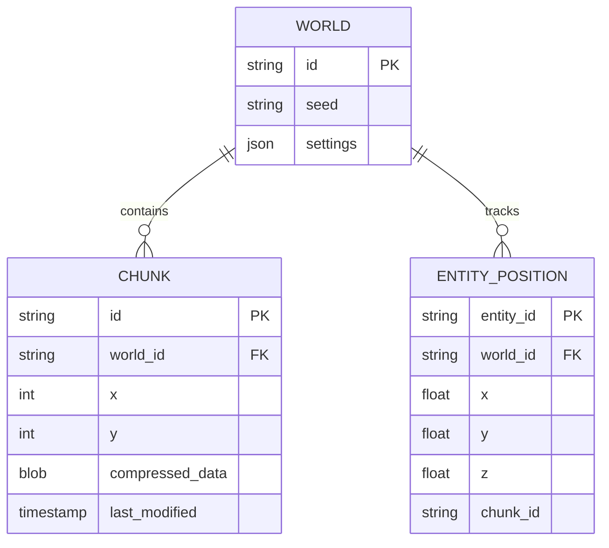

# Map System: Desired Features & Requirements

## Overview

The new Map System aims to eliminate the "Three-Headed Monster" by establishing a **Single Source of Truth** for the world state. It must be persistent, performant, and capable of handling dynamic entities (characters, structures) directly on the grid.

## Core Requirements

### 1. Single Generation, Multiple Views

We must generate the terrain **once** and store it. All three consumer contexts (Gameplay, Preview, Admin) must read from this single stored state.

- **Unified Generator**: The `@daicer/shared` logic matches exactly what is stored.
- **Preview**: Reads a "draft" version of the stored map.
- **Gameplay**: Reads the "committed" version of the stored map.
- **Admin**: Reads the same "committed" version.

### 2. Persistence (Terraformability)

The map must not be just a procedural seed. It must be a **database of tiles**.

- **Modifiable**: If a spell destroys a bridge, the tile at `(x,y,z)` changes from `Bridge` to `Air`. This change persists across reloads.
- **Fog of War State**: Each player needs to persist their explored chunks.
- **Delta Storage**: We don't need to store every grass tile if it matches the procedural seed, but we MUST store every modified tile.
- **Versioning**: The map should support versioning (e.g., "Pre-Cataclysm" vs "Post-Cataclysm").

### 3. Entity spatial Indexing (The "Pointer" System)

We need to query "Who is at (10, 10)?" efficiently without iterating through a list of 1000 entities.

- **Spatial Hash / Quadtree**: The backend should be able to return a list of entities within a viewport `{minX, minY, maxX, maxY}` in milliseconds.
- **Layering**: Entities exist on specific Z-levels (e.g., flying creatures at z=2, dwarves at z=-2).
- **Collision**: The system must enforce collision rules (e.g., Player cannot move to (10,10) because a Wall is there).

### 4. Performance & Reliability

The system must support "Infinite" worlds without crashing the browser or the server.

- **Chunking Strategy**:

  - **Network**: Send data in 16x16x7 chunks (Protocol Buffers or optimized JSON).
  - **Frontend**: Keep only active chunks in memory (LRU Cache). Drop chunks far from the player.
  - **Backend**: Stream chunks from DB. Do not load the entire world into Node.js memory.

- **Reliability Targets**:
  - **Zero "Black Maps"**: If a chunk fails to load, render a placeholder or retry, but never brick the rendering loop.
  - **Sync**: If Player A moves to (10,10), Player B sees them at (10,10) within <50ms (Socket.IO).

## Detailed Feature Set

### A. The "World Spine" Database

A specialized schema to store voxel data.

### B. The Unified API

A single set of endpoints for all consumers.

| Endpoint                        | Method | Purpose                                                 |
| :------------------------------ | :----- | :------------------------------------------------------ |
| `/api/map/:worldId/chunk/:x/:y` | GET    | Retrieve a specific 16x16 chunk (Sparse: Seed + Deltas) |
| `/api/map/:worldId/viewport`    | GET    | Retrieve all entities and dynamic tiles in a bbox       |
| `/api/map/:worldId/terraform`   | POST   | Modify specific tiles (DM/God Mode or specific spells)  |

### C. Client-Side Resilience

- **Optimistic Updates**: Render movement instantly, rollback if rejected by server.
- **Graceful Degradation**: If WebGL crashes, fallback to 2D Canvas (already partially implemented).
- **Offline Support**: Cache visited chunks in IndexedDB for instant load on refresh.

## User Experience Goals

1.  **"It Just Works"**: The DM creates a room, clicks "Generate", and gets a persistent map. No "Preview looks different from Game" bugs.
2.  **Immersive Persistence**: Players return to a dungeon a week later, and the door they broke is still broken.
3.  **Massive Scale**: Support for "Epic" size maps (1024x1024) without lagging the browser, by only loading what is seen.
4.  **Admin Power**: The Admin Panel allows the DM to paint tiles (edit map) in real-time.

## Success Metrics

- **Load Time**: < 1s for initial viewport.
- **Memory Usage**: < 200MB execution memory on Frontend for Large maps.
- **Sync Latency**: < 100ms for entity movement.
- **Storage Efficiency**: < 50MB for a fully exploring 1024x1024 map (using sparse storage).
