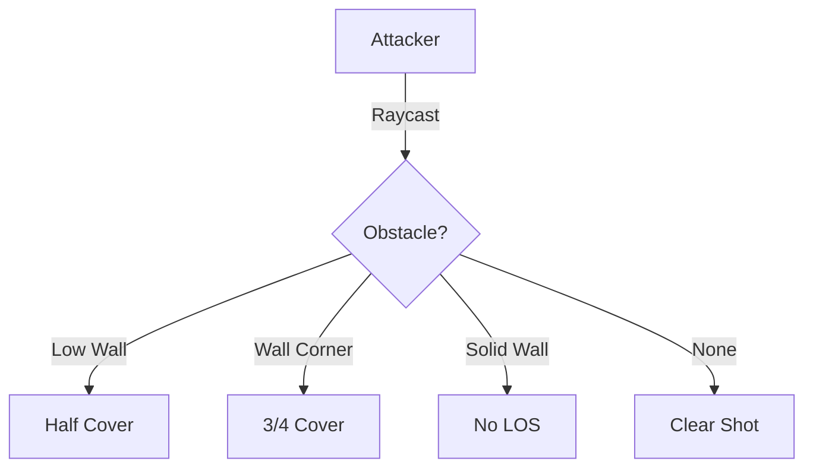

# Design Study 05: Tactical Combat System

This document details how the map's 3D and structural features directly impact combat mechanics, focusing on tactical depth, cover, and line of sight.

## 3D Line of Sight (LOS)

Combat in a 3D environment requires a robust LOS algorithm. We cannot simply raycast on a 2D plane.

### The Algorithm: Voxel Raycasting (Bresenham's 3D)

To check if Entity A can see Entity B:

1.  Draw a 3D line from A's `HeadPosition` `(x, y, z + 1.5)` to B's `CenterMass` `(x, y, z + 1)`.
2.  Traverse all voxels (tiles) intersected by this line.
3.  If any voxel is `opaque` (Wall, Closed Door, Dense Tree foliage), LOS is blocked.

### Cover System

Cover is calculated based on obstacles _partially_ blocking the entity.

- **Half Cover (+2 AC)**: A low wall (Fence, Barricade) exists between Attacker and Defender, but LOS is not fully blocked.
- **Three-Quarters Cover (+5 AC)**: Significant obstruction (Arrow slit, Corner of building).
- **Full Cover**: LOS blocked.

## Range and Elevation

### The Pythagorean Theorem in D&D

Distance in 3D is `sqrt(dx^2 + dy^2 + dz^2)`.

- **High Ground**: Attacking from `z+1` vs `z=0`. In some systems (homebrew/tactical), this yields Advantage. We should make this **Configurable** (Study 10).
- **Range Limits**: A Shortbow (80/320) shooting down from a 50ft tower. The hypotenuse distance matters.

## Flanking and Positioning

With the grid data, we can automate Flanking detection.

- **Logic**: If an ally is on the exact opposite side of the enemy, Flanking = True (Advantage).
- **Multi-Level Flanking**: Flying creatures or creatures on balconies can flank combatants below.

## Chat Integration: "I take cover!"

The NLP engine supports tactical intents:

> **Player**: "I run behind the bar and flip a table for cover!"
> **Interpretation**:
>
> 1. Move to tile behind Bar (Movement Physics).
> 2. Interact with `Table` object (State Change: `Table` -> `Table (Overturned)`).
> 3. `Table (Overturned)` has property `providesCover: true`.

This dynamic interaction requires the map objects to be interactable and mutable (Study 08).

## Area of Effect (AOE) Templates

Modeling fireballs and cones in 3D.

- **Sphere**: Standard Euclidean distance.
- **Cylinder**: Crucial for things like _Call Lightning_ (tall vertical cylinder) or _Flamestrike_.
- **Cone**: Defined by Origin, Vector, and Angle.
- **Verification**: The system must highlight affected tiles in the Frontend (Study 09) so players know who gets hit.

[Next: Character Progression](06_character_progression.md)
[Back: Movement & Physics](04_movement_and_physics.md)
