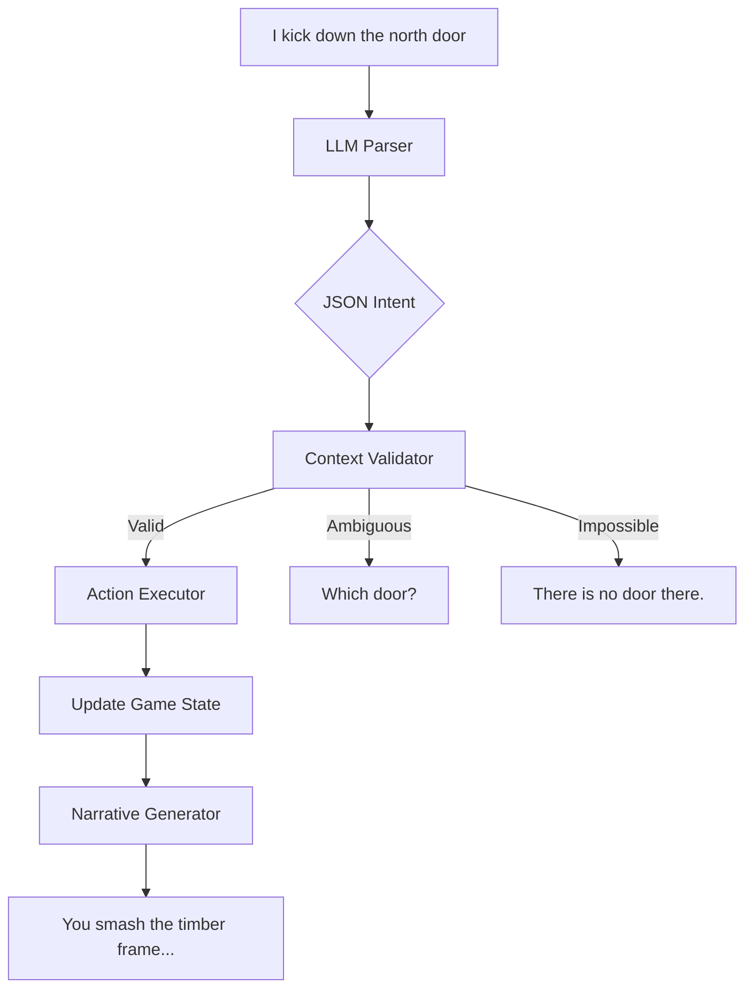

# Design Study 07: Natural Language Engine (NLP)

This document describes the bridge between User Chat (English/Spanish/Portuguese) and the rigid logic of the Game Engine (Grid, Combat, Physics).

## The Interpretation Pipeline

We need to parse intent + spatial context. "Open the door" is ambiguous. "Open the door in front of me" is specific.



### JSON Intent Schema

The LLM should output structured actions:

```json
{
  "action": "INTERACT",
  "target": {
    "type": "DOOR",
    "direction": "NORTH",
    "relative_distance": "ADJACENT"
  },
  "method": "FORCE",
  "tool": "FOOT"
}
```

## Spatial Context Injection

The LLM needs to know what the player sees to understand "The door".
We inject a **Context Prompt** into the LLM logic:

> "You are in a 10x10 room. To your North is a Wooden Door (Closed). To your East is a Table. There is a Goblin at (3,4)."

This context is generated by querying the `MapService` for entities within `LineOfSight`.

## Handling Complex Commands

> "I run to the table, jump over it, and stab the goblin."

This is a **Chained Action**.

1.  **Move**: Target = Table (adjacent).
2.  **Athletics Check**: DC 10 (Jump).
    - _If Fail_: Stop at table, Prone. End of Turn.
    - _If Pass_: Move to tile past table.
3.  **Attack**: Target = Goblin. Roll to hit.

The Engine must serialize this sequence. If an early step fails, the subsequent steps are aborted or modified.

## Multilingual Support

The NLP engine must support the user's native language.

1.  **Input Translation**: (Optional) Translate inputs to English for standardized processing.
2.  **Native Processing**: Better yet, fine-tune prompts to accept Spanish/Portuguese directly and output the standardized JSON intent.
    - Input: _"Abro la puerta"_
    - Intent: `{"action": "OPEN", "target": "DOOR"}` (Standardized code remains English)
3.  **Output Generation**: The narrative response is generated in the user's language.

## Chat-to-Map Visuals

When the NLP describes "A dark, ominous fog rolls in", the engine should trigger a visual effect:

- `MapService`: Update `Room.worldConditions` adding `Fog`.
- `Frontend`: Render particle effect `Fog` on the canvas.

This creates a loop: Map -> Context -> Turn -> Narrative -> Map Update.

[Next: Data Persistence Schema](08_data_persistence_schema.md)
[Back: Character Progression](06_character_progression.md)
