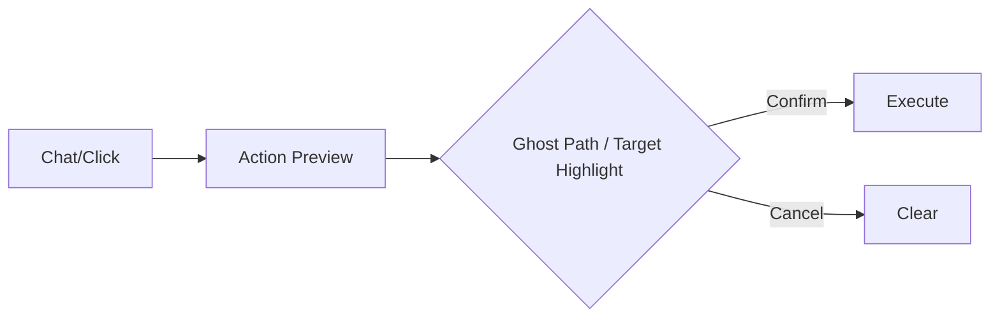

# Design Study 09: Frontend Visual Feedback & UX

Rendering a complex 3D world on a HTML5 Canvas (likely 2.5D or Top-Down) presents unique UX challenges. This study focuses on legibility, vertical awareness, and user interface.

## The Rendering Pipeline

We continue with the `Canvas API` (as used in `GridMapRenderer`) but enhance it for "2.5D" layering.

### The Painter's Algorithm

To handle verticality, we must draw back-to-front, bottom-to-top.

1.  **Layer -1 (Basement)**: Draw with darken filter (if visible through hole).
2.  **Layer 0 (Ground)**: Draw terrain tiles.
    - Draw Features (Trees, Walls) sorted by Y-coordinate to handle overlap/perspective fakery.
3.  **Layer 1 (Upstairs)**: Draw only if the player is on this level or looking up?

### "Slicing" and Fading

When the Player is on `Z=0` (Ground Floor), rooftops at `Z=1` block the view.

- **UX Rule**: If Player Z < Structure Z, fade out the blocking structure (Cutaway View).
- **UX Rule**: If Player Z > Structure Z, render the structure's roof (opaque).

## Visualizing Height

How do we show a cliff or a pit in 2D?

- **Depth Shading**: Lower Z-levels are tinted blue/dark. Higher Z-levels are tinted yellow/bright.
- **Parallax**: (Optional) Slight movement of layers at different speeds when panning.
- **Icons**: A "Stairs Up" icon on a tile is critical. Hovering it should show a tooltip "To 2nd Floor".

## Integrated Chat & Map UX

The user requested "Chat input and output guided with the map as visual guidance".

**Features**:

1.  **Click-to-Reference**:
    - Player clicks a Goblin on the map.
    - Chat input populates: `I attack [Goblin A]`.
    - This removes ambiguity for the NLP engine.
2.  **Highlighting**:
    - Chat output: "The _northern door_ glows ominously."
    - Map: The door entity flashes purple.
3.  **ghosting**:
    - Player types: "I want to move to the fountain."
    - Map: Shows a ghost path (A\*) texturing the route.
    - Player presses Enter to confirm.

## Graphic Design & "Premium" Feel

To meet the "Wow" factor:

- **Dynamic Lighting**: Canvas `globalCompositeOperation` for simple radial lights around torches/players.
- **Particle Effects**: Rain, fog, spell effects overlaid on the canvas.
- **Smooth Transitions**: Interpolated movement (tweening) for tokens, not instant teleportation.

[Next: Game Master Tools](10_game_master_tools.md)
[Back: Data Persistence Schema](08_data_persistence_schema.md)
