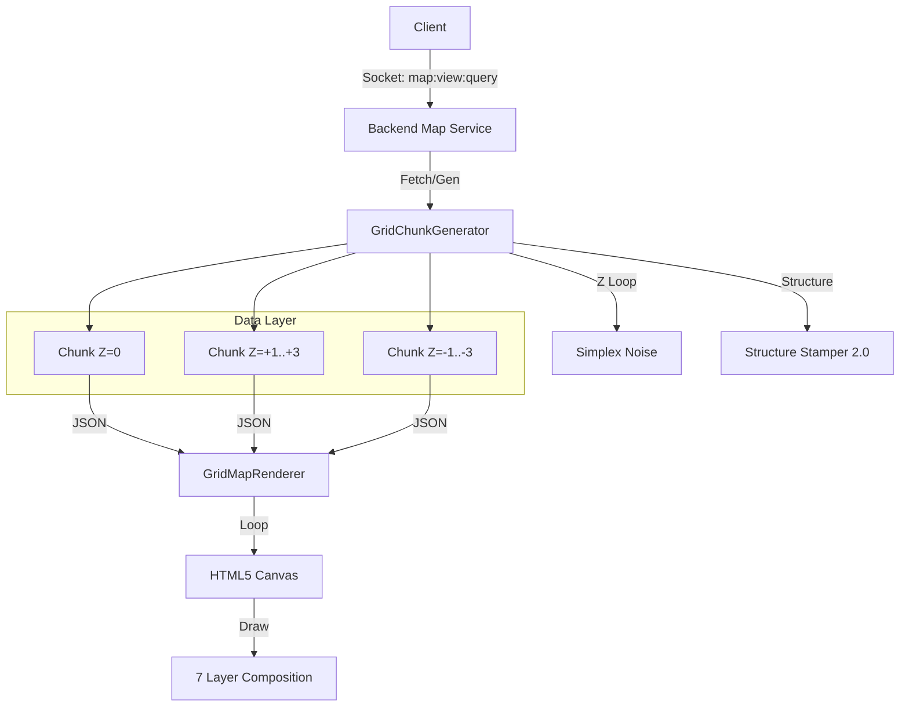

# Phase 1: The Vertical World (Technical Specification)

**Objective**: Transition the game from a 2D grid to a fixed 7-layer 3D voxel-lite system (`Z = -3` to `+3`), enabling true verticality, rendering, and data persistence.

## 1. Architecture Overview



## 2. Backend Implementation

### 2.1 Refactor `GridChunk` Schema

**File**: `shared/world/grid-chunk-schema.ts`
The current schema supports `z`, but the generation pipelines treat `z=0` as special. We must formalize the 7-layer standard.

```typescript
// New Z-Level Enum for strict typing
export type GridLayer = -3 | -2 | -1 | 0 | 1 | 2 | 3;

export const GridChunkSchema = z.object({
  // ... existing fields ...
  z: z.union([z.literal(-3), z.literal(-2), z.literal(-1), z.literal(0), z.literal(1), z.literal(2), z.literal(3)]),
  // ...
});
```

### 2.2 Update `GridChunkGenerator`

**File**: `backend/src/services/world-gen/grid-chunk-generator.ts`

**Core Logic Change**:
The current `generateTile` function mixes elevation calculation with strict Z-checks. We will separate this into specific Layer Generators.

- **Z=0 (Surface)**: Uses Elevation Noise -> Biome Mapping.
- **Z<0 (Underground)**:
  - If `Z > Elevation`: Air (Cave/Tunnel).
  - If `Z <= Elevation`: Stone/Ore.
  - **Logic**: `CaveNoise` becomes the primary driver.
- **Z>0 (Sky)**:
  - Default: Air.
  - **Logic**: Only contains blocks if a `Structure` (Sky Castle) or `Feature` (Cloud) is stamped.

**Code Structure**:

```typescript
function generateTile(x, y, z, params) {
  // 1. Calculate Ground Height (Heightmap)
  const groundZ = Math.floor(params.elevation * 10); // e.g. Mountain = +2

  // 2. Default Block Logic
  if (z === groundZ) return SurfaceBlock(biome);
  if (z < groundZ) return UndergroundBlock(biome, depth);
  return AirBlock();
}
```

### 2.3 Structure Stamper 2.0

**File**: `backend/src/services/world-gen/structure-stamper.ts`

**Foundation Logic**:
When a structure is placed at `Z=0` but the terrain `groundZ = -1`, the stamper must generate a "Foundation" to prevent floating buildings.

```typescript
function stampStructure(chunk, structure) {
  // ... existing overlap logic ...

  for (const tile of structure.tiles) {
    // Stamp the actual building block
    setTile(chunk, tile);

    // CHECK FOUNDATION
    if (tile.isGroundFloor) {
      let currentZ = tile.z - 1;
      while (currentZ >= chunk.groundZ && currentZ >= -3) {
        setTile(chunk, { x, y, z: currentZ, type: 'cobblestone_foundation' });
        currentZ--;
      }
    }
  }
}
```

## 3. Frontend Implementation

### 3.1 Layered Rendering Loop

**File**: `frontend/src/components/world/GridMapRenderer.tsx`
**Current State**: Renders only `currentLayer`.
**New State**: Must render a "depth stack" to visually support looking down or up.

**Algorithm**:

1.  **Define Render Range**: `[currentLayer - 2, currentLayer + 1]` (Configurable).
2.  **Painter's Algorithm**: Draw from bottom (lowest Z) to top (highest Z).
3.  **Opacity/Tint**:
    - `Layer < Current`: Darker (+0.2 black tint per layer).
    - `Layer > Current`: Translucent (0.3 opacity) if blocking view.

```typescript
// Render Loop
for (let z = minVisibleZ; z <= maxVisibleZ; z++) {
  const alpha = z === currentLayer ? 1.0 : z > currentLayer ? 0.3 : 1.0;
  const brightness = z < currentLayer ? 0.5 : 1.0;

  ctx.globalAlpha = alpha;
  ctx.filter = `brightness(${brightness})`;

  drawLayer(ctx, z); // Re-use existing drawChunk logic
}
```

### 3.2 "Ghost" Entity Rendering

When `Entity.z !== currentLayer`:

- If `Entity.z < currentLayer` (Below): Render with `brightness(0.5)` and small scale (0.8x) to simulate distance.
- If `Entity.z > currentLayer` (Above): Render as semi-transparent "Ghost" icon.

## 4. Testing & Validation

### 4.1 Unit Tests

- `generateGridChunk`: Verify `Air` blocks generated correctly at `Z=3`.
- `structureStamper`: Test "Hill House" scenario (House at Z=1, Terrain at Z=0 -> Foundation generated?).

### 4.2 Visual Verification

- Create a "Vertical Debug Room".
- Manually place blocks at `(0,0,0)`, `(0,0,1)`, `(0,0,-1)`.
- Toggle `currentLayer` from -1 to 1 and verify visual stacking (Parallax/Tinting).

## 5. Migration Strategy

1.  **Stop-the-world**: The chunk schema change breaks existing persistent worlds.
2.  **Wipe**: Delete all existing `grid_chunks` in Firestore.
3.  **Deploy**: Push new Generator & Renderer.
4.  **Regen**: New chunks generated on demand will follow the 7-layer system.
