# Phase 3: DM Agent & NLP (Technical Specification)

**Objective**: Empower the AI Dungeon Master (`TacticalDMAgent`) to act as the "Storyteller of Physics", translating user intent into strict game actions and narrating results.

## 1. Architecture Overview

```mermaid
sequenceDiagram
    participant User
    participant NLP as Intent Parser
    participant TM as Turn Manager
    participant NG as Physics (NavGraph)
    participant DM as DM Agent (LLM)

    User->>NLP: "I run to the goblin and attack!"
    NLP->>TM: Intent: { Move(GoblinPos), Attack(Goblin) }

    rect rgb(20, 20, 20)
        Note over TM, NG: Verification Layer
        TM->>NG: isValidMove(UserPos, GoblinPos)?
        NG-->>TM: Valid (Cost: 15ft)
    end

    TM->>DM: Execute(Action, Context)
    DM->>DM: Roll Dice (Attack)
    DM-->>TM: Result: { Damage: 5, Desc: "You slash the goblin!" }
    TM->>User: Update State + Show Speculative Action
```



## 2. NLP & Intent Parsing

### 2.1 The Context Window Strategy

**Refactor**: `backend/src/graph/nodes/turn-processing.ts`

**Constraint**: "50 Turns Context" (QA #50).
Sending 50 full JSON turns to an LLM is too expensive. We implement a **Sliding Summary Window**.

- **Turns 1-40**: Compressed into `previous_narrative_summary` (String).
- **Turns 41-50**: Raw JSON (`Action`, `Result`, `Rolls`).
- **Current Turn**: User Input.

**LangChain Logic**:

```typescript
const history = [
  SystemMessage(staticWorldPrompt),
  HumanMessage('Summary of last 40 turns: ' + summary),
  ...recentTurns.map((t) => HumanMessage(t.userAction) + AIMessage(t.dmResponse)),
  HumanMessage(currentUserInput),
];
```

### 2.2 Intent Parser (The "Pre-Brain")

Before the DM "Thinks", we parse the raw text into structured intent using a smaller, faster model (or function calling).

**Input**: "I want to cast Fireball on the group of orcs."
**Output**:

```json
{
  "type": "CAST_SPELL",
  "spell": "Fireball",
  "target": "Orc Group",
  "approx_location": { "x": 10, "y": 15, "z": 0 }
}
```

## 3. The Tactical DM Agent

**Enhancement**: `backend/src/agents/tacticalDM.ts`

### 3.1 Strict Tool Integration

The current `tacticalDM.ts` has tools like `move_character`. We must wrap these to enforce Phase 2 Physics.

**Modified Tool**: `move_character`

```typescript
const moveCharacterTool = tool(async ({ characterId, x, y }) => {
  // 1. CALL PHYSICS ENGINE
  if (!NavGraph.isValidMove(char.pos, { x, y })) {
    return 'Move Failed: Path Blocked or Too Far.';
  }

  // 2. EXECUTE
  await db.updatePosition(char.id, { x, y });
  return 'Moved successfully.';
});
```

### 3.2 Hallucination Handling (QA #52)

**Constraint**: "We don't prevent hallucination" but "Players can't change map".

If the DM says "You find a chest" (Hallucination) but the map has no chest:

1.  **Narrative Truth**: The users _believe_ there is a chest.
2.  **System Truth**: No `Entity` exists.
3.  **Resolution**: The DM Agent records a "Temporary Narrative Asset" in memory, or simply narratively handles the "opening" of the imaginary chest (finding imaginary loot that _then_ becomes real in the inventory).

## 4. Turn Cycle Integration

**Refactor**: `backend/src/game-loop/turn-manager.ts`

The DM Agent is invoked _inside_ the Turn Loop logic:

1.  **Player Turn**:
    - Waits for User Input.
    - Parses Intent.
    - DM Agent executes Intent (Move/Attack).
    - **Summarize**: DM generates "Result Description".
2.  **NPC Turn (Automated)**:
    - DM Agent _decides_ Intent ("Goblin moves to Player").
    - DM Agent executes own Intent.

## 5. Testing & Validation

### 5.1 Intent Accuracy

- **Test Set**: 50 common phrases ("Attack", "Run", "Hide", "Cast").
- **Metric**: % correctly mapped to Zod Schema.

### 5.2 Context Window

- **Simulate**: 100 turns of "Attack".
- **Verify**: Token count remains stable (due to summarization) and doesn't crash the LLM context limit.

### 5.3 Physics Enforcement

- **Scenario**: User says "I fly to the moon" (Invalid Move).
- **Expected**: DM Agent returns "You flap your arms but remain grounded." (Tool rejection handling).
