# Architecture: The Sandwich Pipeline (Turn Orchestration)

> **Context**: The "Sandwich" architecture ensures deterministic turn processing.
> **Philosophy**: Logic ("Meat") wrapped in Safety & Persistence ("Bread").
> **Source Logic**: `src/api/game/services/turn-pipeline.ts`

## 1. The Architectural Imperative

The **Sandwich Pipeline** enforces a rigid lifecycle (Lines 48-270) to prevent **State Desynchronization**. If the server fails mid-process, the **Atomic Transaction** (Lines 114-148) ensures the database rolls back.

## 2. Sequence Diagram (The 8 Stages)

```mermaid
sequenceDiagram
    autonumber
    participant Client as User Client
    participant GQL as GraphQL Gateway
    participant Pipe as TurnPipeline
    participant Lock as LockService (The Guardian)
    participant Engine as ActionEngine (The Heart)
    participant DB as Postgres (The Archive)
    participant Snap as SnapshotService (Timeline)
    participant AI as NarrativeEngine (Voice)

    Note over Client, GQL: 1. Intent Phase
    Client->>GQL: Mutation processRoomTurn()
    GQL->>Pipe: Execute Pipeline (L48)

    Note over Pipe, Lock: 2. Guardian Phase
    Pipe->>Lock: acquireLock(roomId) (L54)
    alt is Locked
        Lock-->>Pipe: Error 429
        Pipe-->>Client: Retry-After
    end

    Note over Pipe, Engine: 3. Resolution Phase
    Pipe->>Engine: dispatch(commands, dryRun=true) (L91)
    Engine-->>Pipe: Return { StateDiff, Events }

    Note over Pipe, DB: 4. Persistence Phase
    rect rgb(30, 0, 0)
        Note right of Pipe: ATOMIC TRANSACTION START (L114)
        Pipe->>DB: Apply StateDiff (L116)
        Pipe->>DB: Insert GameEvents (L124)
        Pipe->>DB: Create Turn Record (L133)
        
        alt SQL Error
            DB-->>Pipe: ROLLBACK (Auto)
            Pipe-->>Client: Error 500
        else Success
            DB-->>Pipe: COMMIT (L148)
        end
    end

    Note over Pipe, Snap: 5. Timeline Phase
    Pipe->>Snap: createSnapshot (L175)
    Snap->>DB: Save TimeFrame

    Note over Pipe, AI: 6. Narration Phase
    Pipe->>AI: generateResponse (L226)
    AI-->>DB: Insert Message (L247)

    Note over Pipe, Client: 7. Passive Sync
    Pipe->>Lock: releaseLock(roomId) (L269)
    Pipe-->>GQL: Success
    GQL-->>Client: 200 OK
```

## 3. Deep Dive: The Atomic Commit

**Stage 4 (Persistence)** is the crash-proof mechanism.
- **Code**: `src/api/game/services/turn-pipeline.ts` lines 114-148.
- **Mechanism**: `strapi.db.transaction` wraps three distinct write operations.
    1.  **State Updates**: Iterates `allDiffs.updates` and applies them (L116).
    2.  **Event Log**: Bulk creates `game-event` entries (L124).
    3.  **Turn Seal**: Creates a `turn` record linked to the events (L133).

**Critical Safety**: If `Create Turn` fails (e.g., ID collision), the `State Updates` are REVERTED. The player does not take damage if the system cannot record *why*.
