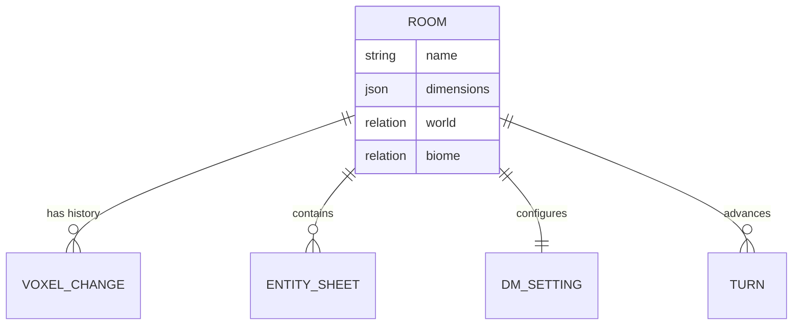
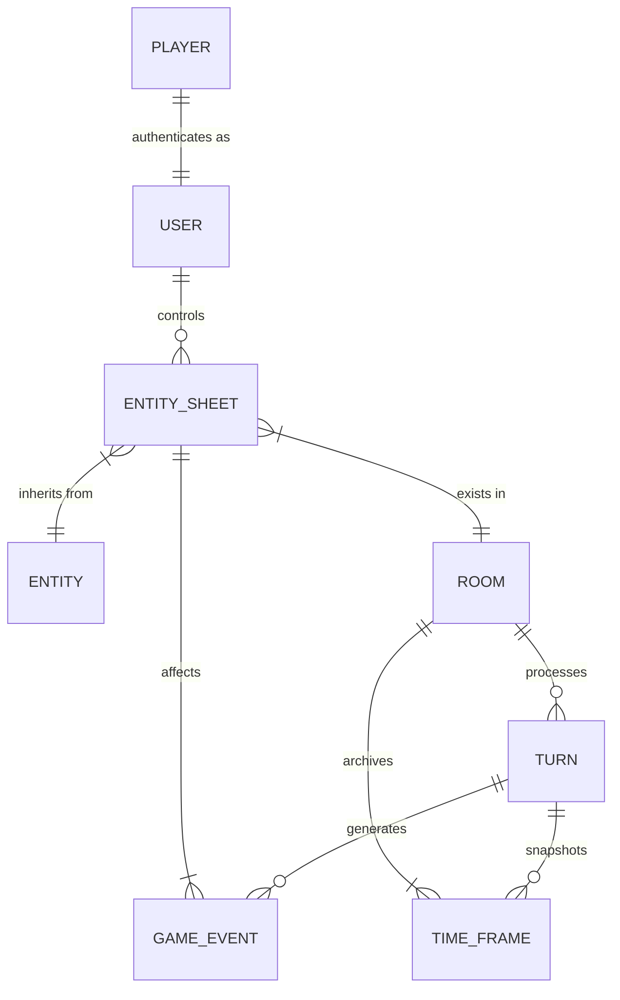

# Database Schema Registry

> **Status**: Verified Jan 2026.
> **System**: PostgreSQL 16 via Strapi 5 Documents API.
> **Source**: `src/api/*/content-types/*/schema.json`

## 1. Core Entity Model (`api::entity.entity`)

The "Blueprint" that defines what things *are*.

| Field | Type | Description | Relations |
| :--- | :--- | :--- | :--- |
| `documentId` | UUID | Unique Global ID (Strapi 5 native). | |
| `name` | String | Display Name ("Ancient Red Dragon"). | |
| `type` | Enum | `monster`, `player`, `npc`, `flora`. | |
| `compilation_state` | Component | Verification status of the data. | |
| `features` | DynZone | Mechanical abilities (Spells, Resistances). | |
| `tags` | Relation | Categorization tags. | `api::tags.tag` (m:n) |

## 2. The Runtime Instance (`api::entity-sheet.entity-sheet`)

The "Mutable State" of an entity in the world.
**Source**: `src/api/entity-sheet/content-types/entity-sheet/schema.json`

| Field | Type | Data Structure | Notes |
| :--- | :--- | :--- | :--- |
| `inventory` | Component | `repeatable: true`, `component: game.inventory-item` | **Not a Relation**. Affects UX complexity. |
| `stats` | Component | `{ hp, maxHp, ac }` | Nested Component. |
| `position` | Component | `{ x, y, z, r }` | Mutable 3D coordinates. |
| `entity` | Relation | `manyToOne` -> `api::entity.entity` | Link to Blueprint. |
| `room` | Relation | `manyToOne` -> `api::room.room` | Spatial Container. |

## 3. The Grid (`api::room.room`)

The Container of Reality.

## 4. The Event Log (`api::game-event.game-event`)

The immutable history of truth.

| Field | Type | Description |
| :--- | :--- | :--- |
| `type` | Enum | `DAMAGE`, `HEAL`, `MOVE`, `NARRATIVE`. |
| `turn` | Relation | The specific turn transaction ID. |
| `source` | Relation | The EntitySheet that acted. |
| `targets` | Relation | The EntitySheets affected. |
| `payload` | JSON | Schema-less payload (e.g., `{ damageType: 'fire', rolled: 18 }`). |

## 5. Flow of Data (ERD)

