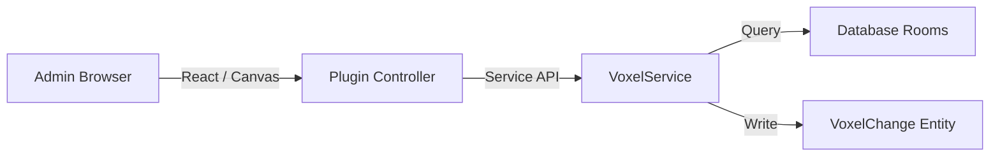

# Plugin Ecosystem & Extensions

> **Status**: Active / Production
> **Architecture**: Strapi 5 Plugin API

## 1. `map-explorer`: The Voxel Engine Frontend

This plugin is the "Crown Jewel" of the Admin UI. It bypasses the standard Content Manager to provide a true 3D Editor.

### Architecture

### Key Components
1.  **Voxel Canvas**: A React component rendering the 32x32px grid.
2.  **Tools**:
    - **Brush**: Paint terrain (Grass, Stone).
    - **Eraser**: Revert to void.
    - **Entity Placer**: Drag & Drop entities.

## 2. `queue-dashboard`
Security-hardened wrapper around `@bull-board`. Protected by Strapi RBAC to ensure only Admins can view the background workers.

## 3. `semantic-search`
The RAG Brain. Handles vector embedding (via Google `text-embedding-004`) and retrieval of knowledge snippets for the Narrative Engine.
