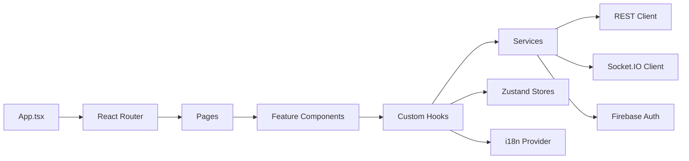

# Daicer Frontend

<p align="center">
  
</p>

<p align="center">
  <a href="https://github.com/lguibr/daice/actions/workflows/ci.yml?query=branch%3Amain"></a>
  <a href="https://github.com/lguibr/daice/releases"></a>
  
  
  
  
  
</p>

React + TypeScript client that renders the AI-driven tabletop experience: world creation, real-time narrative, and tactical combat.

---

## TL;DR

- Built with **React 19**, **Vite**, **Tailwind**, and **React Router**.
- Syncs with backend via REST and long-lived **Socket.IO** channels.
- Internationalized (EN/ES/PT-BR) with runtime language switching.
- Strict TypeScript (`noImplicitAny`, `exactOptionalPropertyTypes`) and component-level tests via **Vitest**.

---

## Directory Map

```text
frontend/
├── src/
│   ├── components/      Feature + UI components (see nested READMEs)
│   ├── hooks/           Custom hooks (auth, socket, combat)
│   ├── services/        API/Firebase/socket clients
│   ├── state/           Zustand stores for UI state
│   ├── i18n/            Locales + providers
│   ├── pages/           Route-level screens
│   ├── types/           Shared frontend types (mirrors backend)
│   ├── constants/       UI + gameplay constants
│   ├── lib/             Utilities (formatters, guards)
│   ├── main.tsx         Vite entry point
│   └── App.tsx          Router + layout shell
├── public/              Static assets (logo, manifests)
├── index.html           Shell document
├── vite.config.ts       Build configuration
└── tailwind.config.js   Design tokens + presets
```

Key READMEs inside `src/components/*`, `src/hooks`, `src/services`, and `src/i18n` go deeper on feature areas.

---

## Architecture Overview



- Routing handled by React Router with data loaders per route.
- Persistent auth state from Firebase (Google Sign-In, emulator-friendly).
- Real-time events streamed into Zustand stores and distributed via hooks.
- Derived presentation logic lives in components, keeping hooks mostly side-effect focused.

---

## Local Development

```bash
# From repository root
yarn install:all

# Start frontend only (expects emulators + backend running)
yarn workspace @daicer/frontend dev

# Or start full stack from root
yarn dev
```

Additional scripts:

| Command          | Description                         |
| ---------------- | ----------------------------------- |
| `yarn build`     | Production build with Vite          |
| `yarn preview`   | Serve built assets locally          |
| `yarn lint`      | ESLint (Airbnb + React hooks rules) |
| `yarn format`    | Prettier write                      |
| `yarn typecheck` | `tsc --noEmit`                      |
| `yarn test`      | Vitest + Testing Library            |
| `yarn storybook` | Component catalogue                 |
| `yarn test:ui`   | Playwright smoke tests              |

---

## Environment Variables

Create `.env.local` in repo root to hydrate Vite:

```env
VITE_USE_EMULATORS=true
VITE_API_URL=http://localhost:3001
VITE_FIREBASE_PROJECT_ID=daicer-dev
VITE_FIREBASE_API_KEY=demo-key
VITE_FIREBASE_AUTH_DOMAIN=daicer-dev.firebaseapp.com
VITE_FIREBASE_STORAGE_BUCKET=daicer-dev.appspot.com
VITE_FIREBASE_MESSAGING_SENDER_ID=1234567890
VITE_FIREBASE_APP_ID=1:1234567890:web:abcdef123456
VITE_SOCKET_URL=http://localhost:3001
```

The dev server automatically reloads when `.env.local` changes.

---

## Routing & Flows

| Route              | Component           | Overview                                     |
| ------------------ | ------------------- | -------------------------------------------- |
| `/`                | `LandingPage`       | Marketing splash + Sign-in                   |
| `/`           | `LobbyScreen`       | Create/join rooms, view active games         |
| `/create`          | `WorldSettingsPage` | Configure world tone, theme, difficulty      |
| `/room/:id`        | `RoomShell`         | Hosts character creation + gameplay + combat |
| `/room/:id/combat` | `CombatScreen`      | Tactical grid + time travel                  |
| `/explore`         | `ExplorePage`       | SRD explorer with Firestore-backed data      |

State transitions rely on Socket events; fallback fetches come from REST endpoints when sockets reconnect. The explore archive reads from the Firestore emulator and shows placeholder icons while image URLs are curated.

---

## Styling & Design System

- Tailwind CSS with custom theme tokens (`aurora`, `nebula`, `midnight`).
- UI primitives live in `src/components/ui/` (Button, Card, Select, AnimatedBackground).
- Global dark mode; accessible contrast enforced for core components.
- Motion/animation opt-out via `prefers-reduced-motion`.

---

## Testing & QA

```bash
# Unit + component tests
yarn test frontend

# Watch mode
yarn test --watch

# Coverage
yarn test --coverage

# E2E (Playwright)
yarn workspace @daicer/frontend test:e2e
```

Testing stack:

- Vitest + Testing Library for components/hooks.
- Mock Service Worker for API mocking.
- Playwright for auth + gameplay happy-path flows.
- Storybook for visual regression (Chromatic pending).

---

## Accessibility & Internationalization

- ARIA-first approach with `getByRole({ name })` selectors used in tests.
- Language switching provided by `src/i18n/provider.tsx`; persists to localStorage.
- Strings organized by domain (`lobby.*`, `gameplay.*`, etc.). See `src/i18n/README.md`.
- Focus management on route transitions handled via `useFocusRestore`.

---

## Observability & Debugging

- Debug panel (`Ctrl+D`) renders real-time socket traffic, combat timeline, and LangGraph traces.
- Dev overlay for grid coordinates to validate combat geometry.
- Use Vite's `--host` flag for device testing (`yarn dev --host`).
- Storybook showcases edge cases and design tokens.

---

## Contributing Checklist

1. Add component-level tests beside the component (`Component.spec.tsx`).
2. Update relevant feature README.
3. Run `yarn qa frontend`.
4. Document new routes or env vars in this file.

See `CONTRIBUTING.md` for repo-wide guidance.

---

## References

- `backend/README.md` — backend counterpart.
- `frontend/src/components/README.md` — component architecture.
- `frontend/src/services/README.md` — API/socket clients.
- Root `README.md` — holistic project overview.
