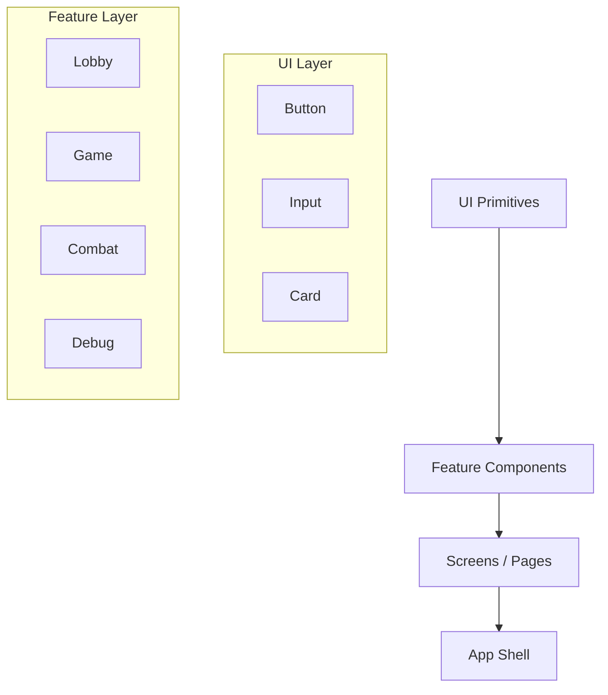

# Component System

Feature-first component tree that renders the entire Daicer player experience across lobby, narrative, and combat flows.

---

## Layering



- **UI Primitives (`components/ui/`)**: Tailwind + Radix-based building blocks.
- **Feature Bundles (`components/<feature>/`)**: Domain-specific composites (game, combat, auth).
- **Screens (`pages/`)**: Route-level containers that coordinate state and routing.

Each feature folder includes a README describing component contracts and data flow.

---

## Naming & Structure

```
components/
├── auth/
│   ├── LoginScreen.tsx
│   └── README.md
├── combat/
│   ├── CombatGrid.tsx
│   ├── CharacterCard.tsx
│   ├── ...
│   └── README.md
├── game/
│   ├── GameplayScreen.tsx
│   ├── CombatScreen.tsx
│   └── README.md
├── ui/
│   ├── button.tsx
│   ├── card.tsx
│   └── README.md
└── DebugPanel.tsx
```

Folder rules:

- Co-locate styles (`*.css` or Tailwind modules), tests (`*.spec.tsx`), and stories (`*.stories.tsx`).
- Barrel export within folder (`index.ts`) to simplify imports.
- Keep default exports for route-level screens and named exports for reusable child components.

---

## Props & Typing

- Define prop interfaces in the same file (`interface CombatGridProps`).
- Prefer `Readonly` wrappers for nested objects to prevent accidental mutation.
- For shared types, import from `@/types` instead of redefining.

Example:

```typescript
export interface PlayerSummary {
  readonly id: string;
  readonly displayName: string;
  readonly isReady: boolean;
}

export function PlayerSidebar({ players }: PlayerSidebarProps) {
  // ...
}
```

---

## Styling

- Use Tailwind utility classes; abstract repeated patterns into `cn()` helpers or UI primitives.
- Respect design tokens from `tailwind.config.js` (`aurora`, `nebula`, etc.).
- Avoid inline styles except for dynamic CSS variables.
- Animation defaults should check `prefers-reduced-motion`.

---

## Testing & Storybook

```bash
yarn test frontend/src/components
yarn storybook
```

- Tests live next to the component (`Component.spec.tsx`), use Testing Library.
- Favour `getByRole` selectors to mirror accessibility expectations.
- Storybook stories (`Component.stories.tsx`) document state permutations; include controls when feasible.
- For complex interactions, add visual regression stories to `__stories__` with annotations.

---

## Accessibility

- Ensure keyboard focus states are visible and intuitive.
- Use semantic HTML tags (list, nav, section) where appropriate.
- Provide `aria-live` regions for dynamic narration updates.
- Run `yarn lint --max-warnings=0` to catch accessibility lint rules.

---

## Debugging Utilities

- `DebugPanel` toggled with `Ctrl+D` overlays socket traffic, state snapshots, and LangGraph traces.
- Place temporary development helpers in `components/debug/` and guard rendering behind `import.meta.env.DEV`.

---

## Adding a Component

1. Identify target layer (UI primitive vs feature-level).
2. Create component file + test + story.
3. Update folder README if the component changes the public API.
4. Export via `index.ts`.
5. Drop a `FIXME` or `TODO` comment only with ticket references.
