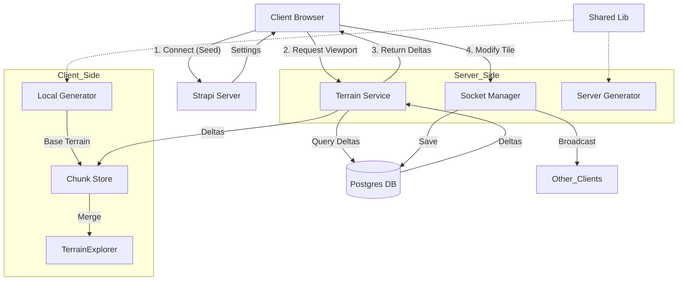

# Map System: Implementation Plan

## Executive Summary

We will refactor the Daicer Terrain System to use a "Seed + Delta" architecture. This involves creating a new `TerrainService` in the backend that manages persistent chunks in Postgres, and a new `ChunkManager` in the frontend that merges local procedural generation with server-side deltas.

## Tech Stack Decisions

- **Database**: PostgreSQL (Existing).
- **Schema**: `MapChunk` entity with `jsonb` for delta storage.
- **API**: Hybrid.
  - **REST/GraphQL** for initial viewport hydration (GET).
  - **Socket.io** for real-time updates (Terraforming).
- **Frontend State**: `Zustand` store for Chunk Management (replacing simple React State).
- **Shared Logic**: `@daicer/shared` is the absolute source of truth for generation algorithms.

## Architecture

## Implementation Phases

### Phase 1: The Core (Backend)

1.  **Schema Definition**: Create `MapChunk` Content Type.
2.  **Service Layer**: exact duplicate of `simple-gen.ts` logic wrapped in a service that checks DB first.
3.  **API**: `GET /terrain/chunk/:x/:y`.

### Phase 2: The Consumer (Frontend)

1.  **Zustand Store**: Create `useTerrainStore`.
2.  **Hydration Logic**: `fetchDeltas(viewport) -> merge(procedural(viewport))`.
3.  **Renderer Update**: Point `TerrainExplorer` to read from `useTerrainStore` instead of `grid3D` prop.

### Phase 3: The Persistence (Terraforming)

1.  **Mutation**: `modifyTile(x, y, z, newType)`.
2.  **Optimistic UI**: Update store immediately.
3.  **Broadcasting**: Socket event `map:update`.

### Phase 4: Entity Integration

1.  **Spatial Index**: `EntityPosition` table or JSONB index.
2.  **Viewport Query**: `getEntities(minX, maxX, ...)`

## Best Practices

### 1. "Never Block the Main Thread"

- **Web Workers**: The procedural generation is CPU intensive. Move `Gen_C` (Local Generator) to a Web Worker.
- **Time Slicing**: If generating 100 chunks, do 5 per frame, not all at once.

### 2. "Trust the Seed"

- Never minimize the client's ability to recalculate state. Don't send data the client can figure out itself (e.g., "This is a forest"). Only send exceptions ("This forest tile is now a crater").

### 3. "Defensive Rendering"

- If a chunk is missing (network error), render a wireframe box or "Void Fog". Do not crash.
- `TerrainExplorer` must handle `undefined` tiles gracefully (already patched, but keep enforcing).

### 4. "Idempotent Deltas"

- Updates should be "Set tile X to Stone", not "Change tile X". If we receive the same update twice, the result is the same (Convergence).

## Risk Assessment

| Risk                  | Impact | Mitigation                                                                   |
| :-------------------- | :----- | :--------------------------------------------------------------------------- |
| **Data Migration**    | High   | Old maps are not compatible. Enforce "New Room" for V2 maps.                 |
| **Worker Complexity** | Medium | Web Workers can be tricky with bundling. Use Comlink or similar abstraction. |
| **DB Bloat**          | Low    | `jsonb` is efficient. Use strict pruning for abandoned rooms.                |

## Timeline Estimate

- **Week 1**: Shared Lib Audit & Backend Schema.
- **Week 2**: Frontend Store & Web Worker.
- **Week 3**: Renderer Integration & Socket Updates.
- **Week 4**: Entity indexing & Optimization.
