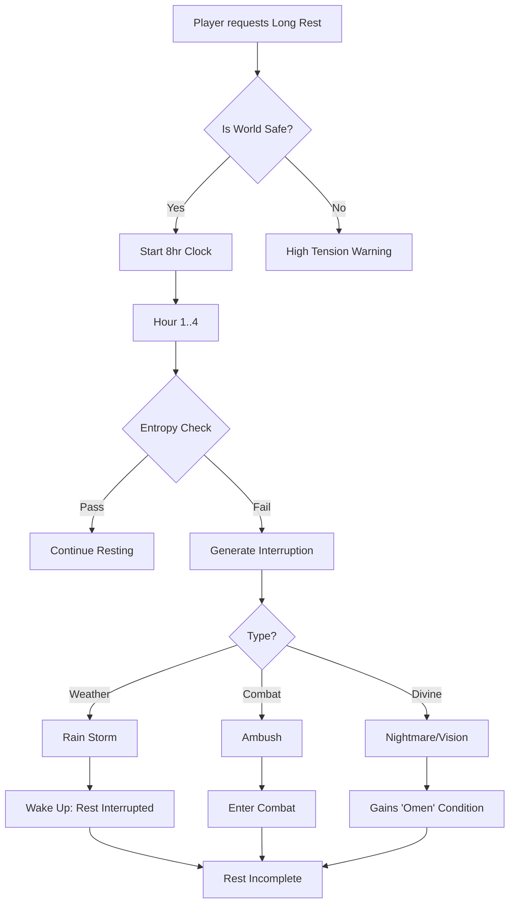

# Entropy System Design

## 1. Concept: The "Chaos Accumulator"

The **Entropy System** is a narrative pacing engine designed to ensure the world feels alive, unpredictable, and sometimes hostile. It prevents the game from becoming a static "menu simulator" by injecting dynamic events based on the passage of time and player actions.

At its core, it is a **Probability Accumulator**:

- **Peace is unstable**: The longer nothing happens, the higher the chance something _will_ happen.
- **Action generates noise**: Traveling, loud combat, and magical mishaps increase entropy faster.
- **Release valve**: When an event triggers (Entropy Event), the pool resets or decreases, restoring temporary calm.

## 2. Core Components

### 2.1 The Entropy Pool

A numeric value (0-100+) representing the current "tension" or "chaos potential" of the local region.

- **Base Rate**: +1 per Hour passed.
- **Travel Rate**: +1 per Mile traveled / +5 per Hour traveled.
- **Danger Multiplier**: Dangerous regions (dungeons, cursed lands) have 2x or 3x multipliers.

### 2.2 Thresholds & Triggers

Events are triggered when a roll (d100) is made against the current Entropy Pool.

- **Check Frequency**: Every time significant time passes (e.g., 4 hours, Long Rest, Travel segment).
- **Trigger**: If `d100 < EntropyPool`, an event occurs.
- **Crit Fail**: If `d100` is naturally 1, a **Major Event** occurs regardless of pool.

## 3. Event Categories (The "Weird Stuff")

The system dispatches events based on context tags (Location, Biography, Current State).

| Category           | Flavor              | Examples                                                               |
| :----------------- | :------------------ | :--------------------------------------------------------------------- |
| **Environmental**  | Weather & Terrain   | Sudden rainstorm (interrupts rest), Landslide, Fog blocking vision.    |
| **Divine**         | Gods & Favor        | A deity is offended by a recent action, Shrine found, Omen observed.   |
| **Encounter**      | Travel & Danger     | Bandit ambush, Wandering monster, Merchant caravan in distress.        |
| **State**          | Personal & Internal | Exhaustion sets in mysteriously, Equipment breaks, Old wound aches.    |
| **High Weirdness** | Magic & Anomaly     | Gravity fluctuates, Time skips, Local reality glitch (Entropy Spikes). |

## 4. Integration with Time System

The Entropy System is a **Passenger** on the Time System bus. It listens for `TimePassed` events.

```mermaid
sequenceDiagram
    participant GameLoop
    participant TimeSystem
    participant EntropySystem
    participant Narrator(LLM)
    participant Engine

    GameLoop->>TimeSystem: AdvanceTime(4 Hours)
    TimeSystem->>EntropySystem: OnTimePassed(4 Hours, Context=Travel)

    EntropySystem->>EntropySystem: AddEntropy(Base * 4)
    Note right of EntropySystem: Pool goes from 20 -> 24

    EntropySystem->>EntropySystem: CheckTrigger()

    rect rgb(50, 20, 20)
        Note over EntropySystem: Roll d100 vs 24. Result: 12 (HIT)
        EntropySystem->>EntropySystem: SelectEventTable("Wilderness")
        EntropySystem-->>Engine: Dispatch(Event: HeavyRain)
    end

    Engine->>Narrator(LLM): Context: "Heavy Rain started."
    Narrator(LLM)-->>GameLoop: "Dark clouds gather abruptly..."

    Engine->>Engine: ApplyEffect(Wet, DifficultTerrain)
```

## 5. Integration with Dreaming & Resting

Sleep is a vulnerable state. High entropy makes resting risky.

## 6. Implementation Strategy

### Phase 1: Naive System (MVP)

- **Manual Trigger**: A "Make it Rain" button for the DM.
- **Simple Timer**: Fixed chance (10%) per day of weather change.
- **Gods**: Simple flag `isDeityAngry` that adds text to descriptions.

### Phase 2: The Entropy Manager

- **Class**: `EntropyManager` in `@daicer/engine`.
- **State**: Persisted in `WorldState` or `GameState`.
- **Hooks**: Listening to `action-dispatcher` for `TIME_PASS`.

### Phase 3: Connected Narratives

- The LLM receives the Entropy State as context.
- _"The air feels heavy with unspoken threats (Entropy: 85%)"_
- When an event triggers, the LLM hallucinates the specifics based on the generic tag (`DIVINE_ANGER` -> "Zeus strikes nearby").
