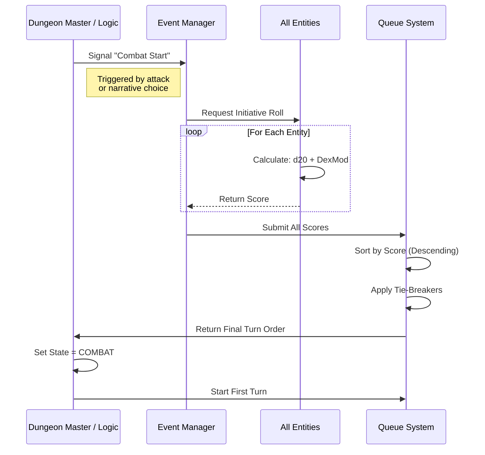
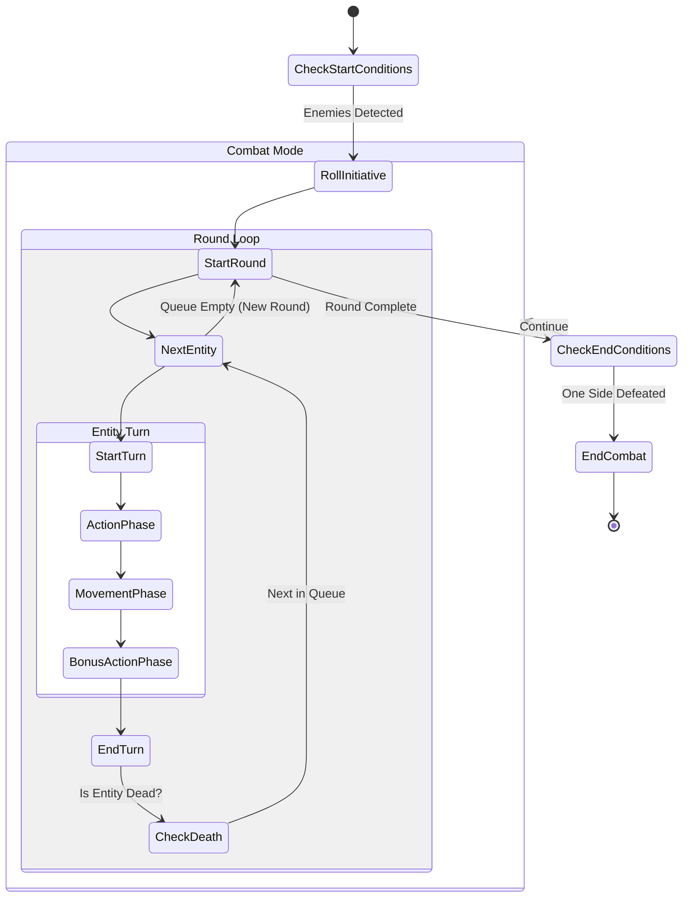
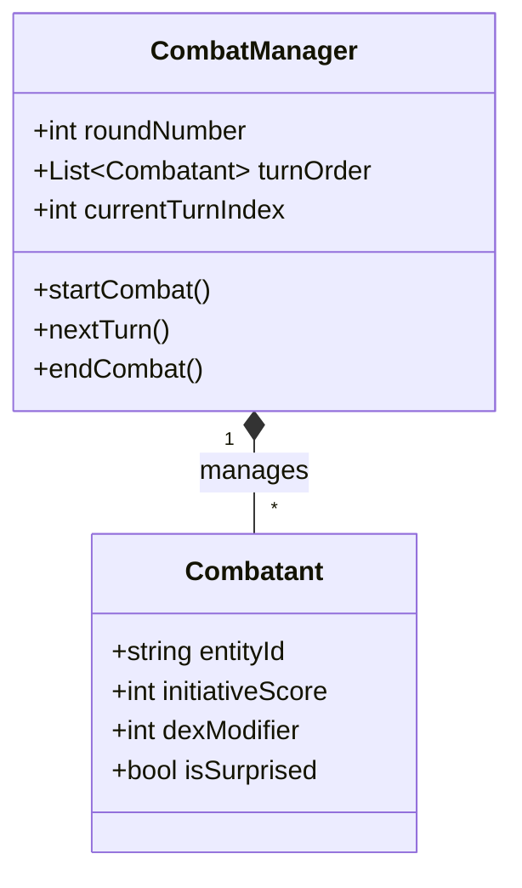

# Study Case: Rolling Initiatives & Combat Turn Order

## 1. Executive Summary

This document analyzes the transition from "Exploration Mode" to "Combat Mode" in the Daicer engine, specifically focusing on the mechanism of **Rolling Initiative** and establishing a deterministic **Turn Order**.

The core objective is to define a robust model where:

1.  A **Battle Start** event is triggered.
2.  All eligible entities roll for **Initiative**.
3.  A linear **Turn Order** is established.
4.  The game enters a **Combat Loop** where entities act sequentially.
5.  The loop terminates upon meeting an **End Condition**.

## 2. The Combat Model Architecture

### 2.1. Core Concepts (The 10 Topics)

We must address the following 10 architectural topics to ensure a complete implementation:

1.  **Trigger Event**: What precise action or state change initiates combat? (Aggressive action, proximity, narrative switch).
2.  **The Initiative Formula**: Defining the calculation `1d20 + Dex Modifier + Feat Bonuses`.
3.  **The Initiative Queue**: The data structure (Round-Robin Queue) holding the order.
4.  **Tie-Breaking Logic**: Resolving identical rolls (Dex score comparison vs. Random coin flip).
5.  **State Transition**: Locking "Free Movement" and enabling "Turn-Based Movement".
6.  **Round Tracking**: Incrementing a global `roundCounter` for duration-based effects (spells, buffs).
7.  **Active Entity Pointer**: A pointer tracking `currentTurnActorId`.
8.  **Effect Decrementation**: Reducing duration of status effects at Start/End of turns.
9.  **Dynamic Joiners**: Handling entities entering the battle _after_ round 1.
10. **Death & Removal**: Handling entities that die mid-round (skipping their turn vs. removing from queue).

### 2.2. Visualizing the Flow

#### Diagram A: The Setup Phase

This diagram illustrates the transition from World State to Combat State.

#### Diagram B: The Combat Loop (State Machine)

This diagram details the cyclic nature of turns and rounds.

#### Diagram C: Data Structure Visualization

## 3. Implementation Challenges & Solutions

### Problem 1: Determining "In Combat" Scope

**Issue:** In a large open world, who joins the combat?
**Solution:** Spatial Query. `getEntitiesInRadius(center, range)` collects all distinct entities.

### Problem 2: Simultaneous Turns (The "party" problem)

**Issue:** Some systems allow players to act together if adjacent in initiative.
**Solution:** Strict ordering for V1. Implement `Wait` or `Hold Action` later.

### Problem 3: Persistence

**Issue:** If the server restarts, is the turn order lost?
**Solution:** The `CombatManager` state must be serialized into the `Room` or `Game` state, including the specific index of the current actor.

## 4. Initialization Questions (The 10 Questions)

To proceed with the implementation, we need answers to the following 10 questions:

1.  **Scope**: Do we include _all_ loaded entities in the map chunk, or just those within a specific radius (e.g., 60ft)?
2.  **Surprise**: Do we need to implement "Surprise Rounds" immediately, where surprised entities skip their first turn?
3.  **Tie-Breaking**: If Player A and Monster B both roll a 15, does the Player always win, or do we compare DEX scores?
4.  **Dexterity Source**: Does the `EntitySheet` strictly mirror D&D 5e stat blocks for calculating specific modifiers?
5.  **Visibility**: Should the initiative order be fully visible to players (UI list), or hidden for enemies until they act?
6.  **Manual Override**: Does the DM need a "God Tool" to manually edit the initiative score/order simply by dragging?
7.  **Dynamic Entry**: If a noise attracts a guard from another room, how do they insert themselves into the _current_ round?
8.  **Lair Actions**: Do we need to reserve "Initiative Count 20" for environmental/Lair actions?
9.  **Ready Actions**: Are we implementing the "Ready" action (triggers) in V1, or just immediate actions?
10. **Combat End**: Is "Combat End" automatic (0 enemies left) or must it be manually toggled off by the DM?

---

_Drafted by Antigravity_
