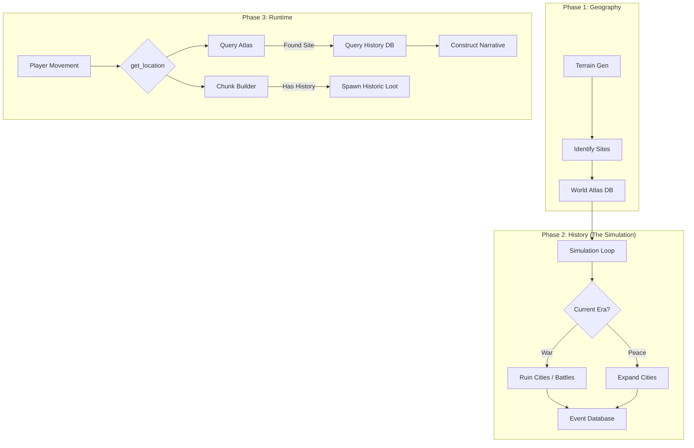

# Study: Geo-Lore, History, and Eras

> **Goal**: Create a rich, layered history for the world akin to _Dwarf Fortress_, where "Ruins" are not just random blocks, but the site of specific historical events (Battles, Foundings, Cataclysms).

## 1. The Core Loop: Structure -> Era -> Lore -> Loot

We cannot generate "Everything everywhere all at once". We need a focused pipeline.

1.  **Geography First**: Generate the **Macro World** (Continents, Biomes, Divine Sites).
2.  **Sites Second**: Identify **Points of Interest (POIs)** (Future Cities, Bridges, Mountain Passes).
3.  **History Third**: Iterate through **Eras** using an LLM/Simulation semantic layer.
4.  **Artifacts Fourth**: Bury "Physical Evidence" (Loot, Ruins, Books) based on History.

## 2. Data Structures

To support this, we need a lightweight "Historical Database" that lives alongside the Voxel World.

```typescript
// The "Atlas" (Macro Layer)
interface WorldAtlas {
  regions: Region[];
  sites: Site[]; // Cities, Dungeons, Holy Sites
}

interface Site {
  id: string;
  name: string; // "Ironhold"
  location: Vector3; // World Coordinates
  type: 'CITY' | 'FORTRESS' | 'SHRINE' | 'BRIDGE';
  state: 'ACTIVE' | 'RUINED' | 'BURIED';
  founded: number; // Year
  ruined?: number; // Year
}

// The "Chronicle" (History Layer)
interface WorldHistory {
  eras: Era[];
  events: HistoricalEvent[];
}

interface Era {
  name: string; // "The Age of Ash"
  startYear: number;
  endYear: number;
  theme: string; // "War", "Plague", "Discovery"
}

interface HistoricalEvent {
  year: number;
  type: 'BATTLE' | 'FOUNDING' | 'SIEGE' | 'MIRACLE' | 'CATACLYSM';
  description: string; // "The Dragon Smaug burned Ironhold."
  participants: string[]; // ["Smaug", "Dwarves of Ironhold"]
  siteId: string; // Links to Site.id

  // The "Physical Evidence" spawned by this event
  consequences: {
    ruin: boolean; // Site becomes RUINED
    lootSpawn?: LootTableID; // "Dragon Hoard"
    bossSpawn?: MonsterID; // "Undead Dragon"
  };
}
```

## 3. The Generation Pipeline

### Phase 1: Macro-Geo (The Canvas)

_Existing per `structures.md`_

- Generate Biomes.
- Place implicit "High Value" spots (River mouths, Mountain peaks).
- **Result**: A list of `PotentialSite[]`.

### Phase 2: The Age Simulator (The Writer)

We run a simulation loop (pseudo-code):

```typescript
let year = 0;
let sites = initialSites;

for (const era of eras) {
  // 1. Era Setup
  const eraContext = generateEraTheme(era);

  // 2. Iterate Years (or Decades)
  while (year < era.endYear) {
    // 2a. Pick a random "Active" Site
    const targetSite = pickRandom(sites.filter((s) => s.state === 'ACTIVE'));

    // 2b. Generate Event (LLM or Table)
    const event = generateEvent(eraContext, targetSite);

    // 2c. Apply Logic
    if (event.isDestructive) {
      targetSite.state = 'RUINED';
    }

    // 2d. Record History
    history.events.push(event);
    year += rand(10, 50);
  }
}
```

### Phase 3: The "Geo-Lore" Embed (The Anchor)

When the simulation ends, we "Bake" the history into the Voxel World chunks.

- **Chunk Generation**: When a player visits `Site.location`:
  - Check `Site.state`.
  - If `RUINED`, use the **Ruin Generator** instead of City Generator.
  - **Loot Injection**: Look at `history.events` for this Site.
    - Did a dragon die here? -> Spawn `Dragon Bones` and `Hoard Chest`.
    - Was it a library? -> Spawn `Ancient Scrolls` containing the _actual text of the history_.

## 4. LLM Integration: "The Archaeologist"

When a player inspects a location or asks "What is this place?", the LLM Agent queries the History DB:

1.  **Player**: "Look at these ruins."
2.  **Agent**: `get_location_context(pos)`
3.  **System**:
    - Finds nearest `Site`.
    - Fetches `events.filter(e => e.siteId === Site.id)`.
4.  **Agent (Narrator)**: _"You stand amidst the charred remains of **Ironhold**. Built in the First Age, it stood for a thousand years until the **Dragon Smaug** descended upon it in the Age of Ash (Year 402). The local legends say the dragon's bones still lie beneath the keep..."_

## 5. Treasure & Loot Logic

Loot isn't random; it's historical.

- **Battlefield**: Rusted armor, broken weapons, skeletal remains.
- **Plague Pit**: Cursed amulets, medical journals (high value), disease risk.
- **Divine Miracle**: Holy relics, pristine statues (despite ruins).

**Algorithm**:

```typescript
function generateLoot(site: Site, history: WorldHistory): Item[] {
  const events = history.events.filter((e) => e.siteId === site.id);
  const lastEvent = events[events.length - 1];

  if (lastEvent.type === 'BATTLE') return spawnBattleLoot();
  if (lastEvent.type === 'CATACLYSM') return spawnBuriedTreasures();
  return genericRuinLoot();
}
```

## 6. Mermaid Diagrams

### Architecture Flow



## 7. Next Steps

1.  **Define the Schema**: Create `schema/history.ts`.
2.  **Mock the Generator**: Create a script that generates a fake history JSON to test the LLM narration.
3.  **Visual Debugger**: Add a layer to the specialized map tool to show "Battles" and "Ruins" as icons.
