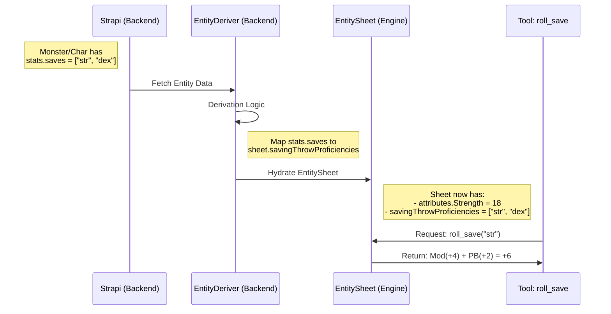

# Study Case: Saving Throws & Proficiency System

## 1. Executive Summary

This document analyzes the implementation of a **Saving Throw System** within the Daicer engine, enabling entities (Characters and Monsters) to resist effects based on their Attributes and Proficiencies.

The core objective is to define a robust model where:

1.  **Saving Throws** are based on the 6 Core Attributes (D&D 5e standard).
2.  **Proficiency** is derived from a `proficiencies` list (or `saves` list) on the entity.
3.  A **Tool** (`roll_save`) is available to the Agent to execute these rolls.
4.  The current legacy `Fortitude/Reflex/Will` schema in the Engine is modernized to support Attribute-based saves.

## 2. Core Concepts

### 2.1. The 6 Saving Throws

Unlike the current Engine schema (which uses 4e-style Fortitude, Reflex, Will), the goal is to align with the Backend and Standard Rules (5e) which define 6 saving throws corresponding to the ability scores:

- Strength
- Dexterity
- Constitution
- Intelligence
- Wisdom
- Charisma

### 2.2. The Calculation Formula

The result of a saving throw is deterministic based on the entity state:
`Roll Result = d20 + Attribute Modifier + Proficiency Bonus (if applicable) + Global Save Bonus`

### 2.3. Data Source Truth

- **Backend**: `game.stats` component already has a `saves` JSON field (e.g., `["str", "dex"]`). This is the Source of Truth.
- **Engine**: Must be updated to receive `savingThrowProficiencies` (string array) instead of `savingThrows` (object with values).

## 3. Visualizing the Flow

### Diagram A: Data Flow Architecture

This diagram illustrates how Saving Throw data travels from the Database (Strapi) to the Engine.



### Diagram B: Tool Logic (The "Check")

```mermaid
flowchart TD
    Start[Agent Calls roll_save(ability)] --> LookupAttr[Lookup Attribute Score]
    LookupAttr --> CalcMod[Calculate Modifier (Score-10)/2]
    CalcMod --> CheckProf[Check Proficiency List]

    CheckProf -- Yes --> AddPB[Add Proficiency Bonus]
    CheckProf -- No --> AddZero[Add 0]

    AddPB --> FinalCalc[Roll d20 + Total Mod]
    AddZero --> FinalCalc

    FinalCalc --> Output[Return Result to Chat]
```

## 4. Implementation Plan

### 4.1. Engine Schema Update

We must modify `engine/src/schemas/entity-sheet.ts` to reflect the new architecture.

**Current (Legacy):**

```typescript
export const SavingThrowsSchema = z.object({
  fortitude: z.number(),
  reflex: z.number(),
  will: z.number(),
});
```

**Proposed (Modern):**

```typescript
// Replace SavingThrowsSchema usage in EntitySheet
savingThrowProficiencies: z.array(z.string()), // ["str", "dex", "con", ...]
```

### 4.2. Entity Deriver Update

The `EntityDeriver` in `backend` must be updated to:

1.  Read `monster.stats.saves` (JSON array).
2.  Populate `sheet.savingThrowProficiencies`.
3.  Calculate `fortitude/reflex/will` only if needed for backward compatibility (or set them to 0).

### 4.3. Tool Implementation

Create `backend/src/ai/tools/game/roll-save.ts`:

- **Inputs**: `ability` (enum), `entityId` (string).
- **Process**:
  - Fetch Entity.
  - Calculate Mod.
  - Check Validation (Proficiency).
  - Broadcast Event (`entity_rolled_save`).
  - Return formatted string.

## 5. Decision Points

1.  **Backward Compatibility**: Do we keep `fortitude/reflex/will` calculated as averages (e.g. Ref = Dex Mod) for legacy tools? -> _Recommendation: Keep for 1 sprint, then remove._
2.  **Proficiency Source**: Characters verify proficiency via Class relationships in Strapi `Proficiency` entity. Do we "flatten" this into `stats.saves` at the database level, or derive it at runtime? -> _Recommendation: Derive at runtime in `spawn-service` and inject into Sheet._
