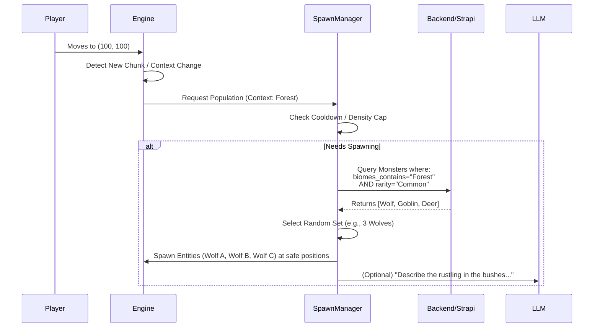

# Study: Spawning & and Monster Placement

> **Goal**: Design a coherent "On-Demand" spawning system that populates the world with context-aware creatures (Nature) and NPCs (Urban), supported by a robust tagging system.

## 1. The Core Philosophy: "On-Demand" Spawning

Daicer is a **Local Relevance** engine. We do not simulate the entire planet's ecology every tick. We only simulate what matters to the players **right now**.

**The Rule**: _"Things exist only when looked at, but they behave as if they were always there."_

### 1.1 The Trigger System

Spawning is triggered by **Context Shifts**, not just time.

1.  **Chunk Entry**: Player enters a new 16x16 Chunk.
2.  **Context Change**: Player moves from "Street" to "Building Interior" (handled by `LocationContext`).
3.  **Time Passage**: Specific "Refill" timer (e.g., every 4 in-game hours) if the player stays in one area.

## 2. Context-Aware Density

We define two primary "Density Modes" based on the `LocationContext` studied in `structures.md`.

### 2.1 Urban Mode (Civilization)

**Trigger**: `LocationContext.type === 'City' | 'Village'`

- **NPC Density**: **High**.
  - _Streets_: Crowds, Merchants, Guards (patrolling), Children.
  - _Interiors_: Shopkeepers, Patrons, Residents.
- **Monster Density**: **Zero/Low**.
  - _Exceptions_: "Urban Wildlife" (Rats, Pigeons), "Hidden Threats" (Doppelgangers in crowds), or specific "Danger Zones" (Sewers, Graveyards).
- **Behavior**:
  - NPCs spawn with short-term goals (e.g., "Walking to Market").
  - Conversational state is generated on demand (LLM improv).

### 2.2 Wilderness Mode (Nature)

**Trigger**: `LocationContext.type === null` (Pure Biome)

- **NPC Density**: **Low**.
  - _Occasional_: Travelers, Caravans, Bandits, Patrols.
- **Creature/Monster Density**: **Medium/Variable**.
  - Dependent on **Biome** and **Danger Level**.
- **Behavior**:
  - Ecological simulation (Predator hunting Prey).
  - Territorial wandering.

## 3. The Monster Labeling System

To make this work, the backend `Monster` schema needs to know **where** a monster belongs.

### 3.1 Schema Update

We will add a specialized JSON field (or component) to the `Monster` Content Type.

**Field**: `spawn_rules` (JSON)

```json
{
  "biomes": ["Forest", "Plains"], // Matches Engine BiomeType
  "contexts": ["Dungeon", "Ruins", "Sewer"], // Specialized Contexts
  "social_tier": "None", // None, Pack, Tribe, Civilization
  "rarity": "Common", // Common, Uncommon, Rare, Legendary
  "activity_cycle": "Nocturnal" // Diurnal, Nocturnal, Any
}
```

### 3.2 The Biome Mapping

We map `engine/src/types.ts` -> `BiomeType` directly to these tags.

| Engine Biome     | Monster Tag  | Examples                         |
| :--------------- | :----------- | :------------------------------- |
| `forest`         | `"Forest"`   | Wolves, Bears, Dryads, Goblins   |
| `mountain`       | `"Mountain"` | Goats, Harpies, Giants, Dragons  |
| `desert`         | `"Desert"`   | Scorpions, Camels, Thri-kreen    |
| `ocean`          | `"Ocean"`    | Sharks, Merfolk, Sahuagin        |
| `swamp` (Future) | `"Swamp"`    | Crocodiles, Bullywugs, Hags      |
| _Civilized_      | `"Urban"`    | Rats, Pigeons, Guards, Commoners |

## 4. Architecture & Flow



## 5. Implementation Roadmap

1.  **Backend**: Update `Monster` schema with `spawn_rules`.
2.  **Data Entry**: Create a "Migration Script" to tag existing monsters (using AI or manual defaults).
3.  **Engine**: Create `SpawnManager` class in `engine/src/systems`.
    - Listen to `EntityMove` events.
    - Implement "Density Budget" logic.
4.  **Frontend**: Debug view to visualize "Spawn Zones" and "Active Entities".

## 6. Q&A / Edge Cases

- **Q: What happens if I leave and come back?**
  - _A: If it's short term (< 1 hour), entities persist. If long term, they are "recycled" into the abstract simulation and re-spawned (possibly in different positions) to save memory._
- **Q: How do we handle "Unique" monsters (Bosses)?**
  - _A: They are tagged `rarity: "Unique"`. The SpawnManager checks a `WorldState` flag ("Is DragonAlive?") before spawning._
